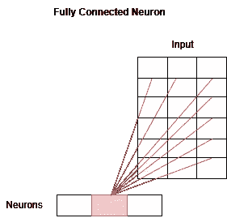
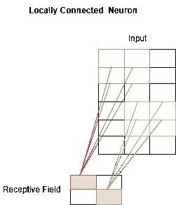
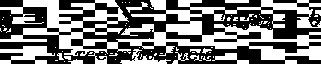
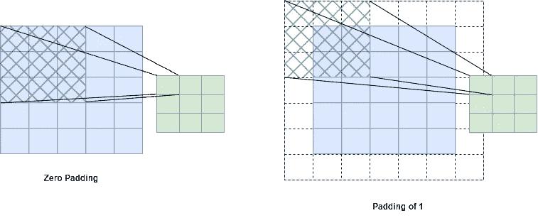
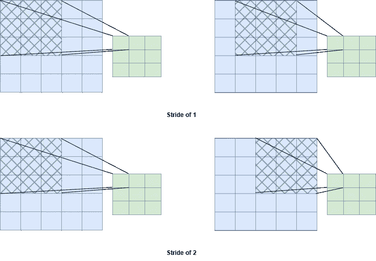
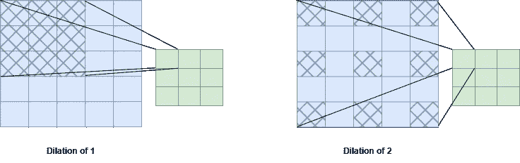

# 构建图像彩色化神经网络第 3 部分:卷积神经网络

> 原文：<https://medium.com/mlearning-ai/building-an-image-colorization-neural-network-part-3-convolutional-neural-networks-21a45ef42dde?source=collection_archive---------6----------------------->

Image generated by [Stable Diffusion](https://stability.ai/blog/stable-diffusion-public-release)

你好，欢迎回到这个系列的第三部分，我们试图用神经网络给黑白图像着色。如果您还没有检查我们分析自动编码器和人工神经网络基础的前两部分，请确保在继续之前检查(下面的链接)。

整个系列由以下 4 部分组成:

1.  [**第一部分**](/mlearning-ai/building-an-image-colorization-neural-network-part-1-generative-models-and-autoencoders-d68f5769d484) :概述生成模型和*自动编码器*的基础知识。
2.  [**第二部分**](/mlearning-ai/building-an-image-colorization-neural-network-part-2-artificial-neural-networks-ac591eb180) :展示了人工*神经网络*的基本概念。
3.  **第三部分(当前)**:介绍*卷积神经网络*的基础知识。
4.  [**第四部分**](/@geokam/building-an-image-colorization-neural-network-part-4-implementation-7e8bb74616c) :描述实际模型的实现。

> 声明:这绝不是一个教程。它提供了一些基本知识，但主要目标是展示如何构建这样一个模型。

在前一篇文章中，我们展示了什么是人工神经网络，它如何工作，以及我们如何训练它来解决一个特定的问题。在目前的文章中，我们将提供完全相同的问题的答案，但对于卷积神经网络。

# 卷积神经网络

人工神经网络的基本形式在输入数据是用相对“少”的维度“结构化”的情况下工作得非常好。但是，有些输入数据(如图像)被认为是“非结构化的”，因为它们包含过多的维度。让我们考虑这样一个场景，我们有 256x256 像素的彩色图像。输入的尺寸将是 256x256x3 = 196，608，因为我们有 3 个通道:红色、绿色和蓝色。如果我们创建一个简单的线性神经网络，它接收这些图像作为输入并产生相同大小的图像，我们将需要 196，608 个参数！现在应该很清楚，这样的网络需要非常大的内存，更不用说过多的训练时间了。

虽然图像可以表示为非常高维的向量，但是它具有一些特殊的特征。第一个称为*位置*，本质上意味着图像中的对象确实有局部空间支持。也就是说，相邻像素看起来非常相似，或者它们以某种方式相关。第二个叫做*平移不变性，*表示物体的外观通常与它们的位置无关。例如，不管人脸在图像上的位置如何(即，上、右、下、左)，人脸看起来都是一样的。

如何利用这些特性来建立可管理的神经网络？为了在神经网络中引入局部性的概念，我们必须调整发生在各层之间的操作。更具体地说，我们需要从计算显式神经元之间的乘积转移到利用矩形区域，也称为感受野或核，它在执行卷积运算时越过输入。请注意，输入和感受野之间的卷积会导致图像尺寸变小。由于这一开始可能很难理解，下面的图展示了上述范式转变:

Dot product between neurons and input

Dot product formula

Convolution between receptive field and input

Convolution formula

在已建立的过程中引入平移不变性假设可以通过强制感受野的权重 wᵢ在输入上共享来实现。

也就是说，*卷积神经网络*或 CNN 是一种特定类型的人工神经网络，其中各层之间的基本操作是卷积而不是乘法。卷积发生在感受野和输入之间，其中感受野的数量和大小是可配置的，权重是可训练的。在中枢神经网络中，我们通常出于不同的原因使用不同种类的感受野。例如，应用于图像的某些字段会检测边缘或模糊或锐化图像。然而，在一般情况下，感受野的权重被初始化，然后被训练，就像在传统的前馈神经网络中训练神经元的权重一样。更清楚地说，在人脸识别任务中，一些感受域可能最终识别眼睛，而另一些则识别鼻子、头发或其他任何东西。所有这些的结合给了我们一个完整的人脸识别模型。

## 配置

既然我们已经解释了感受野背后的直觉，让我们来看看它们应用于输入的不同方式。实际上，有 4 个可配置的参数会影响卷积过程。

## 填料

填充处理包含零的帧的大小，可以在输入周围添加零。通过使用填充，我们可以更好地控制输出分辨率，因为感受野会更加关注图像的边缘。在某种意义上，填充有助于保持输入分辨率。

Padding example

## 进展

当应用卷积时，步幅处理感受野的步长。步幅为 1 意味着感受野将一次移动一步，而步幅为 2 表示在输入上移动两步。Stride 有助于降低空间分辨率，以实现更好的处理。

Stride example

## 联营

与 stride 类似，还有另一种称为池化的技术具有相同的目的，即在不丢失有价值的细节的情况下加快处理速度。有许多不同的池，如平均池和最大池。在第一种情况下，我们计算感受野的平均输入，这与应用权重固定为 1/k 的 k×k 步长卷积相同。在第二种情况下，我们计算并保持感受野的最大输入。

## 扩张

扩张处理感受野的扩展。1 的扩张意味着 3×3 感受野将保持 3×3，而 2 的扩张意味着相同的场将被转换成 5×5 的场，因为它通过在权重之间添加“孔”而被扩展。扩张试图模仿大的感受野，同时保持较小的权重。例如，膨胀为 2 的 3x3 场具有 9 个可训练权重(具有 1 个通道)，而膨胀为 1 的 5x5 场具有 25 个可训练权重。

Dilation example

# 转置卷积

卷积层在输入是“非结构化”的(如图像)辨别任务中非常有用。然而，在我们的任务中，我们必须建立一个生成模型来创建新的图像。更正式地说，在图像着色任务中，我们必须增加维度来实现我们的目标。我们可以用*转置卷积*来实现，它与卷积完全相反。卷积层会降低分辨率，而转置层会提高分辨率。它们的作用对于生成模型和自动编码器至关重要，因为解码器是转置卷积层的混合物。

# 结论

总之，为了训练有或没有转置层的 CNN，必须指定层数，并为每一层确定感受野的数量、它们的大小以及填充、步幅和扩张选项。然后，就像在简单的 ann 中一样训练网络，不同之处在于在 CNN 中，我们调整感受域的权重。

通读完这一部分，你就具备了理解图像彩色化攻击方案所需要的全部基础知识。这就是我们在本系列的下一篇也是最后一篇文章中要做的事情。所以，敬请期待！

 [## Mlearning.ai 提交建议

### 如何成为 Mlearning.ai 上的作家

medium.com](/mlearning-ai/mlearning-ai-submission-suggestions-b51e2b130bfb)