# 构建图像彩色化神经网络第 4 部分:实现

> 原文：<https://medium.com/mlearning-ai/building-an-image-colorization-neural-network-part-4-implementation-7e8bb74616c?source=collection_archive---------4----------------------->

Image generated by [Stable Diffusion](https://stability.ai/blog/stable-diffusion-public-release)

欢迎回到本系列的第四部分，也是最后一部分，我们将最终实现一个能够将颜色应用于黑白图像的神经网络。在前面的文章中，我们已经介绍了生成模型和自动编码器、人工神经网络和卷积神经网络的基础知识。如果这些对你来说听起来像是胡言乱语，在你学习下面的部分(下面的链接)之前，一定要检查相应的文章。

整个系列由以下 4 部分组成:

1.  [**第一部分**](/mlearning-ai/building-an-image-colorization-neural-network-part-1-generative-models-and-autoencoders-d68f5769d484) :概述生成模型和*自动编码器*的基础知识。
2.  [**第二部分**](/mlearning-ai/building-an-image-colorization-neural-network-part-2-artificial-neural-networks-ac591eb180) :展示了人工*神经网络*的基本概念。
3.  [**第三部分**](/mlearning-ai/building-an-image-colorization-neural-network-part-3-convolutional-neural-networks-21a45ef42dde) :介绍*卷积神经网络*的基础知识。
4.  **第 4 部分(当前)**:描述实际模型的实现。

> 声明:这绝不是一个教程。它提供了一些基本知识，但主要目标是展示如何构建这样一个模型。

整个模型用 [PyTorch](https://pytorch.org/) 搭建，图像预处理借助 [Scikit-Image](https://scikit-image.org) 库进行。所有的代码都可以在:[https://github.com/gkamtzir/cnn-image-colorization](https://github.com/gkamtzir/cnn-image-colorization)中找到

# 数据和预处理

在进行实际实现之前，我们需要一个包含彩色图像的相当大的数据集。请记住，我们的方法不需要相应的黑白图像，因为正如我们在[第一篇文章](/mlearning-ai/building-an-image-colorization-neural-network-part-1-generative-models-and-autoencoders-d68f5769d484)中提到的，我们将利用 LAB 格式，这意味着我们可以分解训练集的图像，并获得每个图像的黑白版本。我选择的数据集是[图像彩色化数据集](https://www.kaggle.com/datasets/aayush9753/image-colorization-dataset)，包含 5000 张用于训练的彩色图像和 739 张用于测试的图像。每张图片的尺寸是 400x400x3。它们的内容各不相同，从食物、人、动物、车辆的图像到室内和室外的图像。

唯一进行的预处理是将 RGB 转换为 LAB 格式。为此，我使用了 Scikit-Image 库和 PyTorch 提供的“Dataset”类来创建读取和加载图像的机制。有关更多详细信息，请查看“Dataset.py”文件。

# 架构和配置

关于神经网络的架构，我们已经提到，我们将尝试实现一个自动编码器，其中编码器将由卷积层组成，解码器将包含转置卷积层。输入将是具有 1 个通道的 400x400 的图像，L 值(亮度)。在输出中，我们将得到一个 400x400 的图像，有两个通道，a 和 b 值。将通过将预测的 a 和 b 与输入 l 相结合来构建最终的彩色图像

网络的结构是逐步建立起来的，从只有几层和几个参数的网络到在信息流方面有更复杂方法的多层网络。基本上，我遵循奥卡姆剃刀原则，逐步构建更复杂的解决方案，我试图将任务的实际复杂性反映到模型的复杂性中。

有一点我们还没有谈到，那就是层与层之间的批量规范化。我发誓要写一篇关于批处理规范化的文章，但是现在你可以把批处理规范化看作是一个聪明的技巧，它允许我们在很好地处理权重值的同时加快训练过程。

> 批量规范化远不止这些。我将在接下来的文章中解释一切。

作为激活功能，我使用了 *ReLU* ，因为这是最安全的选项之一。批次大小设置为 32，这意味着用包含 32 个图像的批次来训练网络。预测损失通过*均方误差*或 *MSE* 计算，而在实验中，网络使用 *Adam 优化器*。

总的来说，我已经尝试了 6 个不同的网络。在随后的部分中，我将提供所有这些设置和结果。每个人都在大约 200 个时期的 200 个图像的开发集上接受训练。开发集用于在将整个数据集提供给模型之前测试和比较不同的架构，可以节省大量时间。

## 第一架构

第一种，也是最基本的一种架构，如下图所示。我们已经用三种不同的学习速度进行了三个独立的实验，但是它们的表现都非常相似。此外，他们甚至无法学习训练实例，这对于学习能力来说是一个危险信号。

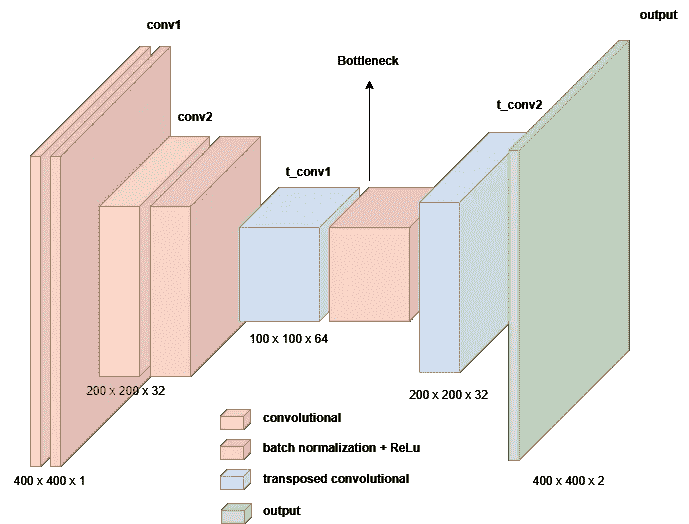

Architecture of 1st Network

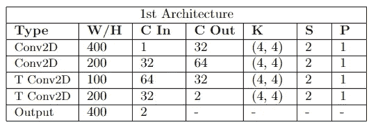

Configuration of 1st network

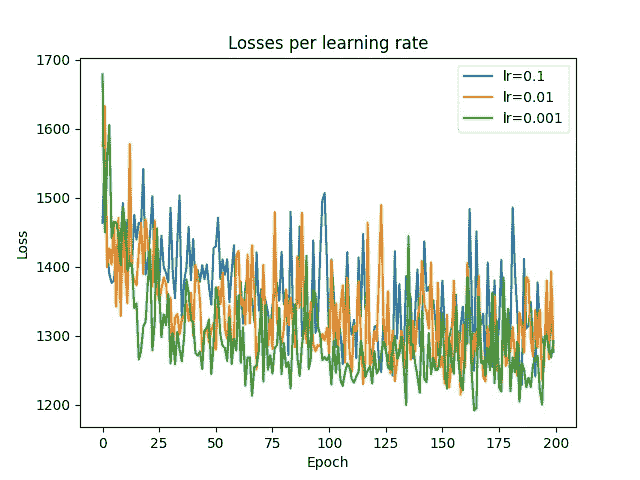

Loss of 1st Architecture

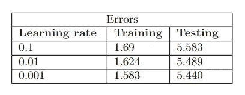

Errors of 1st Architecture

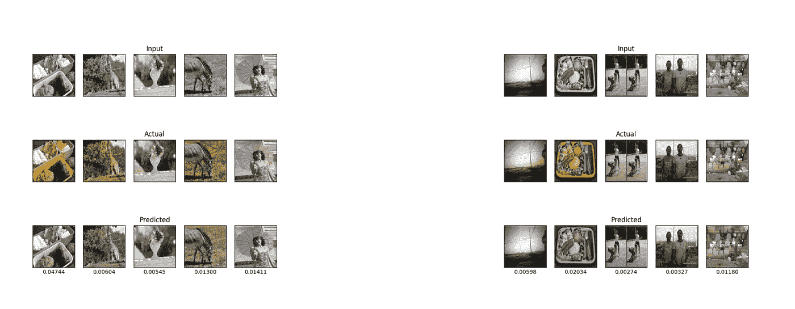

Results of 1st Architecture (left: training set, right: testing set). The number underneath the picture indicates the MSE.

## 第二架构

第二种架构本质上是前一种架构的增强，其中我分别在编码器和解码器中添加了 1 个卷积层和 1 个转置卷积层。在这种情况下，与第一种情况相比，损失减少了，而学习率为 0.001 的实验证明了更好的结果。尽管如此，该网络还是不能给图像着色，尽管它确实尝试在某些地方涂上一些颜色。

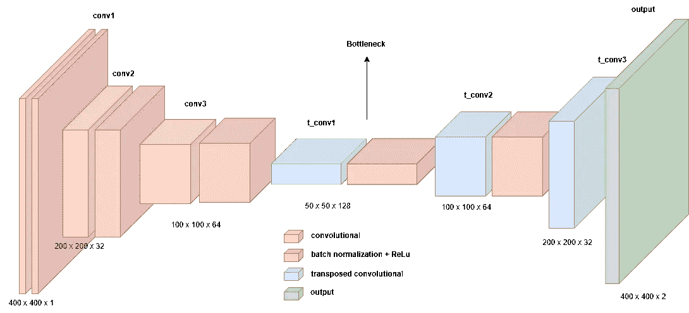

Architecture of 1st Network

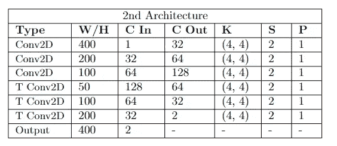

Configuration of 2nd Architecture

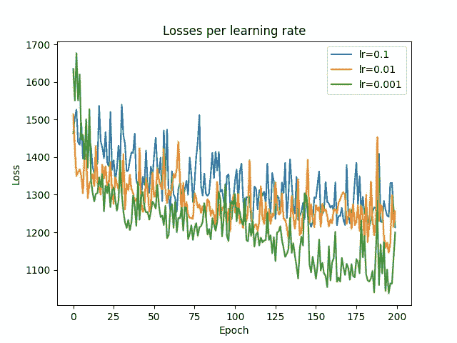

Loss of 2nd Architecture

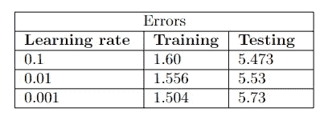

Errors of 2nd Architecture

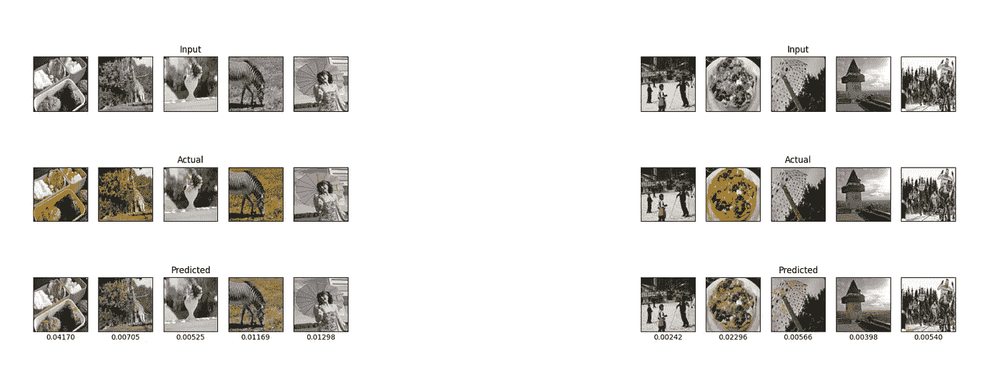

Results of 2nd Architecture (left: training set, right: testing set)

## 第三架构

第三个架构不仅仅是一个增强，而是一个完整的修改。我已经调整了网络来实现所谓的 U-Net [1]。U-Net 布局使用先前计算的编码器输出作为解码器后续部分的输入。这样，我们可以确保网络不会丢失任何重要信息。U 形网的确切结构如下所示:

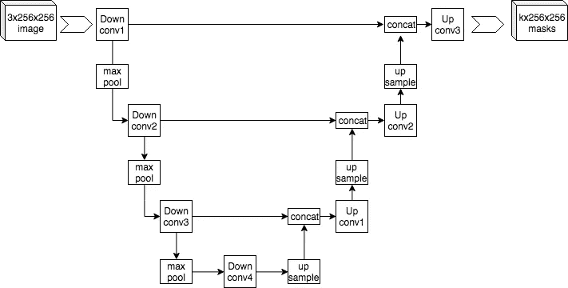

U-Net Layout (Source: Wikipedia [https://commons.wikimedia.org/wiki/File:Example_architecture_of_U-Net_for_producing_k_256-by-256_image_masks_for_a_256-by-256_RGB_image.png](https://commons.wikimedia.org/wiki/File:Example_architecture_of_U-Net_for_producing_k_256-by-256_image_masks_for_a_256-by-256_RGB_image.png))

使用这种方法，网络收敛速度更快，训练集和测试集的错误更少。此外，它还是第一个能够持续应用特定颜色的网络。

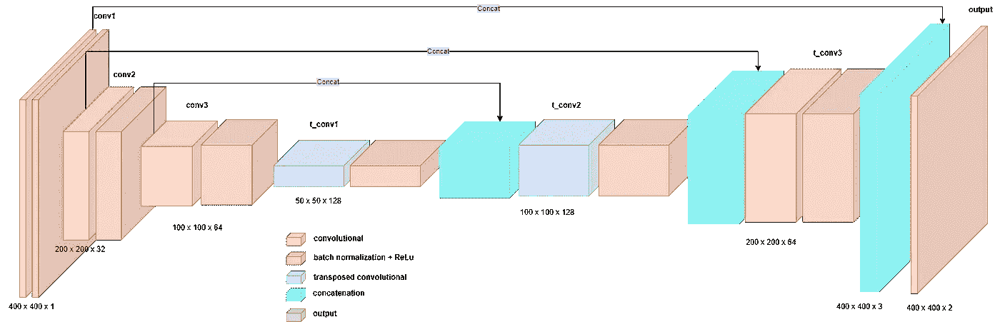

Architecture of 3rd Network

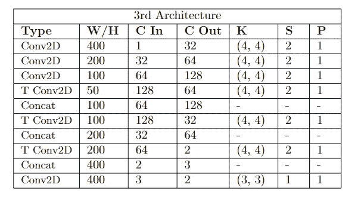

Configuration of 3rd Architecture

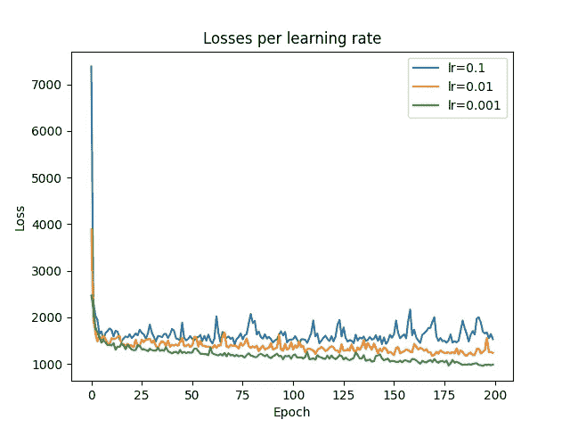

Loss of 3rd Architecture

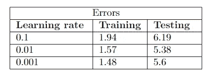

Errors of 3rd Architecture

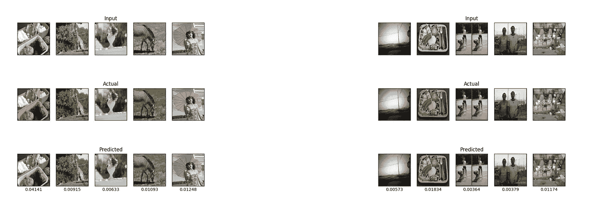

Results of 3rd Architecture (left: training set, right: testing set)

## 第四建筑

这种架构基于前一种架构，在编码器和解码器上增加了一层。最终结果显示，训练集中的损失减少得更多，输出包含更多彩色区域。注意测试损失增加了。这意味着我们的模型在训练集上过度拟合，但这在这一点上不是问题，因为构建模型的第一步是确保它能够学习。这是通过让模型在某种程度上过度拟合，然后通过增加训练集来实现的，过度拟合问题通常会消失。

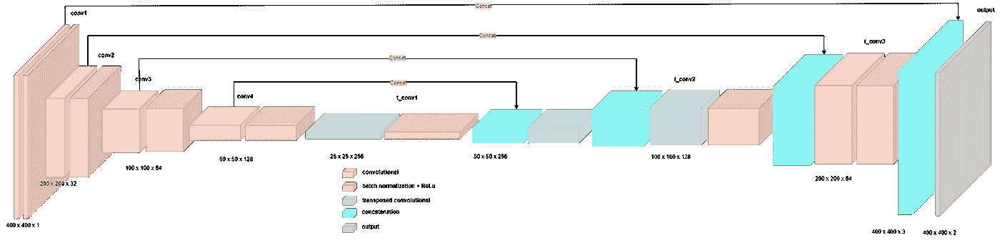

Architecture of 4th Network

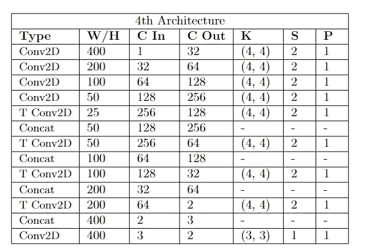

Configuration of 4th Architecture

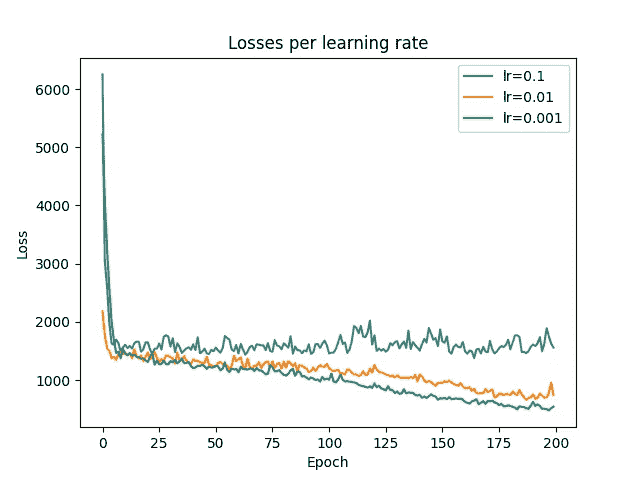

Loss of 4th Architecture

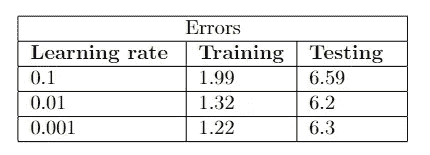

Errors of 4th Architecture

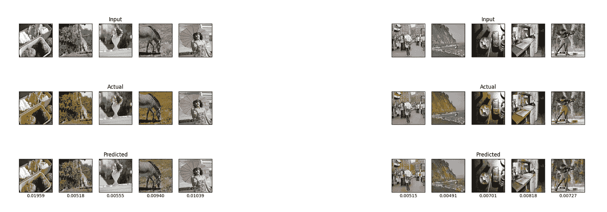

Results of 4th Architecture (left: training set, right: testing set)

## 第五建筑

在这个阶段，我选择通过引入膨胀层来修改网络布局，这也被称为“a trous”层。有研究表明，像我们这样的病例在预测方面有了重大改进[2]。同样，损失减少得更多，模型能够更精确地给图像着色。

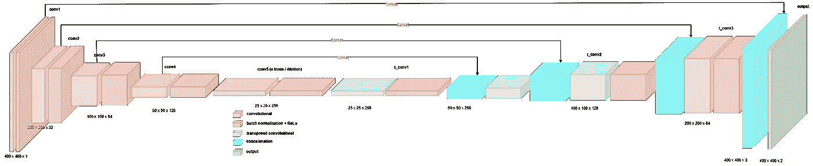

Architecture of 5th Network

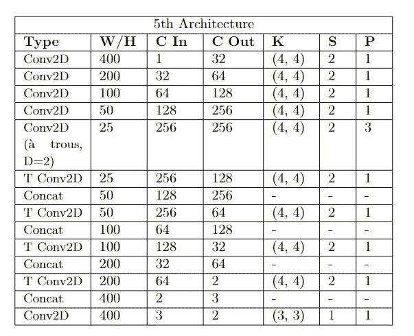

Configuration of 5th Architecture

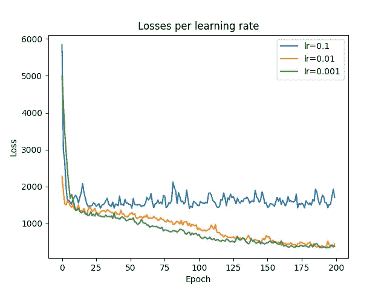

Loss of 5th Architecture

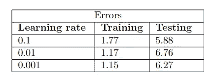

Errors of 5th Architecture

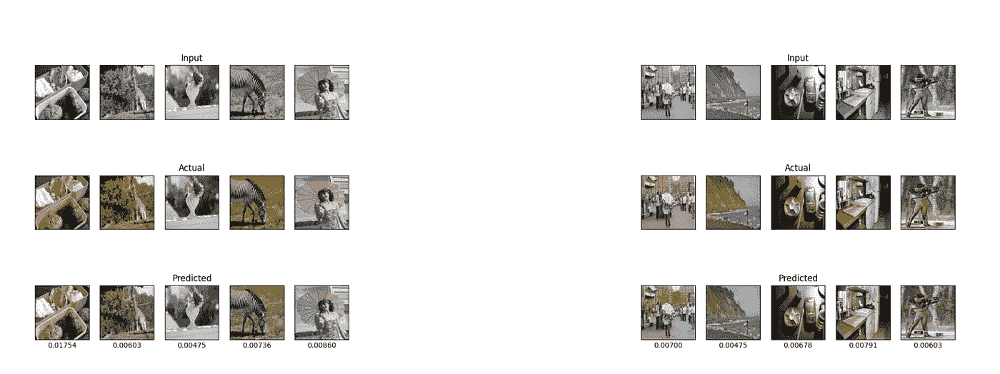

Results of 5th Architecture (left: training set, right: testing set)

## 第六建筑

最后一个架构是第五个案例的扩充版本，我在其中添加了两个额外的层。结果与以前的版本没有太大的不同，这使得这个架构成为一个很好的停止点。公平地说，在某些部分，架构 5 比 6 更好，但由于后者表现出较低的过拟合，我选择它作为最终模型。

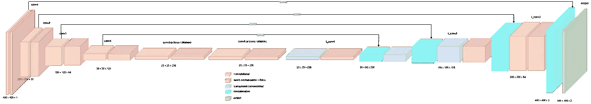

Architecture of 6th Network

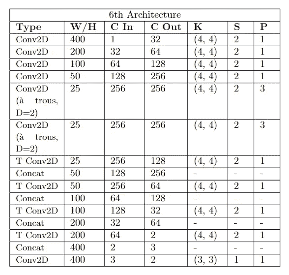

Configuration of 6th Architecture

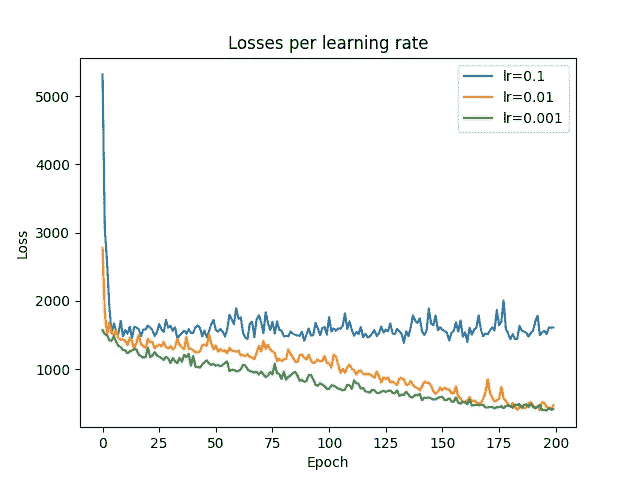

Loss of 6th Architecture

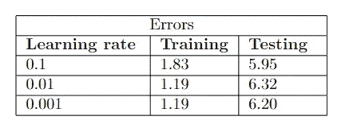

Errors of 6th Architecture

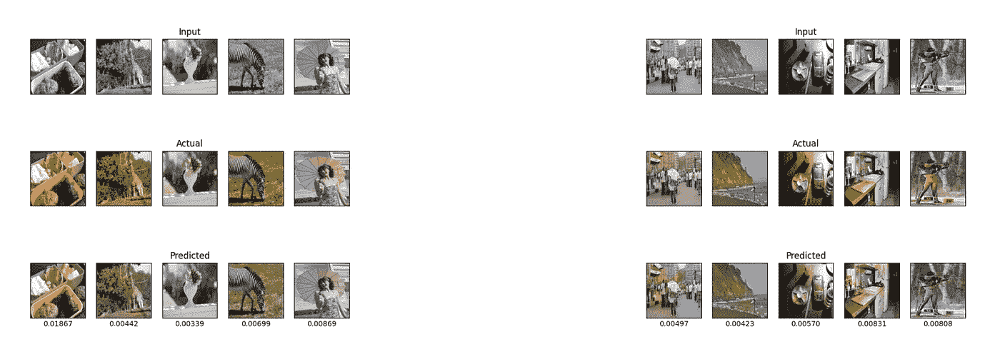

Results of 6th Architecture (left: training set, right: testing set)

# 决赛成绩

针对第六架构的开发集的培训在 Google Colab Pro GPUs 上持续了约 40 分钟，在 i5–4690k @ 3.9 GHz CPU 上持续了约 2.5 小时。由于时间限制和 GPU 可用性，我被限制只能使用 CPU 进行培训。这就是为什么最终的架构是在 2000 幅图像上训练的，而不是在整个数据集上。于是，我对模型进行了 300 个历元的训练，3 天的学习率为 0.001。最终的结果是令人鼓舞的，因为该模型不仅能够彩色化它在训练中遇到的图像，还能够彩色化它以前没有见过的图像！

## 训练集

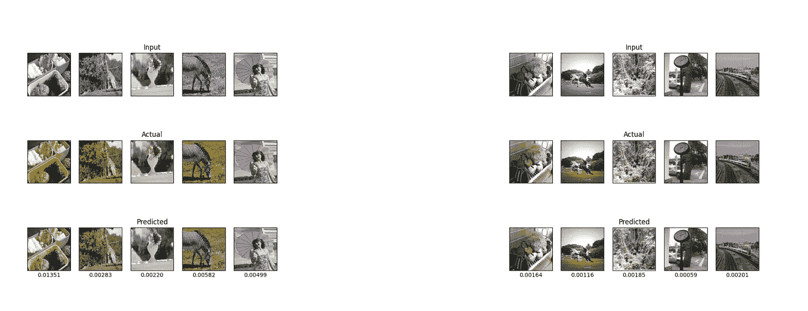

Final Results on Training Data I

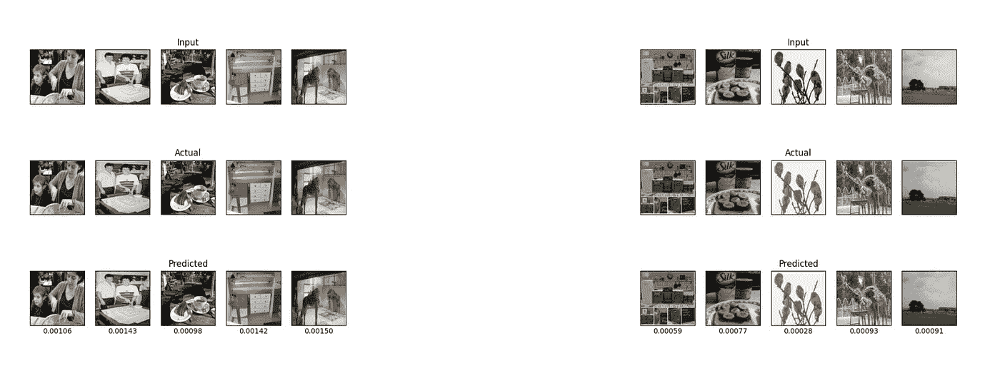

Final Results on Training Data II

## 测试设备

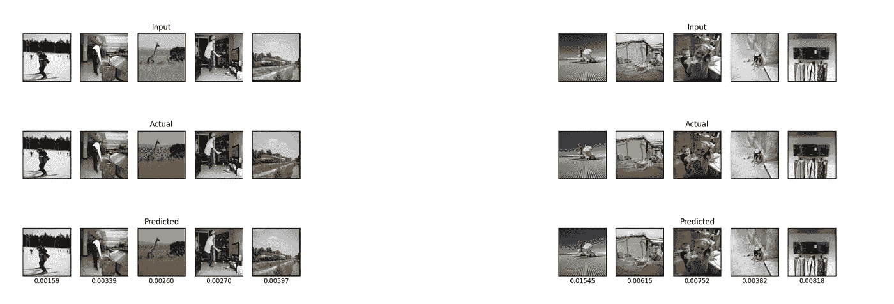

Final Results on Testing Data I

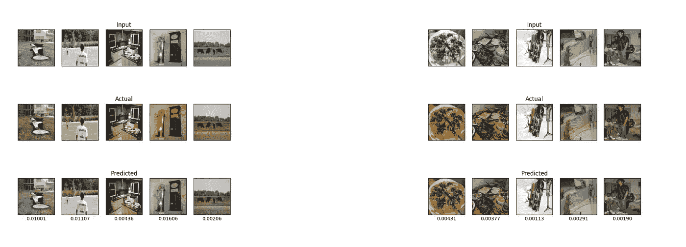

Final Results on Testing Data II

这就结束了用神经网络解决图像彩色化问题的整个系列。我真的希望你在这个过程中学到了很多，同时也获得了乐趣。这是我的第一个机器学习相关系列，所以请相信在不久的将来会有更多的系列。在那之前，继续学习！

# 参考

[1]，曾志刚，程莲，唐慧明，*使用 U-Net 的逐像素回归及其在泛锐化上的应用*，神经计算，第 312 卷，第 364–371 页，ISSN 0925–2312，2018。

[2]陈，梁杰和帕潘德里欧，乔治和科克基诺斯，亚索纳和墨菲，凯文和尤耶，艾伦， *DeepLab:用深度卷积网、卷积和全连通 CRFs 进行语义图像分割*，IEEE 模式分析和机器智能汇刊，PP，10.1109/tpami . 2017 . 20160202005

 [## Mlearning.ai 提交建议

### 如何成为 Mlearning.ai 上的作家

medium.com](/mlearning-ai/mlearning-ai-submission-suggestions-b51e2b130bfb)