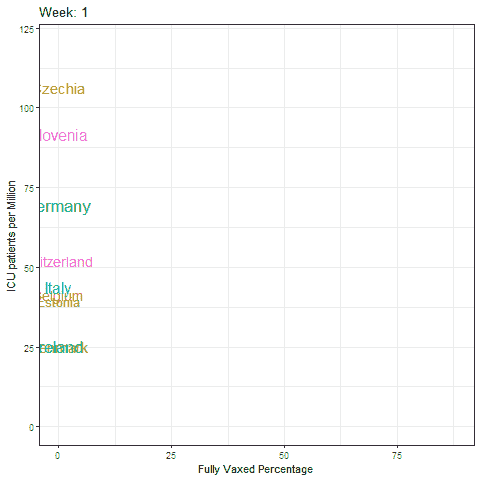
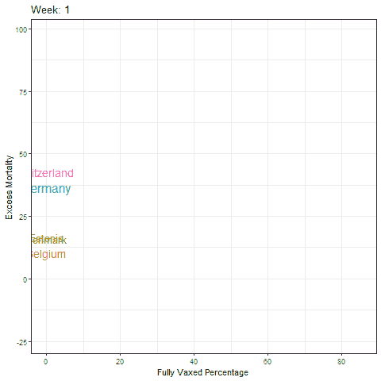

# 用 R 构建动画图形

> 原文：<https://medium.com/mlearning-ai/building-animated-graphs-in-r-dcacf0be3255?source=collection_archive---------8----------------------->

## 第四维是一个奇妙的东西

当我年轻的时候，我想创作 3D 动画。我喜欢的玩具总动员。《海底总动员》我看了无数遍。唉，成为一名 3d 建模师的道路并不平坦，所以我成为了一名喜欢制作图表和动画的统计建模师。在一篇小博文中，我将向你展示如何使用 R 来创建动画。该数据集是来自 OWID 的新冠肺炎数据集。

```
library(readr)
library(ggplot2)
library(gganimate)
library(tidyverse)
library(ggrepel)
library(lubridate)
library(tidymodels)
library(modeltime)
library(tsbox)
library(TSstudio)
library(timetk)
library(tseries)
```

让我们加载数据并创建必要的数据集，以绘制生活在欧洲国家的完全接种疫苗的人口百分比与 ICU 提交率和超额死亡率之间的关系。这些图表没有证明因果关系，事实上是一个很好的例子，说明为什么边际横截面比较没有多大帮助。

```
getwd()
data_folder <- file.path("")
url <- "[https://covid.ourworldindata.org/data/owid-covid-data.csv](https://covid.ourworldindata.org/data/owid-covid-data.csv)"
name <- "owid-covid-data.csv"
download.file(url = url, destfile = paste0(data_folder,name))
setwd(data_folder)
coviddat  <- read_csv(paste0(data_folder,name))
coviddat$vax_perc<-(coviddat$people_fully_vaccinated/coviddat$population)*100
coviddat$week<-week(coviddat$date)coviddat2<-coviddat%>%dplyr::select(date,
                                    week,
                                    location, 
                                    continent, 
                                    vax_perc,
                                    icu_patients_per_million,
                                    excess_mortality,
                                    stringency_index)%>%
  filter(continent=="Europe")%>%
  filter(complete.cases(.))%>%
  group_by(location)%>%
  summarise_by_time(date,.by="week",
                  vax_perc_week=max(vax_perc,na.rm=TRUE),
                  icu_week=max(icu_patients_per_million,na.rm=TRUE),
                  location=location,
                  continent=continent,
                  em_week=mean(excess_mortality,na.rm=TRUE), 
```

现在，我将准备所需的图形。它看起来真的很像一个 GGPLOT，但是区别就在这里，在*转换状态*函数中。这个函数告诉 R 在各种图像中创建开始移动变量，之后通过*动画*函数进行优化。

```
p<-coviddat2%>%filter(continent=="Europe" & 
                       date>"2020-12-31")%>%ggplot(., aes(
  x=vax_perc_week, 
  y=icu_week,
  size = SI_week, 
  color=as.factor(location),
  label=as.factor(location))) + 
  geom_text(nudge_y = 1) +
  ylim(0,120) +
  theme_bw() + 
  theme(legend.position = "none") +
  labs(title= 'Week: {closest_state}', 
       x = 'Fully Vaxed Percentage', 
       y = 'ICU patients per Million') +
  transition_states(week, 
                    transition_length = 2,
                    state_length = 1) +
  ease_aes('linear') + 
  enter_fade()+
  exit_fade()
anim4 <- animate(p,nframes=350)
anim_save(filename="VAX_ICU.gif", animation=anim4)
```



And this is what we end up with!

让我们结合超额死亡率对完全接种疫苗的人群重复同样的步骤。

```
q<-coviddat2%>%filter(continent=="Europe" & 
                        date>"2020-12-31")%>%ggplot(., aes(
                          x=vax_perc_week, 
                          y=em_week,
                          size = SI_week, 
                          color=as.factor(location),
                          label=as.factor(location))) + 
  geom_text(nudge_y = 1) +
  theme_bw() + 
  theme(legend.position = "none") +
  labs(title= 'Week: {closest_state}', 
       x = 'Fully Vaxed Percentage', 
       y = 'Excess Mortality') +
  transition_states(week, 
                    transition_length = 2,
                    state_length = 1) +
  ease_aes('linear') + 
  enter_fade()+
  exit_fade()
anim5 <- animate(q,nframes=350)
anim_save(filename="VAX_EM.gif", animation=anim5)
```



Tadaa! Here it is.

简明扼要，你可以重复这个例子，并用于任何你喜欢的动画。尽情享受吧！

[](/mlearning-ai/mlearning-ai-submission-suggestions-b51e2b130bfb) [## Mlearning.ai 提交建议

### 如何成为 Mlearning.ai 上的作家

medium.com](/mlearning-ai/mlearning-ai-submission-suggestions-b51e2b130bfb)