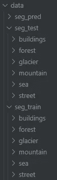
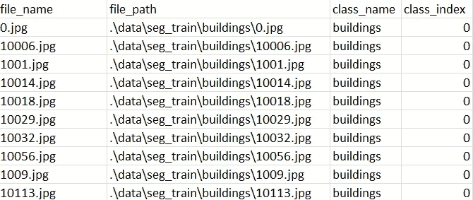
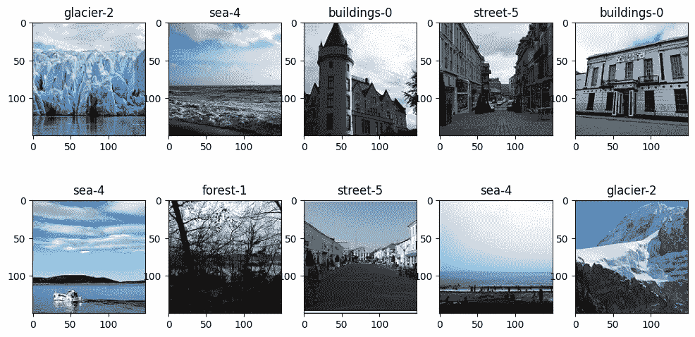
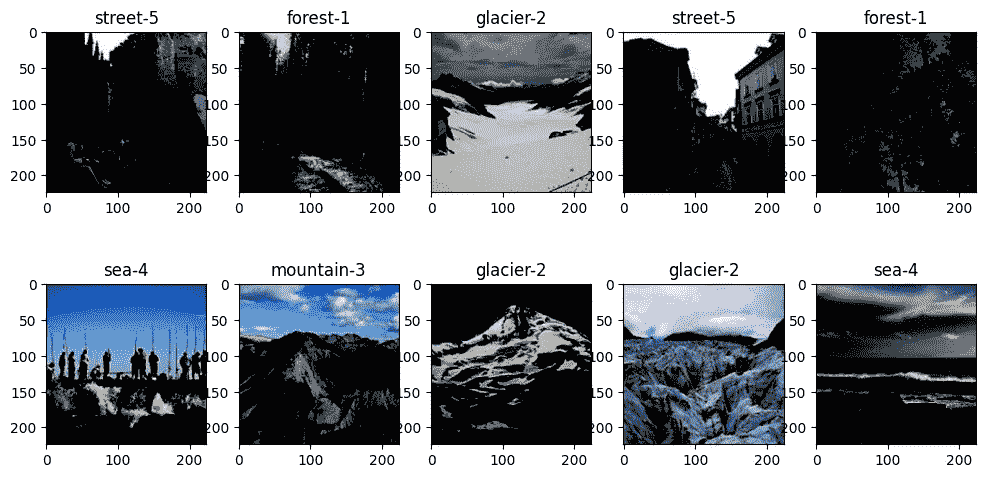

# 为 PyTorch 深度学习图像分类构建自定义数据集

> 原文：<https://medium.com/mlearning-ai/building-custom-datasets-for-pytorch-deep-learning-image-classification-29989971652d?source=collection_archive---------0----------------------->


Photo by [Ravi Palwe](https://unsplash.com/@ravipalwe?utm_source=medium&utm_medium=referral) on [Unsplash](https://unsplash.com?utm_source=medium&utm_medium=referral)

> 在我的其他文章中查看 PyTorch 在数据集上的完整实现([第 1 部分](/mlearning-ai/intel-image-classification-with-pytorch-f0f549b70af6)、[第 2 部分](/mlearning-ai/intel-image-classification-pt2-transfer-learning-with-pre-trained-ensemble-model-in-pytorch-5cf8e5c006e))。

1.  **简介**

在使用 MNIS 和 CIFAR 等内置数据集(直接从通用机器学习框架加载)一段时间后，你已经练习构建了你的第一个深度学习图像分类器。以使用自己的数据集为目标是很自然的一步。也许您在工作中有一个非常具体的用例，并希望根据您公司的图像数据库训练一个自定义模型。或者您只是想用从互联网上搜集的图片来实践其他用例。幸运的是，用 PyTorch 你可以(相当)容易地做到这一点，只要把你的图片整齐地组织在文件夹里。

本文使用英特尔图像分类数据集，可在[这里](https://www.kaggle.com/datasets/puneet6060/intel-image-classification)找到。一旦下载，相同类别的图像被分组在以类别命名的文件夹中(例如，“建筑物”、“森林”...)，并且这些类标签在训练集和测试集中是一致的。在实践中，这是将图像组织到文件夹中的一种常见方式，因此可以作为一个很好的样本数据集。在这里，所有东西都放在名为`data`的父文件夹中，如下图所示。



the structure of the Intel dataset

**2。注释文件准备**

首先，我们定义包含训练和测试数据的文件夹目录。

```
train_folder = r'.\data\seg_train'
test_folder = r'.\data\seg_test'
```

为了以后构造自定义数据集，找到一种将图像组织到注释文件中的方法是很有用的，这样我们就可以用它来指示 PyTorch 某个具有特定名称的图像属于某个特定的类。当然，用相同的类名重命名上面的类文件夹中的所有图像，并用一些数字 ID 来区分它们是不实际的。因此，我们将使用文件夹名作为类名，图像完整路径将作为图像的唯一地址。

这可以通过下面的功能`build_csv`来完成。每个步骤的解释都包含在注释中。本质上，该函数首先将列标签写入一个空白的 csv 文件，然后遍历指定目录中的每个文件夹(例如，training 文件夹)并获取子文件夹名称作为类名。然后，所有图像的完整路径及其对应的类名(和索引)被逐行写入 csv 文件。

```
def build_csv(directory_string, output_csv_name):
    """Builds a csv file for pytorch training from a directory of folders of images.
    Install csv module if not already installed.
    Args: 
    directory_string: string of directory path, e.g. r'.\data\train'
    output_csv_name: string of output csv file name, e.g. 'train.csv'
    Returns:
    csv file with file names, file paths, class names and class indices
    """
    import csv
    directory = directory_string
    class_lst = os.listdir(directory) #returns a LIST containing the names of the entries (folder names in this case) in the directory.
    class_lst.sort() #IMPORTANT 
    with open(output_csv_name, 'w', newline='') as csvfile:
        writer = csv.writer(csvfile, delimiter=',')
        writer.writerow(['file_name', 'file_path', 'class_name', 'class_index']) #create column names
        for class_name in class_lst:
            class_path = os.path.join(directory, class_name) #concatenates various path components with exactly one directory separator (‘/’) except the last path component. 
            file_list = os.listdir(class_path) #get list of files in class folder
            for file_name in file_list:
                file_path = os.path.join(directory, class_name, file_name) #concatenate class folder dir, class name and file name
                writer.writerow([file_name, file_path, class_name, class_lst.index(class_name)]) #write the file path and class name to the csv file
    return

build_csv(train_folder, 'train.csv')
build_csv(test_folder, 'test.csv')
train_df = pd.read_csv('train.csv')
test_df = pd.read_csv('test.csv')
```

在定义了这个助手函数之后，我们创建了两个 csv 注释文件，一个用于训练，一个用于测试。然后，它们作为两个数据帧重新导入到下游步骤中。输出 csv 看起来像这样。



Annotaion CSV file

如果更方便的话，可以考虑直接从函数中返回 dataframe。如果您想将数据和注释文件传递到其他地方，使用 csv 只是提供了更多的便利，编写 csv 文件似乎比使用 Pandas dataframes 更简单。

请注意，我们故意写入图像文件的完整路径，因为稍后需要将图像加载到 dataset 类中。

另一个重要的注意事项是在函数中类列表的排序中突出显示为`IMPORTANT`。这个步骤是必要的，因为由 `os.listdir`产生的类列表是任意的，并且当应用于训练和测试集时可以产生不同的顺序，因此列表中的类的索引在训练和测试数据集之间可能不一致。

为了谨慎起见，我们可以压缩类名和索引，然后在训练数据集和测试数据集之间进行比较。正如您所看到的，类名和它们的索引在这两个集合中是一致的。

```
class_zip = zip(train_df['class_index'], train_df['class_name'])
my_list = []
for index, name in class_zip:
  tup = tuple((index, name))
  my_list.append(tup)
unique_list = list(set(my_list))
print('Training:')
print(sorted(unique_list))
print()

class_zip = zip(test_df['class_index'], test_df['class_name'])
my_list = []
for index, name in class_zip:
  tup = tuple((index, name))
  my_list.append(tup)
unique_list = list(set(my_list))
print('Testing:')
print(sorted(unique_list))
```

输出显示类名和索引是一致的。

```
Training:
[(0, 'buildings'), (1, 'forest'), (2, 'glacier'), (3, 'mountain'), (4, 'sea'), (5, 'street')]

Testing:
[(0, 'buildings'), (1, 'forest'), (2, 'glacier'), (3, 'mountain'), (4, 'sea'), (5, 'street')]
```

最后，我们可以取出训练或测试数据集中的类名(最好是训练集，因为它应该包含所有的类)作为最终的引用。

```
class_names = list(train_df['class_name'].unique())
['buildings', 'forest', 'glacier', 'mountain', 'sea', 'street']
```

**3。创建定制的培训和测试数据集**

在处理完注释文件之后，我们将使用`torch.utils.data`中的`Dataset`类构建定制的训练和测试数据集。从文档教程([链接](https://pytorch.org/tutorials/beginner/data_loading_tutorial.html))，`Dataset`是一个表示数据集的抽象类。为了构建一个定制数据集，我们应该继承`Dataset`本身并覆盖它的方法来定制我们的用例。

同样，每个步骤的解释都包含在注释中。总之，我们将向`__init__`方法传递两个重要的参数:注释 csv 文件和图像转换(稍后将详细介绍图像转换)。

```
class IntelDataset(torch.utils.data.Dataset): # inheritin from Dataset class
    def __init__(self, csv_file, root_dir="", transform=None):
        self.annotation_df = pd.read_csv(csv_file)
        self.root_dir = root_dir # root directory of images, leave "" if using the image path column in the __getitem__ method
        self.transform = transform

    def __len__(self):
        return len(self.annotation_df) # return length (numer of rows) of the dataframe

    def __getitem__(self, idx):
        image_path = os.path.join(self.root_dir, self.annotation_df.iloc[idx, 1]) #use image path column (index = 1) in csv file
        image = cv2.imread(image_path) # read image by cv2
        image = cv2.cvtColor(image, cv2.COLOR_BGR2RGB) # convert from BGR to RGB for matplotlib
        class_name = self.annotation_df.iloc[idx, 2] # use class name column (index = 2) in csv file
        class_index = self.annotation_df.iloc[idx, 3] # use class index column (index = 3) in csv file
        if self.transform:
            image = self.transform(image)
        return image, class_name, class_index
```

最终结果是，对于定制类的每个实例，我们将拥有转换后的图像本身，以及根据上面准备的注释文件的相应类名和索引。

注意，在这里，我们使用完整的图像路径来读取 CV2 的图像。使用 CV2 时，需要注意的是，它以蓝-绿-红(BGR)的顺序读取图像像素阵列，而不是正常的 RGB 顺序。因此，对于使用 RGB 的下游步骤，包括从 BGR 到 RGB 的转换。更多关于 CV2 及其与 PIL 的比较可以在下面的链接中找到。

[](https://towardsdatascience.com/image-processing-opencv-vs-pil-a26e9923cdf3) [## 图像处理— OpenCV 与 PIL

### 利用 Python 库从图像中提取信息！

towardsdatascience.com](https://towardsdatascience.com/image-processing-opencv-vs-pil-a26e9923cdf3) 

另一个注意事项是，我们将保留“root_dir”参数为空(空字符串),因为我们已经在注释文件中存储了图像完整路径。

因此，您可以看到，准备一个好的注释文件有助于将我们需要的所有东西整齐地放在适当的位置。

现在，我们已经完成了构建我们自己的数据集的必要步骤。让我们从上面的类中创建一个未转换的样本训练数据集，并在迭代数据集中可视化一些随机图像及其类名和索引。

```
#test dataset class without transformation:
train_dataset_untransformed = IntelDataset(csv_file='train.csv', root_dir="", transform=None)

#visualize 10 random images from the loaded dataset
plt.figure(figsize=(12,6))
for i in range(10):
    idx = random.randint(0, len(train_dataset_untransformed))
    image, class_name, class_index = train_dataset_untransformed[idx]
    ax=plt.subplot(2,5,i+1) # create an axis
    ax.title.set_text(class_name + '-' + str(class_index)) # create a name of the axis based on the img name
    plt.imshow(image) # show the img
```



untransformed_sample_images

**4。图像变换**

图像分类任务的常见做法是变换输入图像。变换是将图像在大小、形状、像素范围等方面从一种形式转换成另一种形式的行为。，同时保持基本的图像信息基本不变。理想情况下，这是为了增加分类器的鲁棒性，因为它暴露于同一图像类的许多变化，而不仅仅是“好看”的图像。

一个重要的步骤是将图像阵列信息转换成张量。这是 PyTorch 使用的数据格式，而不是 numpy 或 PIL 数组。最终的张量数组将是通道*高度*宽度(C * H * W)的形式，而不是原始的(H * W * C)。因此，如果我们想形象化一幅图像，就用“置换”来恢复顺序。

我们将使用的另一个重要转换步骤是规范化。如您所知，普通 24 位彩色图像的通道具有从 0 到 255 (8 位)的强度范围，不同图像之间的分布可能非常不同。通过将它们标准化(通常在 0 到 1 的范围内)，训练会遇到不太频繁的非零梯度，从而导致更快的学习。关于规范化和其他常见转换技术的更多信息可以在下面的链接中找到。

[https://inside-machine learning . com/en/why-and-how-to-normalize-data-object-detection-on-image-in-py torch-part-1/](https://inside-machinelearning.com/en/why-and-how-to-normalize-data-object-detection-on-image-in-pytorch-part-1/)

[](https://towardsdatascience.com/improves-cnn-performance-by-applying-data-transformation-bf86b3f4cef4) [## 通过应用数据转换提高 CNN 性能

### PyTorch 和 Torchvision 中的一项实验，旨在提高您在计算机视觉中的神经元网络性能

towardsdatascience.com](https://towardsdatascience.com/improves-cnn-performance-by-applying-data-transformation-bf86b3f4cef4) 

在 PyTorch 中，`torchvision.transforms`模块中提供了常用的图像变换方法。可以使用`Compose`将多个变换步骤(如调整大小、增大和规格化)链接在一起。现在，让我们创建转换管道，然后在数据集类`transform`参数中使用它，并可视化一些结果图像。

```
# create a transform pipeline
image_transform = transforms.Compose([
    transforms.ToTensor(),
    transforms.Normalize(mean=[0.5, 0.5, 0.5], std=[0.5, 0.5, 0.5]),
    transforms.Resize((224, 224), interpolation=PIL.Image.BILINEAR)
])
#create datasets with transforms:
train_dataset = IntelDataset(csv_file='train.csv', root_dir="", transform=image_transform)
test_dataset = IntelDataset(csv_file='test.csv', root_dir="", transform=image_transform)

#visualize 10 random images from the loaded transformed train_dataset
plt.figure(figsize=(12, 6))
for i in range(10):
    idx = random.randint(0, len(train_dataset))
    image, class_name, class_index = train_dataset[idx]
    ax=plt.subplot(2,5,i+1) # create an axis
    ax.title.set_text(class_name + '-' + str(class_index)) # create a name of the axis based on the img name
    #The final tensor arrays will be of the form (C * H * W), instead of the original (H * W * C), 
    # hence use permute to change the order
    plt.imshow(image.permute(1, 2, 0)) # show the img
```



transformed_sample_images

您可以看到这些图像看起来比原始版本“更暗”，因为亮度值现在介于 0 和 1 之间，而不是 0 和 255 之间。

**5。结论**

至此，我们已经完成了为训练 CNN 模型构建自定义数据集的工作。请继续关注我未来关于如何构建`Dataloader`的文章，并使用它将图像馈送到模型训练，以及迁移学习/整体迁移学习。

[](/mlearning-ai/mlearning-ai-submission-suggestions-b51e2b130bfb) [## Mlearning.ai 提交建议

### 如何成为 Mlearning.ai 上的作家

medium.com](/mlearning-ai/mlearning-ai-submission-suggestions-b51e2b130bfb)