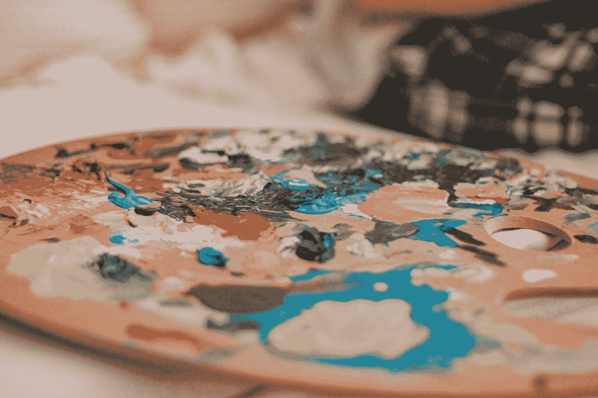

# 用 Python 和深度学习构建图像着色应用

> 原文：<https://medium.com/mlearning-ai/building-image-colourization-app-with-python-and-deep-learning-8a019ef6edf1?source=collection_archive---------5----------------------->

Photo by [Shayna Douglas](https://unsplash.com/@shaynamdouglas?utm_source=medium&utm_medium=referral) on [Unsplash](https://unsplash.com?utm_source=medium&utm_medium=referral)

有没有翻阅过你的旧家庭相册，想知道你是否可以给你父亲或祖父的旧黑白照片上色？这篇文章将满足这种直觉。在这篇文章中，我将为你提供一个深入的直觉，告诉你我们如何使用一个叫做**条件 GAN** 的 GANs 的变种来给灰度图像着色。在文章的最后，你会有足够的…