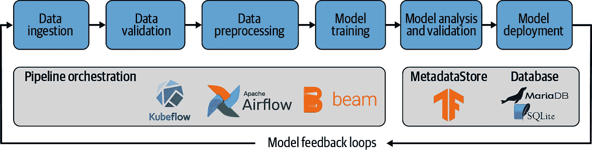
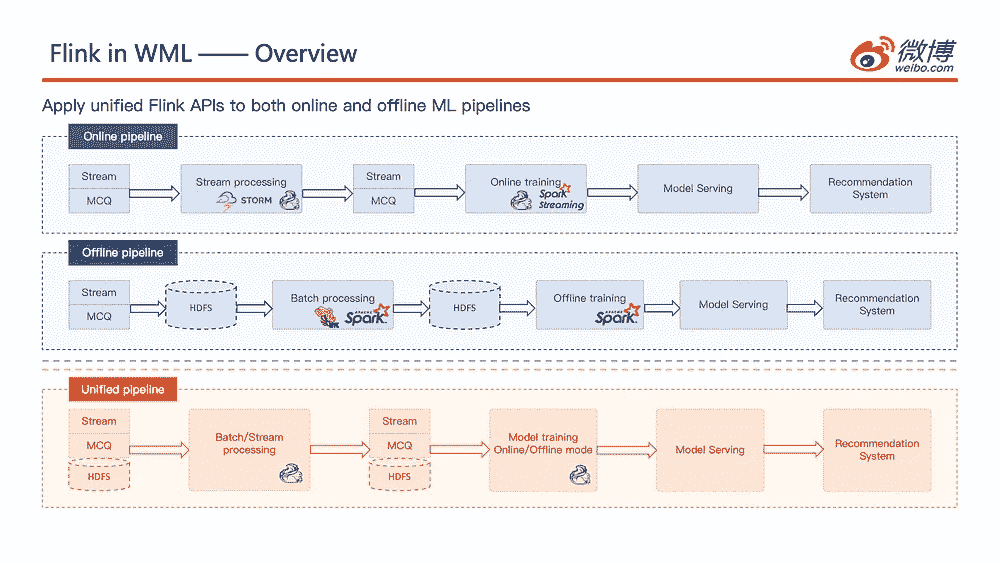
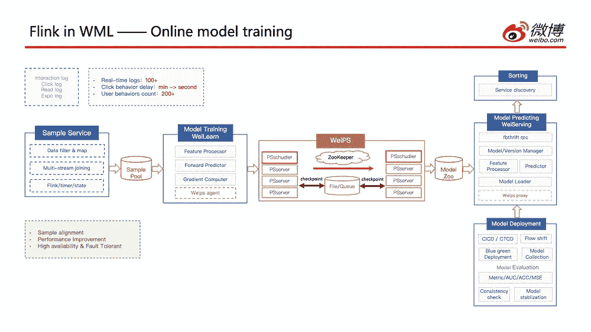
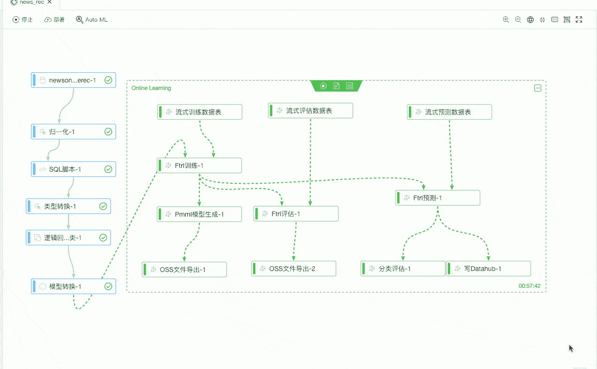
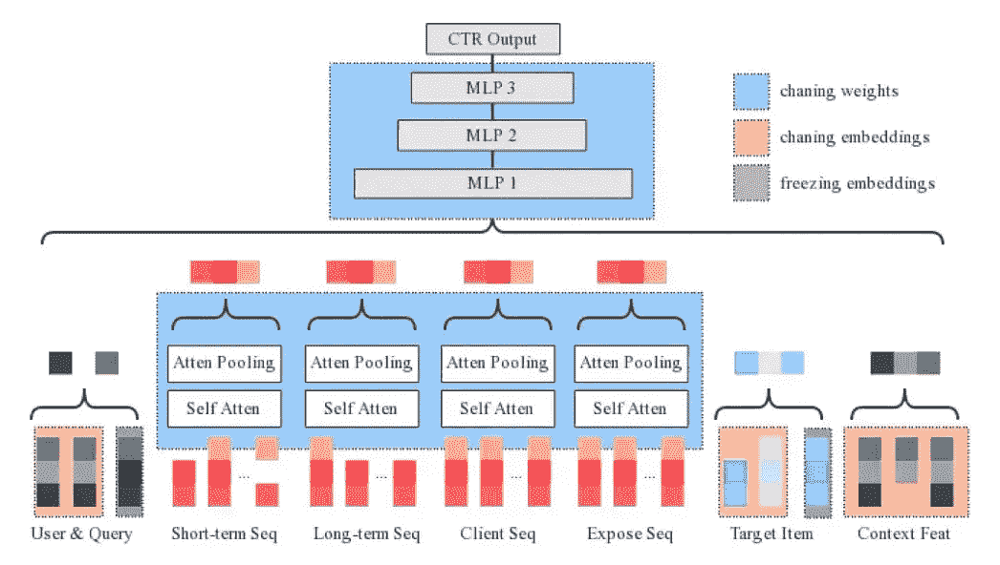
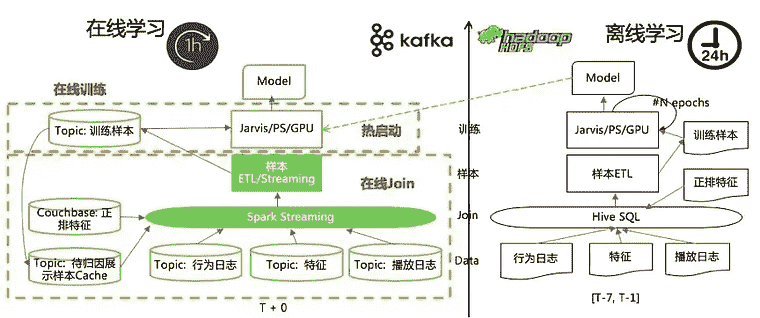
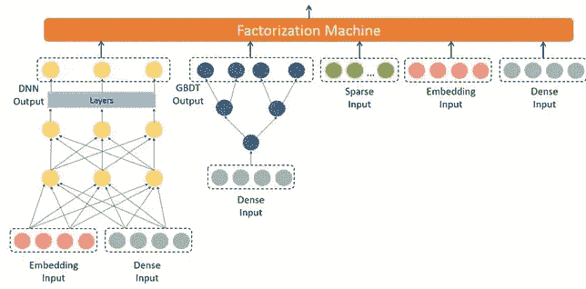
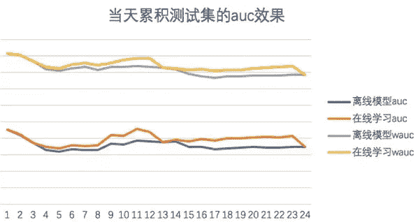

# 构建 ML 管道以实时学习数据(调查)

> 原文：<https://medium.com/mlearning-ai/building-ml-pipelines-for-learning-from-data-in-real-time-b6dbbe9b07ce?source=collection_archive---------0----------------------->

> 在本系列中，作者分享了他使用可用的开源工具构建实时 ML 管道的亲身经历，并记录了一路上的困难。

How much value can you generate by updating models with real-time streams? Photo by [Todd Trapani](https://unsplash.com/@ttrapani?utm_source=medium&utm_medium=referral) on [Unsplash](https://unsplash.com?utm_source=medium&utm_medium=referral)

在[机器学习正在走向实时](https://huyenchip.com/2020/12/27/real-time-machine-learning.html)中，作者 Chip Huyen 将实时机器学习系统分为两个级别:

*   第一级:能够进行实时预测的人工智能系统(在线预测)
*   第二级:能够不断学习新数据并实时更新模型的 ML 系统(在线学习)

第一层中的系统能够做出相关/及时的预测，例如广告排名、跌倒检测、欺诈检测等。实时预测股票价值比一个月后更有价值，对吗？但是对于 Level 1 ML 系统来说，[的技术挑战](https://huyenchip.com/2020/12/27/real-time-machine-learning.html#online_predictions_challenges)大多是通过成熟的开源工具解决的，比如 [Apache Flink](https://flink.apache.org) (流处理) [Kafka](https://kafka.apache.org) (事件驱动架构)[模型压缩](https://github.com/topics/model-compression)[kube flow](https://www.kubeflow.org)(工作流管理)和 [Seldon](https://github.com/SeldonIO/seldon-core) (自动缩放模型服务)。**所有这些** **工具都有清晰的开发路线图**，不断提高模型推理速度，简化流水线开发。

然而，更困难的部分是实现能够进行在线学习并实时用新数据更新模型的 2 级 ML 系统。在如何构建它们的问题上，MLOps 社区几乎没有讨论和共识。事实上，CDFoundation 的 SIG MLOps 将[在线学习列为“必需研究”](https://github.com/cdfoundation/sig-mlops/blob/master/roadmap/2020/MLOpsRoadmap2020.md)直到 2024 年。那么，用目前的开源工具建立一个实时的机器学习管道有多容易呢？

# 1.在线学习的好处

等等，在我们进一步探讨之前，我们到底为什么要进行在线学习呢？近年来，流处理器的成熟允许 DataOps)以可扩展的方式处理实时数据(2)统一批处理和流处理，从 Lamba 架构转移到更简单的 [Kappa 架构](https://milinda.pathirage.org/kappa-architecture.com/)。它们为我们的管道提供了源源不断的实时数据，这让我们不禁要问:我们能从这些实时数据中获取更多价值吗？

答案(你可能已经猜到了):是的，我们可以。在线学习更频繁地更新我们的 ML 模型，以处理社交媒体上的趋势内容、罕见事件(黑色星期五)甚至冷启动期间(新用户行为)等情况。当您需要提高模型性能以快速响应动态数据时，它会大放异彩。因此，值得一问:**通过增加模型更新的频率**，你能产生多少价值？

# 2.实时 ML 流水线的体系结构

好了，现在我们明白了好处，那么我们应该如何设计实时 ML 管道呢？网上有一些行业参考资料，不出所料，这些公司拥有大量实时用户交互数据。在查看它们之前，有必要回顾一下离线 ML 管道，因为将它们发展到在线仍然涉及相同的流程，只是它**变成了一个长期运行的连续循环——**摄取、培训和部署。

(from: [https://www.oreilly.com/library/view/building-machine-learning/9781492053187/ch01.html](https://www.oreilly.com/library/view/building-machine-learning/9781492053187/ch01.html); Online ML Pipelines update model continuously, although may have some delay in deployment to validate models)

在 [Flink Forward Virtual 2020](https://www.ververica.com/blog/flink-for-online-machine-learning-and-real-time-processing-at-weibo) 期间，微博(社交媒体平台)分享了 WML 的设计，他们的实时 ML 架构和管道。本质上，他们已经通过 Apache Flink 将以前分离的离线和在线模型培训整合到一个统一的管道中。本次演讲的重点是 Flink 如何通过将离线数据(社交帖子、用户资料等)与多个实时交互事件流(点击流、阅读流等)和提取的多媒体内容特征相结合，来生成用于培训的样本数据。没有提到具体的模型架构，但他们正在进行在线培训 DNN。

**(Left)** Unified pipeline using Flink for both online & offline | **(Right)** Online Model Training (from: [https://www.ververica.com/blog/flink-for-online-machine-learning-and-real-time-processing-at-weibo](https://www.ververica.com/blog/flink-for-online-machine-learning-and-real-time-processing-at-weibo))

与此同时，PAI(人工智能平台)是阿里云(云供应商)的产品，允许用户通过拖放视觉 UI 建立在线机器学习管道。2019 年初，他们[在平台上发布了 FTRL(跟随正规化的领导者)在线学习模块](https://developer.aliyun.com/article/741004)，以支持推荐器用例，如新闻推荐。那年晚些时候，在阿里巴巴的(电子商务)[工程博客](https://web.archive.org/web/20200815083452/https://developer.aliyun.com/article/688613)上，他们分享了如何利用在线训练来预测光棍节期间的点击率(CTR)和转化率(CVR)。

由于影响 CTR/CVR 的因素很多，如促销、季节等，模型采用了“多层多频”的方式。它是从 XNN 演化而来的，模型的一部分使用冻结嵌入的检查点，而另一部分使用改变嵌入/改变权重。管道执行在线训练和实时模型更新(A/B 测试)。他们使用 AUC 进行在线评估，将模型准确性与 10 分钟前的样本进行比较。(阿里巴巴还开源了在线 FTRL，作为 Alink 的一部分，这将在下一节中提到。)

**(Left)** PAI drag-and-drop visual builder for FTRL module (from: [https://web.archive.org/web/20200815083452/https://developer.aliyun.com/article/688613](https://web.archive.org/web/20200815083452/https:/developer.aliyun.com/article/688613)) **(Right)** Model architecture for predicting Click Through Rate and Conversion Rate, with part of the model updated in real-time (from: [https://developer.aliyun.com/article/741004](https://developer.aliyun.com/article/741004))

几乎同一时间，爱奇艺(视频流媒体)[分享了他们在线培训广&深度 DNN 流媒体推荐系统](https://www.infoq.cn/article/lthcdazelzgc639p1p5q)的经验。他们使用了一种“lambda”方法:对过去 7 天的数据进行离线训练模型，并使用该检查点作为日常在线模型实时摄取的开始。在线培训只有一遍，然后每小时部署一次模型。使用这种体系结构的原因是，当在线模型过度适应本地模式并观察到很有可能出现 OOV(超出词汇表)的性能下降时，要对其进行校正。下一步，他们正在探索替换 Adam 优化器和部署频率。

(Left) Online & Offline ML Pipeline Design (Middle) Model Architecture for Streaming Recommender System (Right) AUC performance improvement (yellow and orange are online trained-models) (from: [https://www.infoq.cn/article/lthcdazelzgc639p1p5q](https://www.infoq.cn/article/lthcdazelzgc639p1p5q))

从上面的例子来看，有几个趋势很明显:

1.  公司正在统一线下和线上培训的 MLOps 渠道
2.  他们也正与 DNN 一起走向在线培训的更深层次模式
3.  并试验用**更频繁的模型部署** ( < 10 分钟，甚至实时！)

# 3.工具和库

有几组开源库用于在 ML 管道中实现在线培训。一些构建在 Flink 之上，而一些使用 Spark 流。大多数都需要 Java 在流处理器上运行，但有些提供 API，甚至在 Python 上原生运行(对来自 Python 深度学习生态系统的开发者更友好！).

*   [**河流**](https://github.com/online-ml/river) **—** 完全为在线训练而设计:它可以通过单次观察更新模型，包含用于构建预处理管道和流数据评估指标的实用程序。唯一拥有最多在线学习算法的库，包括 Tree/FM/Linear/Naive Bayes/KNN 分类器&回归器、K-means 聚类和半空间树异常检测。它的 SKLearn 风格的 API 对很多人来说是非常熟悉的，如果你喜欢 Python，这是最好的选择！
*   **FlinkML —** 提供了[几个 ML 算法](https://ci.apache.org/projects/flink/flink-docs-release-1.2/dev/libs/ml/index.html)，但是在 Flink 1.9 中放弃了较老的库。目前正在重新开发中，利用 Flink Table API 提供[管道接口](https://cwiki.apache.org/confluence/display/FLINK/FLIP-39+Flink+ML+pipeline+and+ML+libs)和[模型服务](https://cwiki.apache.org/confluence/display/FLINK/FLIP-23+-+Model+Serving)。进度可以在这里[获得](https://github.com/apache/flink/tree/master/flink-ml-parent)(在撰写本文时只有几个界面)。
*   [**Alink**](https://github.com/alibaba/Alink)**——**阿里巴巴发布的基于 ML 算法的操作符集合，构建在 FlinkML 新管道接口之上。它同时拥有 Python 和 Java API。但是，FTRL 是唯一的在线训练算法，其他的都是批处理算法。如果你喜欢 Flink 生态系统，这是最好的选择。
*   [**Spark Mllib 的流式算法**](https://spark.apache.org/docs/latest/streaming-programming-guide.html#mllib-operations)**——**类似于提供了几种流式 ML 算法的 FlinkML，但是在 Spark 流式生态系统上。它同时拥有 Python 和 Scala API 来构建管道和导出 PMML 模型。从 Spark 2.0 开始也在重新开发，以利用 DataFrame API。旧的库包含在线 Kmeans 聚类和线性回归。
*   [**Oryx**](https://github.com/OryxProject/oryx)**——**一个 lambda 架构开发平台，使用 Kafka 和 Spark。它提供批处理、速度和服务层来管理模型训练和更新(PMML)。目前包含 ALS 推荐、K-means 聚类和随机森林分类/回归流算法。可惜 2019 年以来没有大的发展。

总的来说，所有的库仍在开发中，大多数优先考虑批量/离线训练算法。River 是唯一一个优先考虑使用最多算法的在线培训的库，而其他从离线培训开始的库可能更适合在生产中部署。

# 4.未来的挑战

本文探讨了用于构建实时机器学习管道的通用架构和开源工具的当前状态，重点关注实现和工程视角。在后续系列中，我将构建实时 ML 管道，并不断探索改进它们的思路，如比较检查点+在线训练和 100%在线训练、实时模型部署等。

接下来:第 2 部分(即将推出)

*如果您喜欢此内容，请点击*👏*所以会有更多人看到这一点。*