# 用 Surprise 和 python 构建电影推荐系统。

> 原文：<https://medium.com/mlearning-ai/building-movie-recommendation-system-with-surprise-and-python-e905de755c61?source=collection_archive---------1----------------------->

完成人:[莫尼拉](https://medium.com/u/cac8f1becf29?source=post_page-----e905de755c61--------------------------------)、[艾莎·Y·哈卡米](https://medium.com/u/20e1553c7e2c?source=post_page-----e905de755c61--------------------------------)、[拉马哈尔比](https://medium.com/u/87f03ec137ee?source=post_page-----e905de755c61--------------------------------)和[默罕默德·阿拉里](https://medium.com/u/c026f26badf6?source=post_page-----e905de755c61--------------------------------)


source: shorturl.at/fltG7

# 问题标识

在 STC 提供的 Jawwy 服务中开发 IPTV 推荐系统。Python 和 JupyterLab 是使用 Sklearn 库实现推荐系统的工具。其目的是为当地公司创造商业价值，以改善他们的服务，STC 被选中与他们的服务 Jawwy 一起参与该项目，因为他们在开放数据计划中共享其数据。

## 在这篇博客中，我们将使用惊奇方法建立一个推荐模型

**Surprise** 是一个 Python scikit，用于构建和分析处理显式评级数据的推荐系统。

## 惊喜的设计考虑了以下目的:

*   让用户完全控制他们的实验
*   提供各种现成的预测算法，如基线算法、邻域法
*   使新算法思想的实现变得容易。
*   提供评估、分析和比较算法性能的工具。使用强大的 CV 迭代器可以非常容易地运行交叉验证过程(受 sci-kit-learn 优秀工具的启发)。

我们将使用 [j](http://www2.informatik.uni-freiburg.de/~cziegler/BX/) awwy IPTV 数据集开发推荐系统算法，使用[惊奇库](http://surpriselib.com/)，它是由 [Nicolas Hug](http://nicolas-hug.com/) 构建的。让我们开始吧！

# 资料组

沙特运营商 STC 为其 DSL 客户推出了一项名为 InVision 的交互式 IPTV 服务，以配合斋月的开始。这项服务最初在三个主要城市利雅得、吉达和达曼提供，整个斋月期间免费。InVision 提供免费电视频道和付费电视套餐、节目时移、节目录制、宗教和纪录片节目的视频点播库，以及观看过去七天播出的节目的电视追播服务。此外，用户可以通过控制面板选择节目和电影。

我们赞赏 STC 在支持数据社区方面发挥的作用，当时 STC 启动了开放数据计划，通过支持对数据科学感兴趣的研究人员，使他们能够通过应用和实践探索和处理数据，帮助培养符合 2030 愿景的懂技术的沙特一代。

由 8k 内 29，487 个用户行为组成的数据全部显示在 3m 行中。我们不仅从用户的所有行为模式中提取汁液，也从电影本身中提取汁液。

# 建模

在之前的帖子中，我们讨论了推荐系统的两种最流行的方法是[协同过滤](https://en.wikipedia.org/wiki/Collaborative_filtering)和[基于内容的推荐](https://www.analyticsvidhya.com/blog/2015/08/beginners-guide-learn-content-based-recommender-systems/)。在这篇博客中，我们将重点讨论协同过滤方法，即:向用户推荐过去有相似品味和偏好的人喜欢的项目。换句话说，这种方法通过使用用户之间的相似性来预测未知的评级。

## 惊喜模型

*惊喜*提供了一个评分预测的估计器集合，实现了经典算法，如主要的基于相似性的算法，以及基于矩阵分解的算法，如奇异值分解或 NMF。它还支持模型评估工具，如交叉验证迭代器和内置度量。

由于**惊喜**不支持隐式**评分**，我们的数据集没有如下所示的重要数据:

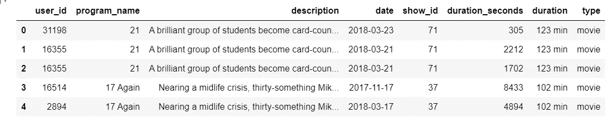

The head of the dataframe.

因此，我们做了一些特征工程来获得每个用户/电影的观看评级，其想法是将观看比率视为一个评级。

问题在于该数据集中电影和系列之间的差异，电影的总时长如下:

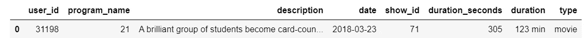

sample of movie

而系列是这样的:

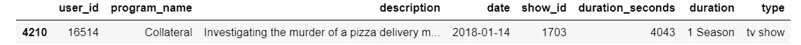

sample of series

对于电影节目，很容易获得观看比率，并将其作为用户评级处理，方法是使用 regex remove (min)单词，该单词以持续时间中的分钟数为后缀，这是 IMDB 中每部电影的总持续时间，然后将时间从分钟转换为秒，之后将持续时间除以 duration_second，这是用户观看这部特定电影的持续时间。

不幸的是，我们不能对连续剧/电视节目应用这些步骤，因为持续时间是针对该季的，而不是该连续剧一集的总持续时间，当我们试图从外部数据集获得这些数据时，我们面临其他问题，即一些连续剧/电视节目将会丢失，还有许多不同的电影具有相同的名称，如[小妇人](https://www.imdb.com/title/tt3281548/)和[小妇人](https://www.imdb.com/title/tt0110367/)。

因此，我们将数据集分成 2 个数据帧，第一个数据帧用于`TV Show`的 *merged_df_series* ，第二个数据帧用于`Movie`节目的 *merged_df_movie*

对于分配总时长的`TV Show`节目，我们使用`.max()`返回每个节目/电视节目的用户在 duration_seconds 内的最大值作为总时长，因为我们没有数据集的总时长

```
df_series_duration=merged_df_series.groupby(‘program_name’)[[‘duration_seconds’]].max()
```

加上 average_watching 和 total_duration，我们会把它作为惊喜模型的目标。

```
#average_watching
merged_df_series[“average_watching”] = merged_df_series.apply(lambda x: 1 if x[‘duration_seconds’] > df_series_duration.loc[x.program_name,’duration_seconds’] else x[‘duration_seconds’]/df_series_duration.loc[x.program_name,’duration_seconds’], axis=1)# total_duration 
merged_df_series[“total_duration”]= merged_df_series.apply(lambda x: df_series_duration.loc[x.program_name,’duration_seconds’],axis=1)
```

## 系列数据集的头部:

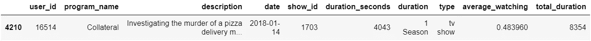

请记住，平均收视率代表每个用户观看特定节目的比率。

对于`Movie`计划:

```
# Extract minute by using (regex) and convert to appropriate type 
merged_df_movie[‘total_duration’] = merged_df_movie[‘duration’].str.replace(r’min’, ‘’)
merged_df_movie[‘duration_seconds’] = pd.to_numeric((merged_df_movie[‘duration_seconds’]) , errors=’coerce’).astype(‘Int64’)
merged_df_movie[‘total_duration’] = pd.to_numeric((merged_df_movie[‘total_duration’]) , errors=’coerce’).astype(‘Int64’)# convert from min to sec
merged_df_movie[‘total_duration’]=(merged_df_movie[‘total_duration’]*60)
```

如果持续时间秒的值>总持续时间，则将总持续时间的值分配给持续时间秒:

```
merged_df_movie[“duration_seconds”] = merged_df_movie.apply(lambda x: x[‘total_duration’] if x[‘duration_seconds’] > x[‘total_duration’] else x[‘duration_seconds’], axis=1)
```

添加 average_watching 特性，我们会将其作为惊喜模型的目标。

```
merged_df_movie[‘average_watching’]=merged_df_movie[‘duration_seconds’]/merged_df_movie[‘total_duration’]
```

## 电影数据集的头:

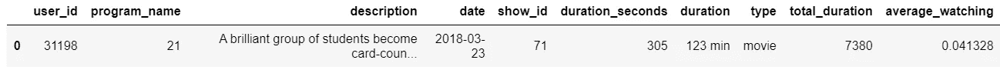

# 连接数据帧

*   连接 merged_df_movie 和 merged_df_series 并检查异常值。

数据集如下所示:

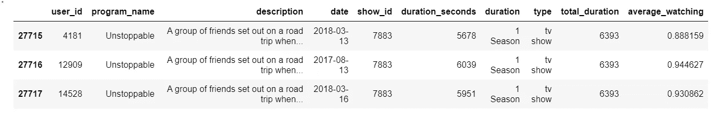

Sample of the merged dataset

一些 EDA:

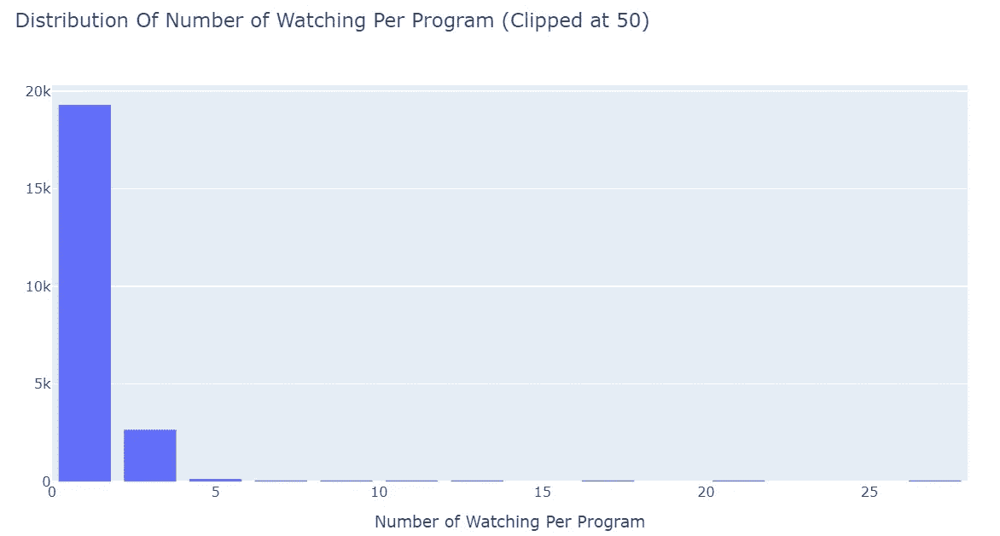

most-watched program

数据中的大部分节目观看次数少于 3 次，极少数节目观看次数多，尽管观看次数最多的节目已经被观看了 2312 次

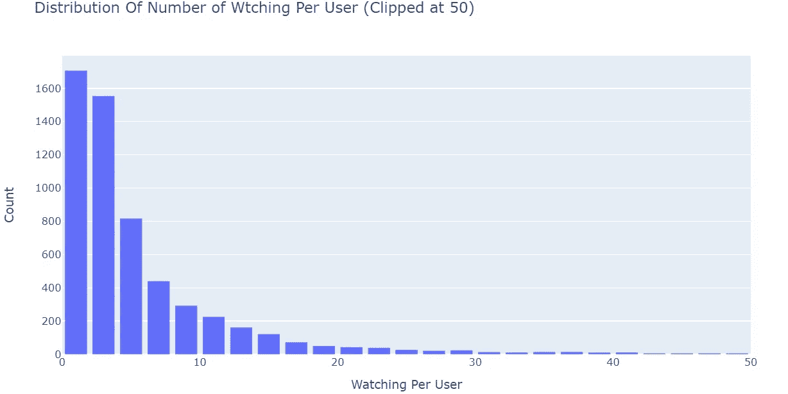

Distribution Of Number of Watching Per User

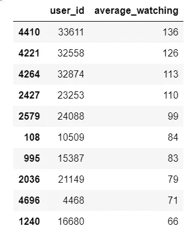

most-active users

数据中的大多数用户观看的节目少于 10 个，观看次数不多的用户不多，尽管最活跃的用户观看了 136 个节目。

```
reader = Reader(rating_scale=(0.03, 1.0))
data = Dataset.load_from_df(df_data[[‘user_id’, ‘show_id’, ‘average_watching’]], reader)benchmark = []
# Iterate over all algorithms
for algorithm in [SVD(), SVDpp(), SlopeOne(), NMF(), NormalPredictor(), KNNBaseline(), KNNBasic(),
 KNNWithMeans(), KNNWithZScore(), BaselineOnly()]:
 # Perform cross validation
 results = cross_validate(algorithm, data, measures=[‘RMSE’], cv=3, verbose=False)

 # Get results & append algorithm name
 tmp = pd.DataFrame.from_dict(results).mean(axis=0)
 tmp = tmp.append(pd.Series([str(algorithm).split(‘ ‘)[0].split(‘.’)[-1]], index=[‘Algorithm’]))
 benchmark.append(tmp)
```

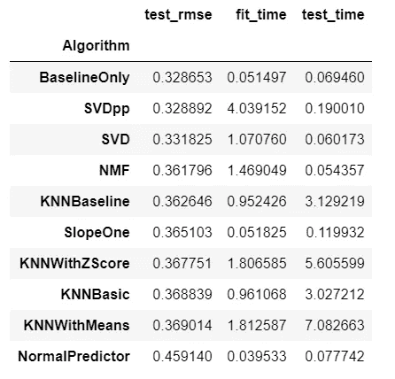

various algorithms and their scores

# 训练和预测

`BaselineOnly`算法给出了最佳 rmse，因此，我们将使用`BaselineOnly`进行训练和预测，并使用交替最小二乘法(ALS)。

```
 print(‘Using ALS’)
bsl_options = {‘method’: ‘als’,
 “random_state”:250,
 ‘n_epochs’: 5,
 ‘reg_u’: 12,
 ‘reg_i’: 5
 }
algo = BaselineOnly(bsl_options)
cross_validate(algo, data, measures=[‘RMSE’], cv=3, verbose=False)Using ALS
Estimating biases using als...
Estimating biases using als...
Estimating biases using als...
```

出局:

```
{'test_rmse': array([0.32846883, 0.32829109, 0.32849049]),
 'fit_time': (0.05880260467529297, 0.04584360122680664, 0.06278657913208008),
 'test_time': (0.1285717487335205, 0.14949917793273926, 0.12757420539855957)}
```

我们使用`train_test_split()`对给定大小的训练集和测试集进行采样，并使用 rmse 的精度度量。然后，我们将使用`fit()`方法在训练集上训练算法，使用`test()`方法从测试集返回预测。

```
trainset, testset = train_test_split(data, test_size=0.25)
algo = BaselineOnly(bsl_options)
predictions = algo.fit(trainset).test(testset)
accuracy.rmse(predictions)
```

出局:

```
Estimating biases using als...
RMSE: 0.3295
```

为了详细检查我们的预测，我们将建立一个包含所有预测的熊猫数据框。

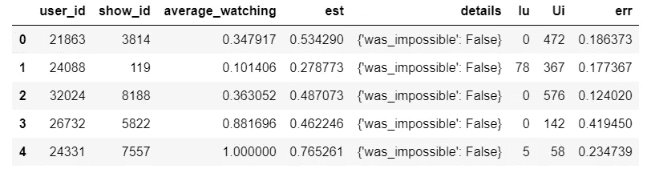

The predictions in detail

## 用户的 13618 行为

*   这里我们将研究一个特定用户的观看行为，他的 ID 是(13618)

```
# user_id is the 13618
ratings = newdf.loc[newdf[‘user_id’] == 13618]
# obtain the required data of this user
ratings=ratings[[‘user_id’, ‘show_id’, ‘average_watching’]]
ratings
```

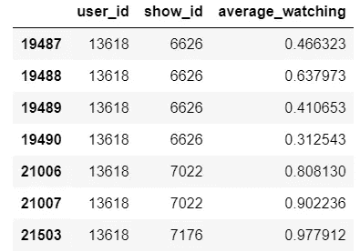

```
# get the list of the movie ids
unique_ids = newdf[‘show_id’].unique()# get the list of the ids that the userid 13618 has watched
iids1001 = newdf.loc[newdf[‘user_id’]==13618, ‘show_id’]# remove the rated movies for the recommendations
movies_to_predict = np.setdiff1d(unique_ids,iids1001)
```

## 用户 13618 的推荐方案

```
algo = BaselineOnly(bsl_options)
algo.fit(data.build_full_trainset())my_recs = []
for iid in movies_to_predict:
 my_recs.append((iid, algo.predict(uid=’13618',iid=iid).est))
pd.DataFrame(my_recs, columns=[‘iid’, ‘predictions’]).sort_values(‘predictions’, ascending=False).head(10)
```

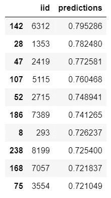

Prediction estimators

就是这样！我希望你喜欢带着[惊喜](https://surprise.readthedocs.io/en/stable/index.html)的推荐(或者说，评级预测)之旅。

参考:

*   [惊喜’文档](https://surprise.readthedocs.io/en/stable/index.html)
*   【https://actsusanli.medium.com/ 
*   [https://predictive hacks . com/how-to-run-recommender-systems-in-python/](https://predictivehacks.com/how-to-run-recommender-systems-in-python/)