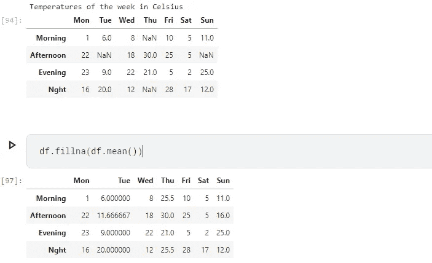
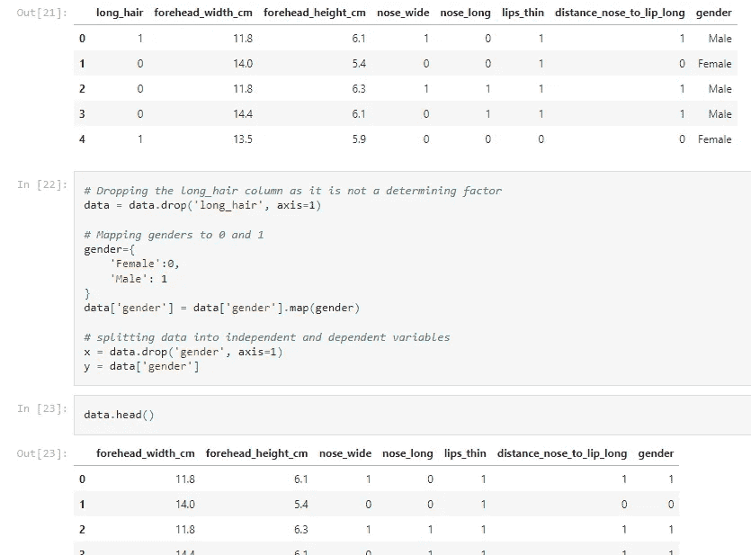
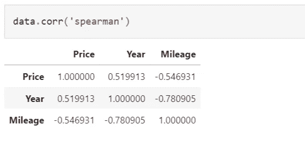
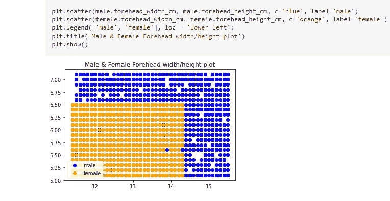
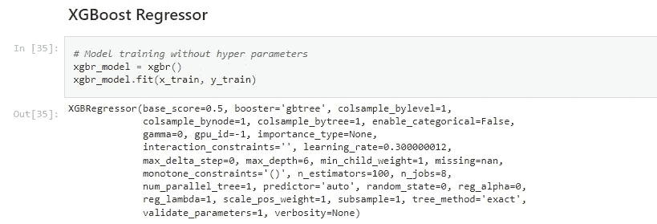
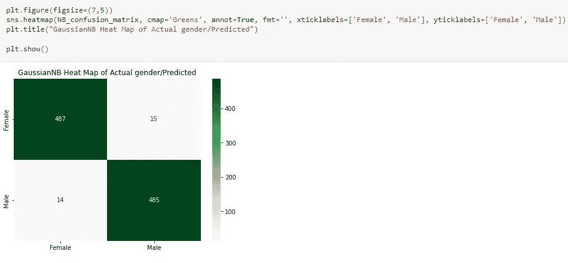
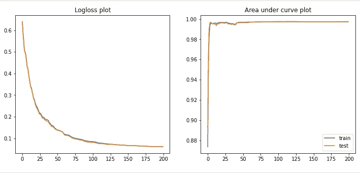
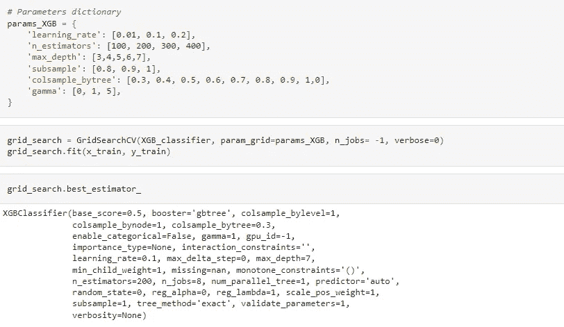

# 构建完美的机器学习项目:应遵循的步骤

> 原文：<https://medium.com/mlearning-ai/building-the-perfect-machine-learning-project-steps-to-follow-197a49650aad?source=collection_archive---------3----------------------->

## 标准机器学习项目生命周期的细分，包括每个步骤中的任务和子任务，以及 python 项目中的实际示例。

Photo by [Markus Winkler](https://unsplash.com/@markuswinkler?utm_source=medium&utm_medium=referral) on [Unsplash](https://unsplash.com?utm_source=medium&utm_medium=referral)

当构建机器学习项目时，为了细化训练模型的端到端过程，需要遵循某些步骤，否则称为**机器学习流水线**。在这篇文章中，我将强调并阐明它们。

它们如下:

1.  数据采集
2.  特征工程
3.  探索性数据分析
4.  特征选择(FS)
5.  交叉验证
6.  模型训练和评估
7.  超参数调谐
8.  部署、监控和维护模型/系统
9.  重新培训和重新部署

## **数据采集**

什么是数据收集？

我将首先从数据的基本定义开始，众所周知，数据是具有隐含意义的原始事实和数字，可用于分析和/或其他目的。 ***数据采集另一方面是收集和编译数据的过程*** *。没有数据，任何其他流程都无法运行，因为没有数据，机器或人类就没有东西可以学习。有几种数据收集方法，如**网络搜集**、**调查、API 调用、公开可用数据下载**等等。在收集数据之前，应考虑以下问题: ***需要多少数据，需要什么类型的数据，如何收集这些数据，收集这些数据的成本是多少，如何安全地存储这些数据*** 等等*

## 特征工程

几乎在数据收集过程完成后的所有时间里，我们都没有得到“干净的数据”NB:没有错误并准备好进行分析的数据。 ***这些错误可能是缺失值、重复数据、*** [***离群值***](https://www.google.com/search?q=what+is+a+data+outlier&ei=qRmaYtH8GqWGxc8Pu5eZsAo&oq=what+is+a+data+out&gs_lcp=Cgdnd3Mtd2l6EAMYATIFCAAQgAQyBQgAEIAEMgUIABCABDIFCAAQgAQyBggAEB4QFjIGCAAQHhAWMgYIABAeEBYyBggAEB4QFjIGCAAQHhAWMgYIABAeEBY6BQgAEJECOgQIABBDOggIABCABBCxAzoICC4QgAQQsQM6BQgAELEDOgoIABCxAxCDARBDOhAIABCxAxCDARCRAhBGEPkBOgsIABCxAxCDARCRAjoLCAAQgAQQsQMQgwE6CAgAELEDEIMBOggIABAeEA8QFkoECEEYAEoECEYYAFAAWLktYJc8aAJwAXgAgAHwAogB2yKSAQgwLjMuMTYuMZgBAKABAcABAQ&sclient=gws-wiz) ***、拼写错误(在文本数据的情况下)、数据格式错误，即整数为字符串*** 因此，必须对数据进行处理，以确保其可供分析。可以做以下工作: ***用平均值或中值替换缺失值，新列可以从两个或多个现有列(值)之间的组合或数学运算、特征缩放、归一化、特征编码(用整数或浮点映射替换字符串数据，因为大多数 ML 模型不接受字符串)中导出。我将在另一篇文章中讨论更多关于特征编码的内容。***

Example of Feature Engineering (Filling missing values with mean)

Example of Feature Engineering (feature encoding)

请注意，第一幅图像中的 NaN/missing 值现在如何替换为列的平均值，以及第二幅图像中“性别”列的值如何从男性和女性变为 1 和 0。这些是什么是特征工程的简单示例。在我的 [GitHub repo](https://github.com/munas-git/Gender-classification/blob/main/gender-classification.ipynb) 上查看完整代码。注意:两个数据集都是随机生成的。

## 探索性数据分析

顾名思义，探索性数据分析与彻底检查数据有关，以便了解诸如*什么特征/属性是依赖集的决定因素(模型要预测什么)、变量如何相互关联(相关性)以及许多其他因素*之类的事情。然而，你应该注意到，相关性并不一定意味着因果关系，因为两件事相关的事实并不一定意味着一个导致另一个。执行 EDA 的一些方式包括但不限于 ***绘图*** ***散点图、直方图、相关表(Spearman 的、Pearson 的)、交叉表、e.t.c.***

Exploratory Data Analysis (Spearman’s correlation table)

Exploratory Data Analysis (Scatter plot)

在第一张图中，表格告诉我们属性之间的正/负相关程度。在第二张图中，该图表明男性通常比女性有更大的前额。参见 [GitHub](https://github.com/munas-git/Gender-classification/blob/main/gender-classification.ipynb) 上的完整代码。

## 特征选择(FS)

探索性数据分析(EDA)完成后，您将会很好地理解哪些特性/属性与做出预测最相关。然后你可以继续删除不相关的列，这就是所谓的[降维](https://www.google.com/search?q=dimensionality+reduction+in+machine+learning&ei=PHKbYpeGAaKF9u8Prs6qiAI&oq=dimensionality+&gs_lcp=Cgdnd3Mtd2l6EAMYADIECAAQQzIFCAAQkQIyBAgAEEMyBQgAEIAEMgUIABCABDIFCAAQgAQyBQgAEJECMgQIABBDMgUIABCABDIFCAAQgAQ6DQguENQCEOoCELQCEEM6CggAEOoCELQCEEM6BwgAELEDEEM6CgguELEDENQCEEM6BAguEEM6CwguEIAEELEDEIMBSgQIQRgASgQIRhgAUNACWOUcYOMnaAFwAXgAgAHBAogB6hiSAQcwLjcuNy4xmAEAoAEBsAEKwAEB&sclient=gws-wiz)。它有助于减少数据中的噪声，并提高模型的整体准确性。要查看特征选择的示例，向上滚动到图像***特征工程示例(特征编码)。*** 在图像中，您会注意到第一个表格中的“long_hair”列在第二个表格中不再可用，这是因为在 EDA 过程中，数据集表明男性和女性都有长发或短发，并且没有性别差异。在这种情况下，这样的列是不相关的，对模型的准确性没有帮助，所以可以而且应该删除。

## 交互效度分析

有几种算法可以用来拟合数据进行训练，但是为了得到最好的结果，我们选择“最适合工作的算法”，你怎么知道哪种算法是“最适合工作的”？这就是交叉验证的用武之地。 ***交叉验证是通过数据子集训练模型，然后用另一个子集(未用于训练的子集)测试模型的过程。*** 对几种不同的算法进行该处理，计算平均预测精度得分。此后，具有最高平均分数的算法被选择用于进一步的处理。交叉验证的类型包括但不限于 ***K 重交叉验证、分层 K 重交叉验证、维持交叉验证。我将在另一篇文章中更多地讨论这个概念。***

## *模特培训与评估*

> *模特培训*

*在这一阶段，已经选择了作业的最佳算法，是时候向算法提供处理过的数据以供其学习了。没有任何超参数的模型训练通常是这样的；*

**

*Basic example of Model Training(Extreme Gradient Boost Regressor Algorithm)*

> *估价*

*在评估期间，可以采用几种技术来评估模型的性能，例如 ***计算回归任务的 R2(R 平方)分数、均方根误差*** 和 ***对数损失、曲线下面积图、显示真阳性、真阴性、假阳性和假阴性数量的混淆度量****。*** 在计算出一个混淆矩阵后，绘制出它的热图会使它更吸引人，更容易理解。***

****

*Evaluation (Classification/clustering tasks…. Confusion matrix heat map, Log loss plot and Area under curve plot)*

*从热图中，您可以看到模型预测正确的次数(绿色背景中的数字)和预测错误的次数(白色数字)。注意:这些预测是通过在独立集合上使用***model . predict***进行的，并用从属集合中的实际值进行验证。从 log loss 和 AUC 图来看，线几乎遵循完全相同的路径，这意味着模型能够对训练/熟悉的数据和新的/测试数据进行适当的概括，因此没有过度拟合，模型是好的。*

## *超参数调谐*

*什么是超参数？*

****这些是算法配置，可以调整以提高模型性能。*** 模型的性能可以通过简单地调整其超参数来提升。不同的算法有不同的超参数，可以在它们的文档中找到。在对任何超参数进行任何调整之前，了解其影响以及这些超参数中哪些需要更改是很重要的。有手动方式调整超参数，但我个人更喜欢使用[网格搜索 CV](https://scikit-learn.org/stable/modules/generated/sklearn.model_selection.GridSearchCV.html) 或[随机搜索 CV](https://scikit-learn.org/stable/modules/generated/sklearn.model_selection.RandomizedSearchCV.html) 来节省时间。这两种交叉验证搜索器技术在所提供的超参数组合上训练模型。我将在下一次讨论这两种技术，以及基于模型的复杂性和您的计算机资源，您应该使用哪一种。*

**

*Hyper-parameter tuning (GridSearch CV)*

*在上图中，您可以看到超参数字典。GridSearchCV 使用提供的所有可能的超参数组合来训练几个模型，最后，您可以运行一行非常短的代码，根据 grid searcher 的规定为您的模型返回可能的最佳超参数组合，然后您可以继续复制和粘贴这些超参数，并重新训练模型。*

## *部署、监控和维护模型/系统*

> *部署*

*模型部署是将机器学习模型集成到现有环境中，目的是接收输入并提供输出(预测)。这一步包括把模型拿出来，让它做它应该做的事情。此时，我简单地通过构建一个 web 应用程序将我的 ML 模型部署到 web 上。前端使用 HTML 和 CSS，后端使用 Flask，并在免费托管平台上托管 web 应用程序，如 [Heroku](https://www.heroku.com/free) 。有几种部署方法，一旦我很好地掌握了它们，我也将讨论它们。*

> *监控和维护*

*为了确保一个模型仍然像它应该的那样运行，它需要不断地被监控和维护。这一过程有助于检测错误预测、模型退化、数据漂移、概念漂移等。监控和维护模型的一种简单方法是检查其在真实世界数据上的准确性，如果准确性保持在可接受的要求标准以上，则该模型在一段时间内仍然有效。如果没有达到可接受的标准，那么下一步就要开始了。*

## *重新培训和重新部署*

*重新训练，重新部署，基本上就是前面 8 步的重做。如你所见，训练机器学习模型的过程是循环的。重新训练模型的唯一目的是随着时间的推移增加/保持其准确性。*

*至此，我已经到了这篇文章的结尾。我希望你能够学会一些新的技巧，并且理解构建**机器学习管道所涉及的步骤、任务和子任务。**请随意分享、鼓掌并留下评论，我会尽快回复。*

*在我的下一篇文章中，我将讨论使用 Python(BeautifulSoup)和 Excel 收集数据的 ***web 抓取*** 。*

*要阅读上面提到的文章，请按照这个 [***链接***](/@einsteinmunachiso/web-scraping-with-ms-excel-and-python-static-site-contents-4903ea08b85)*

*谢谢，下次再见。*

* [## Mlearning.ai 提交建议

### 如何成为 Mlearning.ai 上的作家

medium.com](/mlearning-ai/mlearning-ai-submission-suggestions-b51e2b130bfb)*