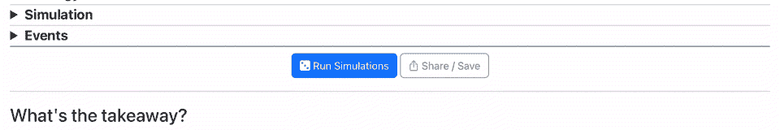
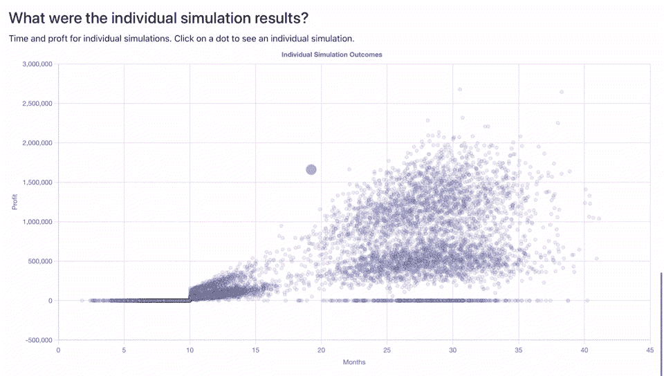
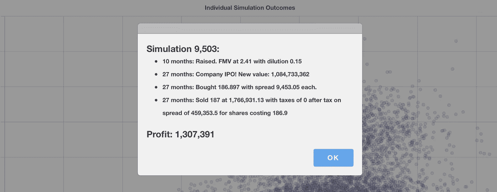
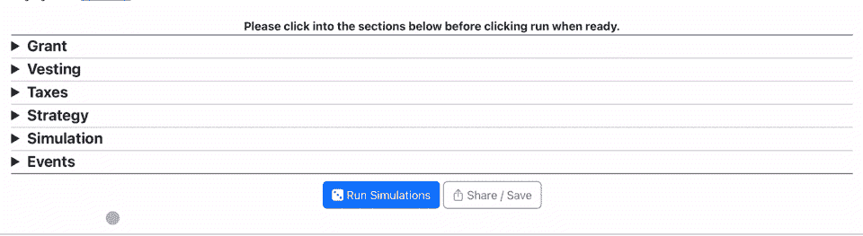
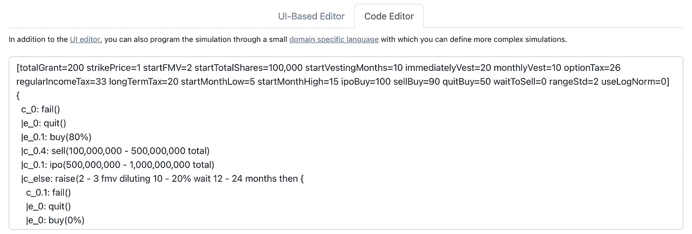

# 共同建设:为什么数据项目失败以及如何促进协作

> 原文：<https://medium.com/mlearning-ai/building-together-why-data-projects-fail-and-how-to-foster-collaboration-a31f7b97accf?source=collection_archive---------5----------------------->

在工程师和科学家努力开发新工具或新模型的漫长道路上，事情仍然可能会失败。不幸的是，大约四分之三的数据项目失败了，研究和文章强调协作和采用是共同的挑战[[1](https://designingforanalytics.com/resources/failure-rates-for-analytics-bi-iot-and-big-data-projects-85-yikes/)][[2](https://venturebeat.com/ai/why-do-87-of-data-science-projects-never-make-it-into-production/)][[3](https://www.forbes.com/sites/randybean/2021/01/03/decade-of-investment-in-big-data-and-ai-yield-mixed-results/?sh=926c94409e9b)[[4](https://towardsdatascience.com/why-is-data-science-failing-to-solve-the-right-problems-7b5b6121e3b4)]。当然，对于一般的软件来说，用户参与和内部购买是最重要的成功标准，像用户研究、敏捷和参与式设计这样的工具都可以解决这些长期存在的问题[[5](https://standishgroup.com/sample_research_files/CHAOSReport2015-Final.pdf)][[6](/aleph-universe/roi-and-ux-research-how-can-we-measure-it-295b82b44eea)][[7](https://repository.lboro.ac.uk/articles/journal_contribution/Empirical_investigation_of_the_impact_of_using_co-design_methods_when_generating_proposals_for_sustainable_travel_solutions/9348323)][[8](https://pointjupiter.com/what-is-participatory-design-what-makes-it-great/)][[9](https://youtu.be/a-BOSpxYJ9M)][[10](https://books.google.com/books/about/The_Design_of_Design.html?id=0qG4TQi-e-4C)[[11](https://www.semanticscholar.org/paper/An-empirical-study-of-the-impact-of-user-on-system-Baroudi-Olson/96170541d5cc94c212cd2b567f0a89c19a522c66)]。然而，特别是在 AI / ML 中，数据项目面临着独特的挑战:模型的不确定性、机械的不透明性、单一作者和有限的代理都为参与和反馈设置了障碍。使用我最近的一个开源项目作为案例研究，数据团队可以从其他学科学到什么？如果协作如此重要，他们在与其他团队合作时可以采取什么步骤？

## **挑战 1:不确定性建模**

处理和讨论不确定性通常会遇到第一个障碍。考虑到一些合作者可能不太熟悉概率系统，因此很难使用数据科学团队常用的工具(如不同的概率分布或指标)进行推理。

Small UX gestures can get the user thinking about a population of outcomes not one answer.

当然，从行话中退一步可能会有所帮助:对比“80%的精确度”和“当预测某事是不成熟的时，它在 80%的时间里是正确的”。然而，更基本的是，将不同的概率分布内在化是具有挑战性的，信息设计可以帮助培养“分布”思维。例如，FiveThirtyEight 的“[蜜蜂群](https://fivethirtyeight.com/features/how-we-designed-the-look-of-our-2020-forecast/)”在他们的概率 [2022 年中期预测](https://projects.fivethirtyeight.com/2022-election-forecast/)中鼓励读者将选举预测视为可能结果的*集合*而不是单个*答案，显示个人的可能性，以 1)向用户暗示他们的预测实际上是一种分布，2)揭示不同结果群体的形状[ [13](https://projects.fivethirtyeight.com/2022-election-forecast/senate/?cid=rrpromo) ][ [14](https://fivethirtyeight.com/features/how-we-designed-the-look-of-our-2020-forecast/) 。我最近的一个开源项目( [StartupOptionsBot](https://startupoptionsbot.com/) )以类似的方式显示启动选项。*

Showing individual simulation results encourages distributional thinking.

就像选举预测一样，一系列复杂的事件可能会改变初创员工期权的结果，这部分薪酬让他们可以购买自己公司的股票([免责声明](https://startupoptionsbot.com/disclaimer.html#financial)，而不是财务建议)[ [16](https://every.to/p/what-should-you-do-with-your-options-during-a-downturn) )。员工可能赚钱，也可能赔钱，同样，这项投资结果的“人口形状”通常比总体平均答案更能提供信息。因此，StartupOptionsBot 以散点图的形式展示了它的每个蒙特卡洛试验，从而勾勒出潜在结果的总体。简而言之，展示个人模拟的结果会促使用户进行分布式思考。

## **挑战 2:机械不透明**

除了解决不确定性之外，请注意，机器学习/概率模型的复杂机制经常变得难以用简洁的人类可理解的方式来描述。因此，开放像 [LIME](https://dl.acm.org/doi/10.1145/2939672.2939778) 这样的工具，它们可以估计不同属性的重要性，以“解释”一个单独的预测[ [17](https://dl.acm.org/doi/10.1145/2939672.2939778) ]。此外，这些信息可以使用界面设计模式进行“上下文”解释，在不中断用户流程的情况下提供洞察力。

Allowing users to access explanations for individual results builds trust and understanding.

作为演示，考虑一下 [StartupOptionsBot](https://startupoptionsbot.com/) 如何在代表单个模拟的点上附加一个点击监听器[ [15](https://startupoptionsbot.com) ]。仍然保持整体分布的整洁视图，用户可以访问导致结果的单个事件，为什么场景导致什么结果提供直觉。事实上，FiveThirtyEight 的总统预测与单个模拟级别的选举地图有些类似。简而言之，机制的透明性有助于建立模型信心，预测解释可以促进对问题的理解。

## 挑战 3:单身作者

在解决了不确定性和不透明性之后，考虑像[参与式/合作设计](https://www.beyondstickynotes.com/what-is-codesign)这样的技术旨在将用户作为合作者带入设计/开发过程中 [19](https://www.beyondstickynotes.com/what-is-codesign) 。当现实世界的系统经常需要数据科学家或工程师的技能来与模型或管道进行交互时，这对于数据项目如何工作呢？像气候变化[途中](https://en-roads.climateinteractive.org/scenario.html?v=22.8.0)模拟这样的解决方案允许用户“玩”模型参数，看看不同的选择如何改变变暖的结果，而像[网格](https://grid.is/)或[可观察](https://observablehq.com/)这样的产品允许使模型的各个部分互动[[20](https://en-roads.climateinteractive.org/scenario.html?v=22.8.0&p1=62&p211=1)][[21](https://grid.is)][[22](https://observablehq.com/@observablehq/modeling-in-observable)]。这些为生产性探索创造了安全的环境，同时保留了模型的底层机制和安全措施。

Progressive disclosure can help the user see the main loop of a tool.

作为一个案例研究，考虑一下 [StartupOptionsBot](https://startupoptionsbot.com/) 的用于建筑模拟的用户界面[ [15](https://startupoptionsbot.com) ]的交互设计。首先，请注意，它使用了“[渐进显示](https://www.freshconsulting.com/insights/blog/uiux-principle-51-progressive-disclosure-hides-complexity/)”来将不同的控件分组到可折叠部分之后，这样用户就可以轻松地了解系统的复杂性，在显示细节之前，从模型结构的简单概述开始。第二，它借鉴了 game design 的“[核心循环](https://www.youtube.com/watch?v=mGL5YGcAxEI)”概念，使用高亮按钮和颜色来指导用户通过改变模型参数和查看结果的循环[ [24](https://youtu.be/mGL5YGcAxEI) ]。总之，这些设计选择可以创建迭代实验沙盒，为安全探索提供环境。

## **挑战四:有限代理**

当然，在这些复杂的界面中导航是很费力的。虽然这些技术允许用户操作模型参数，但像 [En-ROADS](https://en-roads.climateinteractive.org/scenario.html?v=22.8.0) 和 [StartupOptionsBot](https://startupoptionsbot.com/) 这样的 ui 的复杂性意味着，在某种程度上，这些工具变得类似于大量使用的编程:仅在图形界面[[15](https://startupoptionsbot.com)][[20](https://en-roads.climateinteractive.org/scenario.html?v=22.8.0&p1=62&p211=1)][[25](https://blog.metaobject.com/2020/04/maybe-visual-programming-is-answer.html)]中实现类似于基于代码的编程的复杂性。然而，语言设计可能会有所帮助！

Domain specific languages provide a streamlined path for broad authorship.

例如，StartupOptionsBot 提供了一种小型的[“特定领域”编程语言](https://tomassetti.me/domain-specific-languages/)。局限于特定的环境或项目，这些“DSL”可能比通用语言(如 [Python](https://www.python.org/) )更容易完成任务，并使合作者能够在系统中真正合作[ [26](https://tomassetti.me/domain-specific-languages) ][ [27](https://www.python.org/) ]。事实上，正如在比较可视化编程和基于代码的编程时经常发现的那样，StartupOptionsBot 中代码表示的紧凑性通常比大型模拟的 UI 等效物更可行[ [15](https://startupoptionsbot.com) ][ [25](https://blog.metaobject.com/2020/04/maybe-visual-programming-is-answer.html) ]。尽管从 UI 转移到代码是为了可用性，但考虑一下你的数据工具是否已经需要一种“可视化编程”,哪些方法提供了更深层次的共享作者身份/代理。

邀请外部数据团队的合作者可以帮助建立利益相关者的支持，并将新的专业知识融入建模，促进采用和成功。数据项目提出了独特的挑战，但这些技术可能为合作和合著铺平道路。说了这么多，我想以承认这需要资源来结束:数据可视化、软件工程和基础设施。也就是说，如果具备这些技能可以降低失败的风险，那么您的数据团队能承受不具备这些技能的后果吗？

*喜欢这样，想要更多设计与数据交汇的创意？* [*跟我来*](https://tinyletter.com/SamPottinger) *！另外，参见* [*幻灯片中一段相关的谈话*](https://www.slideshare.net/Samnsparky/codesign-in-data-science) *。*

 [## Mlearning.ai 提交建议

### 如何成为 Mlearning.ai 上的作家

medium.com](/mlearning-ai/mlearning-ai-submission-suggestions-b51e2b130bfb)