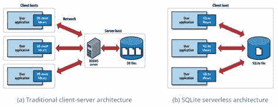
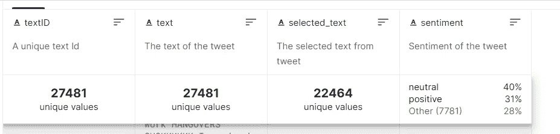
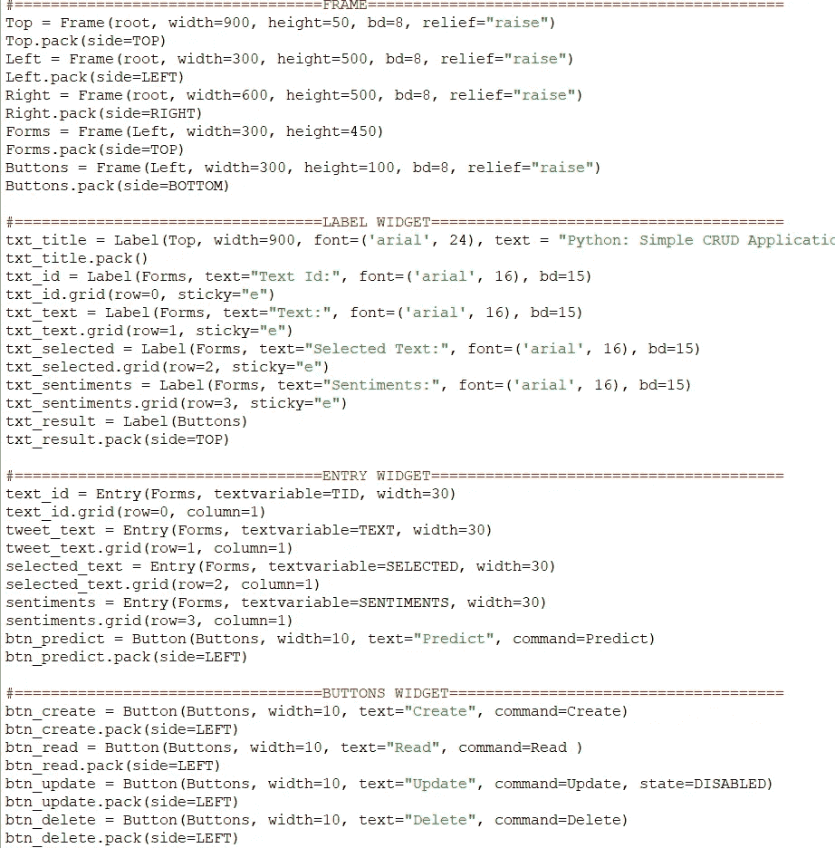
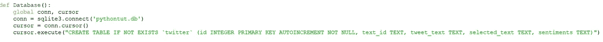
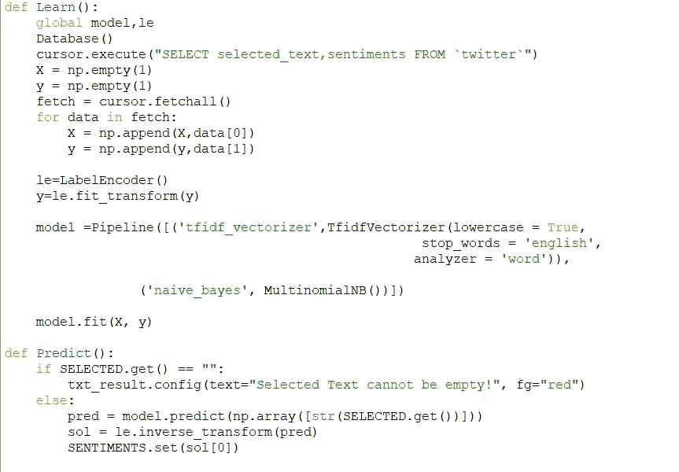
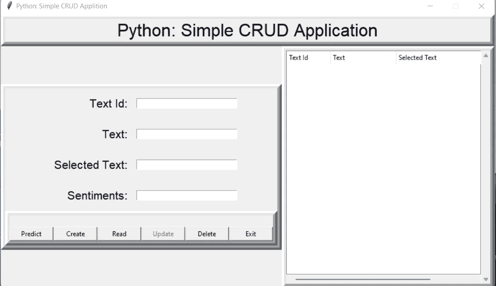
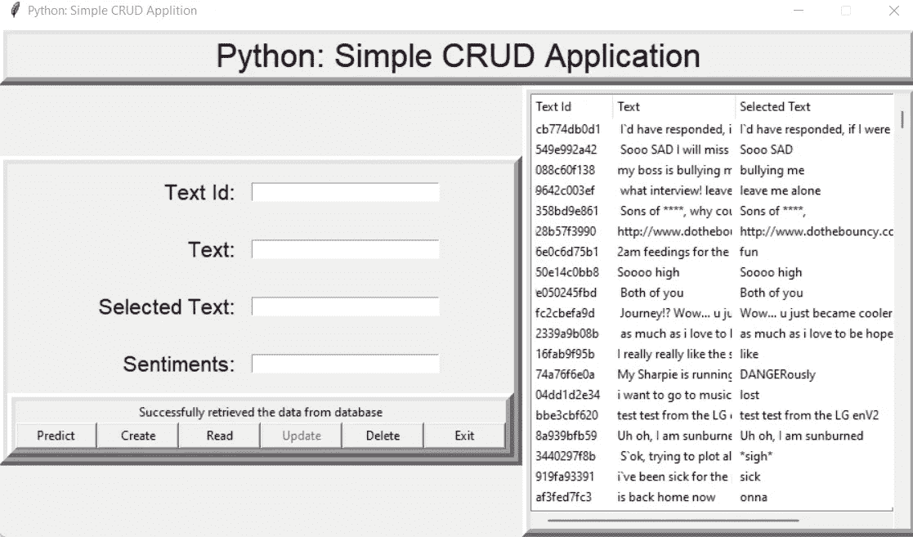
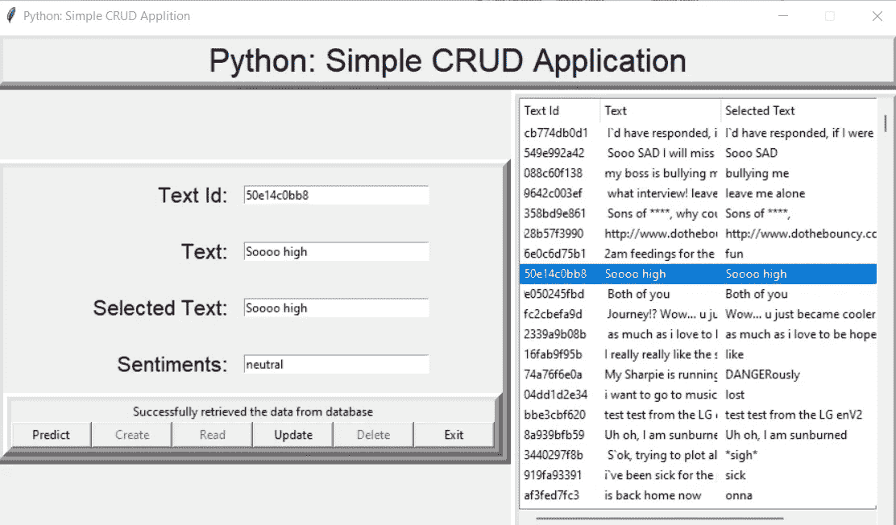

# 用 Python 构建 Tweet Analysis Crud 应用程序

> 原文：<https://medium.com/mlearning-ai/building-tweet-analysis-crud-application-in-python-7a3515aae654?source=collection_archive---------8----------------------->

用 python 实现 CRUD 应用程序，并将其与 SQLite 数据库连接，对数据集进行分类以进行情感分析。

什么是 SQLite？

SQLite 是用 C 语言编写的数据库引擎。它不是一个独立的应用程序；更确切地说，它是软件开发人员嵌入到他们的应用程序中的一个库。因此，它属于嵌入式数据库家族。它是部署最广泛的数据库引擎，因为它被一些顶级的 web 浏览器、操作系统、移动电话和其他嵌入式系统所使用。

[https://devopedia.org/images/article/97/8476.1547460380.png](https://devopedia.org/images/article/97/8476.1547460380.png)

**SQLite 的特性**

1.  即使在系统崩溃和电源故障之后，事务也遵循 ACID 属性，即原子性、一致性、隔离性和持久性。
2.  配置过程非常简单，不需要设置或管理。
3.  SQL 的所有特性都在其中实现了，还有一些附加特性，如部分索引、表达式索引、JSON 和公共表表达式。
4.  有时它比直接文件系统 I/O 更快。
5.  它支持万亿字节大小的数据库和千兆字节大小的字符串和 blobs。
6.  几乎所有的操作系统都支持 SQLite，如 Android、BSD、iOS、Linux、Mac、Solaris、VxWorks 和 Windows (Win32、WinCE 等。移植到其他系统非常容易。
7.  完整的数据库可以存储在一个跨平台的磁盘文件中。

**SQLite 的应用**

1.  由于它的代码量小，内存使用效率高，所以它是手机、PDA、MP3 播放器、机顶盒和其他电子设备中数据库引擎的流行选择。
2.  它是 open 的一种替代方法，可以将 XML、JSON、CSV 或一些专有格式写入应用程序使用的磁盘文件中。
3.  由于它没有复杂的配置，很容易将文件存储在普通的磁盘文件中，所以它可以用作中小型网站的数据库。
4.  它速度更快，可以通过各种第三方工具访问，因此它在不同的软件平台上都有很好的应用。

什么是 CRUD 应用？

CRUD 应用程序是我们用来通过 API 与数据库交互的用户界面。它是一种特定类型的应用程序，支持四种基本操作:创建、读取、更新、删除。概括地说，CRUD 应用程序由数据库、用户界面和 API 组成。

现代 web 应用程序让用户在数据库上执行至少一个以下操作—创建(新记录)、读取/查看(现有记录)、更新(现有记录)或删除(记录)。简而言之，CRUD。如果您使用过数据库，那么您很可能在没有意识到的情况下使用了 CRUD。

许多企业和组织每天都在使用 CRUD 应用程序来维护他们的日常工作流程。人力资源使用 CRUD 应用程序来管理员工记录，跟踪员工休假和出勤情况。Sales 使用 CRUD 管理精益信息，customer success 使用 CRUD 应用解决客户票据，等等。看看博客网站。作为用户，您可以创建/发布帖子，阅读/显示您的帖子，更新/编辑您的帖子以及删除您的帖子。博客是经典的垃圾应用。

数据集:

数据集来自 KAGGLE。这是关于推特和它的观点。

[推特推文情感数据集| Kaggle](https://www.kaggle.com/datasets/yasserh/twitter-tweets-sentiment-dataset)

它由 4 列组成。

我的应用程序中使用的库。

SQLITE:用于连接数据库存储数据更新
SKLEARN:用于机器学习分类
TKINTER:用于开发 GUI。(用于接口)

NUMPY:用于计算数组等。

我的代码和应用程序的工作

首先我安装了所有的库，比如 sklearn，tkinter，sqlite，然后用 tkinter 库设计了 GUI。我做了按钮(预测、创建、删除、更新、退出)。滚动条和文本框的文本 id，情感，选定的文本和文本。

我已经设置了框架大小，小工具的大小，何时打开和禁用它，我还定义了按钮的功能，如读取，预测和连接数据库进行更改。代码中定义了每个按钮的功能。

sqlite 函数中使用了两个全局变量 conn、cursor 来连接数据库。我已经下载了数据集，并将其转换为数据库文件，并将其与具有两个全局功能的 sqlite 连接。然后，这两个全局变量在所有按钮中使用，用于创建、删除和预测应用程序中存在的情感。

现在，我已经通过对数据集应用朴素贝叶斯 nlp 算法来预测情绪。首先，它加载数据集，然后将文本和选定的文本放入 X 和 Y np 数组，并转换它。它将获取数据，然后我们将应用编码器将人类的话转换成机器学习的话，然后转换它。然后，我们将转换后的数据发送到 pipeline vectorizar 进行分类，并对预先测试的单词执行 nayes bayes nlp 算法，然后它输出机器学习理解中的负、正、中性输出，然后我们必须将其转换回人类可理解的语言，转换为 np 数组。然后，我们将把它发送到预测函数中，并应用逆变换将其转换回人类可理解的语言。

Fetching data from database

Selecting Text

参考

[推特推文情感数据集| Kaggle](https://www.kaggle.com/datasets/yasserh/twitter-tweets-sentiment-dataset)

[什么是 CRUD？CRUD 操作解释— Flatlogic 博客](https://flatlogic.com/blog/crud-app/)

【tutorialspoint.com】SQLite 教程

 [## Mlearning.ai 提交建议

### 如何成为 Mlearning.ai 上的作家

medium.com](/mlearning-ai/mlearning-ai-submission-suggestions-b51e2b130bfb)