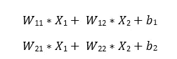
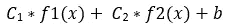
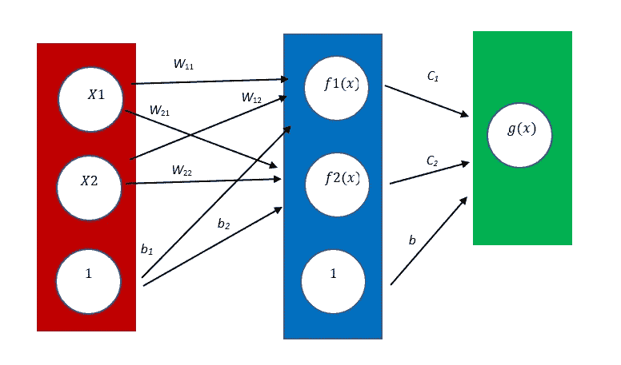
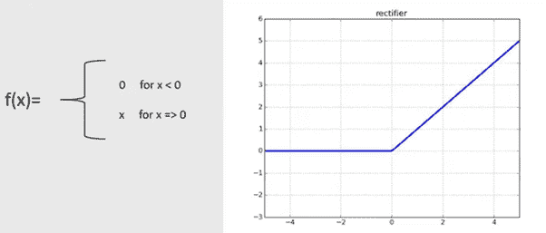
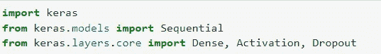
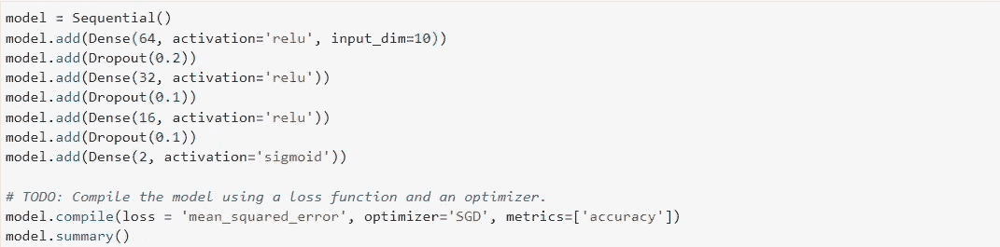
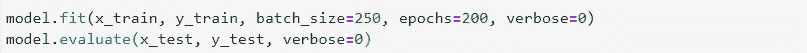

# 使用 Keras 构建您的第一个神经网络

> 原文：<https://medium.com/mlearning-ai/building-your-first-neural-network-using-keras-478a9885117?source=collection_archive---------0----------------------->

我们都听说过神经网络及其在人工智能(AI)领域的潜力，它可以通过一系列线性方程和激活函数来预测结果。它主要用于图像识别或文本处理。

然而，神经网络可以用于正常的分类(甚至线性回归)任务，并且在 Python 中使用 Keras 构建用于分类目的的神经网络相对简单。当涉及到非线性分类时，神经网络特别有用，这意味着你不能用一条直线来区分两个类别。至于线性分类，使用其他机器学习算法(如决策树或逻辑回归)可能更容易解决。此外，如果您想进一步学习如何构建卷积或递归神经网络，了解编码的基本概念(即使是用于分类任务)是非常重要的起点。

在这篇文章中，我将给出一个帮助你建立创业模型的教程。首先，我将从解释神经网络模型的基本概念开始。然后用 Python 呈现模型架构。之后，我将列出用于调整模型和改变其复杂性的超参数。最后，我将分享一些课程的链接，这些链接将有助于开始更多地了解这个领域，并在这个领域走得更远。

请注意，我不会讨论卷积神经网络(CNN)或递归神经网络(RNN)，因为这些需要更多的细节。

# 什么是神经网络？

如下图所示，神经网络主要由多个层组成，从输入层(红色)开始，到输出层(绿色)结束，中间可以有一个或多个隐藏层(蓝色突出显示)。每一层由节点(白色圆圈)组成，其中每个节点将采用从前一层接收的输入的线性组合，并对线性方程的输出应用激活函数。

请注意，拥有多个节点的想法意味着每个节点使用一条线对数据进行不同的分类。然而，当这些不同的线被组合时，我们得到非线性分类，这显示了神经网络的真正能力。

source: [i2tutorials](https://www.i2tutorials.com/what-are-different-layers-in-neural-networks/)

让我们举一个例子来解释上面的概念。为了简单起见，假设我们想要使用两个主要特征 *X1* 和 *X2* 将植物的数量分类为**植物** **A** 或**植物** **B** ，其中 *X1* 表示植物的高度， *X2* 表示植物中分枝的数量。

Source of the pictures: [Shutterstock](https://www.google.com/url?sa=i&url=https%3A%2F%2Fwww.shutterstock.com%2Fvideo%2Fclip-1027645646-plants-growing-animation-optional-luma-matte-alpha&psig=AOvVaw15UxCQAiVy5l25pHp-tG18&ust=1649549676336000&source=images&cd=vfe&ved=0CAsQjhxqFwoTCKiD8tjZhfcCFQAAAAAdAAAAABAT) and [Amazon](https://images-na.ssl-images-amazon.com/images/I/21fXGJqPsQL._SR600%2C315_PIWhiteStrip%2CBottomLeft%2C0%2C35_SCLZZZZZZZ_FMpng_BG255%2C255%2C255.jpg)

现在既然神经网络不理解文字或者文本，我们就用 0 和 1 分别指代**植物** **A** & **植物** **B** 。然后，我们从一个线性方程开始，并将其输出传递给所谓的激活函数，该函数最终将返回一个从 0 到 1 的概率值，其中概率越接近 1 意味着该植物越有可能是植物 A，而结果接近 0 意味着它越有可能是植物 b。

现在回到我们的网络，输入层中的节点代表我们拥有的特性，它们是 *X1* 和 *X2。*因此我们在输入层有两个节点。在这个模型中，我将只引入一个隐藏层，其中有两个节点，以使事情变得简单，但同样的概念适用于多个层。

因为我们在隐藏层中有两个节点，所以我们需要两个线性方程来组合两个特征 *X1* 和 *X2* ，并向两个方程添加偏差。

**重要的是要知道偏差不是输入或特征。像系数 *W11* 或 *W22* 一样是模型参数，可以设置为零。在下图所示的神经网络图中，一些节点的值为 1，并乘以系数 *b.* 这些节点代表偏差项。**

Input Layer Equations

你应该注意到，从隐藏层中我们得到了另一个等式

Hidden Layer Equation

现在我们将有下面的网络结构作为我们的模型

Neural Network Diagram

在哪里

*   *X1* 和 *X2* 是输入特征
*   *f1(x)* 和 *f2(x)* 是激活函数，根据所使用的激活函数产生输出。那些激活函数在同一层中是相同的，例如，两者都具有 ReLU 或 Sigmoid 函数。
*   *g(x)* 是输出层中的激活函数，提供 0 到 1 之间的结果，其中 1 表示 A 类植物，0 表示 B 类植物
*   *W* 是方程的系数或模型参数。
*   c 也是与隐藏层方程相关的模型参数
*   *b 的*是方程偏差，也是模型参数

在开始查看过程之前，您需要知道上面提到的系数或模型参数(*W*s、*C*s 和*b*s)由网络随机初始化，并随后通过称为反向传播的过程进行更新，这将在本节稍后讨论。

现在让我们从隐藏层中的第一个节点方面来查看流程，在这里它具有函数 *f1(x)。*节点接收来自输入层的特征值，并将其乘以系数 *W11* 和 *W12* ，加上偏置 *b1* 。该等式(我们拥有的第一个等式)将产生一个输出，该输出将通过激活函数 *f(x)传递。*

让我们将激活函数设置为 ReLU。所以根据输出的值，我们得到了一定的结果(见下图)。例如，如果第一个等式输出是 5，那么 *f1(x)* 的结果也将是 5。然而，如果方程输出为负或零，那么 *f1(x)* 结果将为零(注意，有许多激活函数，您可以在此[链接](https://keras.io/api/layers/activations/)中了解它们)

source: [https://www.quora.com/What-does-ReLU-layer-do](https://www.quora.com/What-does-ReLU-layer-do)

对于具有函数 *f2(x)* 但使用不同的相关系数或参数(见第二个等式)但使用相同激活函数的第二节点也是如此。一旦我们得到隐藏层中第一个和第二个节点的结果，这些结果将被线性组合，如第三个等式所示。这里需要知道的重要一点是，模型中的每一层都可以有不同的激活函数，但是同一层中的节点必须有相同的激活函数。

现在转到下一步，第三个等式的输出将作为输入传递给输出层的激活函数 *g(x)* 。因为在我们的例子中，我们有一个二进制分类，我们将使用 sigmoid 函数，它将产生 0 到 1 之间的输出，给我们一个概率，代表植物是 A 型还是 B 型的可能性(下图显示了 sigmoid 函数及其样子)。

source: [Sigmoid](https://www.google.com/url?sa=i&url=https%3A%2F%2Fwww.kaggle.com%2Fgeneral%2F197117&psig=AOvVaw0tmvM0eR4S--ley40ohJqZ&ust=1649234002851000&source=images&cd=vfe&ved=0CAsQjhxqFwoTCPiA3tPB_PYCFQAAAAAdAAAAABAD)

到目前为止，我解释的过程称为前向传播，这意味着从输入层到输出层。下一步是进行所谓的反向传播，将神经网络的输出与数据集中的实际值进行比较，并创建所谓的误差或损失函数。为了最小化这个误差函数(更精确地分类数据)，我们从输出层返回到输入层，更新模型的参数(W*W*、 *C* 和 *b* ),然后再次运行正向传播并检查误差函数。前进和后退的过程称为迭代，在模型中定义为**历元**。

这个迭代过程一直持续下去，直到我们将损失函数最小化到一个最优值。我们增加迭代或历元的数量越多，误差将进一步最小化。然而，这将导致所谓的**过度拟合**到训练数据集，其中模型可以正确地分类训练数据集中每个和所有记录的结果。然而，当处理新记录时，模型精度会显著下降。换句话说，该模型不能被推广以对新点进行分类。

# 基于 Keras 的神经网络体系结构

在本节中，我将通过将神经网络的基本架构分解为几个步骤来反映这里作为概念解释的内容:

1.  导入重要的主库。以下类是从 Keras 导入的:

*   **时序**类为网络本身奠定基础。
*   **密集**类，通过设置层中的节点数、激活函数和输入层形状来定义层结构。请注意，正如我们将要看到的，输入层形状只定义了一次。
*   **激活**类，其中定义了激活函数，但如果它是在密集类中定义的，则可以忽略它。
*   **Dropout** 用于关闭一些节点并保持其他节点活动，以查看哪种节点和参数组合可产生最佳结果并最小化模型复杂性。

Importing Libraries

2.下面是网络的基本架构。首先，您可以看到没有使用**激活**类，因为**密集**类下的激活设置服务于相同的目的。此外，只有在第一密集层，我们定义了输入层的形状。

其次， **Dropout** class 直接出现在每一层之后，我们希望随机关闭它的节点，但它不能用于最后一个密集层，即输出层。第三，每次需要删除或新的密集层时，都需要一个“添加”方法。最后，代码的最后一部分是模型编译。在这一步中，我们指定损失函数、优化器和我们希望作为评分指标查看的指标，在这种情况下是准确性。

3.每个密集层的第一部分是隐藏层或输出层中的节点数。dropout 中显示的值表示概率，在下面的例子中，我们将第一层的值设置为 0.2，这意味着在迭代过程中，第一个隐藏层中的 64 个节点中的每一个都有 20%的机会被关闭，这可以最小化模型的复杂性。

Building the Network

4.最后一步是使用拟合和评估方法对模型进行训练和评分。有两个与拟合方法相关的重要部分需要解释:批量大小和时期。历元是用于训练整个数据集的迭代次数，这意味着在每个历元之后，系数或模型参数和误差函数被更新。

批量大小将原始数据集分成多个部分，每个部分将用于一次训练一次模型。例如，我们有一个由 1000 个数据记录组成的数据集，我们将批量大小设置为 250，这意味着我们在一次迭代或一个时期内分别训练四个数据集。

5.最后一部分是使用“model.evaluate”评估我们的模型，以查看当我们传递新的数据集时模型的准确性，为此，我们使用所谓的测试集，这在训练部分中没有使用。evaluate 方法的输出将是准确性，这是我们在模型编译中选择的评分标准。

Training and Scoring the Network Performance

# 超参数的调整

本文的最后一部分是关于调整神经网络，这可能是最复杂和最耗时的部分，因为有许多超参数可以调整:

1.  每层的节点数:增加它会导致模型更加复杂，并可能导致**过拟合**。另一方面，将其最小化到某个数字以下会导致**欠拟合**问题。
2.  激活函数的类型:不同的函数会导致不同的模型精度。然而，对于输出图层，如果我们有二元分类，我们使用 Sigmoid 函数，对于多类分类，我们将使用 Softmax。
3.  层数:增加层数也会导致**过拟合**。
4.  丢弃值:增加丢弃值将最小化模型的复杂性
5.  时期的数量(如果高于应有的数量，可能会导致过度拟合)
6.  损失函数和优化器的使用，这可能会改变模型的准确性。

# 帮助您入门的有用链接

下面我将列出三个有用的资源和推荐的课程，它们将丰富你的知识并让你开始学习:

*   [Udacity 深度学习课程](https://www.udacity.com/course/deep-learning-nanodegree--nd101)
*   [Keras 网站](https://keras.io/)
*   [Coursera 深度学习专业化](https://www.coursera.org/specializations/deep-learning?utm_source=gg&utm_medium=sem&utm_campaign=17-DeepLearning-ROW&utm_content=B2C&campaignid=6465471773&adgroupid=77415260637&device=c&keyword=coursera%20deep%20learning%20ai&matchtype=b&network=g&devicemodel=&adpostion=&creativeid=506751438660&hide_mobile_promo&gclid=CjwKCAjw9LSSBhBsEiwAKtf0n7pSCqIqOkIFmHBoua4mvtY59DewhiMa9FenS0nYt5z7RLUAO2rHvBoCKf4QAvD_BwE)

 [## Mlearning.ai 提交建议

### 如何成为 Mlearning.ai 上的作家

medium.com](/mlearning-ai/mlearning-ai-submission-suggestions-b51e2b130bfb)