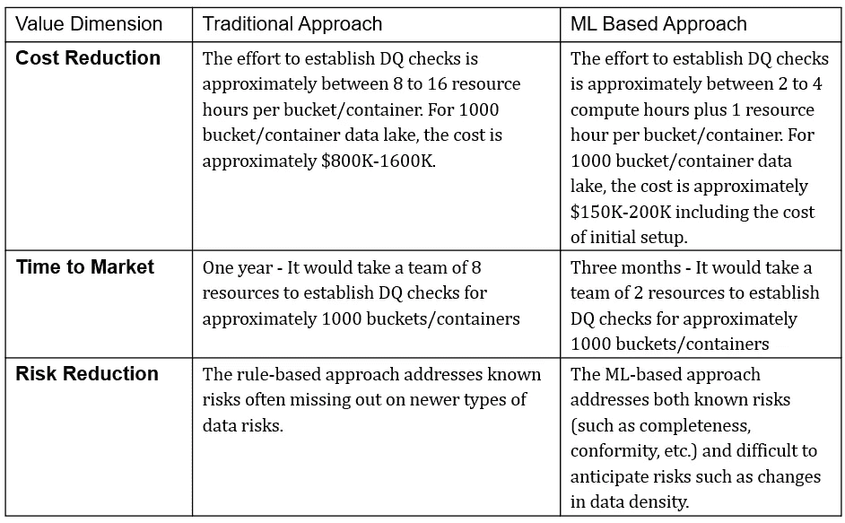

# 利用机器学习(ML)验证数据湖的商业案例

> 原文：<https://medium.com/mlearning-ai/business-case-for-leveraging-machine-learning-ml-to-validate-data-lake-a59124e2d447?source=collection_archive---------2----------------------->

利用 ML 提高数据湖中的数据质量。

Photo by [JESHOOTS.COM](https://unsplash.com/@jeshoots?utm_source=medium&utm_medium=referral) on [Unsplash](https://unsplash.com?utm_source=medium&utm_medium=referral)

如果没有有效和全面的验证，数据湖就会变成数据沼泽，并且无法为业务价值创造提供清晰的链接。组织正在迅速采用云数据湖作为首选的数据湖。有鉴于此，实时验证数据的需求变得至关重要。准确、一致和可靠的数据推动算法、运营流程和有效的决策制定。现有的数据验证方法依赖于基于规则的方法，这种方法资源密集、耗时、成本高，并且对于数千个数据资产来说不可扩展。

**数据湖中数据质量问题的业务影响**

以下来自全球 2000 强组织的示例展示了对数据湖中存在的每个数据资产建立数据质量检查的需要。

**场景 1 — ETL 作业无法识别数据湖中的文件**

一家保险公司的新用户在超过一周的时间内不能利用远程保健服务。这里，根本原因是数据工程团队没有意识到保险公司作为一个新客户的加入，ETL 作业没有提取他们 Azure 数据湖中的注册文件

**场景 2 —贸易公司未经验证就接收数据**

一家贸易公司的商品交易员在周一早上找不到某个用户组的用户级信用信息，报告为空白，导致交易活动中断 2 小时。原因是从另一个应用程序收到的信用文件的信用字段为空，并且在加载到大查询之前没有进行检查

**场景 3——预处理不当导致的错误信息**

一家餐饮连锁公司的供应链高管对英国 5 月份消费翻番的报告感到惊讶。由于处理错误，本月的消耗文件被追加到 4 月的消耗文件中，并存储在 AWS 数据湖[[https://firsteigen.com/databuck/](https://firsteigen.com/databuck/)]中。

# 当前的方法和挑战

云数据湖项目目前的重点是数据摄取，即将数据从多个数据源(通常是不同格式)移动到一个目的地的过程。在数据接收之后，数据通过数据管道移动，这是数据错误/问题开始出现的地方。我们的研究估计，任何分析项目平均有 30–40%花费在识别和修复数据问题上。在极端情况下，项目可能会被完全放弃。

当前的数据验证方法被设计为一次为一个容器/桶建立数据质量规则，因此，为 1000 个桶/容器实施这些解决方案存在显著的成本问题。容器式的关注经常导致一组不完整的规则，或者经常根本不实现任何规则。

**集成数据验证解决方案的运营挑战**

通常，数据工程团队在集成数据验证解决方案时会遇到以下操作挑战:

●分析数据和咨询主题专家以确定需要实施哪些规则所需的时间[【https://firsteigen.com/snowflake-data-quality-lp/】T2

●每个集装箱特定规则的实施。因此，工作量与数据湖中容器/桶/文件夹的数量成线性比例

●现有开源工具/方法的审计跟踪能力有限。为法规遵从性需求生成规则执行结果的审计跟踪通常需要数据工程团队花费时间和精力。

●维护已实施的规则

# 基于机器学习的数据质量方法

标准化的无监督机器学习算法可以大规模应用于数据湖桶/容器，以确定可接受的数据模式并识别异常记录，而不是通过剖析、分析和咨询主题专家来找出数据质量规则。我们已经成功应用以下算法来检测金融服务和物联网(IOT)数据中的数据错误。一些开源的 ML 软件提供了这些算法作为它们软件包的一部分。其中包括:

● DBSCAN [1]

●主成分分析和特征向量分析[2]

●关联挖掘[3]

利用异常记录，通过标准化数据质量维度来衡量数据信任得分，如下所示:

1.  **新鲜度** —确定数据是否在流程的下一步之前到达
2.  **完整性** —确定上下文重要字段的完整性。应该使用各种数学和/或机器学习技术来识别上下文重要的领域。
3.  **符合性** —确定符合上下文重要字段的模式、长度和格式。
4.  **唯一性** —确定单个记录的唯一性。
5.  **漂移** —从历史信息中确定关键分类和连续字段的漂移
6.  **异常** —确定关键列的体积和值异常

**数值比较**

基于 ML 的数据质量的好处大致分为两类:定量和定性。虽然定量收益是商业案例中最有力的论据，但不应忽视定性收益的价值。

描述:传统与基于 ML 的数据方法。

**结论**

数据是组织最宝贵的资产。当前用于验证数据的方法充满了操作挑战，导致信任缺失、耗时且昂贵的修复数据错误的方法。迫切需要采用一种标准化的自治方法来验证云数据湖，以确保它不会成为数据沼泽。

**参考文献**

[1] J. Waller，使用 DBSCAN 进行异常值检测(2020)，数据博客

[2] S. Serneels 等人，包含异常值和缺失元素的数据的主成分分析(2008)，科学指导

[3] S. B. Hassine 等人，使用关联规则检测数据质量问题，麻省理工学院信息质量(MITIQ)计划

 [## Mlearning.ai 提交建议

### 如何成为 Mlearning.ai 上的作家

medium.com](/mlearning-ai/mlearning-ai-submission-suggestions-b51e2b130bfb)