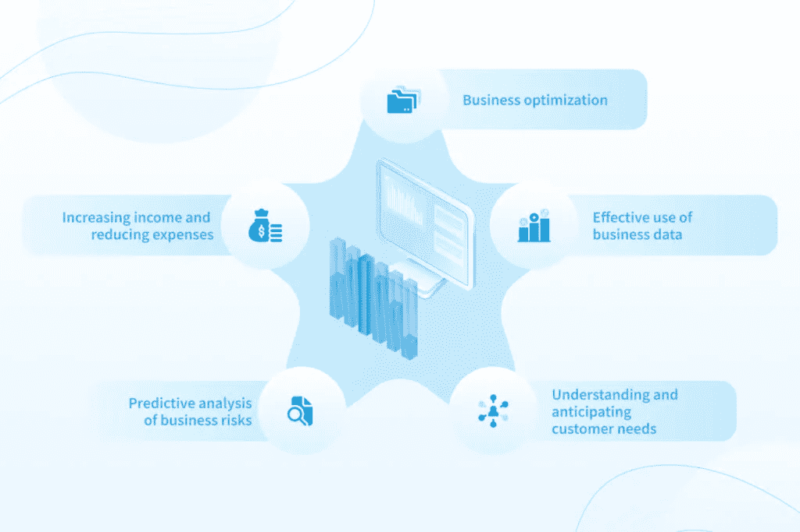
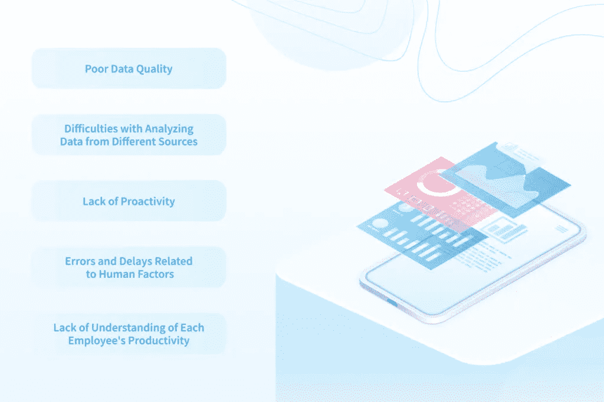

# 商业智能自动化:加快您的工作流程— NIX United

> 原文：<https://medium.com/mlearning-ai/business-intelligence-automation-speed-up-your-workflow-nix-united-a9dbb6cef874?source=collection_archive---------4----------------------->

商业智能(BI)是一套收集、分析、处理和可视化商业数据的工具和技术。商业智能允许公司将他们经营的数据转化为人类可读的形式，并在实践中使用。当谈到商业智能的自动化时，它提供了一种智能的方法，帮助公司做出更明智的决策。我们将在下面详细讨论商业智能和分析，以及最成功的商业智能自动化案例。

您还可以了解我们实施的[企业商业智能解决方案](https://nix-united.com/services/business-intelligence-services-bi/)。

# 为什么要使用商业智能和分析？

商业智能(BI)和分析解决方案并不是新的商业趋势。然而，一些公司仍然根本不使用它们，或者没有充分发挥这类软件的潜力。他们这样做是徒劳的。

商业智能和分析应用从原始数据中获得可操作的见解。同时，作为一项规则，它们是通用的，可以在各种行业中使用，以解决从提高数据质量到优化复杂业务流程的广泛任务。

特别是，作为完全自主的解决方案，它们可以从任何来源接收数据——从 ERP、CRM 和 WMS 系统到 Excel 电子表格和物联网设备。为此，自动化商业智能软件连接到企业已经使用的软件解决方案，并上传所有必要的信息。所有数据只上传一次，然后这些数据被实时同步，这确保了最新分析结果的输出。

商业智能自动化工具分析历史和当前数据，并以易于理解的可视化格式呈现结果。因此，这种数据视图有助于公司快速从分析转向行动，进行实时调整，并为现有业务战略的长期变化制定计划。

# 商业智能和分析解决方案的优势

当正确实施时，商业智能自动化为企业所有者带来许多好处，无论是在短期还是长期业务战略中。我们将突出显示下一个。

*   **业务优化。**通过对实时和历史数据的深入分析，基于 BI 的解决方案可帮助企业更高效、更智能地分配资源。
*   **有效利用商业数据。**BI 系统不是为每个数据源使用独立的软件解决方案，而是确保这些数据的集中化、结构化和应用，以供进一步分析。
*   **业务风险的预测分析。** BI 解决方案可以独立地对潜在风险进行智能分析，处理大量的最新数据。与手动生成的报告不同，这些解决方案提供了更准确、更快速的结果。
*   **了解并预测客户需求。**通过与 CRM 系统集成，BI 解决方案可以分析客户需求、问题和购买行为，识别客户服务和支持的薄弱环节，帮助企业所有者构建更可行的业务场景。
*   **增收节支。**最后，自动化商业智能解决方案使公司能够更明智地使用预算，避免可能的风险、停机和额外成本，并专注于现有的市场趋势。如此严谨的做法有助于在短短几个月内增加利润，减少开支。

点击您可以了解更多关于商业智能报告[的好处。](https://nix-united.com/blog/business-intelligence-reporting-benefits-and-best-practices/)

# 商业智能和分析的应用

商业智能自动化可以应用于员工必须不断处理大量数据的任何活动领域。商业智能和分析最典型的使用案例是以下业务领域。

*   **销售和营销。** BI 解决方案有助于构建更准确、更有效的客户获取和维系战略。它们还有助于企业快速适应新的市场趋势。
*   **业务流程管理。**对于拥有复杂和多阶段业务流程的公司，此类解决方案为业务分析中的业务流程自动化提供了一种新的方式，降低了实施成本和时间，最大限度地减少了停机时间，并消除了财务损失的风险。
*   **软件和硬件的预测性维护。**自动化商业智能解决方案为公司提供了对其硬件和软件的持续、系统的控制，确保了及时的故障排除和维护。
*   **供应链优化。**基于商业智能的解决方案使用历史和实时数据来减少积压，或者相反，及时消除短缺。
*   **欺诈检测。**一些公司提供基于 BI 的分析解决方案，能够在欺诈活动对业务造成危害之前识别出其威胁。
*   **有效的人力资源管理。**人力资源管理中的手工工作需要花费大量时间。反过来，商业智能自动化允许企业自动执行与雇用新员工和管理现有员工相关的任务，从而减轻人事部门的负担。

# BI 和分析解决方案通常包括哪些项目元素？

虽然自动化商业智能和分析解决方案执行复杂的数据处理，但它们通常易于使用。这种简单性来自于它们包含的深思熟虑的工具。我们来考虑一下主要的。

*   **ETL 工具。**ETL 从外部来源提取信息，对其进行转换、清理，并将其加载到一个存储库中。
*   **分析数据存储。**其实这是一个独立架构和分析数据的数据库。
*   **数据挖掘工具。**这些工具根据预定义的参数处理和分析数据，识别相关性和趋势。同时，这些工具可以使用多种数据处理方法:从统计和预测到语义分析。
*   **数据可视化工具。**这些是最终用户使用的报告。根据任务的不同，报告可以按照批准的格式创建，也可以是动态的。构建分析报告时，最终用户可以独立设置显示的指标列表、对数据进行排序以及应用过滤器。

# 为什么实施 BI 和分析对一些企业至关重要？

由于自动化商业智能系统，公司可以避免雇用数据科学家，因为这种解决方案独立收集和处理数据，并以可读的格式呈现给最终用户。让我们仔细看看自动化商业智能和分析解决方案到底帮助解决了哪些任务:

*   从不同来源收集数据，并对其进行结构化和集中存储
*   数据分析以形成/验证假设并规划有效的业务战略
*   模拟结果及其对业务的影响
*   创建运营和战略报告
*   将知识系统化，以便传授给新员工

所有这些都在商业智能的自动化水平上变得可用，而无需您需要的主题领域的现场专家的帮助。

# 如何理解您迫切需要实施 BI 和分析

任何领域的任何公司都可以从业务分析和其他活动中的业务流程自动化中受益匪浅。然而，对于一些公司来说，使用这种解决方案是至关重要的。特别是，如果您需要:

*   定期处理来自多个来源的大量数据
*   提供对业务数据的快速访问
*   优化与需要访问业务数据或分析的用户的数字系统的交互
*   由于现有数字环境效率低下，需要对其进行现代化改造
*   跟踪企业或其某些部门的活动
*   刺激更快的企业发展

# 商业智能和分析可以帮助您的 5 个使用案例

总的来说，由于商业智能工具加快了数据分析和业务绩效评估，它们在消除低效流程、识别潜在问题、寻找新的收入来源以及预测未来增长领域方面是不可或缺的。

尽管如此，如果上述业务目标对您来说过于抽象，并且您仍然怀疑是否值得将商业智能自动化引入到您现有的业务流程中，请分析下面描述的五个案例，在这些案例中，这种类型的软件已经显示出了其全部潜力。

# 数据质量差

许多公司经常面临数据质量不足的问题。正因为如此，预测和报告是不准确的，为公司的进一步发展而建立的商业模式的质量也受到影响。

反过来，BI 可以对您的业务产生非常积极的影响，并为分析准备数据，以便用于构建可行的业务战略。特别是，基于 BI 的解决方案可以自动执行收集、清理和恢复数据的过程，而不管它们来自哪种类型的数据源。

因此，经过筛选和恢复的数据被放在集中存储中，然后在那里进行实时更新(与源同步)。与此同时，BI 系统会保留更新这些数据的历史记录，以便用户可以跟踪数据变化的动态，并做出极其准确的预测。

还值得注意的是，这种数据处理方法显著减少了手动操作的次数，这意味着与疏忽大意的员工输入错误数据相关的风险被降至最低。

现在想一想:您的公司多久会面临一次异构、不同数据的问题，这些数据的质量会对其分析结果产生负面影响？如果是这样的话，考虑一下也许是时候实施 BI 了。

# 分析不同来源数据的困难

不幸的是，时至今日，世界各地的公司都在使用过时的软件解决方案。这种方法使数据提取及其在单个集中式系统中的处理变得非常复杂，通常需要员工手动执行大量工作。

借助 BI 解决方案，您可以保留大部分传统软件，即使它没有与高级分析软件产品集成的 API。特别是，这些解决方案可以自动提取这些数据，只需要最少的工作人员介入。

因此，如果出于某种原因，您不想切换到更新、更现代的数据工具，BI 解决方案可以帮助您毫不费力地坚持这种做法。

# 缺乏主动性

要将员工的工作转化为流水线，最大限度地减少他们因缺乏在特定情况下如何行动的适当知识而经常经历的停工时间是很重要的。基于 BI 的解决方案可以解决这个问题。

特别是，这种软件可以在最有用的时间和地点进行商业智能分析。因此，您的员工有机会根据收到的信息立即采取行动。

一般来说，如果您公司中的单个业务流程之间的转换伴随着停机时间，请想一想:也许商业智能会帮助您消除它们。

# 与人为因素相关的错误和延误

有时工作流程中延迟和错误的主要原因是人为因素:您的一些员工可能会分心，一些员工可能会因为按错键而出错。有时，这种情况的后果对企业来说是灾难性的。

为了做出数据驱动的决策，而不是让您的员工花费数十个小时的时间来处理枯燥乏味的数据库工作，您可以实施基于 BI 的软件。得益于此，报告所需的所有数据都将被自动加载和处理，您的所有员工只需等待应用程序完成工作。

此外，一些 BI 系统会根据生成的报告，自动创建一个提醒时间表，这样您就不会忘记定期付款、费用等。

因此，如果你想减轻下属的工作负担，让他们承担比单调的数据工作更有趣的任务，你绝对应该考虑 BI 解决方案。

# 对你的每个员工的生产力缺乏了解

自动生成已完成任务的报告是提高员工生产力的起点。您可以实现一个 BI 解决方案，将这一职责交给软件，而不是要求下属定期(通常是每天)报告。

此外，这种解决方案通常会根据公认的标准(CPI)自动评估员工的生产力。多亏了这一点，你将能够更客观地监控在一个特定的时间段内完成了多少任务，以及由谁来完成。

因此，如果您想要识别表现不佳的员工并优化他们的工作量，可以考虑使用 BI 解决方案。

要了解商业智能和分析应用的其他示例，[请阅读本文](https://nix-united.com/blog/examples-of-business-intelligence-systems-for-improving-decision-making/)。

# 为什么在商业智能和分析的帮助下，您不应该害怕现代化

一些企业对使用商业智能解决方案进行升级持谨慎态度，因为他们怀疑自己的员工是否能够应付看起来更复杂的新软件。然而，这并不是一个真正的问题。

要开始使用一般的自动化商业智能解决方案，您的员工不需要是高级 PC 用户，也不需要具备编程技能。通常，此类软件配备了直观的图形界面，允许用户只需几次点击即可生成新报告，并通过易于使用的仪表板访问分析。

请注意，绝大多数专门开发自动化商业智能产品的供应商都提供了可视化数据的最大交互性。这意味着，如果有必要，用户可以放大和重建绘制的图形，以及更改时间间隔和可视化格式(例如，可以用图表的形式显示相同的数据，而不是线形图)。

因此，商业智能自动化中最终用户的进入门槛很低，这意味着您很可能不会面临因员工素质低而导致的停机时间或额外成本。

# 结果

在全球数字化和业务流程自动化的时代，公司应该思考如何减少员工的手工工作量。本论文特别适用于需要处理大量异构数据的情况。商业智能自动化是解决这一问题的关键。

如果您想在您的业务流程中实施这些技术，请[联系我们](https://nix-united.com/blog/business-intelligence-bi-and-analytics-5-processes-to-automate/#contact-us)，我们将为您提供最有效的方法来实施与您的业务数据的数字交互。

*原载于 2022 年 10 月 7 日*[*【https://nix-united.com】*](https://nix-united.com/blog/business-intelligence-bi-and-analytics-5-processes-to-automate/)*。*

 [## Mlearning.ai 提交建议

### 如何成为 Mlearning.ai 上的作家

medium.com](/mlearning-ai/mlearning-ai-submission-suggestions-b51e2b130bfb)