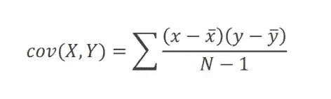
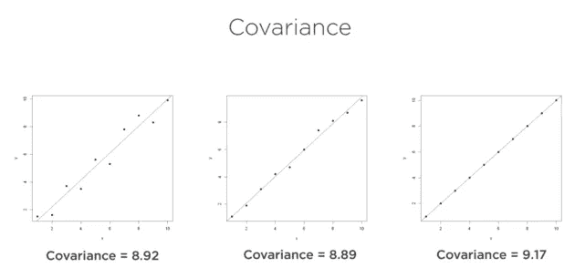
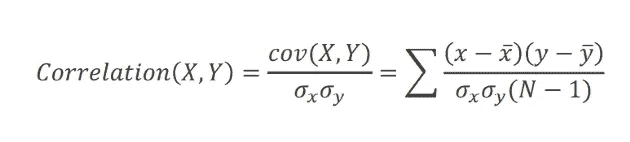
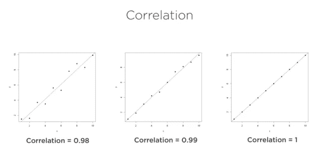
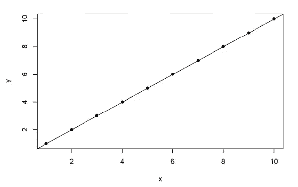
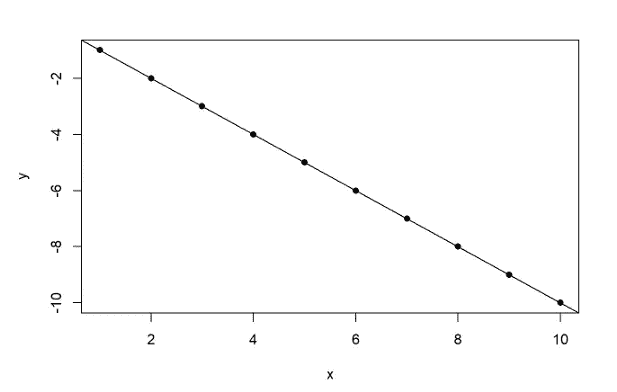
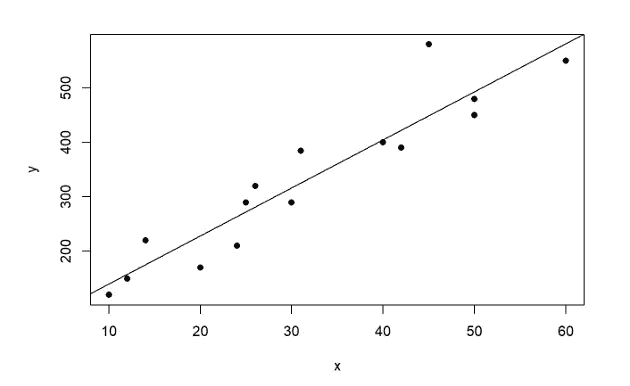

# 计算协方差，以及 R 中变量之间的相关性

> 原文：<https://medium.com/mlearning-ai/calculating-covariance-and-correlation-between-variables-in-r-5fceed29872e?source=collection_archive---------2----------------------->

计算数据集变量之间的关系强度在数据科学和分析领域非常重要。在这方面，我们将研究的工具是协方差和相关性。协方差只能度量变量之间的方向关系，如果协方差值为正，则变量之间存在正关系，如果协方差值为负，则变量之间存在负关系。协方差不限制值，对于正关系，协方差值可以大于 0 且小于正无穷大，对于负关系，协方差值可以小于 0 且大于负无穷大。。它不能显示数据集变量之间关系的实际强度。为了计算变量的强度，我们必须将协方差公式标准化，并将其值限制在-1 和+1 之间。这是相关系数，它是计算变量之间强度的更好的度量。

*   +1 代表变量之间完美的正关系
*   +1 代表变量之间完美的负关系
*   0 表示没有关系
*   接近+1 的值表示强正相关
*   接近-1 的值表示强烈的负相关
*   接近 0 的值表示弱关系

# 协方差

这是一种量化不同变量之间相互关系的方法。相关性的一种测量方法是测量变量之间的相互关系。



# 相关系数

相关性的一种常用度量，通过将协方差除以两个变量的标准偏差的乘积来获得。



# 完全正关系和完全负关系中的协变性和相关性

下面是 x 和 y 之间完美的正相关关系，所以协方差是正值，相关是正极值 1。

```
x <- c(1,2,3,4,5,6,7,8,9,10)
y <- c(1,2,3,4,5,6,7,8,9,10)
cov(x,y)
## [1] 9.166667
cor(x,y)
## [1] 1
plot(x,y,pch=16)
abline(lm(y ~ x))
```



下面是 x 和 y 之间的完美负关系，所以协方差是负值，相关性是负极值-1。

```
x <- c(1,2,3,4,5,6,7,8,9,10)
y <- c(-1,-2,-3,-4,-5,-6,-7,-8,-9,-10)
cov(x,y)
## [1] -9.166667
cor(x,y)
## [1] -1
plot(x,y,pch=16)
abline(lm(y ~ x))
```



以下是 x 和 y 之间的非完美正关系，因此协方差是正值，相关性是接近 0.93 的正值。

```
x <- c(40,30,20,10,50,12,14,25,26,24,60,31,42,45,50)
y <- c(400,290,170,120,480,150,220,290,320,210,550,385,390,580,450)cov(x,y)
## [1] 2062.762
cor(x,y)
## [1] 0.9360033plot(x,y,pch=16)
abline(lm(y ~ x))
```



# MTCARS 数据集

```
data(mtcars)
head(mtcars, n = 3)
##                mpg cyl disp  hp drat    wt  qsec vs am gear carb
## Mazda RX4     21.0   6  160 110 3.90 2.620 16.46  0  1    4    4
## Mazda RX4 Wag 21.0   6  160 110 3.90 2.875 17.02  0  1    4    4
## Datsun 710    22.8   4  108  93 3.85 2.320 18.61  1  1    4    1
```

**计算 MTCARS 数据集**中马力(hp)和气缸数(cyl)之间的协方差和相关系数

```
cov(mtcars$hp,mtcars$cyl)
## [1] 101.9315
cor(mtcars$hp, mtcars$cyl)
## [1] 0.8324475
```

**计算 MTCARS 数据集中功率(hp)和位移(disp)之间的协方差和相关系数**

```
cov(mtcars$hp,mtcars$disp)
## [1] 6721.159
cor(mtcars$hp,mtcars$disp)
## [1] 0.7909486
```

**计算 MTCARS 数据集中功率(hp)和重量(wt)之间的协方差和相关系数**

```
cov(mtcars$hp,mtcars$wt)
## [1] 44.19266
cor(mtcars$hp,mtcars$wt)
## [1] 0.6587479
```

**计算 MTCARS 数据集中小时功率(hp)和每加仑英里数(mpg)之间的协方差和相关系数**

```
cov(mtcars$hp,mtcars$mpg)
## [1] -320.7321
cor(mtcars$hp,mtcars$mpg)
## [1] -0.7761684
```

## 结论

在本文中，我们已经理解并在 R 编程语言中实现了协方差和相关系数。

[](/mlearning-ai/mlearning-ai-submission-suggestions-b51e2b130bfb) [## Mlearning.ai 提交建议

### 如何成为 Mlearning.ai 上的作家

medium.com](/mlearning-ai/mlearning-ai-submission-suggestions-b51e2b130bfb)