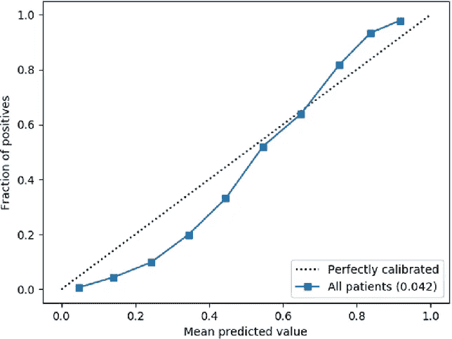

# 机器学习中的校准

> 原文：<https://medium.com/mlearning-ai/calibration-in-machine-learning-9d73aeaae8fd?source=collection_archive---------2----------------------->

calibration

当我们接触到“游标卡尺”时，有科学背景的学生一定读过物理学中的校准。

虽然基本原理保持不变(检查测量/结果的质量)，但机器学习中的校准使用不同的技术，并应用于不同的用例。

在这个故事中，我们将学习机器学习中的校准，为什么我们需要校准，如何执行校准以及理解概率模型。*让我们开始吧，*

## 什么是概率模型？

在机器学习中，分类模型是预测类别标签的预测模型。然而，一些分类模型不直接预测类别，而是预测概率；例如，逻辑回归。这种分类模型被称为概率分类模型。

## 为什么要校准？

在了解我们为什么需要校准之前，让我们来探索一下**在机器学习**的背景下校准意味着什么。

> 如果机器学习模型产生校准的概率，则它是校准的，其中置信度为“p”的类的预测在 100 * p 的时间内是正确的

考虑一个例子。一个天气预报模型预测下雨的可能性为 40%。在所有的日子里，预测概率是 40%，实际上下了多少天的雨？？如果下雨的时间多于或少于这些天的 40%,那么模型没有很好地校准。

现在我们已经了解了校准，让我们深入了解一下我们为什么需要校准。

考虑一个场景，其中机器学习模型预测疾病的几率，医生基于预测的置信度，需要决定进一步的诊断。如果模型以 90%的概率(置信度)预测输出，但只有 70%的概率是正确的，那么这种置信度可靠吗？？

答案是绝对不行！！

让我们考虑另一个场景，模型预测哪个广告被点击的几率最高。在这种情况下，我们只关心广告的相对概率，而不太依赖置信度。

> **因此，在需要根据预测的置信度来解释预测概率的情况下，校准是必要的**

*“在机器学习中，校准通常是一个被忽视的概念。一个模型是否被校准，取决于它的内在属性。例如，逻辑回归实际上不需要任何额外的训练后校准，因为它使用了损失函数。另一方面，随机森林由于其打包(平均)方法，很少返回值接近 0 或 1，并且需要校准。*

*一般来说，概率模型往往具有更好的内在校准"*

既然我们意识到了校准模型的重要性，那就让我们了解一下校准模型的方法。

## 如何校准？

检查模型校准的最常见方法是创建校准图。

calibration plot

校准预测概率有两种主要技术

*   普拉特标度
*   保序回归

让我们详细学习这两种技术

## 普拉特标度

它使用基于预测概率的逻辑回归模型。它假设校准曲线是 S 形的。拟合回归线是预测概率到校准概率的直接映射。

## 保序回归

它使用加权最小二乘回归模型。“等渗”只是指原始概率到重新标度值的单调递增映射。使用保序回归优于普拉特标度的主要优点是，它不需要假设曲线是 S 形的。然而，保序回归对异常值很敏感。

> scikit-learn 库通过' **CalibratedClassifierCV** '模块提供对普氏定标和等渗回归方法的访问。需要声明模块的'*方法*参数:Platt 的' *sigmoid '和等张*的*'等张'。[要了解更多信息，请参考[链接](https://scikit-learn.org/stable/modules/generated/sklearn.calibration.CalibratedClassifierCV.html)*

 [## Brier Score:了解模型校准- neptune.ai

### 当你的天气应用程序中下雨的概率低于 10%时，你是否遇到过风暴？嗯，这很好地显示了…

海王星. ai](https://neptune.ai/blog/brier-score-and-model-calibration) 

## 结论

我们现在已经了解了校准的含义以及为什么需要校准。此外，我们还介绍了机器学习中两种主要的校准方法。

请记住，校准确实会影响精度(有时会导致性能下降)。例如，考虑非常接近决策边界的值，现在校准可能会将这些点推到影响性能的任何一侧。

校准的目的是得到一个更合理的概率结果，我相信你喜欢学习这个美丽的概念。

请务必传播❤，并关注 [datahat](https://youtu.be/8qAeUe5oY7k) 以获取关于数据科学的视频和概念。

***谢谢！！不断学习，不断成长，帮助其他数据科学爱好者…..***

 [## Mlearning.ai 提交建议

### 如何成为 Mlearning.ai 上的作家

medium.com](/mlearning-ai/mlearning-ai-submission-suggestions-b51e2b130bfb)