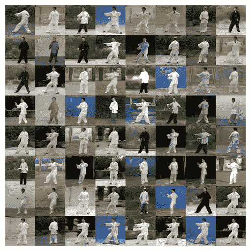

# AI 可以生成 3D 视频吗？

> 原文：<https://medium.com/mlearning-ai/can-ai-generate-3d-videos-10dbe76e73c3?source=collection_archive---------0----------------------->

## [机器学习艺术](https://mlearning.substack.com)

## 新的人工智能视频生成器创建 3D 内容

A new AI video maker makes 3D videos [— https://mlearning.substack.com](https://mlearning.substack.com)

大多数**人工智能生成器**使用[自动文本到语音转换](https://evartology.substack.com/p/how-do-beginners-make-ai-movies-in?r=9hp4d&s=w&utm_campaign=post&utm_medium=web)来制作看起来像人类制作的视频。这些软件工具中使用了机器学习来自动将基于文本的内容转换为视频。新的 AI 视频生成器 [**得益于 4D 艺术**](/p/8a754006cd9c)