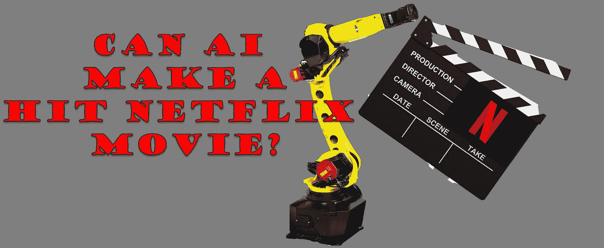
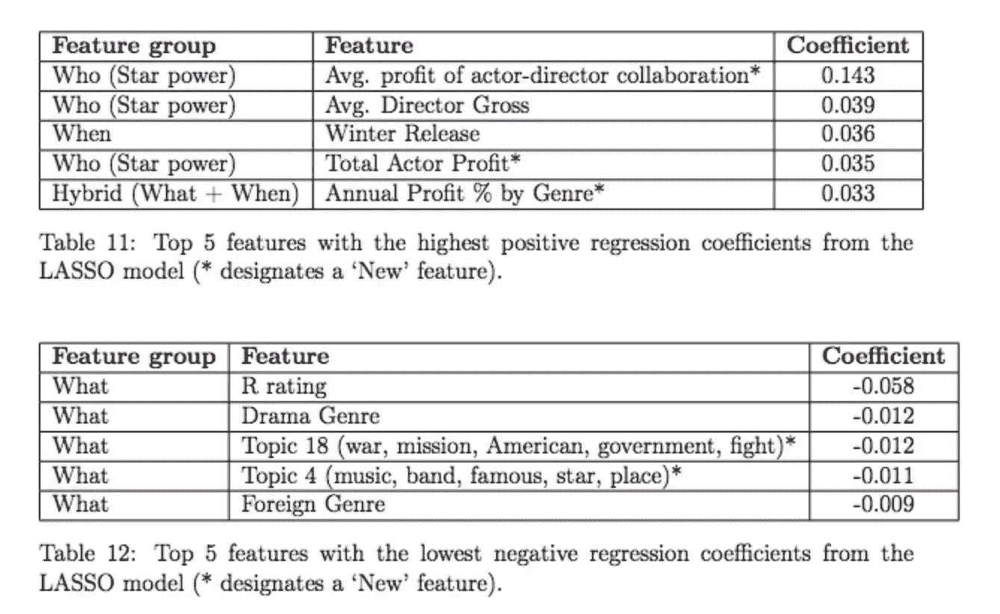
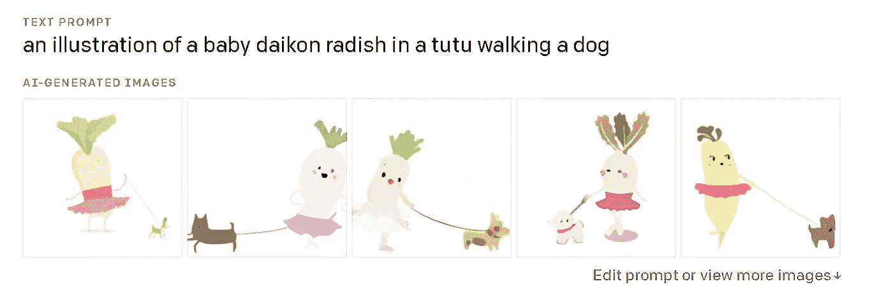

# 艾能拍出叫座的网飞电影吗？

> 原文：<https://medium.com/mlearning-ai/can-ai-make-a-hit-netflix-movie-4674044b293c?source=collection_archive---------3----------------------->

Made in MS Paint

人工智能研究人员马克斯·泰格马克(Max Tegmark)的未来主义书籍《生活 3.0》(Life 3.0)以一个故事开场，讲述了一个仁慈的人工智能通过制作轰动一时的电影接管世界的故事。首先，人工智能以低成本制作了数千部自动生成的电影，然后变得非常有利可图，发展了一批追随者。最后，人工智能扩展到新闻媒体，影响选举，但在追求民主、普遍社会服务和有效市场的过程中运用它的力量。

虽然这个故事的总体寓意是关于人工智能的力量及其对社会的影响，但我发现有趣的是，所需的基本信念是人工智能可以制作一部伟大的电影。不管你对技术和权力有什么样的看法，我想探究一下这个核心信念是否是真的。

随着计算机和人工智能变得越来越聪明，人类能力剩下的前沿是创造力、想象力和灵魂。理想情况下，一部伟大的电影应该具备那些以人为主导的特征才能成功，对吗？

这里我想探讨一下这个概念。安艾能拍出好的网飞电影吗？

# 艾在今天的电影制作中

在当今的行业中，媒体公司正在采用越来越多的技术来制作、分发和增强他们的创作追求。好的例子包括:

1.  Spotify 使用人工智能来推荐每周曲目，并为您提供理想的下一首歌曲，增加您在应用程序上的时间。
2.  Adobe suite 产品将繁忙的工作从大量的创作过程中抽离出来。他们的人工智能功能简化并增强了电影制作、编辑、动画和设计。
3.  网飞使用机器学习来[为你挑选推荐电影的图片](/swlh/how-netflix-uses-ai-for-content-creation-and-recommendation-c1919efc0af4)。
4.  电影公司优化票房收入，并提出基于剧本/角色变化的人工智能模型，这些模型审查剧本，[准确预测首映周末的票房](https://celluloidjunkie.com/2016/05/31/ai-algorithm-predicts-boxoffice/)。

是的，人类在电影中用来表达创造力的工具已经数字化，但这并不意味着 AI 的创造力。仅仅因为这篇文章是在计算机上写的，并不意味着它更加机器人化，事实上，它可能增强了创作的自由。在撰写这篇文章时，我并没有因为需要补充羽毛笔墨水而分心。

# 因此，人工智能对于创意人员来说是一个有用的工具，但它能有创意吗？

人工智能中的一些发展中的技术确实显示了在产生一定数量的模拟创造力方面的进步。人工智能模型不断涌现，生成角色、脚本、场景和图片的能力不断提高。这些“生成性”技术，一个很好的例子是生成性对抗网络(GANS)，可以在大量数据上进行训练，并产生类似人类的输出。例如，GPT-3 模型已经接受了来自互联网的写作训练，当给出写作提示时，它可以写出一些有趣的短篇故事。

这种技术类似于你在中学时将维基百科、雷克萨斯 nexus 和大英百科全书的文章混在一起写关于海牛的研究论文[抄袭/混搭/开源/群体智慧]吗，或者这与从以前的例子中提取的标准人类创造力没有什么不同？《阿凡达》读起来很像《与狼共舞》和迪士尼的《风中奇缘》。霍比特人的英雄之旅和很多神话一样有骨气。

除了我对人类创造力衍生性质的看法，我确实认为这些技术在为好莱坞电影生成合理的角色、脚本和编辑方面取得了很大进展。

# 未来的电影制作技术

这里有一些当今技术的例子，可以用来制作下一部伟大的网飞电影。

*   作为自动缪斯的人工智能(AI)——首先，人工智能现在可以把你说的话转换成图片。如果你梦想着幻想中的角色，并希望将它们作为你下一部电影的灵感，来自 Open AI 的[Dall-e model](https://openai.com/blog/dall-e/)将会有所帮助。此外，利用微软飞行模拟器背后的技术，生成世界和场景将成为可能。就像 CGI 为电影制作人的创造力打开了许多可能性一样，文本到图像模型将能够充当创意者思想的活绘画缪斯。"电脑，开始生成萝卜遛狗的图像！"

*   **神经配音演员**——给定几十个录制的音调和单词，神经网络可以创建一个非常令人信服的名人声音的复制品。使用这项技术，我的谷歌家庭设备说话完全像约翰·传奇。相反，神经声音可以将文本转换成可信的人类语音，这可能在未来取代配音演员。
*   **GPT-3 生成的脚本**——来自开放人工智能的大型变压器模型展示了令人难以置信的“创造性”写作能力。基于大规模的互联网范围的训练数据集，包括人类对话，聊天，其他脚本，GPT-3 有潜力生成有趣和令人信服的书面对话。例如，这个剧本是由 GPT-3 模型编写的。【analyticsindiamag.com， OpenAI 的 GPT-3 正在为一部情节曲折的短片写剧本

[警告视频变得有点紫，但为了保护 GPT 3 号，它是根据互联网/reddit/twitter 上人类的例子进行训练的]

# 下一部伟大的网飞电影

那么，计算机能制作出获奖的电影吗？可能不会很快，但工具和模型已经到位，人工智能可以越来越多地增强创作过程。

完全由计算机生成的电影可能会以类似于皮克斯短片的动画短片开始，由 GPT 剧本、生成的对话、定制的神经网络声音和强大的动画世界提供支持。这些的第一次迭代会像上面的 GPT-3 脚本一样笨拙，但数字技术的伟大天赋之一是它可以根据消费者的反馈反复改进。事实上，人工智能生成的技术甚至可以开发成定制电影，根据用户的偏好和以前的喜欢历史来定制。在学习了你在《英国烘焙大比拼》中喜欢的角色后，这个模型可以用这些角色生成一整季的动画，并根据你对第一集的认可来改进第二集到第十集。

# 大结局

因此，虽然离人工智能创造改变世界的电影还很远，但基础技术今天正在建立。人工智能在电影制作中肯定会被用来提高人类的创造力和生产力。在其最佳状态下，这是人工智能作为合作伙伴/伴侣的可实现愿景，它增强了人类，并将我们人类的创造力带入生活。除了为世界各地可能没有昂贵设备或培训的更多人提供机会，人工智能还将使那些可能没有被雇用为创意人员的人能够将他们的愿景带给世界。理想情况下，人工智能的引入只会增加依靠创造力谋生的人数。

我预计在人工智能(AGI)出现之前，将会有基于人工智能的电影。虽然我不指望他们很快，但第一轮肯定会比尼克凯奇的新柔术电影好。

【https://www.linkedin.com】最初发表于**。**