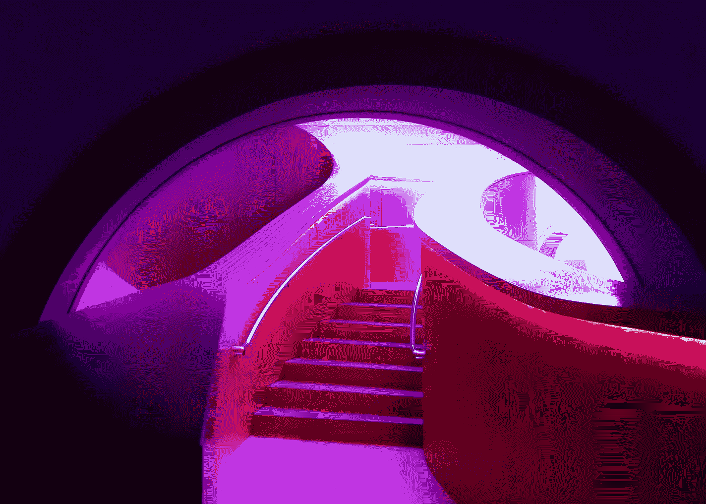

# 为什么我们需要人工智能艺术家？

> 原文：<https://medium.com/mlearning-ai/can-ai-replace-artists-378d466f69b8?source=collection_archive---------1----------------------->

## 美的主观性是一种幻觉

Photo by [Tony Reid](https://unsplash.com/@togna_bologna?utm_source=unsplash&utm_medium=referral&utm_content=creditCopyText) on [Unsplash](https://unsplash.com/s/photos/the-steps--art-gallery?utm_source=unsplash&utm_medium=referral&utm_content=creditCopyText)

他们来到博物馆的借口是为了获得大学艺术课的学分，但他们实际上是为了说服自己，他们不像那些开着 iPhones 到处跑，给朋友发短信说谁穿这套衣服或那套衣服更糟糕的孩子。这三个朋友要出发了…