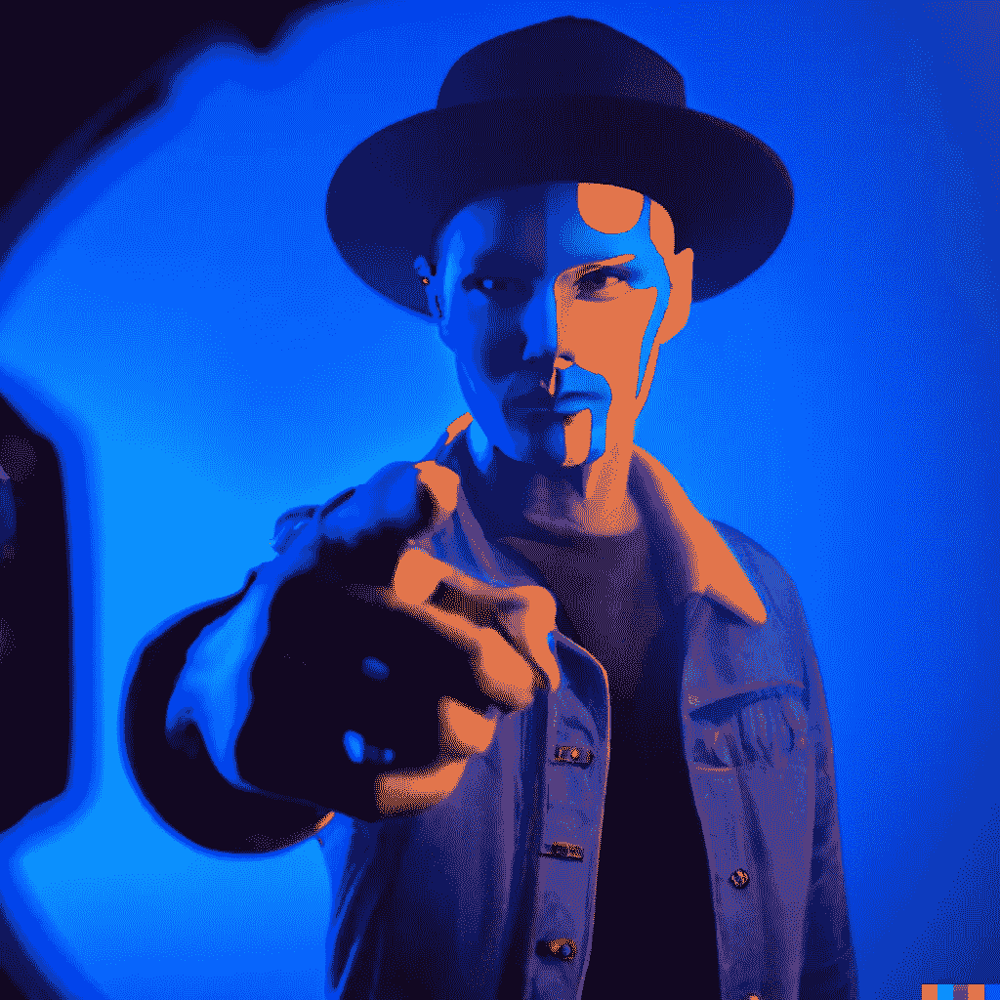

# AI 能代替人像照片吗？

> 原文：<https://medium.com/mlearning-ai/can-ai-replace-portrait-photos-f239cd3443db?source=collection_archive---------1----------------------->

## [机器学习艺术](https://mlearning.substack.com/p/how-are-realistic-virtual-humans?r=z7zu8&s=w&utm_campaign=post&utm_medium=web)

## 开始制作 [AI 图片](https://evartology.substack.com/p/how-to-draw-ai-caricatures?r=9hp4d&s=w&utm_campaign=post&utm_medium=web)

[Generate an AI avatar for yourself or your friends.](https://evartology.substack.com/p/how-to-draw-ai-caricatures?r=9hp4d&s=w&utm_campaign=post&utm_medium=web)

## AI 会取代摄影吗？

摄影的未来是光明的！摄影是一个蓬勃发展的行业，不会很快消失。然而，有一个基本点将会改变:**摄影的目的。**