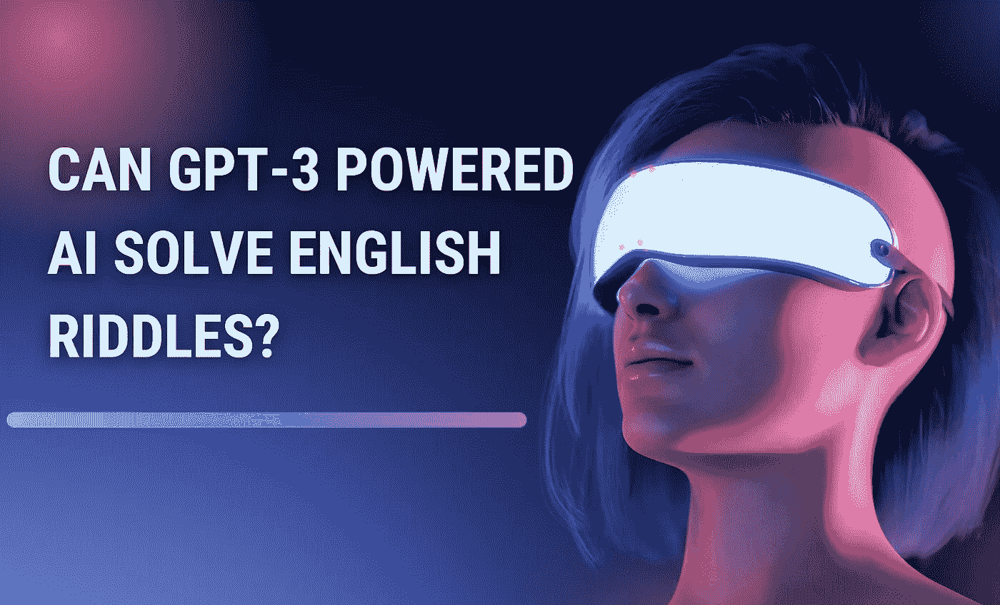

# GPT 3 号能解开这些英语谜语吗？

> 原文：<https://medium.com/mlearning-ai/can-ai-solve-english-riddles-8f509fc71ffd?source=collection_archive---------0----------------------->

Image by [Jim Clyde Monge](https://medium.com/u/819323b399ac?source=post_page-----8f509fc71ffd--------------------------------)

人工智能的功能和受欢迎程度与日俱增。这些人工智能模型在过去几年中得到了显著的改进和发展，并在创意空间的几乎每个角落都找到了应用。

过去几周，人工智能图像生成器在互联网上如雨后春笋般出现。