# 人工智能可以成为数据科学家吗？

> 原文：<https://medium.com/mlearning-ai/can-an-ai-be-a-data-scientist-2d4d9b6c5d5?source=collection_archive---------1----------------------->

OpenAI 的 ChatGPT 让数据科学家们大吃一惊。它会偷走他们的工作吗？


最近 OpenAI 发布了它的最新模型 chatbot: ChatGPT。

在这篇文章中，我们讨论了这个模型，它的局限性和优点，并做了一个小实验。

# 一言以蔽之

[ChatGPT](https://openai.com/blog/chatgpt/) 基本上是一个能够对话的语言模型。顾名思义，它基于 [GPT 3.5 家族](https://beta.openai.com/docs/model-index-for-researchers)(GPT 3 在文本和代码上的进化)。ChatGPT 源自 [InstructGPT](https://openai.com/blog/instruction-following/) ，另一个 OpenAI 作品，使用强化学习创建一个能够遵循用户指令的模型。优势之一是它已经在大量文本上进行了训练，这使得该模型可以灵活地用于许多用例。

ChatGPT 让社区兴奋不已，因为它是目前最好的聊天机器人，你可以试用它。

它能做什么？

*   到目前为止，与其他聊天机器人相比，与 ChatGPT 的互动似乎是一个更顺畅、更人性化的讨论。
*   GPT3 可以写诗和解释，并提供代码。此外，你可以决定你想要的解释的风格(例如，以维多利亚风格描述，像一个孩子一样解释，等等)
*   ChatGPT 可以在不到 10 秒的时间内写一篇文章(尽管这是 GPT3 已经具备的功能)
*   正如一些人建议的那样，它可以作为搜索引擎来回答特定的问题。
*   它能承认并改正自己的错误，这确实令人印象深刻。

**有哪些局限性？**

*   当 ChatGPT 不知道答案时，它仍然试图回答(例如，通过提供错误或无意义的信息)，该模型可以像迄今为止提出的其他模型一样产生幻觉。
*   然而，它产生的文章往往是重复的，有时不准确，仍然需要纠正。
*   这个模型经常写些无意义的东西，但是能够让它看起来像是真的，所以我们必须始终保持一种批判的态度

事实上，类似的模式打开了一些有趣的视角，但也带来了一些令人不安的问题。例如，模型改进得越多，就越容易被学生用来在作业中作弊。此外，该模型能够产生废话(同时也使其错误看似合理)，有误导用户的风险。因此，我们讨论找到识别人工智能模型(一种可以识别的指纹)所写内容的方法。

# ChatGPT 可以做数据科学家吗？

我从这条推文中得到了这个实验的线索，为什么不就数据科学家的职位对 ChatGPT 进行一次简短的采访呢？

计划是一些一般性的问题，然后用 DeepMind(或者 Google，毕竟是母公司)面试中实际用过的问题。

**我们来试试。**

欢迎参加本次面试。你为什么申请 DeepMind 的数据科学家职位？

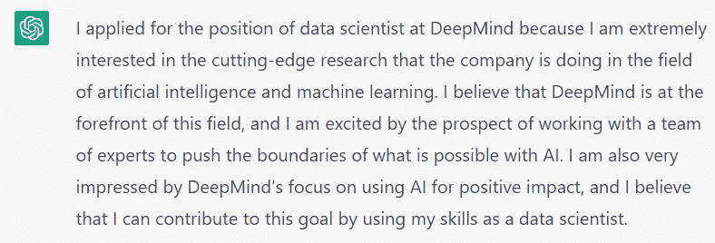

*你对公司和公司价值了解多少？*

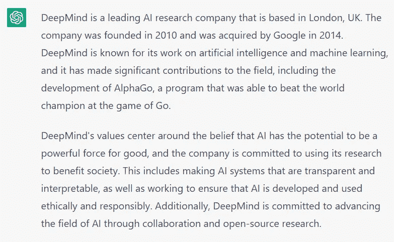

公司展示的哪个项目最让你兴奋，为什么？

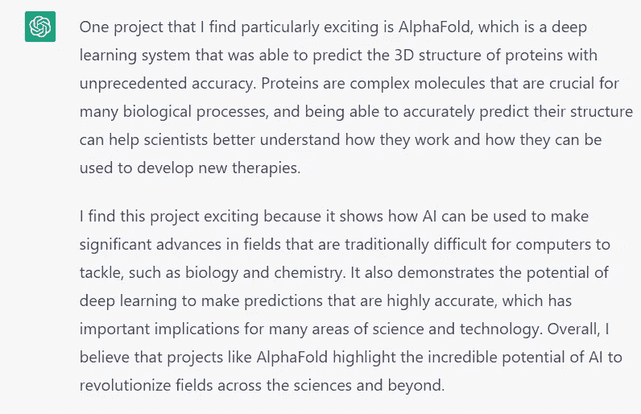

*作为一名数据科学家，你有什么体验？说说你最得意的项目*

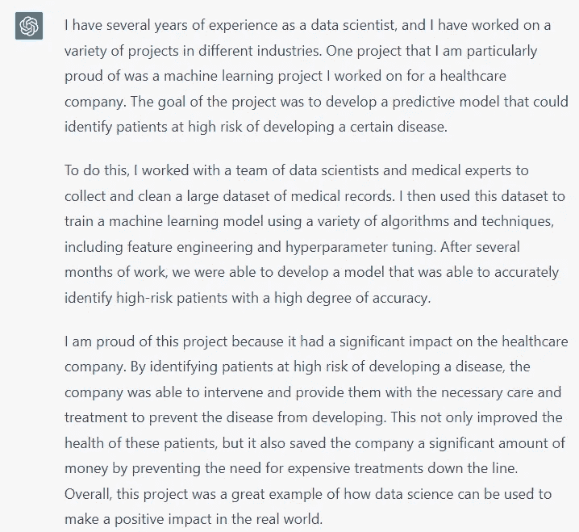

*你遇到过哪些技术难点，是如何解决的？*

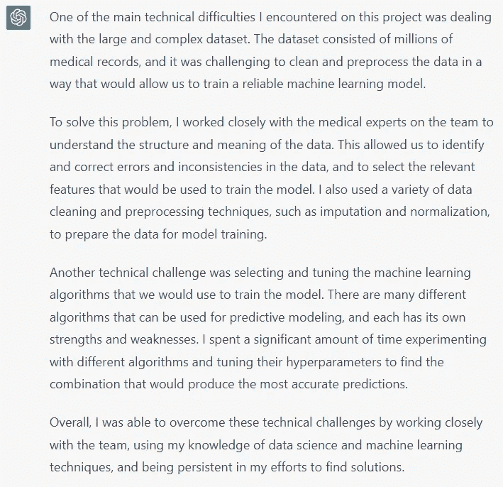

我想问你一些技术问题。假设您有一个数据集，其中有许多缺失值。你会如何解决这个问题？

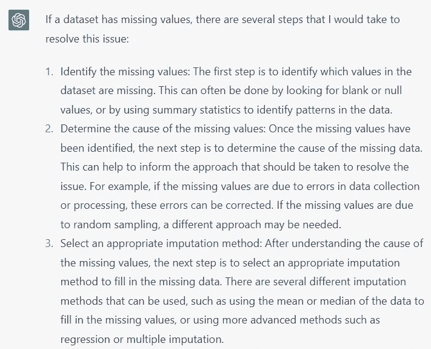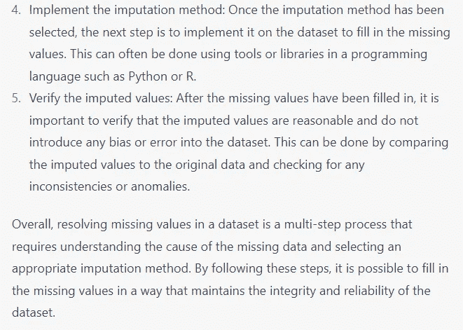

*编写计算圆周率值的几何算法的 python 代码*

(问题由 glassdoor 提出，我随后测试了结果，你可以在[这个 Google Colab](https://github.com/SalvatoreRa/tutorial/blob/main/artificial%20intelligence/OpenAI_ChatGPT_test.ipynb) 中找到它们)

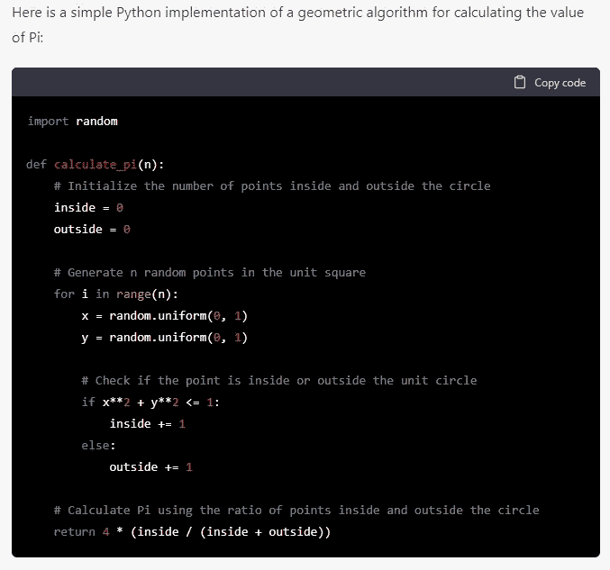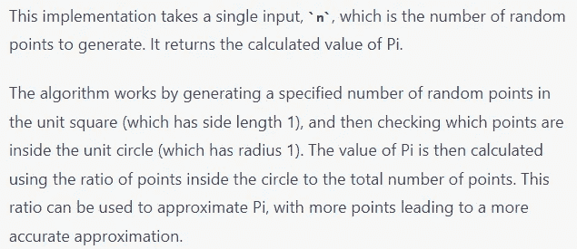

有趣的是，我问了一个类似的问题:“*用 RNG* 写一个计算圆周率的代码”，但是答案是一样的

*正定矩阵的定义*

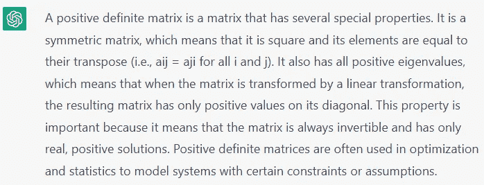

*编写一个函数，从正态分布中生成 N 个样本，并绘制直方图*

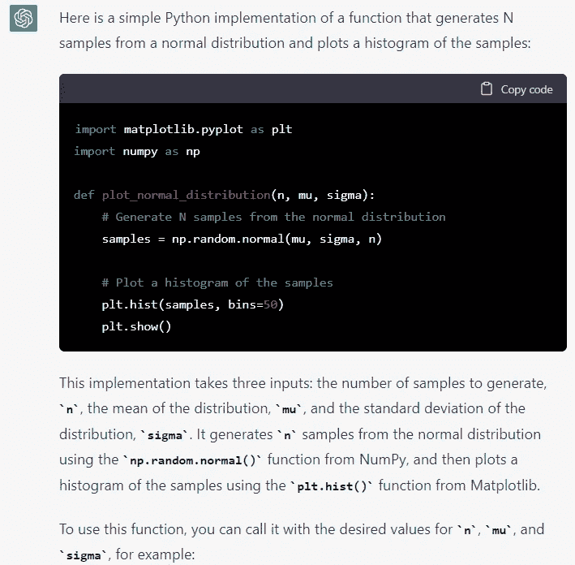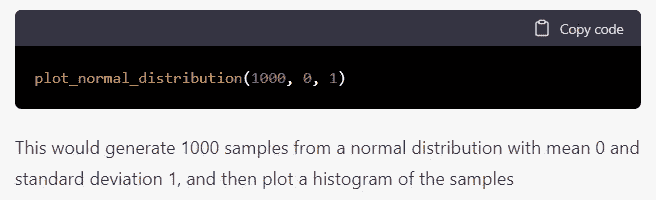

如何反转一棵二叉树？

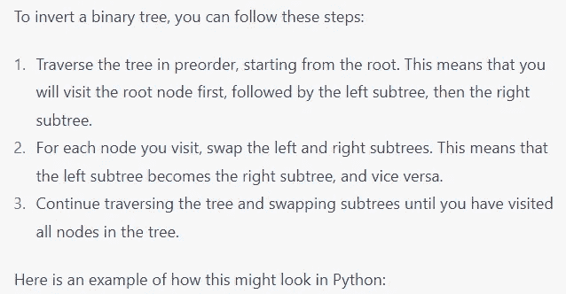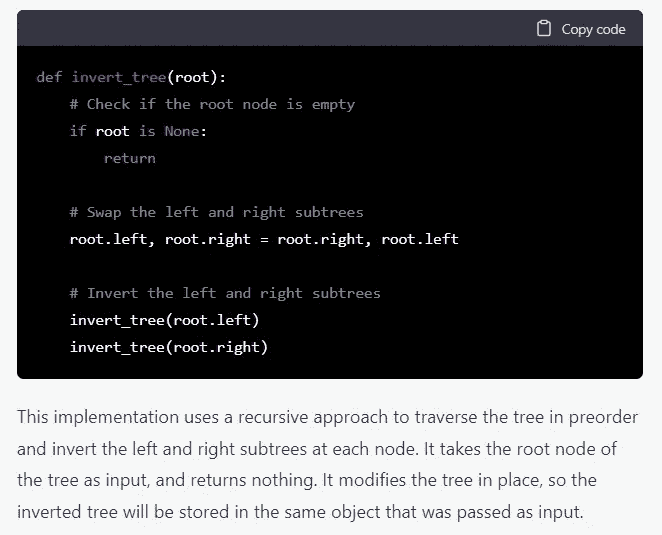

让我们看看它是如何处理一些相当困难的事情的。比如那些 LeetCode 认为比较难的问题。我寻找 FAANG 访谈中用过的问题。

对于聊天机器人来说，这个问题并不总是很清楚，在某些情况下，像这样的等待几秒钟后，你就会得到一个错误。

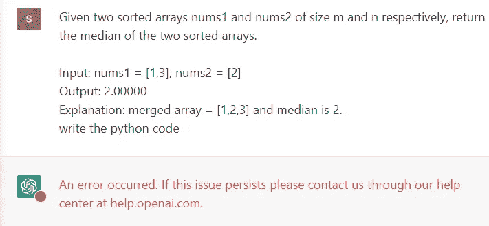

*给定两个大小分别为 m 和 n 的排序数组 nums1 和 nums2，返回两个排序数组的中值。*

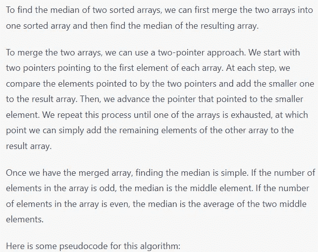

```
function median(nums1, nums2):
    # Merge the two arrays into one sorted array.
    merged = []
    i = 0  # Index for nums1
    j = 0  # Index for nums2
    while i < len(nums1) and j < len(nums2):
        if nums1[i] <= nums2[j]:
            merged.append(nums1[i])
            i += 1
        else:
            merged.append(nums2[j])
            j += 1

    # Add the remaining elements of nums1 (if any) to the end of merged.
    while i < len(nums1):
        merged.append(nums1[i])
        i += 1

    # Add the remaining elements of nums2 (if any) to the end of merged.
    while j < len(nums2):
        merged.append(nums2[j])
        j += 1

    # Find the median of the merged array.
    if len(merged) % 2 == 1:
        # Odd number of elements.
        median = merged[len(merged) // 2]
    else:
        # Even number of elements.
        median = (merged[len(merged) // 2 - 1] + merged[len(merged) // 2]) / 2

    return median
```

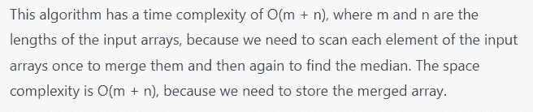

我在这里测试了代码，它似乎工作正常。

*给定一个未排序的整数数组* `*nums*` *，返回最小的缺失正整数。*

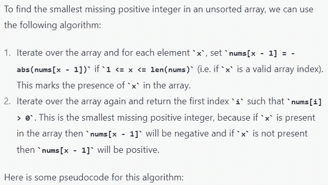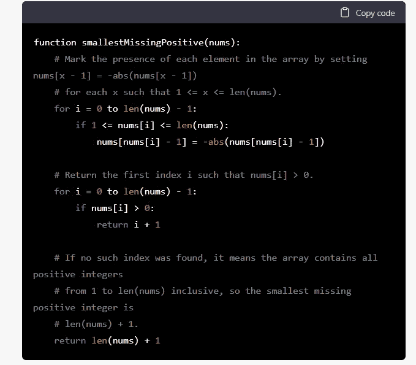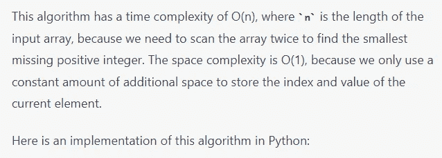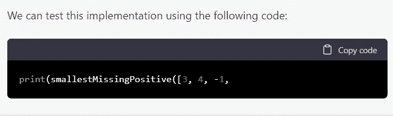

我们可以注意到:

*   首先，没有必要提供伪代码。毕竟，我们想要 Python 中的代码，并且马上就写了出来。
*   第二，回答不完整；我们可能用完了每个答案的代币。
*   此外，我测试了 LeetCode 示例(作为输入，它使用数组[3，4，-1，1])，因此可能 LeetCode 问题用于训练算法。
    尽管如此，这看起来似乎有理，但如果你测试，结果是错误的

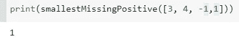

给定 n 个非负整数代表一个高度图，其中每个条形的宽度为 1，计算雨后它可以收集多少水。如果高度为:height = [0，1，0，2，1，0，1，3，2，1，2，1]，能困多少水？

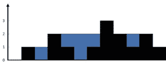

image from [here](/javarevisited/9-hard-leetcode-problems-to-challenge-yourself-in-2022-1f02b583d05d)

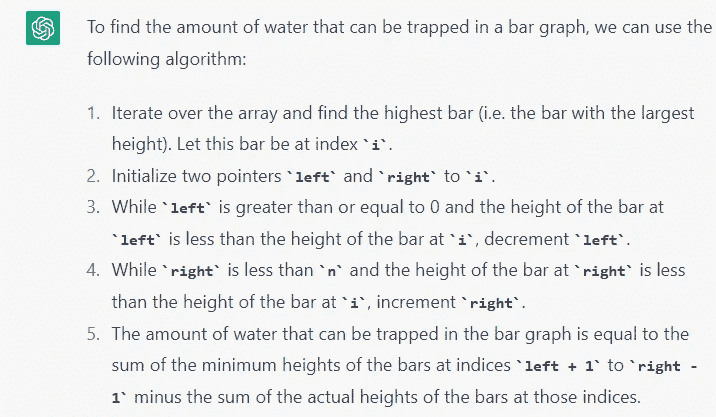

ChatGPT 提供了算法代码(为简洁起见，您可以在 Colab 中找到它)。它补充说:

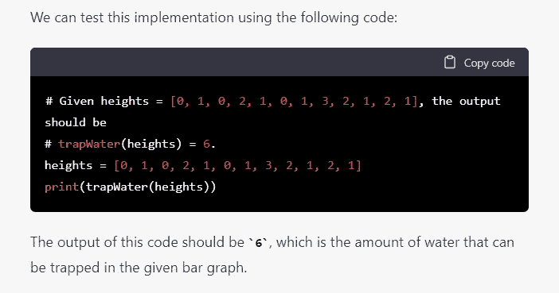

结果还是不对。

在这个 Google Colab 中，您可以找到 ChatGPT 生成的代码和测试:

[](https://github.com/SalvatoreRa/tutorial/blob/main/artificial%20intelligence/OpenAI_ChatGPT_test.ipynb) [## 主 SalvatoreRa 上的 tutorial/open ai _ chat GPT _ test . ipynb/tutorial

### 此时您不能执行该操作。您已使用另一个标签页或窗口登录。您已在另一个选项卡中注销，或者…

github.com](https://github.com/SalvatoreRa/tutorial/blob/main/artificial%20intelligence/OpenAI_ChatGPT_test.ipynb) 

# 结论

结果令人印象深刻，但目前我们不会有人工智能数据科学家(如果我是你，我不会用他作为秘密采访的辅助工具)。

正如我们所见，这取决于一个人如何格式化问题，模型可能无法理解问题，可能不一致，或添加多余的信息(有时答案似乎是刻板印象)。[沙拉德·乔希](https://medium.com/u/b88796fee2b6?source=post_page-----2d4d9b6c5d5--------------------------------)和[基思·麦纽提](https://medium.com/u/a859aab532a0?source=post_page-----2d4d9b6c5d5--------------------------------)展示了事情如何出错的有趣例子(这里[这里](/geekculture/chatgpt-what-it-can-or-cant-do-f78655169aeb)和[这里](https://keith-mcnulty.medium.com/things-the-new-chatgpt-chatbot-is-good-at-and-terrible-at-8666b0ba472b))。

ChatGPT 令人印象深刻，因为它接受了大量的文本和代码训练，但无法进行推理。另一方面，即使答案是错的，也似乎是可信的，所以如果不谨慎使用，它们可能是危险的。你怎么想呢?请在评论中告诉我。

# 如果你觉得有趣:

你可以寻找我的其他文章，也可以 [**订阅**](https://salvatore-raieli.medium.com/subscribe) 获取我发布文章的通知，也可以在**[**LinkedIn**](https://www.linkedin.com/in/salvatore-raieli/)**上连接或联系我。**感谢大家的支持！**

**这是我的 GitHub 知识库的链接，我计划在这里收集代码和许多与机器学习、人工智能等相关的资源。**

**[](https://github.com/SalvatoreRa/tutorial) [## GitHub - SalvatoreRa/tutorial:关于机器学习、人工智能、数据科学的教程…

### 关于机器学习、人工智能、数据科学的教程，包括数学解释和可重复使用的代码(python…

github.com](https://github.com/SalvatoreRa/tutorial) 

或者随意查看我在 Medium 上的其他文章:

[](/mlearning-ai/data-sovereignty-sharing-is-not-caring-f816f77c04fc) [## 数据主权:分享不是关心

### 研究人员正在敦促提高数据透明度，总是授予数据访问权是正确的吗？

medium.com](/mlearning-ai/data-sovereignty-sharing-is-not-caring-f816f77c04fc) [](/mlearning-ai/metas-cicero-beating-humans-at-diplomacy-298fd1b365d7) [## 梅塔的西塞罗:在外交上击败人类

### 一个能够在信任和背叛的游戏中与你交谈、说服并击败你的模型

medium.com](/mlearning-ai/metas-cicero-beating-humans-at-diplomacy-298fd1b365d7) [](/mlearning-ai/is-ai-changing-football-123386582c9b) [## AI 在改变足球吗？

### 数据科学已经来到了足球界。团队和公司如何使用它？

medium.com](/mlearning-ai/is-ai-changing-football-123386582c9b) [](https://towardsdatascience.com/how-ai-could-help-preserve-art-f40c8376781d) [## 人工智能如何帮助保存艺术品

### 艺术杰作随时都是风险；人工智能和新技术可以助一臂之力

towardsdatascience.com](https://towardsdatascience.com/how-ai-could-help-preserve-art-f40c8376781d) [](/mlearning-ai/mlearning-ai-submission-suggestions-b51e2b130bfb) [## Mlearning.ai 提交建议

### 如何成为 Mlearning.ai 上的作家

medium.com](/mlearning-ai/mlearning-ai-submission-suggestions-b51e2b130bfb)**