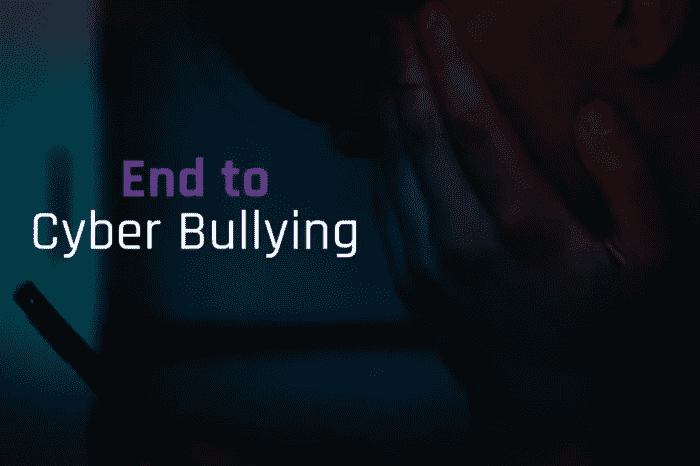

# 人工智能能终结网络欺凌吗？

> 原文：<https://medium.com/mlearning-ai/can-artificial-intelligence-bring-an-end-to-cyberbullying-d5f1e17f655e?source=collection_archive---------3----------------------->

在我们被科技联系在一起之前，校园欺凌是最常见的。例如，还记得《圣诞故事》中的斯库特·法库斯或者《早餐俱乐部》中的布莱恩·约翰逊(安东尼·迈克尔·霍饰演的角色)吗但是欺凌不仅仅是孩子们的事。骚扰和仇恨言论存在于工作场所和成年人的社会中。那么，改变了什么，可以做些什么…