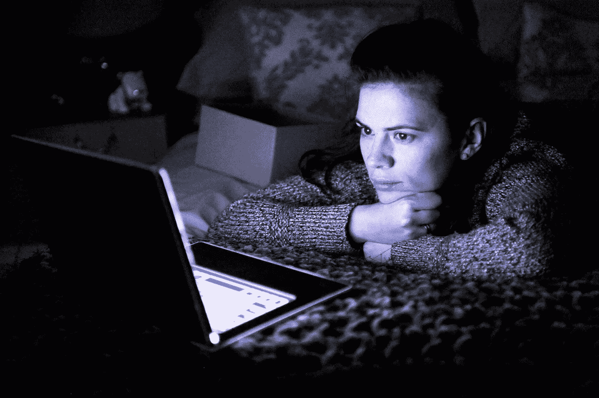
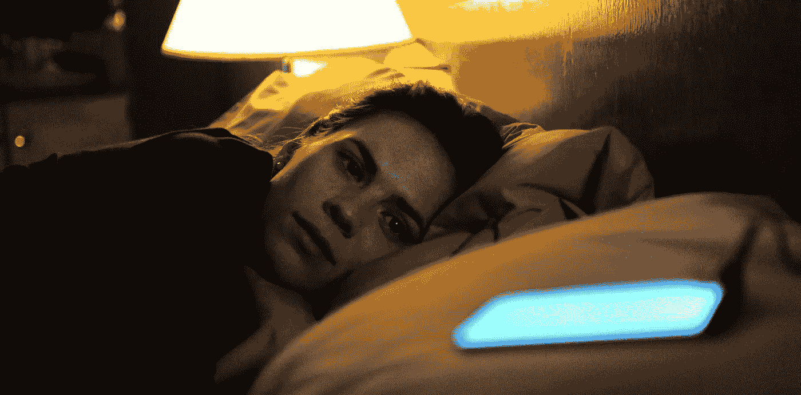

# 人工智能能让人起死回生吗？

> 原文：<https://medium.com/mlearning-ai/can-artificial-intelligence-bring-people-back-to-life-5ba1f432b2fd?source=collection_archive---------1----------------------->

## 最近获得专利的微软聊天机器人可以让人们让死去的亲人“起死回生”。我们对此有何感想？

Black Mirror, Be Right Back

对于任何遭受损失的人来说，微软可能有一个令人难以置信的解决方案——但这是一个有争议的方案。美国商务部最近授予这家科技巨头一项[专利](https://pdfpiw.uspto.gov/.piw?PageNum=0&docid=10853717&IDKey=6E72242A6301&HomeUrl=http%3A%2F%2Fpatft.uspto.gov%2Fnetacgi%2Fnph-Parser%3FSect1%3DPTO2%2526Sect2%3DHITOFF%2526p%3D1%2526u%3D%25252Fnetahtml%25252FPTO%25252Fsearch-bool.html%2526r%3D31%2526f%3DG%2526l%3D50%2526co1%3DAND%2526d%3DPTXT%2526s1%3Dmicrosoft.ASNM.%2526OS%3DAN%2Fmicrosoft%2526RS%3DAN%2Fmicrosoft)，允许基于死者信息制造聊天机器人，包括“图像、语音数据、社交媒体帖子[和]电子信息”如果微软继续这个想法，它将创造人工智能版本的人类，可能伴随着他们的脸或身体的数字表示。

我们已经获得了实现这一目标所需的技术。我们以前也见过人工智能让死人复活，无论是在[科幻](https://www.denofgeek.com/tv/black-mirror-be-right-back-is-a-masterful-exploration-of-fear-love-and-death/)还是[现实](https://theweek.com/articles/659229/best-friend-died-rebuilt--using-artificial-intelligence)中。最近的例子是[deep 怀旧](https://twitter.com/MyHeritage/status/1366029972452827136)应用程序，只需点击几下，就能让旧的家庭照片变得栩栩如生。但是，人造复制品会如此难以置信地黑暗，以至于最好局限在幻想的领域吗？或者为《活死人之夜》的技术续集开绿灯也没问题？我犹豫不决。

一方面，我们所爱的人的死亡会造成难以想象的痛苦——我们可能希望通过任何可能的方式来减轻这种痛苦。对许多人来说，处理损失的传统方法根本不起作用，他们发现自己陷入了痛苦的悲伤真空。那么，为什么不拥抱技术，依靠前沿创新来寻求帮助呢？与有问题的个人的数字图像交流可以填补他们去世后留下的空白。

当你想到这一点时，我们已经从已故亲人的图片、文字聊天和视频/音频内容中寻找安慰。有时它确实能平息悲伤。考虑到这一点，微软的计划能否将止痛提高到另一个水平，将它从单向的努力，如吃药，转变为双向的体验，类似于治疗会话？

Black Mirror, Be Right Back

另一方面，我不得不认为抓住一个已经不在我们身边的人是不健康的。这难道不类似于将它们存放在橱柜或架子上，就好像它们只是一个物体——一个电脑游戏或虚拟现实耳机——在你的家中，足够真实但不完全真实吗？谁想要一个不断提醒他们不再拥有的东西呢？正是因为这个原因，许多悲伤的人实际上并没有从图像或镜头中寻求安慰，或者他们通常所说的“痛苦的纪念品”——这纯粹是太创伤了。

关于悲伤的阶段存在各种各样的理论，但精神病学家伊丽莎白·库伯勒-罗斯提出的模型是最常用的模型之一。在这个模型中，五个阶段是否认、愤怒、讨价还价、沮丧和接受。我想象拥有一个死去的配偶、孩子或父母的人工智能复制品会让哀悼者陷入否认——或者在经历或完成后续阶段后将他们拖回否认。它可以让哀悼者建立一个虚构的世界，在这个世界中，他们假装死者只是他们生活中的人类的影子。

我们应该记住，就像人类一样，技术也是脆弱的。想象一下，哀悼者开始像他所爱的人一样关心这个系统，然后它崩溃了，或者愤怒和不安导致他们删除了它。我们并不经常经历失去所爱的人的痛苦，但如果这种事情发生两次，那将是毁灭性的。

这个想法绝对有希望，感谢微软试图帮助那些真正痛苦的人。虽然它可能会做到这一点，我想这只是一个短期的解决方案。请在下面的评论中告诉我你的想法。