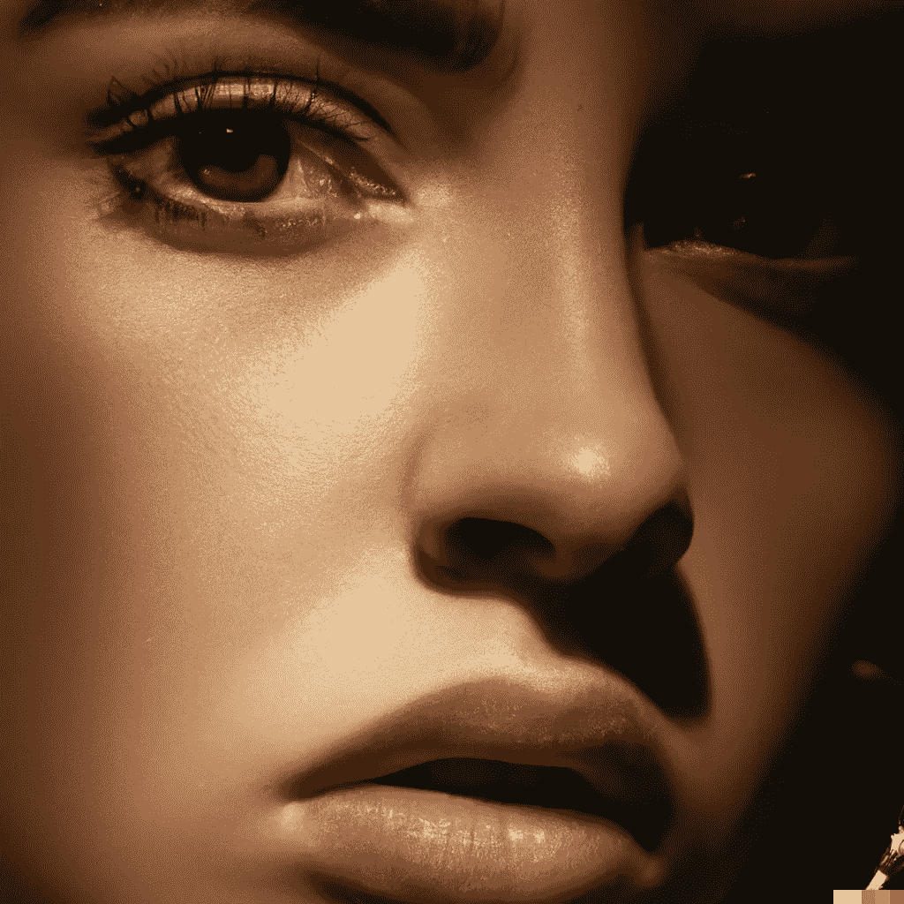

# DeepFakes 能检测出来吗？

> 原文：<https://medium.com/mlearning-ai/can-deepfakes-be-detected-3e865de09e7f?source=collection_archive---------1----------------------->

## [机器学习艺术](https://mlearning.substack.com/p/generate-photo-realistic-ai-art-for?r=z7zu8&s=w&utm_campaign=post&utm_medium=web)

## 如何打击人工智能产生的谎言？密码

img [by AI system](https://evartology.substack.com/p/all-of-the-greatest-ai-powered-art?r=9hp4d&s=w&utm_campaign=post&utm_medium=web) — [All of the greatest AI-powered Art tools](https://evartology.substack.com/p/all-of-the-greatest-ai-powered-art?r=9hp4d&s=w&utm_campaign=post&utm_medium=web)

高质量的 DeepFakes 很难被发现，但是有了一些经验，你就可以分辨出什么是真的，什么是假的。你可以练习识别 DeepFakes 或者使用 [**机器学习**](https://mlearning.substack.com/p/generate-photo-realistic-ai-art-for?r=z7zu8&s=w&utm_campaign=post&utm_medium=web) 工具。