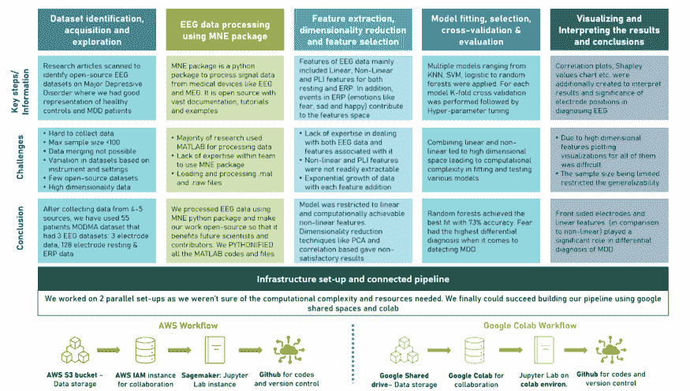
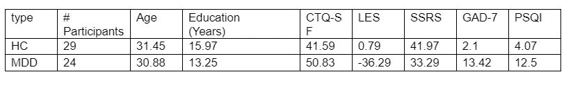
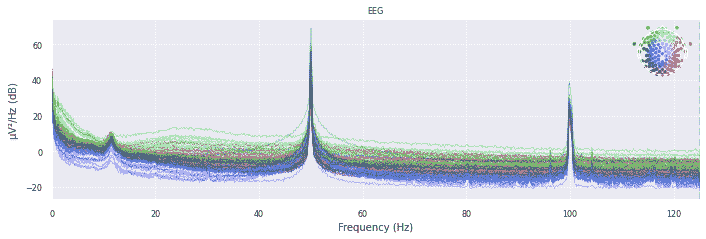
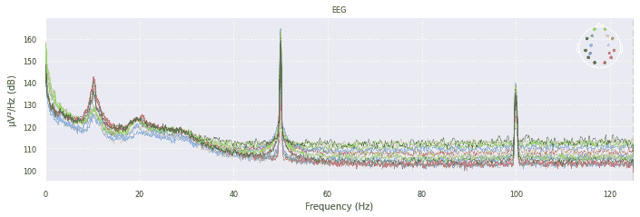
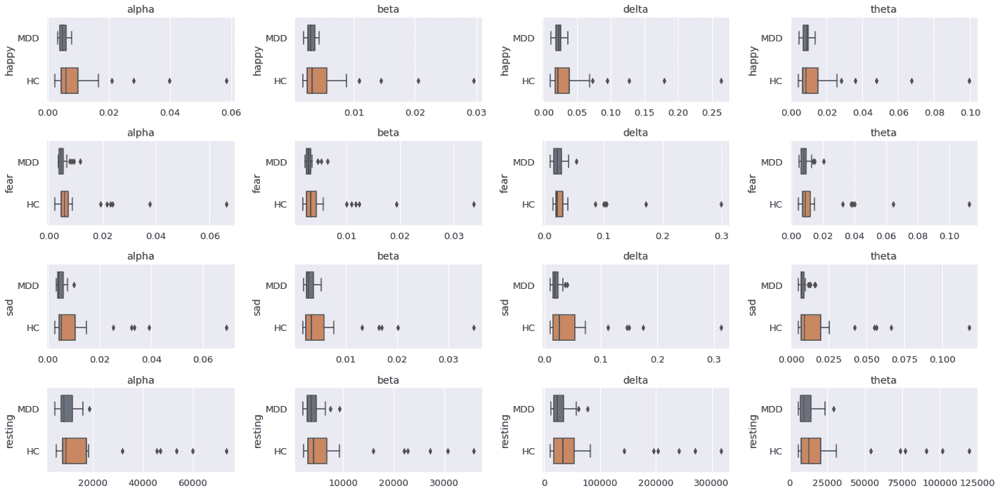
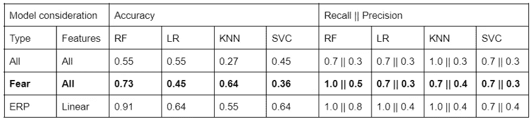
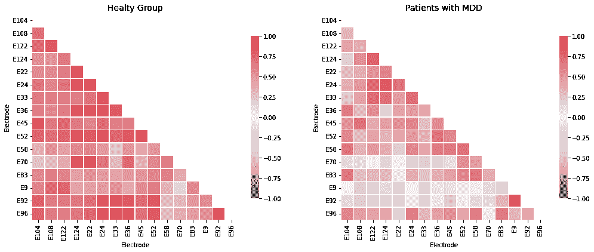
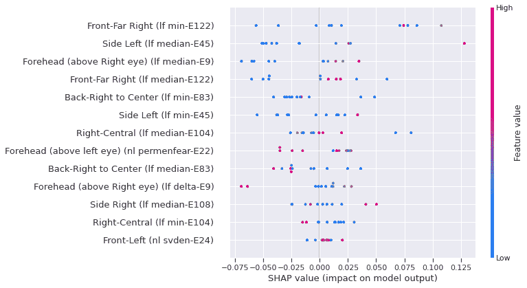
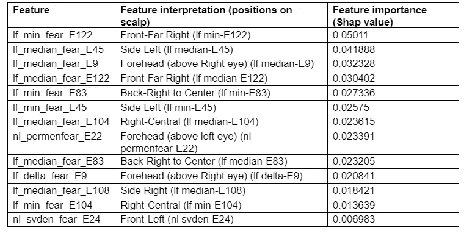

# 脑电图数据能帮助临床诊断重性抑郁障碍(MDD)吗？

> 原文：<https://medium.com/mlearning-ai/can-eeg-data-aid-clinical-diagnosis-of-major-depressive-disorder-mdd-96b09f5c1ced?source=collection_archive---------0----------------------->

*使用 python (MNE、Antropy 和 Scipy 包)构建预测机器学习模型*

Aparna Vadlamudi、Panini Mohan Mokrala 和 Anup Merkap

[特别感谢我们的导师 Elle O'Brien 博士对整个项目的指导]

# 简介和动机

**为什么我们选择脑电图诊断抑郁症:**

抑郁症是一种高度诊断不足，治疗不足，误解和污名化的疾病。抑郁症是[全球范围内导致残疾的主要原因](https://www.who.int/news-room/fact-sheets/detail/depression)，对社会心理、身体和情感功能产生衰弱性影响。据报道，全世界有超过 2 . 8 亿人患有抑郁症。在中低收入国家，未接受治疗的比例高达 75% [ [世卫组织](https://www.who.int/news-room/fact-sheets/detail/depression) ]。重性抑郁障碍(MDD)是一种主要的精神障碍，其特征是失去兴趣，注意力不集中，甚至有自杀的想法( [Acharya 等人，2018](https://www.sciencedirect.com/science/article/abs/pii/S0169260718301494) )，往往导致生活质量差

由于通过访谈和问卷调查(如诊断和统计手册(DSM-5)和精神病学评估)进行评估的主观性，目前的诊断方法不是决定性的，并且缺乏临床意义。MDD 的准确诊断对于早期干预和有效治疗非常重要。抑郁症是最容易治疗的精神疾病之一。80%到 90%的抑郁症患者最终对治疗反应良好。因此，开发客观的方法来帮助临床医生更有效地诊断 MDD 是至关重要的。

[段等](https://www.frontiersin.org/articles/10.3389/fnhum.2020.00284/full#B2)提出了基于机器学习的抑郁症识别与脑电图(EEG)通过一种无创的高时间分辨率技术；这项技术对人脑功能状态的变化很敏感( [Schmidt 等人，2013](https://pubmed.ncbi.nlm.nih.gov/24130529/) )。静息状态脑电图(rsEEG)揭示了大脑网络活动，可以应用于神经学评估([托特等人，2014](https://pubmed.ncbi.nlm.nih.gov/24508504/) )。脑电信号可视为一组多元时间序列，提取特征对于跟踪脑电信号的变化至关重要( [Ting et al .，2008](https://www.sciencedirect.com/science/article/abs/pii/S0263224107000711?via%3Dihub) )。对抑郁症的研究发现，抑郁症患者在解释恐惧、愤怒、快乐、惊讶和悲伤方面表现出明显的障碍( [Filomena et al .，2016](https://www.frontiersin.org/articles/10.3389/fict.2016.00016/full) )。这些解释情绪的差异为临床突出的抑郁症的鉴别诊断铺平了道路，从而提高了治疗率。

所有当前的机器学习模型都是使用 MATLAB 构建的，以从电极提取信号，并构建用于诊断 MDD 的预测模型。我们发现有限的研究和出版物中的流程是用 python 编写的，并且是公开的。通过我们的研究，我们希望实现以下目标:

1.  **我们如何以有临床意义的方式诊断重度抑郁障碍(MDD)？**

我们从一种多模态方法开始，我们希望结合表型、行为、数字生物标记和脑电图数据来预测 MDD。但是由于缺乏所有这些参数的标记数据，我们不得不坚持单独使用 EEG 数据，因为早期研究显示了其在诊断抑郁症中的临床意义。

**2。使用 python MNE 包**使数据处理和模型建立更加开源

所有当前的研究，不管是开源的还是其他的，都是在 MATLAB 中完成的，这需要专门的知识和工具。我们通过这项工作的努力是使用像 python (MNE 包)这样的开源编程语言作为我们的主要编程语言，它易于理解、适应和更改，并使其开源，以便功能科学家和从业者可以从中受益

**3。识别具有良好预测能力的有意义特征，以帮助抑郁症的鉴别诊断**

通过中国兰州大学科学家进行的 MODMA 现有研究(以下数据集部分的完整细节)，我们了解到抑郁症患者对恐惧、悲伤和快乐等情绪的反应不同。我们想测试不同的事件，如 ERP 阶段的情绪和静息阶段的电极信号，以及这些事件的线性和非线性组合如何用作预测 MDD 的特征

# 使用脑电数据集预测 MDD 的工作流程

我们确定了从零开始建立基于 EEG 的预测模型的 6 个主要步骤。关键步骤包括:

1.  数据集识别、获取和探索
2.  用 MNE 软件包处理脑电数据
3.  特征提取、降维和特征选择
4.  模型拟合、选择、交叉验证和评估
5.  可视化和解释结果和结论
6.  跨越上述所有步骤的基础设施设置和连接管道

在我们深入研究每一个步骤之前，我们想简要介绍一下所有 6 个步骤、面临的挑战以及我们在每个步骤中最终采取的解决方案的大致结论

A snapshot of how we organized our entire work, each section will be elaborated in detail in following sections

在接下来的部分中，我们将深入探讨每个关键步骤的细节，同时在每个部分中触及关键挑战、找到的变通方法和解决方案以及有用的资源(代码、视觉效果、存储库和研究出版物链接)。

**我们所有的工作都在 GitHub** 上 [**公开**](https://github.com/anupmerkap87/Diagnosing-depression-using-EEG)

# 数据识别、获取和探索

*通过对现有来源的广泛研究和签署协议，为 MDD 和健康对照收集标记的脑电图数据。探索人口统计学数据中任何可能的偏差*

我们的探索始于确定有助于抑郁症诊断的参数，我们发现可以通过行为访谈、心理评估、表型数据、数字生物标记和脑电图数据来诊断抑郁症的研究。我们希望建立一个多模态诊断模型，将所有这些参数都考虑在内，但由于缺乏包含多模态评估的标记数据集，我们放弃了这个想法。此外，这种多方面的方法需要庞大的 IT 基础设施来处理数据，这对于我们现有的资源来说是一个挑战。由于脑电图数据在诊断 MDD 中具有临床意义，我们将工作范围缩小到基于脑电图的 MDD 诊断。

虽然我们研究了许多数据集，但我们在此提供了我们发现的最佳来源:

**PRED+CT——EEG 数据的患者存储库+计算工具**,这是一个 EEG 数据存储库，包含电极/信号数据和一系列精神疾病的患者数据。数据和相应的研究出版物可以在[这里](http://predict.cs.unm.edu/downloads.php)获得。

**儿童心理研究所的健康大脑网络:**来自纽约市地区 10，000 名儿童和青少年(5-21 岁)的数据。健康大脑网络生物库存储了有关精神病学、行为、认知和生活方式(如健身、饮食)表型的数据，以及多模式脑成像、脑电图、数字语音和视频记录、遗传学和活动描记术的数据。出版物和研究可以在[这里](http://fcon_1000.projects.nitrc.org/indi/cmi_healthy_brain_network/index.html)访问

**基于脑电图的重性抑郁障碍诊疗结果预测:** [链接此处](https://doi.org/10.6084/m9.figshare.3385168.v1)

**MDD 患者和健康对照脑电图数据(新)** : [链接此处](https://doi.org/10.6084/m9.figshare.4244171.v2)

**MODMA 数据集:用于精神障碍分析的多模态开放数据集**该数据集包括来自临床抑郁症患者和匹配正常对照的 EEG 和音频数据。所有的患者都是由医院的专业精神科医生精心诊断和挑选的。EEG 数据集包括在静息状态和刺激下记录的 53 名受试者的传统 128 电极；记录了 55 名受试者静息状态下的三电极脑电信号；在访谈、阅读和图片描述过程中记录了 52 名被试的音频数据。[数据集描述](https://arxiv.org/ftp/arxiv/papers/2002/2002.09283.pdf)

我们选择继续使用 MODMA 数据集，并通过签署最终用户许可协议(EULA) [在这里](http://modma.lzu.edu.cn/data/application/)获得它。为了我们的建模目的，我们仅在静息和 ERP(在刺激数据下)中使用了 128 个电极数据集。选择该数据集的主要原因是:MDD 和健康对照(HC)的良好实验设计、确认 MDD 的专家诊断、丰富的数据可用性(ERP、静息和音频数据)以及几篇在该数据集上构建机器学习模型的研究文章，这些都增强了我们的信心。

**数据集的引用:MODMA**

中国兰州大学甘肃省可穿戴计算重点实验室:蔡，h，高，y，孙，s，李，n，田，f，肖，h，李，j，杨，z，李，x，赵，q，刘，z，姚，z，杨，m，彭，h，朱，j，张，x，胡，x，&胡，b(2020)。MODMA 数据集:用于精神障碍分析的多模态开放数据集。arXiv 预印本:2002.09283

然后，我们研究了人口统计学数据，并确定了 MDD 患者和健康对照者在人口统计学上的不平等分布——年龄、教育状况等。由于我们无法控制研究设计，我们想强调我们的模型有偏差的可能性。人口分布汇总如下

MDD =重度抑郁障碍，HC =健康对照，PHQ-9 =患者健康问卷，CTQ-SF =儿童期创伤问卷，LES =生活事件量表，SSRS =社会支持研究量表，GAD-7 =广泛性焦虑症，PSQI =匹兹堡睡眠质量指数

# 用 MNE 软件包处理脑电数据

*本节将简要介绍数据加载、清理、过滤和处理步骤，为特征提取和模型构建准备数据*

如前所述，我们面临的一个主要挑战是，我们相信许多数据科学家也将面临这一挑战，目前在基于 EEG 的预测模型方面所做的工作非常有限，其中大多数都是在 MATLAB 中构建的，与高级、通用和开源语言 Python 相比，MATLAB 是闭源的、专有的，需要专业知识。这使得复制工作和做出额外的贡献变得具有挑战性。我们希望**使用 python MNE 包** **在 MODMA 数据集上复制基于 EEG 的模型，并使其开源**，让更多的观众从中受益

我们面临着将 MATLAB 处理过的文件和原始文件加载到 python 环境中并进行处理的巨大挑战。多亏了 MNE 软件包的大量文档和教程，通过反复试验和大量实践，我们可以克服一个又一个的障碍。

在我们解释这些挑战以及我们如何克服它们之前，让我们简单解释一下 EEG 数据及其组成部分。脑电图数据中的特征将在下一节【特征提取】中解释

EEG 数据主要包括通过固定在头皮上的头部周围的电极捕获的信号数据。#电极的范围通常为 64、128 和 256。实验中使用的另一个变量也是以 Hz 为单位的频率，从 0.1 Hz 变化到> 100 Hz。响应于事件(刺激)和静息时从大脑中出现的电子信号形成了 MDD 病患者与健康对照的不同反应的良好来源。如前所述，MODMA 数据集中每个患者有 2 个数据集:静息和 ERP(刺激活动),患者被展示不同情绪的图像，并需要通过按下计算机屏幕上的按钮来记录反应——更多详细信息见 [MODMA 文档](https://arxiv.org/ftp/arxiv/papers/2002/2002.09283.pdf)

**加载数据:**

如果数据加载正确，MNE 包可以自动加载事件[ERP]和渲染功率谱密度图(PSD)。这些事件也在蒙太奇上被照亮，从而更容易过滤掉嘈杂的事件。但是在我们的例子中，因为我们的源数据不是像。脑电图，。edf，。mff 或者。bdf '和在。生的和。mat 格式，加载数据花费了我们大量的时间和精力。

*   加载。raw 文件，我们用的是 [**mne.io.read_raw_egi(路径)**](https://mne.tools/stable/generated/mne.io.read_raw_egi.html)
*   加载。mat 文件我们不得不使用[**MNE . io . raw array()**](https://mne.tools/stable/generated/mne.io.RawArray.html)将其转换为原始数组

**过滤噪声数据:**

一旦我们加载了数据，下一步就是可视化 PSD，这将使我们深入了解信号是如何从不同电极发出的——PSD 在 y 轴上，频率在 x 轴上。如果数据加载正确，我们将有一个彩色的 psd。在我们的例子中，这是灰色的，mne.info 通常提供有关“不良渠道”的信息，并没有为我们突出显示任何不良渠道。在进一步研究中，我们注意到作为参考电极的 **E129 以无穷大的频率扭曲了结果**，因此将其移除。我们还使用带通滤波器和巴特沃兹滤波器(下面会提到)过滤掉眼睛和肌肉运动产生的噪声

**加载事件并设置蒙太奇(人体头部的电极位置):**

***仅适用于 ERP 文件***

另外一件 MNE 可以很容易做的事情是从 EEG 文件中提取可用的事件，当在 EEG 机器中记录一个活动时，这些事件通常被标记为“STIM”通道(刺激)。但是因为我们有 MATLAB 处理的文件，我们不能通过 MNE 容易地访问事件。MODMA 数据集确实提供了一个带有频道位置的蒙太奇文件，但对我们没有用，因为我们找不到一种简单的方法来加载文件并将其直接映射到 MNE 中。我们琢磨出了['**make _ standard _ montage()'**](https://mne.tools/dev/generated/mne.channels.make_standard_montage.html)**当时期待用来记录脑电图的机器的名字。这在 MODMA 文件中被称为**‘GSN-hydro cel-128’**。然后，我们使用“set_montage()”来使用这个蒙太奇**

**这最终产生了我们所期望的——一个彩色的功率谱图，蒙太奇被照亮了(右上角)**

****

**Power Spectral Diagrams with montages on top right corner**

****带通滤波器和巴特沃兹滤波器:****

**最后一步是通过固定范围(带通-汉明窗口)滤除高频数据，并通过应用巴特沃兹滤波器将滤波后的数据分离为α、β、δ、θ和γ波。**

**带通滤波器用于消除我们在上图中看到的“电源线噪声”,这种噪声通常是由交流电流引起的。使用巴特沃斯滤波器，我们将波形分段，以检测患者和健康志愿者对这些波形的反应差异。不同的波代表不同的大脑功能，比如伽马波代表注意力，德尔塔波代表睡眠等等，更多细节见本文[的表 2.1](https://www.sciencedirect.com/science/article/pii/B9780128044902000026)**

**通过这些步骤，我们的数据得到了清理，并为特征提取做好了准备。**

# **特征提取、降维和特征选择**

***从 EEG 波形中提取线性、非线性和 PLI 特征，这些特征有望在 MDD 患者和健康对照中引起不同的反应。降维以提取最有意义的特征***

**为了帮助鉴别诊断 MDD(与任何分类任务一样)，特征工程形成了一个非常重要的步骤。虽然 alpha、beta、gamma、delta 和 theta 波以及对 ERP 中不同情绪的反应已经形成了丰富的特征空间，但我们还希望通过添加线性、非线性和 PLI(相位滞后指数)特征形式的其他特征组合，为我们的预测增加额外的鲁棒性。这个特征空间是受孙等人的一篇研究文章[抑郁症识别的静息状态 EEG 生物标志物研究](https://arxiv.org/ftp/arxiv/papers/2002/2002.11039.pdf)的启发。艾尔。,**

****线性特征包括:****

*   **功率信号的平均幅度(峰峰值)**
*   **功率信号的中值幅度(峰峰值)**
*   **功率信号的最大幅度(峰峰值)**
*   **功率信号的最小幅度(峰峰值)**
*   **阿尔法能量**
*   **β功率**
*   **德尔塔的能量**
*   **θ功率**

****非线性特征包括:****

*   **奇异值沉积熵**
*   **光谱熵**
*   **排列熵**

**我们没有实施各种其他形式的熵和 PLI，因为功能呈指数级增长，这对于我们现有的基础设施设置(非工业)来说是一个计算挑战。**

**从数据中提取特征后，下一步是为模型拟合准备数据。如上所述，由于扩展特征导致的数据的巨大维度，我们决定使用 **16 个电极**(‘左-中央’:‘E36’，‘右-中央’:‘E104’，‘前-左’:‘E24’，‘前-最左’:‘E33’，‘前-最右’:‘E122’，‘前额(左眼上方)’:‘E22’，‘前额(右眼上方)’:‘E9’，‘后-左到中央’:‘E70’，‘后-右到中央’:‘E83 这大大降低了计算的复杂性，而没有损失太多的信息和可预测性。我们使用提供的原始数据集映射手动映射具有相应电极的大脑位置，并且具有 16 个电极的 PSD 如下所示**

****

**Power Spectral Density plot for filtered 16 electrodes**

**我们用于模型的最终特征数量是 **714** ( **512 个线性特征** — 8 个线性特征* 16 个电极*4 个情感+ **192 个线性特征** — 16 个电极*3 个特征* 4 个情感+ **10 个来自人口统计的其他特征****

**对于 ERP 数据来说，这些事件是情绪，如中性恐惧、中性悲伤和中性快乐的图像，这些图像被展示给参与者以记录他们的反应。我们在 MNE 中面临的挑战是按照自然顺序处理这些事件序列，我们通过将每个事件类型分段，然后将它们用作数据子集来克服这一挑战。**

**在最后一步中，我们将 ERP 和 resting 数据框架组合成一个数据框架。**

**我们使用相关图来观察不同**情绪**的组合和**线性和非线性特征**的电极之间的相关性。我们确保没有两组变量的相关性超过 0.8。这帮助我们将用于建模的特征总数从 714 个减少到 401 个**

**我们还尝试使用 PCA 进一步减少数据，但没有实现任何增量改进，因为需要 11 个加载因子来解释数据集中 75%的差异**

# **模型拟合、交叉验证、评估和选择**

***探索性数据分析，以选择和改进提取的特征，分类模型，如 KNN、SVM、随机森林和逻辑回归，以预测 MDD 患者与健康对照，以及模型评估参数，如准确度、召回率和精确度，以挑选最佳模型***

**一旦数据框架准备好了干净的数据，我们就适合 **4 个分类模型:KNN、SVM、随机森林和逻辑回归**。如前所述，模型是为每种情绪分别建立的:恐惧、快乐、悲伤和休息阶段。**

**在我们开始任何建模工作之前，我们已经执行了**探索性分析，以观察 MDD 患者和健康对照**在每种情绪和特征方面的差异，并定向了解哪些因素可能在 MDD 和 HC 之间具有良好的分离。情感与线性特征[不同波长]的片段如下所示**

****

**Differences in electrode signals between MDD and HC for different waveforms and emotions**

**对于每个分类器，我们都有**fit‘StratifiedKFold’交叉验证**，以确保 HC 和 MDD 患者的良好混合，并获得线性、非线性、ERP 和静息的最佳拟合模型。我们没有进一步微调模型，因为当前的测试数据集大小只有 11 名参与者。但是，它提供了对各种模型的方向性理解**

**我们观察到**恐惧具有最高的鉴别诊断**，这是在使用 ERP 功能时由 random forest 获得的，我们在下面仅给出 ERP 的结果，对于所有模型的结果，请参考我们在 colab/GitHub 上的 Jupyter 笔记本。虽然我们还观察到，利用 ERP 文件中的所有线性特征能够达到约 91%的准确性，但模型性能会有所波动，因为它使用约 80 个特征进行最终预测**

****

**Top results for various models [refer to our Jupyter notebook for full results]**

**RF —随机森林；LR —逻辑回归；KNN——K 个最近的邻居；SVC —支持向量分类器**

****注:****

1.  **所有模型都是基本版本，除了 K 倍验证之外，没有超参数调整。由于我们的数据样本有限，所以我们选择利用基础版本的分类算法**
2.  **只有 11 个患者样本是测试数据集的一部分。结果非常不稳定。经过多次迭代，我们能够获得这些值**

# **可视化和解释结果和结论**

***我们实验的有趣发现和结论***

**我们创建了电极和特征(情绪)之间的相关图，以观察是否有任何电极在 MDD 和 HC 中引发不同的反应。我们可以从下面的反应中看出一些明显的不同:[下面的图代表恐惧情绪]**

****

**为了加强我们的发现，即少数电极如 E9、E92、E122 和 E124 在 MDD 中具有低相关性，但在健康对照中具有相对高的相关性，我们绘制了 [Shapley 值图表](https://towardsdatascience.com/explain-your-model-with-the-shap-values-bc36aac4de3d)。为了提高图表的可解释性，我们在头皮区域绘制了电极位置，如下图所示。**

********

**从上表中，我们可以了解各种特征，以及它们是如何帮助描述抑郁症患者的。首先让我们了解一下沙普利图表**

*   **x 轴表示 Shapley 值，该值以对数奇数值的形式给出列的得分。要理解它，值越高，支持方向的几率越高**
*   **y 轴是我们用于分类练习的各种特征**
*   **这些点的强度从蓝色到红色不等。蓝色值表示类别标签为 0。在这种情况下，他们是健康对照(HC)。另一方面，红色值表示类别标签为 1——类似于我们的抑郁症参与者(MDD)**
*   **对于单个行，如果在参考线的最右边有更多的点(SHAP 值= 0)，那么这意味着它在分类中起着重要的作用。在同样的情况下，如果右边的点强度为红色，这意味着给定特征的值越高，该个体属于类标签 1 的可能性就越大(与类变量 1 成正比)**

**现在我们已经理解了沙普利图表，让我们深入理解基于恐惧的特征。**

*   **前侧电极在区分 HC(健康对照)和 MDD(抑郁症)个体中起重要作用。在上图中的前 5 个特征中，电极 E122、E9、E122 属于头皮的前部区域**
*   **电极 E122(右前方)、E22(左眼上方前方)是用于识别抑郁症患者的强有力的指示器**
*   **正如我们在标注之间观察到的那样，线状要素在标注之间通常具有更高的可区分特征**

****最终结论:****

**合理的**准确率为 72%，我们可以在向 MDD 患者展示恐惧中性图像**时识别他们。而另一个具有所有 ERP 特征的模型显示准确率为 91%，高度的维度导致我们没有选择进一步解释它**

**我们承认，我们所拥有的参与者样本数量有限，当向更多参与者展示时，模型的稳定性可能会有所不同**

**我们探索了一些扩充有限数据集的方法，这些方法在局限性和未来方向一节中进行了介绍。在同一节中，我们还介绍了我们对深度学习模型(如 LSTM)的看法。**

# **基础设施设置和连接管道**

***AWS，Google Colab 并行设置。GitHub 存储库设置***

**我们从两个工作区的并行设置开始:AWS 和 Google Colab，因为我们不确定我们熟悉的 google drive + Colab 设置是否足以处理如此庞大的数据。我们可以从两种环境中建立到 GitHub 的连接，但 Colab 没有让我们在不同的机器学习活动中失败，这使我们冻结了我们与 google colab +共享驱动器的最终基础设施。**

****AWS:****

**我们已经创建了一个 [IAM 用户(控制台)](https://docs.aws.amazon.com/IAM/latest/UserGuide/id_users_create.html)，这将允许我们相互协作。然后我们将它连接到托管 Jupyter 实例的 **AWS Sagemaker** ，通过它我们能够使用 **BOTO3 包**读取数据。然后，我们将这个 IAM 实例连接到 GitHub，这允许我们将代码提交并推入 GitHub。最后一步是弄清楚如何将数据加载到 **S3 桶**中，我们可以通过 **AWS CLI** 使用这里[提供的指导](https://codingsight.com/upload-files-to-aws-s3-with-the-aws-cli)来完成。**

****谷歌 colab:****

**根据我们以前的经验，我们熟悉使用 google colab 工作区，这使我们能够相当快速地测试和设置环境。Colab 是我们创造和分享代码的空间。这些数据被加载到一个“共享驱动器”上，这个“共享驱动器”内置了我们的三个账户。然后，Colab 使用“从 google.colab 导入驱动器”后跟“drive.mount('/content/drive ')”连接到 google 共享驱动器。我们能够使用**“在 Colab 中打开”功能**将它直接从 GitHub 连接到 GitHub**

****GitHub 设置:****

**为了建立 git 存储库，我们使用了一个现有的帐户，并将其他帐户添加为协作者。一个新的知识库建立起来了，我们将其命名为**‘使用脑电图诊断抑郁症’。**为了让 Git 空间与 AWS 的 IAM 帐户相协调，我们使用了一个个人访问令牌来确保授权提交和推送命令到我们的存储库。**

**git 存储库的配置考虑了整个行业遵循的最佳实践。我们添加了一个自述部分，概述了项目背后的动机以及一些关键的例子。它还包括我们分析中使用的所有功能，以及阅读更多相关信息的重要链接。我们还添加了一个“Requirement.txt”文件，其中包含了所使用的库及其版本的详细信息。**

****我们还在资源库中添加了两个子文件夹:****

1.  **所有 Jupyter 笔记本的文件夹-**

**本着公开我们工作的真正精神，我们增加了笔记本(一个捕捉特征提取的步骤，另一个建立在提取的特征基础上，创建机器学习模型。)**

**2.包含样本原始数据的文件夹**

**我们用于分析的数据非常庞大，无法存储在 git 存储库中。我们创建了一个样本文件，代表单个患者 30 秒的数据。我们有两份数据副本——一份代表在休息状态下收集的数据，另一份代表在活动状态(ERP)下收集的数据。文件夹中还包含一个自述部分，它解释了每个文件的详细信息，以及如何请求访问该数据集以进行探索。**

# **主要经验和未来方向**

> ****用一句话来说，这个项目“给我们带来了 3 倍的挑战和 9 倍的学习回报”****

**作为总是喜欢通过探索新的想法和领域来挑战自己的人，我们三个选择了一个相当具有挑战性的项目。我们的项目至少在三个不同的方面具有挑战性。**

****面临的挑战以及我们如何克服这些挑战:****

**首先，我们选择了一个关于抑郁症和脑电图的领域，我们对这个领域**知之甚少**。我们必须进行广泛的研究，以了解抑郁症的实验设置和研究设计，以及它如何帮助临床诊断抑郁症。**

**第二，我们挑选了高度多维和计算密集型的数据。由于每毫秒记录一次信号数据，每位患者的数据量超过 100 mb。我们在数据方面面临的另一个挑战是**基于设计、实验条件和用于记录数据的仪器**的数据的高度可变性。这种**缺乏一致性和标准化**限制了我们将多个数据集组合成一个大型数据集的能力。我们不得不把自己限制在只有 55 个病人。在从我们的大学讲师(密歇根大学)那里得到反馈并查阅了几份研究出版物后，我们觉得这些数据也足够丰富，足以做出方向性的结论。我们未来要探索的领域是数据增强技术，如 [**少数镜头学习**](https://www.analyticsvidhya.com/blog/2021/05/an-introduction-to-few-shot-learning/) ，这将增强有限的样本数据并提供更多的数据点。**

**最后，我们面临的主要挑战是使用我们从未探索过的 **python MNE 包对如此高度复杂的数据进行建模**，并且必须投入大量时间阅读和浏览大量功能和教程才能找到正确的功能。所有现有工作都是在 MATLAB 中完成的，MODMA 数据集也是 MATLAB 处理的，这使得很难像在 MNE 中那样使用内置函数来加载和处理数据。我们必须进行额外的转换，才能获得正确格式的数据。早期的开始和几次尝试，阅读教程和文档帮助我们应对这一挑战。**

**尽管面临这些挑战，激励我们的是我们**对心理健康的浓厚兴趣**。如果我们能够帮助研究 MDD 的早期诊断，这肯定会改善一些 MDD 患者的生活质量，甚至可能防止一些自杀。我们也想通过冒险进入如此多的新领域来解渴，否则我们将不会获得。这让我们能够**将我们的学习乘以多倍，因此我们称之为 9x 学习****

****我们研究的局限性和未来方向:****

****数据不一致:**除了上述数据集的限制，限制我们组合各种可用数据集的是创建这些数据集的参数的变化，如电极数量、记录频率和仪器的变化。我们认为，如果这些实验有一些标准化，可以让我们无缝地合并数据，我们可以取得更大的成就。**

****不是明确的诊断工具:**团队缺乏医学专业知识，这给验证假设和结果带来了挑战。**我们的模型和我们基于现有研究做出的**假设一样好。但是现有的研究本身是有限的，可能不够全面，不足以对我们的模型的预测能力提出任何要求。我们的模型不是一个明确的诊断工具，而是一个帮助临床诊断的方向性方法**

****选择偏差:**正如我们在人口统计部分所注意到和强调的，所获得的数据在各年龄组中分布不均。不应将任何结果外推至一般人群。我们建议未来的研究人员确保平等的人口分布**

****不包括高级神经网络模型:**我们使用 KNN、随机森林、逻辑回归和 SVC 作为我们的分类模型。我们希望通过试验和拟合像 LSTM 这样的深度神经网络来提高性能和分类结果，从而继续我们的研究**

****多模态分析**:我们开始了我们的实验设计，目的是使用行为访谈、表型、生物标志物和 EEG 的多模态分析来全面诊断抑郁症。由于缺乏包含所有这些数据点的标记数据集，我们将自己局限于脑电图。我们希望通过分析包含患者访谈的音频文件来进一步分析 MODMA 数据集，并提供更多见解和全面的分类。这需要我们做高级的转录分析和 NLP 方法。**

****注意:这个项目是作为顶点项目——密执安大学应用数据科学硕士项目的一部分完成的。****

** [## Mlearning.ai 提交建议

### 如何成为 Mlearning.ai 上的作家

medium.com](/mlearning-ai/mlearning-ai-submission-suggestions-b51e2b130bfb)**