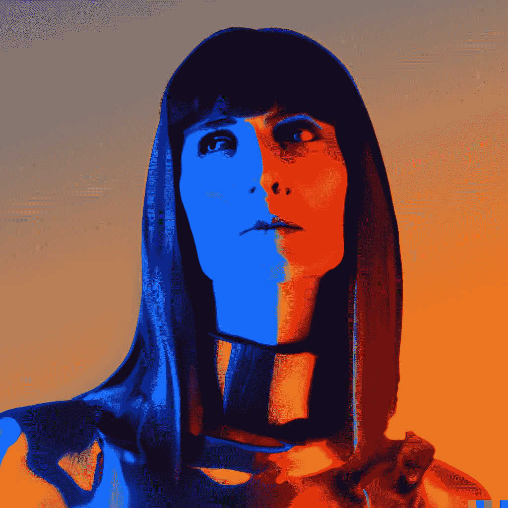

# 我可以用 AI 创作艺术吗？

> 原文：<https://medium.com/mlearning-ai/can-i-use-ai-to-create-art-1a93f91fe4fe?source=collection_archive---------6----------------------->

## [你应该知道的新人工智能艺术发生器](https://mlearning.substack.com/p/new-ai-art-generators-you-should?r=z7zu8&s=w&utm_campaign=post&utm_medium=web)

## 生成艺术

[August 2022 the list of tools](http://August 2022)

是啊！当然可以，但必须先回答更重要的问题。**你想用你的人工智能艺术实现什么？**

[**机器学习**](https://mlearning.substack.com) 的新进展每天都在进行，为用户提供了令人兴奋的机会来试验前沿的 AI 艺术工具。