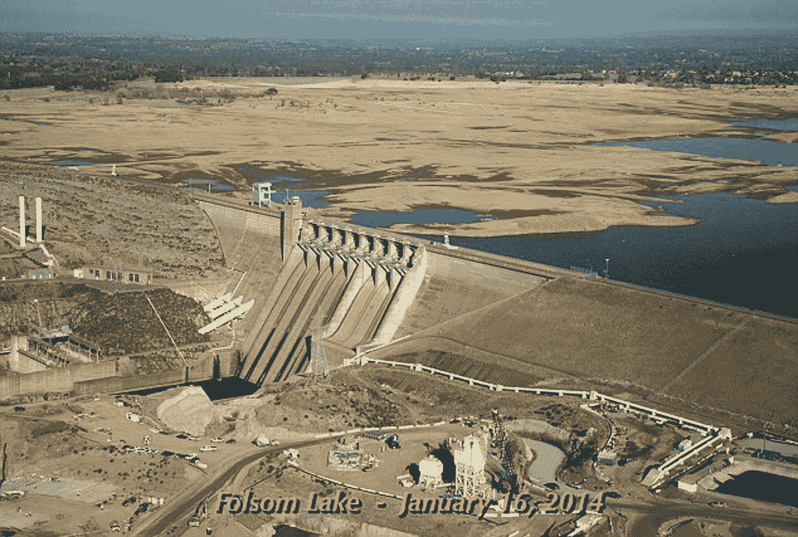
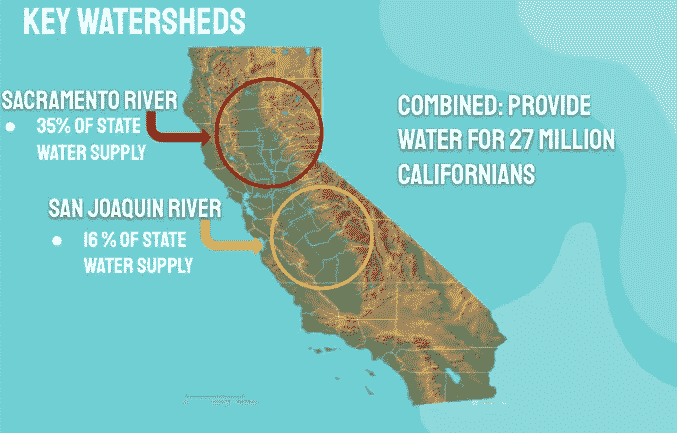
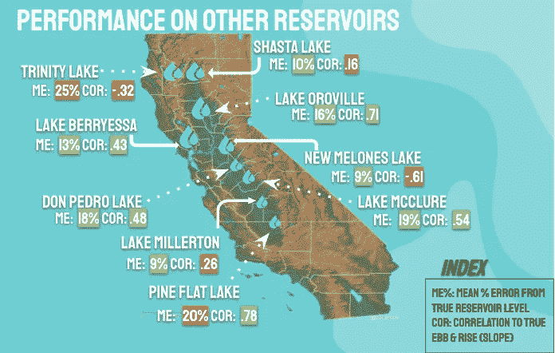

# 机器学习能否用于长期水库水位预测？

> 原文：<https://medium.com/mlearning-ai/can-machine-learning-be-used-in-long-term-reservoir-level-prediction-e088d27e370b?source=collection_archive---------8----------------------->

我在加州主要水库的时间序列预测的顶点项目为水政策制定者展示了潜在的机会。

The reservoir I grew up by, Folsom Lake, has faced major instability in our era of Climate Crisis.

自从我展示我的顶点作品并从熨斗学校的全日制数据科学沉浸式项目毕业以来，已经过去了一个多月。我为我的顶点感到骄傲，在这过程中我学到了很多。为了查看完整的笔记本，我把它链接到了我的 GitHub。

我在加利福尼亚的一个重要水库福尔松湖旁长大，深知保护水资源的重要性。随着我们的气候变得不稳定，加州面临着越来越严重的干旱和不稳定的降雨。管理我们的水资源是加州经济和生态系统生存的关键。(尽管强调水库是如何讽刺性地损害长期水资源可用性是很重要的。查看[最新研究](https://www.sciencedaily.com/releases/2018/11/181113141804.htm#:~:text=Their%20paper%20shows%20that%20increasing,%2C%20paradoxically%2C%20worsen%20water%20shortage.&text=The%20reservoir%20effect%20describes%20cases,by%20drought%20and%20water%20shortage.)和[北加州土著 Klamath 部落](https://e360.yale.edu/features/on-the-klamath-dam-removal-may-come-too-late-to-save-the-salmon)目前正在努力拆除一个主要大坝以恢复他们的河流和土地)

***我的顶点想法***

我对过去机器学习在水位上的实现进行了一些研究，发现机器学习在预测和预防山洪暴发导致的大坝崩溃方面很常见(如[2017 年奥罗维尔大坝崩溃](https://damfailures.org/case-study/oroville-dam-california-2017/))，但发现缺乏长期的机器学习研究。在我的顶点项目中，我试图提前一年模拟整个加州的水库水位。我这个项目的目标是看看机器学习是否能适应水库的季节性和潮起潮落。我还想使用像降水量和温度这样的外生变量来观察它们的影响。

使用时间序列和季节性自回归移动平均模型(SARIMA ),我能够将模型拟合到福尔松湖，准确率超过 90%。我将这个模型扩展到加利福尼亚的其他水库，得到了不同水库的混合结果。由此，我得出结论，人类对水库出流的操作对水库蓄水有很大的影响。在未来，我想扩展到模拟流入，因为它似乎有更明显的季节性。

***数据***

By capturing snowpack and rainfall data for each watershed, I was able to group the reservoirs by watershed in my modeling.

我使用了美国开垦局开垦信息共享环境(RISE)网站上的水库水位数据。我还试图使用每个湖泊的蒸发和降水数据，也可以从网站上下载。我还从位于加州数据交换中心网站上的北塞拉和南塞拉水资源部获取了降水数据。有了这些数据，我建立了一个时间序列，从 1990 年到 2020 年，包含外生变量和一个内生变量，水库水位。关于水数据的一个重要注意事项是，水年是从 10 月到 9 月。请参阅末尾的数据源链接。

***造型***

使用 pmdarima、statsmodels 和 sk-learn 库，我在福尔松湖数据上测试了各种基于时间序列的机器学习模型。我首先运行了一个季节性自回归模型，没有使用任何外生变量。网格搜索最佳参数后，拟合模型对试验 2021 水年的平均水位达到 91%的精度，对潮起潮落达到 92%的匹配。萨里玛模型最终成为我在福尔松湖的最终模型。

我尝试在 SARIMA 模型中实现外生变量，即 SARIMAX 模型(X 代表外生变量)，但网格搜索被证明计算量太大。缺少提供这种能力的公共库——我必须创建自己的类和方法。(补充说明——如果有人知道带有外生变量优化的时间序列库，请告诉我！)

我将我的模型扩展到萨克拉门托和圣华金流域的其他主要水库，并展示了平均水位和潮起潮落与实际相比的情况，如下所示。对于他们中的每一个，我使用了单独的网格搜索 SARIMA 参数。

***结论&教训***

对于大多数其他水库，分数低于福尔松湖。这可能与水政策制定者每天决定的流出量和年降雨量的变化有关。总之，我认为时间序列模型非常有用；然而，考虑到流出政策随时间的变化，模拟流入可能比水位更准确。

这也是我的第一个主要的个人项目，不是先有一个数据集然后再问问题，而是我问问题*然后*找到必要的数据来回答它们。我了解到需要正确的数据和正确地提出问题的挑战。因为我的问题变了，所以我不得不多次回去重新查询 API 数据，所以在未来我学到了获取广泛数据集的重要性，记住你的目标可能会改变，并在笔记本上解析它。

特别是，随着项目的推进，我也意识到水库水位对人为决策的依赖性。在未来，我试图建立流入模型。我还试图纳入长期的水数据，如今年是否是厄尔尼诺年，这是该州降雨量的一个关键预测指标。我也很好奇模拟短期水位变化对风暴反应的准确性，就像我最近评论的一篇论文一样。全年建模虽然擅长预测水库的季节性涨跌，但却难以捕捉实际水位。

总而言之，这个项目提出了更多关于机器学习如何被水政策制定者使用的问题。

***数据来源***

加州数据交换中心—[http://cdec4gov.water.ca.gov/dynamicapp/QueryWY](http://cdec4gov.water.ca.gov/dynamicapp/QueryWY)

美国开垦局—[https://data.usbr.gov/catalog/2304](https://data.usbr.gov/catalog/2304)

 [## Mlearning.ai 提交建议

### 如何成为 Mlearning.ai 上的作家

medium.com](/mlearning-ai/mlearning-ai-submission-suggestions-b51e2b130bfb) 

[**成为作家**](/mlearning-ai/mlearning-ai-submission-suggestions-b51e2b130bfb)