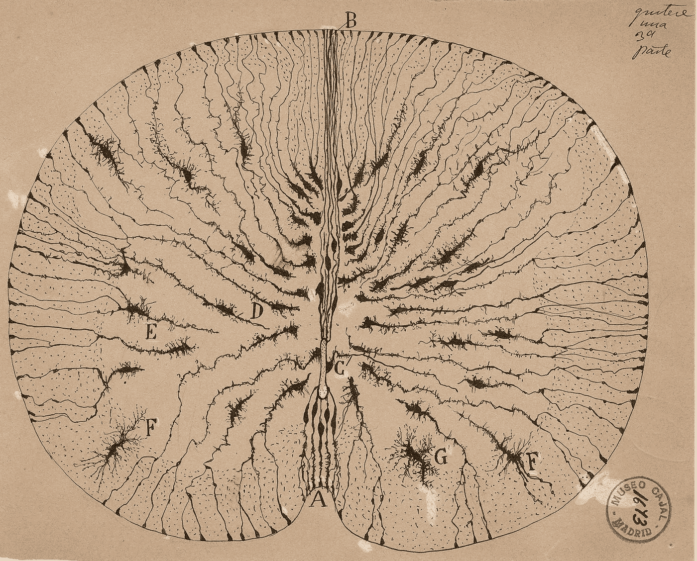
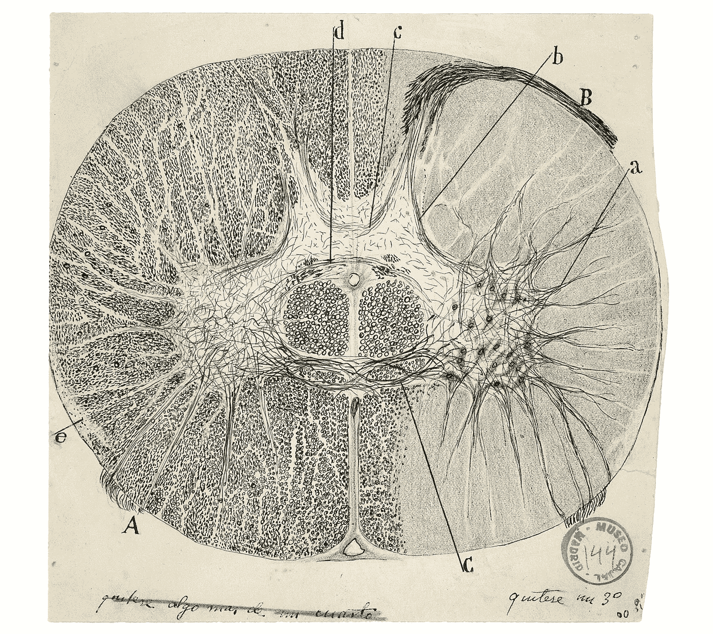

# 原因能成为原因吗？

> 原文：<https://medium.com/mlearning-ai/can-reasons-be-causes-4a2464b71d0e?source=collection_archive---------1----------------------->

*心理内容如何因果地解释人类行为的子集*

Cajal Sketch of Brain Circuitry

在这篇简短的摘要中，我将证明下面的主张:**我们思想的*内容*，无论是在反思中形成，在与他人的对话中，还是在写作中编码，都是因果有效的。**

这远不是一个显而易见的立场。事实上，它受到哲学家和科学家的激烈争论，这表现在无数的哲学立场中，如现象论、同一性理论、行为主义等，以及计算机科学和人工智能研究中的一些观点，其中句法操作被认为是思维的充分类比。

# 认知辩护

在西方传统中，为一个人的立场、信仰、道德原则或其他规范性主张提供理由，就等于为它们提供理性支持。理由是理性的标志。

理性在明确陈述的范围内起作用。这是通过论证进行的哲学传统的一部分。论证可以是口头的，也可以是书面的，但是对理由和结论之间的联系施加了约束，理由和结论是它们所支持的陈述。

因此，给出理由是一件更加微妙和复杂的事情，而不仅仅是通过求助于其他信念、事实、感知报告等来支持你的信念。我们给出的理由必须以正确的方式与我们寻求证明的陈述联系起来。

如果我们接受论证是理性的标志，那么我们也马上接受，或多或少，有两种主要的方式来构建论证，前提和结论之间的联系不是偶然的。我们可以从前提中推导出结论，或者我们可以为结论提供证据支持，使其更有可能成为事实。

第一种方法是真值保留法，即如果一个演绎满足*有效性*的标准，那么结论必然继承*真值*。假设前提为真，那么结论不可能为假；事实上，它不可能是假的——这是有效性的标准。从这个意义上说，有效性传递真理，或者说保存真理。

第二种方法是*扩增*，也就是说超出了现有的证据。当我们*从细节中归纳*或*得出*一般结论时，我们已经超越了细节，得出了一些适用于未来情况的一般原则。因此，归纳和溯因(后者被称为最佳解释的*推理，是前者的一个子集)在这个意义上是扩充的，当(并且*如果——*休谟&波普尔不这样认为)这样的推理是合理的，它为我们提供了预测事态领域未来结果的理性基础。*

论证是理性的标志，这一点并非没有争议。在认识论的哲学分支中，*什么证明了我们的信念是有争议的。不是每个人都同意证明是思考主体的内部精神状态的问题。虽然他们不一定否认论证的作用，但他们认为，至少，它不足以证明思考主体所持有的信念。*

然而，问题*是什么证明了我们的信念*在至少两个，尽管可能更多的意义上模棱两可。它可能意味着:独立于我们的想法，什么是事实上的辩护因素？或者它可能意味着，假设正当性是一个可取的标准，我们应该遵循什么规则来最大限度地为我们的信念提供正当性支持？这两者都寄生在以下的模糊性上:正当性是一种我可以接触到并可以修正的心理状态，还是被一种无意识的执行某种认知角色的物理基质耗尽:记忆、感知、学习、计算等。

这种模棱两可的说法解决了，或者说看起来解决了，各种各样的关于证明的哲学概念，我们把它们分类为*内在主义者*和*外在主义者*。

内在主义者在理性行动者必须制定的一些反思标准内，定位信仰和真理之间的期望联系的轨迹。通过反思标准，我的意思是，代理人据称在确保她或他的信念网的净正当地位方面发挥了有意识的作用。相比之下，外在主义者免除或剥夺了理性主体的这种反思标准或责任。通过一系列可靠的信念产生和传递过程，证明标准代替了主体的有意识的努力。

什么构成了可靠的信念产生和传递过程？根据其定义，认知过程更有可能导致和传递真实的信念。仅举几个例子，感知状态、记忆和有效的推理形式，都是满足这一角色的候选者。

因此，有些人认为外在主义者的立场完全贬低了证明的概念，这就不足为奇了。因为如果称义是信念形成和真理之间的可靠联系，那么在许多情况下，这些似乎是无反思地进行的。为了让这一论点有更深的根基，我们可以说，自然选择的进化过程为我们提供了这些可靠的机制，所以从某种意义上说，我们共同和偶然的信念是有广泛根据的。后一个前提带有实用主义色彩，因为这些过程的状态取决于它们的平均结果。只要结果是保留真理的，它们就有资格成为证明正当的过程。但是这个标准没有要求 rational agent 知道这些过程为什么工作；仅仅是他们这样做似乎就足够了。

也许读者已经很清楚，到目前为止，还没有强有力的证据表明这些不同的标准是相互排斥的。为什么我们的信念要么需要理性(反思)证明的繁重授权，要么对没有自觉努力的过程大规模让步？似乎反思理性化和第三人称传播方法都在确保，从广义上讲，我们的信念不会偏离实际情况，并且这些信念不会在内部相互冲突方面发挥着关键作用。

到目前为止，我刚刚讨论的内容似乎与我在开始时提出的问题(原因是否可以是原因)和我承诺维护的立场完全无关或无关:思考主体的信念内容在世界上起着因果作用，主要是导致该主体行为的子集，总而言之，信念内容具有因果效力。

你会问，为什么要提出这个问题？这看起来是不是微不足道，或者是一种分类错误？我急于申明，这个问题不仅仅是无关紧要的，而是与我们当代相关的一系列智力难题联系在一起，并通过西方智力传统追溯到古希腊时期。

举两个内部主义标准的主要变种来说明:基础主义和内聚主义。在这两个概念中的任何一个中，理性的代理人必须充分利用这两个规范中的任何一个。在基础主义者的意义上，她必须确保她的信仰减少或追溯到某些基本信仰的血统，这些信仰被赋予特殊的正当性地位。这些信念也许是自我证明的。基本信念的常见候选包括由感知经验引起的信念。现在，作为一个理性主体，如果她希望她的非基本信念被证明是正当的，她必须确保无论她获得什么样的信念，这些信念都必须在推理上被还原为那些自我证明的基本信念。

在连贯主义的意义上，她必须确保她的信念形成一个完全连贯的集合，或者一个满足某种可接受的连贯阈值的集合，比如一个最大化推理和解释支持关系的集合。如果不有意识地接近证明的来源，这两个标准似乎都不令人满意。

将这与外部主义者的观点进行对比。广义地说，外在主义者并不要求行为者以我们指定的标准意义证明她的信念。信念可以被证明是正当的，而不是代理人可能给出的理性理由。这并不意味着外部主义者回避像基础或一致性这样的标准。只是不管代理人是否知道这些标准，都可能满足这些标准。例如，想象有某种认知机制，不管代理人是否意识到，它都会剔除相互矛盾的信念。这种认知机制，在没有代理人理由的情况下，将确保代理人的信念是一致的。这改变了证明的意义，从支持有充分理由的信念到像*可靠性*这样的外部标准。如果信念是由可靠的真理传递和保存过程引起的，那么我们就不必担心传统意义上的证明。

然而，外在主义不能是整个画面，或单独足够。正是因为我们反思如何获取知识，我们才能提高获取知识的标准。如果不是这样，我们就会像其他物种一样与自然互动:通过现成的过程，这些过程只能通过遗传和表观遗传来改变或改善。

这种内在主义者和外在主义者对认知证明的解释之间表面上的紧张关系既不是规范性的，也不是描述性的不可解决的。这两种标准都在真理的传播和最大化中发挥作用，有时同时发生，有时一种凌驾于另一种之上。事实上，这两类标准之间的区别在某种程度上仍然是务实的:虽然理性可以让我们看到我们在日常活动中所遵从的认知机制的盲点，即所谓的认知偏差，但如果没有这些在后台运行的很大程度上自动化的过程，理性作为一种对**假设性显性化**的稀有而艰苦的追求是不可能的。

如果你到目前为止还很困惑，我想在这里给出笑点:反思性的辩护标准渗透到文化和制度的辩护模式中。如果不是这样，科学方法论的进化，广泛地将相关证据与一致的理论体系联系起来，将是令人费解的(我对解释现象主义的解释感到绝望)。换句话说，理性(以及作为其子集的经验科学)作为一个集体项目，出现在理性研究规则的编纂中，无论是自然的*经验*，还是参与理论(包括数学)的*内在一致性*。理性调查的规则是文化实践脉络的产物，这种文化实践认可并激励了稳健的反思标准。如果这个故事是真的，那么我们不能将反思标准从它们在更广泛的社会和集体重构中扮演的因果角色中剥离，不管这种影响在更广泛的事物方案中是如何间接和减弱的。无论我们如何讲述精神的构成和特征的物理主义故事，它必须能够适应这种叙事。

# 心理原因

Cajal Sketch of Neurons 1913

尽管有反思性和非反思性的证明标准，我们可以看到这里的对话仅限于信仰。用哲学术语来说，信念是*有意的*状态，它们有一个符合世界的方向。无论我们如何将信念的内容理论化，它们都渴望描绘，广义地说，可能的事态，狭义地说，真实的事态。相反地，*欲望*构成了具有世界-词匹配方向的意向状态。它们是我们希望世界变成什么样子的有意状态，比如满足我们的欲望。

一种理性概念将理性解释为通过伴随的信念对这种偏好结果的工具性追求。如果理性服从于我们偏好的最大化，那么真理最大化的反思美德就获得了工具性的背景。这并不意味着我们的偏好要求我们最大化真相，只是我们想要实现的偏好在某些情况下由相关的准确信息或真相提供服务。另一方面，不是所有的偏好都由真理服务；事实上，必须培育一种微妙的平衡，其中许多伴随的假设实际上是构建出来的，而不仅仅是“描述”出来的。世界上有太多的事实，目标和信念之间的关系不是线性的。此外，这些事实被“固定”的方式是严重欠确定的，因为至少有一部分事实是文化建构，例如，像支撑社会参与模式的宗教教条。然而，主要的观点仍然存在:如果理性是偏好的工具性追求，那么这些偏好会受到信仰的影响，其中许多信仰是由与世界的真实对应来裁决的。

上述讨论的结果是，如果我们试图解释人类的行为，那么我们必须考虑到，人类在自己的头脑中孕育着一个复杂的世界表象，这个表象被语言的表象启示无限放大。信念形成了具有命题内容的心理状态的子集。命题内容十有八九是更基本的心理态度的偶然因素，这种态度形成假设并致力于这些假设。这些假设是如何形成的是一个复杂的问题。很可能我们与相近的物种共享快速做出假设的认知规则。

信念是语言编码的认知假设的一个特殊子集。这并不是说语言是信仰前提。很大一部分信念可能根本不需要语言就能实现。例如，每时每刻的期望范围依赖于更基本的感知(感知广义地解释为包括本体感受、内感受等)、记忆和心理模型的组合。然而，当用语言编码时，信念通过语言的形式给那些非语言的假设以粒度的表达。由于语言表示的模块性，表达这种基本假设的信念可以被微调，以不同的粒度级别表达，并以比非语言表示更灵活的方式进行修改。这部分是因为易错性的范围随着语言的表达能力呈指数增长。此外，语言饱和的信念超越了更基本的非语言假设，因为它们配备了一个公开有意义的本体论承诺矩阵。我所说的本体论承诺指的是我们隐含或明确假设的构成世界的各种实体。信念与其他形式的精神内容相融合，如意象建模，形成一种复杂的内部表征，使代理人能够根据他们获得的偏好思考可能性和追求结果。

我已经为精神内容如何影响行为搭建了舞台。但是在我进一步为心理因果关系辩护之前，让我提出一些警告，把前面的讨论放在当代分析哲学辩论的背景中。

既然我们引用了因果关系的概念，那么首先解开**的因果关系**是什么(它们是事件、实体、事实还是其他什么？)，第二，这种**因果关系**究竟在于什么(即，说一件事*引起*另一件事是什么意思)。毫不奇怪，尽管因果关系是科学的核心，但对这两个问题都没有达成一致。

我认为因果关系是时空事件，也就是说它们是内在的，即它们存在于事件本身之中。此外，在更大的理论主体*内，因果关系相对于*描述层次*而言是个体化的。我所说的描述水平是指我们描述某种现象的成分尺度。我所说的理论体系指的是由证据证实的相关一般原则，这些原则可以用来解释一个特定的现象。*

因果关系的个体化受到观察和特定描述层次的结构特征的限制。例如，在社会尺度上，我们将人和机构个体化为原因，但在生物尺度上，我们将细胞或细胞系统个体化。因此，因果关系必须捕捉*自然界中相对于某些确证描述的有效*节点，并且在这个意义上有些粗粒度(这意味着*概念关节*对应于*自然种类*或独立于思维的现象固有的属性)。粗粒度的归属与细粒度的归属形成对比，细粒度的归属需要个性化到我们的语言假设所允许的程度。那些认为关系像命题一样精细的人，认为关系是事实而不是事件或其他候选类别。由于事实不是时空有序的，这些观点认为因果关系是先验的，而不是内在的，并引用本体论的范畴，如*物体*在内在关系中工作，举个简单的例子，如推推搡搡。

正如我已经指出的，因果关系的粒度受到普通语言感知术语和概念关节的严格组合的限制，这些术语和概念关节是在给定的描述水平上被占主导地位的理论所承认的。这些概念上的节理充其量只是产生经过测试和观察的自然规律或模式的基础结构的代理。

根据这一概念，因果关系是一种与我们进化的认知环境启发式地结合在一起的认知图式，其功能是作为有序事态结构的代理。因此，它跟踪相对于保持不变的背景变量的变化传输。

至于**因果关系**，有三个候选:a)它是*本原*，b)它是*可还原*为更基本的东西，c)它可以是*完全消除*。这些观点中的每一个都有一些看似合理的理由。原始性的理由是，还原的解释并没有完全消除对概念的隐含提及。在旨在将因果关系简化为*过程*或*概率*的还原账户中，因果关系是预设的，因此他们未能正确地分析它。罗素和蒯因提出的排除法认为因果关系是一种狭隘的、尽管有用的模式，但将被科学所取代。消除主义账户的一个问题是，它们将本体论的优先权归于数学方程，而数学方程缺乏对*原因*、*事件*，甚至*对象*的引用。然而，用方程代替现实，或者依赖于只承认数学对象和最原始的物理成分(如力场)的精益本体论模式，可能导致最好避免的概念荒谬。关于还原论，有两个主要的候选人:a)概率和 b)过程帐户。

概率的解释有很多种，其中最突出的是戴维·刘易斯的反事实依赖的概念，但是它们都把因果关系本质上描述为提高概率:原因的发生提高了结果的概率。至于因果关系的终极性质，我将避免对或然性或确定性的解释作出承诺，因为我不认为这两个概念中的任何一个，即使在它们最严格的表述中，就其本身而言是完全适当的。

然而，我将把因果关系过程的各个方面作为最能抓住因果关系概念的理论。虽然许多概率性解释，如反事实依赖，在阐明因果关系的本质方面做了大量的工作，但过程解释似乎在形而上学上最接近于普通语言或科学中关系的调用旨在捕捉的内容。简而言之，过程论认为因果过程是以时空*连续*方式传递*标记*的物理过程。因果相互作用“涉及两个因果过程之间的时空交叉，这改变了两者的结构。”这种解释展示了剔除像投射阴影这样的伪过程的优点。

那么问题就变成了，因果关系的过程解释与心理因果关系相容吗？在何种意义上，信念和信念的原因可以说是构成了以时空连续的方式传递标记的物理过程？你可能会认为答案在于人脑中的神经活动。信念是通过大规模并行和锁频网络传播的电化学信号在物理上实现的。那么是什么导致了我们的行为:神经模式还是我们信仰的内容？信念的内容*仅仅是*神经模式吗？说他们是。在神经模式中，一个信念和另一个信念的编码是如何不同的？尽管无法具体说明神经模式如何与精神内容相关联，但这里发生了更奇怪的事情。我们不能通过观察神经模式来观察或推断信念，除非我们有足够的必要知识。不知何故，信念只能从内部获得，即使我们可能从观察到的行为中把它们归因于他人。不管与意向状态的关联是什么，重要的是内容对于主体来说是反射性的。这个特征混淆了因果图，因为它允许修改的循环，不像计算系统中实例化的循环:计算机算法可以通过反馈修改自己，但还不能像我们通过有意识的思维那样全局地表示自己。

过程解释的主要问题是，尚不清楚它认为是聚合的那种因果过程是如何扩展成宏观过程或模式的，而宏观过程或模式更普遍地是描述、解释和理解复杂现象所需要的。想想像布朗运动或经济这样的现象。对这些过程的解释通常依赖于覆盖律包容:也就是说，它们被同化到一个更广泛的，或者是法理的(类似法律的)或者是统计的一般模式中来解释，这些模式并不对原因作出任何初步的承诺。

在我看来，解决方案必须遵循以下路线:在宏观观察水平甚至第一人称经验水平上理解的因果关系，应该部分地基于我们迄今发现的基本相互作用(即，强力、电弱力和引力)。这些基本的相互作用，凭借非常具体的物理属性，如范围、能级等，产生了结构稳定性和基线规则性，这在我们的观察范围内是可以推断的。

然而，虽然求助于基本原则有助于解释我们所观察到的结构的各个方面，但它不足以解释更高层次的组织特征。例如，我们在种系发生树中解释物种形成时，并不是求助于基本性。例如，为了解释脊椎动物的进化，需要更多关于环境特征的偶然信息。此外，基本的相互作用在宏观尺度上与广泛的因果行为是相容的。换句话说，在更高层次的组织中，由于可组合的(可能联合的)和/或偶然的环境因素，出现了因果层。

这一观点取决于对涌现现象的正确理解，以及新的因果力量在更高层次的组织中出现的说法是否可以令人信服地提出。

然而，对于我们的论证来说，获得因果关系概念的完全精确并不是完全必要的，因为考虑到物理学本体论的发展以及所谓的基本现象如何扩大到更高的水平，因果关系的概念最终需要修订。

那么，为什么还要费心解释因果关系的概念呢？因为这篇文章的目的是在一个与基础科学和特殊科学相一致的自然主义解释中吸收理性和精神内容。这意味着我们应该能够讲述一个故事，这个故事详细说明了一种机制，这种机制与现有的证据一致，即思想的内容如何对世界产生影响。我将机制理解为一种因果解释，它专注于*相关的*过程，同时不调用与确证理论和可用证据不一致的过程。换句话说，原因不仅仅是以*民间心理*的方式起作用，这通常可以通过科学对本体论的提炼来解释(即把民间类别还原为相关的物理相关物)，而是在客观因果关系中的必然因素，而不会侵蚀它们的本体论地位。

为什么要走这条路来证明原因的因果功效，而不是追求某种还原的途径呢？因为我们缺乏一个在较低层次的描述上的解释，这种解释具有心理属性(*心理语言—* 思维的假设语言*，*其中之一)产生的预测能力。这并不是说这样的解释是不可能的，但这是可以想象的，而且根据证据，物理世界可能允许实例化*意向*状态的配置。证明信念和原因的因果功效的项目范围需要将意向性自然化，也就是说，将它归入物理主义的图景，我们归入自然的其余部分。

如果我们审视人类社会进化的证据，我们会发现，如果不把思想和意识形态确定为因果因素，就不可能解释它们的结构。意识形态可能完全是表面现象，意识形态之外的因素完全解释了文明的轨迹。但后者将是非同寻常的主张，需要非同寻常的证据，而不是前者，后者在许多方面都得到了大量证实。如果是后者，那么基督教社会产生描绘圣经故事的壁画，儒家伦理的采纳导致了中华帝国的稳定和长久，基督教、犹太教和伊斯兰教中规定的禁令导致了遵守这些禁令的行为，这将是偶然的。相反，似乎更有可能的是，我们在信仰体系中编纂世界的方式塑造了个人和集体的行为。虽然信仰体系以复杂的方式与基因遗传、机会、地理、历史等其他因素相互作用，但完全否认它们的因果影响就相当于对人类的文化进化进行了令人费解的大规模渲染。哲学上具有挑战性的任务仍然是证明信念的因果力量在物理主义的自然观中是如何可能的。

最近，这个难题被卡伦·贝内特表述为**排斥论点**。

Bennett 简洁地抓住了支持或反对精神状态的因果功效的哲学论点之间的张力，他列出了五个似乎共同不相容的论点:

**(a)独特性:**精神属性(或许还有事件)与物理属性(或事件)截然不同。

**(b)完备性:**每一个物理现象都有充分的物理原因。

**(c)功效:**精神事件有时会引发物质事件，有时则是凭借其精神属性。

**(d)非超定:**精神原因的影响不是系统地超定的；它们与行刑队受害者的死亡不可同日而语。

**(e)排除:**除非超定，否则任何效果都没有一个以上的充分原因。

贝内特否认(e)，主张(a)-(d)的联合真理。通过否认一个以上充分原因的可获得性意味着过度决定，贝内特保留了精神和物理的区别，避免了过度决定，并维护了精神的因果功效，所有这些都没有违反完整性论题:对物理主义的承诺。

这些论点中的每一个的可理解性，即使是在我们对最好的科学理论的承诺下，也远远没有解决。更确切地说，如果没有一些关于因果关系和物理公式的背景协议，这些论文是相当模糊的。例如，(b)如果没有一个强有力的物理主义定义，完整性是没有意义的，而如果有一个物理主义定义，它是完全空洞的，除非参照非物理原因。我手头没有关于*非物理原因*的连贯概念，并且我对任何这样的概念的连贯意义感到绝望。我自己对物理的定义是任何与我们最好的物理理论相一致的东西，即任何给定物理定律的可允许的配置，假设这些定律与系统观察保持一致。(d)另一方面，过度确定是一个概念错误。自然界中没有真正的超定案例。超定的幻觉产生于自然语言的一般术语，这反过来使我们能够根据类型来概念化事件。自然界没有类型，只有细节。过度决定的每一个表象都可以归结为一个消除这种错觉的描述:每一个微小的差异都对应着一个效果的差异，不管这是否会破坏整体模式。这是附带声明的一个版本。最后(e)表示两个因果关系的*酸度*(数)。然而，在我看来，因果关系具有酸性的想法是我们概念化的产物，而不是自然的真正特征。所以说没有一个结果有一个以上的充分原因是完全荒谬的。影响和原因是旨在隔离自然界中某种稳定关系的简化；但是，在我看来，我们能够以不遗漏任何东西的方式这样做似乎是不合理的。

因此，在我看来，这些说法都是错误的。在这篇短文中，我唯一的愿望是证明我们的思想是有内容的，这些内容在解释我们的行为中起着因果作用。在某种意义上，这似乎是显而易见的；看似不明显的是背后的因果故事。在将意向性分离为赋予这种能力的特征时，我们必须具体说明意向性状态是如何以不同于软件相对于硬件的方式与它们的神经基底相关联的。计算机的因果能力是完全可以解释的，而思维的因果能力还不能解释。

当然，简化论者出现了，他说，如果精神内容与某种物质基础是相同的，那么我们也可能是吝啬的，只把因果功效归因于那种物质基础。这是(a)，贝内特的论点，精神和物质的区别，可以调用。但是，即使我们拒绝区分，我认为，即使精神内容与某些象征性的物理状态相同(更确切地说，内容是由网络作为一个整体实现的)，它们的有效性在于它们可以被代理*内部*访问。因此，即使我们否认心理和生理特性的不同，功效的中心应该是实现*反思意识*的物理网络。这就是人类意向性的因果功效。我要证明的那种精神因果关系应该是反思意识的副产品。

# 原因和意识

Cajal Sketch of Dissected Brain

分析哲学中的物理主义命令产生了一些关于心灵本质的奇怪观点。一些种类的*意向性理论*试图解释一个生命体如何在没有意识的情况下实现精神表征。就好像意识是在功能和因果机制被指定之后，你贴在事实上的东西，有点像立宪主义和负责任的政府的普选。虽然意识作为一个概念很可能是可进一步分析的(可分解成更基本的部分——这也是有争议的——参见泛灵论的替代观点),但它模糊的指称指向一个或一组属性，这些属性构成了任何表象的基础。我认为意识是*连续的*，具有生命的涌现属性，从身体的感知开始(涌现的确切含义是有争议的，所以我在这里只使用它的口语意义)。活着只不过是一系列正在进行的物理过程，但它是这些过程的总和，这些过程将感知实例化为及时维持有机体的特征。

我们还不知道意识是一种超越临界阈值的属性，还是一种可以分级的属性。然而，既然我们有充分的理由相信它的一些品质可以在更简单的有机体中找到，那么我们所熟知的作为意识经验的总体是许多运动部分的集合就不是不合理的。然而，我们还不知道，神经系统可能似乎缺乏第一人称体验的简单生物体是如何被嫁接到像我们这样更复杂的生物体上的。

我所捍卫的精神因果需要意识。我们要清楚的是:虽然哲学家们对如何分析意识存在分歧，但许多人实际上同意我们所称的*思想*或命题内容并不*依赖* *于*，也不*伴随着* / *浸透了情感或第一人称体验的*。尽管这一立场如今已不那么受欢迎，但在某些角落，依赖分离仍是正统观念。动机主要如下:说思想不需要/依赖于第一人称的经验能够使它们同化到一个物理主义的因果图中，而不那么顽固。与此同时，我们的第三人称描述遗漏了一些东西，即受到解释空白的困扰，这一想法为物理主义自然主义创造了一个似乎难以解决的问题。

如果事情有这么简单就好了。我通过断言现象意识(包括伴随*影响*的所有复杂性)与认知本身是连续的来反驳这种叙述。虽然这一观点得到了一些阵营的支持，但它也受到以下问题的困扰:绝大多数信息处理都是无意识的，不是弗洛伊德所说的被压抑，而是意识思维无法触及的。那么，我们是否想说第一人称体验是认知的基础或延续，因为它可能在生活的大部分时间里都没有实例化？这就是*层次*假设可以用来缓解第三人称描述和第一人称体验的似乎无法解释和异常的现象之间的明显紧张。层次假说，在这里没有进一步的阐述，试图将*感觉*解释为简单地与任何有机体的环境反应同延。也就是说，环境扰动作为电化学信号通过神经系统传播，在身体水平上产生整体反应:这种整体反应，这是事情变得模糊的地方，*必须充分整合才能在内部体验*。

不仅有意识的意识(作为情感的延伸)在认知上与思想不可分离，而且争论在于后者在本体论上依赖于前者:我们可以拥有我们所拥有的那种思想，因为有辅助的有意识的经验；后者是思想展开的阶段。如果这是真的，那么现象意识就不是一些额外的、因果惰性的成分，可以被挤压来赋予“它像什么”或定性经验给其余的认知过程。相反，经验和第一人称定性状态构成了我们之前讨论的那种反思标准的可能性条件。

还有一个悬而未决的争论:现象意识作为意向性的辅助条件的假设与信念和其他意向状态是因果有效的前提相关吗？如果我们可以在功能上复制意向性的因果力量，而不需要第一人称意识或现象意识，这对后者的作用意味着什么？像人工神经网络那样通过前向和反向传播等功能模拟反馈的计算系统是否能够充分模拟人类的信息处理，从而能够实例化他们的行为输出频谱？如果是这样，人工神经网络的内部状态可以被认为是人类信念网络的类似物，然后约束/调节/定义它们的搜索空间及其在其中的优先进化。假设，具有与人类相同输出能力的人工神经网络也必须实例化相同的因果能力:两者之间必须保持功能对等。这个问题还有待解决。