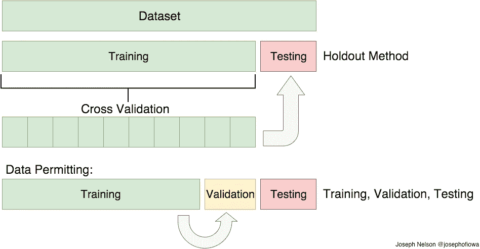
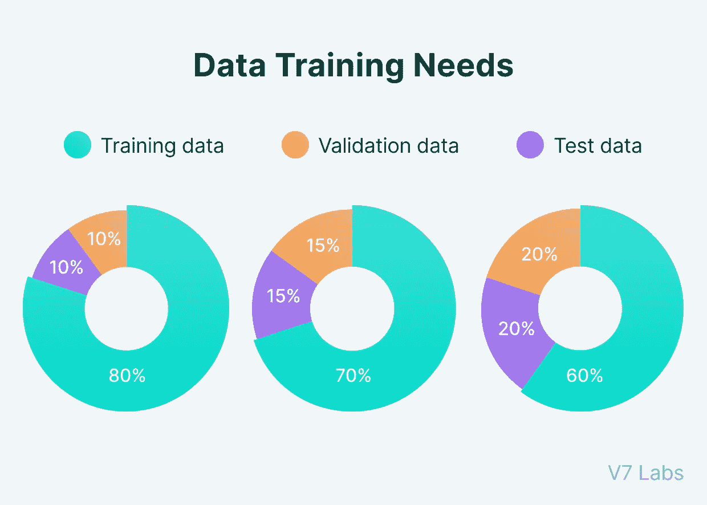
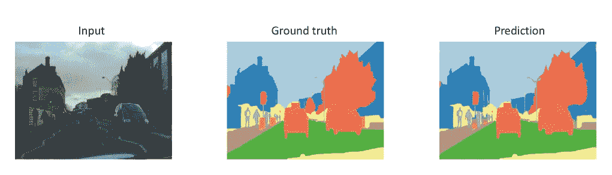
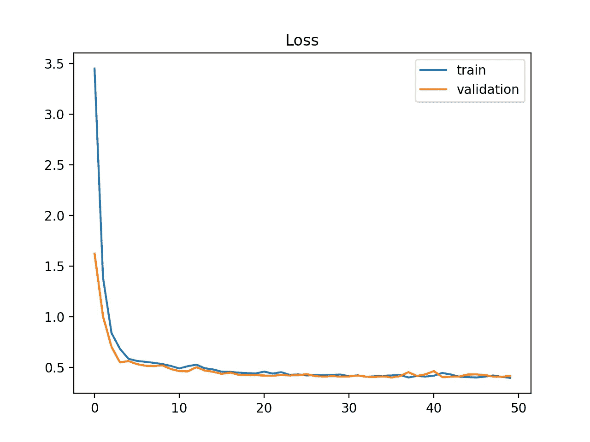
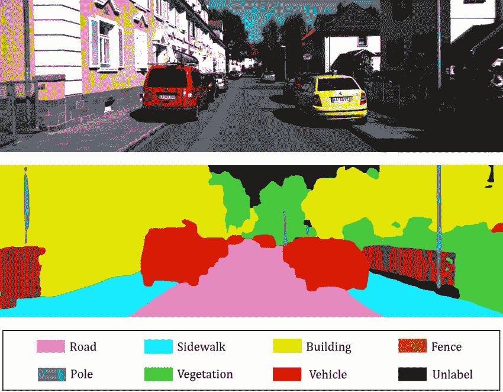

# 数据分割方法能提高你的模型性能吗？

> 原文：<https://medium.com/mlearning-ai/can-the-data-split-method-improve-your-model-performance-b2571691c61d?source=collection_archive---------3----------------------->

# 我很久以来的第一个科技故事…

大家好，在这篇文章中，我想谈论一个有趣而简单的话题，这是我正在从事的一个项目中的一个隐藏问题，我们所有人都忽略了这一事实，我们花了几个月的时间尝试模型和清理数据，相信我们的数据加载和拆分方法，但我们没有得到任何改进，那是什么呢？？

让我们从陈述一些规则开始

1.  我不能陈述关于项目范围的许多细节，所以我将谈论可能适合其他类似问题的主线
2.  我想 def 不会谈论火车测试分流 obv-

*   假设读者对 ML 模型有足够的了解并测试它们-

the process of splitting the data

# 为什么我们需要分割我们的数据？

通常，在构建 ML 模型进行实验时，我们会尝试几种模型架构或学习方法，因此将数据集分成训练/测试/验证部分有助于我们:

1.  在众多型号中选择最佳型号。
2.  选择最佳的模型参数或设置。
3.  拥有一个维持测试集有助于我们通过显示模型看不见的数据来测量真实的性能，也就是准确性，而不仅仅是通过验证准确性来判断——因为它可能会因为数据泄漏而具有欺骗性

# 我们如何分割数据？

有许多已知的方法，最常见的方法是选择 70%用于训练，剩下的 30%用于验证和测试，您可以使用任何工具来这样做 scikit learn、numpy、pandas，或者如果您的数据集包含几个文件夹/文件，如果它们不是很多，您可以手动完成。

different split ratios

# 我的问题

在我的例子中，我的训练集由大约 250GB 的原始卫星图像加上 25 个标签文件组成，数据经过几个处理步骤，直到到达最后一步，大约有 25 个大的 CSV 文件。

这是一个:

**多类像素分类**分割也很重要的问题。

**我们使用的旧方法**是我们将 25 个 CSV 文件分割如下:13 个完整文件用于训练，6 个用于测试，6 个用于验证。

我们不断训练不同的模型，即使在执行了所有应该改善结果的技术之后，也总是得到相同的坏结果，无论是增强、上采样、下采样、数据清理(手动/自动)，还是将模型更改为更简单/复杂的模型，更改优化器、损失函数和**等一切。**

然而同样的坏结果只有不到 1%的改善。

**然后一个偶然的机会，**我正在对一小组数据做实验，所以我使用了 sklearn 的 train_test_split 方法，**令人惊讶的是，所有类别的准确率都达到了+90%!！！！**

a similar example to my problem — image segmentation/pixel classification

# **思维过程**

作为一个一直在那个项目中为所有类获得 80%的准确率而奋斗的人，我感到震惊！然后我做了 3 件事，教会了我关于问题范围的不同事情。

1-使用旧方法重新训练所有模型以比较结果。

2-将所有数据合并成一个巨大的 CSV 文件，将其随机化，并分成训练/测试/验证。

3-将 25 个文件中的每个文件分成培训/测试/验证，结果是 25 个文件用于培训，25 个用于测试，25 个用于验证。

# 结果和行动/实验

**方法#1:
虽然有些人认为这是最合理的方法，但模型学习曲线和绩效都没有反映出这一点**

1.  学习过程非常不稳定，模型从未达到饱和点，曲线从未平滑或稳定。
2.  数字/结果总是非常非常低。
3.  即使在它之前看到的数据(使用训练数据作为输入)上，生产中的性能也很糟糕

model instability

**方法#2:
没有#1 那么糟糕，事实上，模特的表现令人惊讶**

1.  学习曲线非常稳定。
2.  所有类别的准确率都非常高，达到 90%以上。

**但是** 巨大的问题是随机化像素使它失去了正确分割图像的能力，它在单个像素上表现良好，但是相邻的相似像素没有被正确定位

同样在方法#1 和#2 **中，模型没有看到每个时期的所有类。**

**方法#3
我称之为成功，它在所有方面都表现得令人惊讶，模型能够正确地定位片段，顺利地学习，并产生良好的结果，这是一个巨大的惊喜。**

stable curve

example stable output

# 外卖

我从所有这些实验中学到的最大教训是，永远不要低估我们在构建每个 ML 模型时所做的非常简单、重复的任务的力量，有时最小的事情也很重要。

另一件事是尝试，永远不要怀疑我的猜测，我曾经猜测这可能是我们的问题，有人说没有办法，但我尝试了，它的工作。

在 ML/DL 模型上工作有时会非常乏味和烦人，当你认为你的问题是架构时，它可能只是数据、软件错误或逻辑错误，而在其他时候，你可能认为它是数据，结果是模型或另一个错误，还没有明确的规则，这可能使事情有点烦人，但它也使它们有趣和有趣，每天打开一个区域来学习新的东西。

 [## Mlearning.ai 提交建议

### 如何成为 Mlearning.ai 上的作家

medium.com](/mlearning-ai/mlearning-ai-submission-suggestions-b51e2b130bfb)