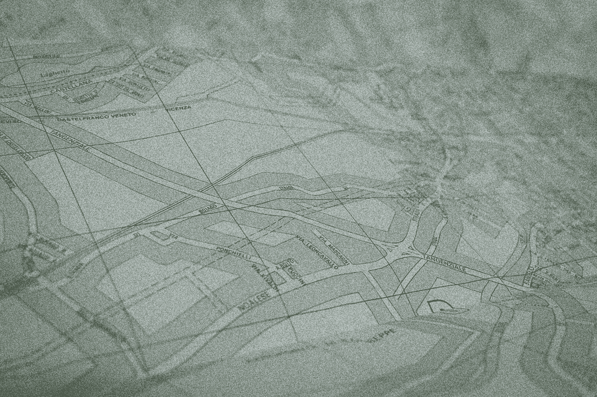

# 变形金刚能比人类算法更好地解决这个 90 年的经典计算机科学问题吗？

> 原文：<https://medium.com/mlearning-ai/can-transformers-solve-this-90-year-old-classic-computer-science-problem-better-than-human-8ef78bb2e9d8?source=collection_archive---------0----------------------->

[Source](https://pixabay.com/photos/tourist-map-italy-travel-tourism-1858958/)

## 深度学习还不能打败人类的解决方案——目前还不能

旅行商问题在 1930 年被公式化，是一个经典的计算机科学最优化问题。这是一个简单的问题:

> 给定一个城市列表和…