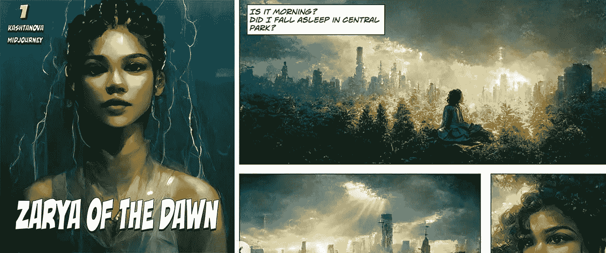

# 可以给 AI 艺术版权吗？这位艺术家刚刚做到了。

> 原文：<https://medium.com/mlearning-ai/can-you-copyright-ai-art-this-artist-just-did-ae0a5cba30ab?source=collection_archive---------1----------------------->

Zarya of the Dawn, an AI assisted Graphic Novel by Kris Kashtanova

人工智能作品的版权法问题非常模糊不清。以至于像 Getty Images 这样的图像媒体公司禁止在他们的平台上使用人工智能艺术。

美国版权局继续拒绝人工智能艺术作品的版权请求，声称人工智能艺术“*缺乏支持版权主张所需的人类作者身份。*