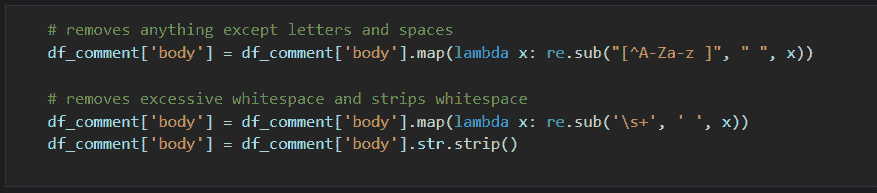
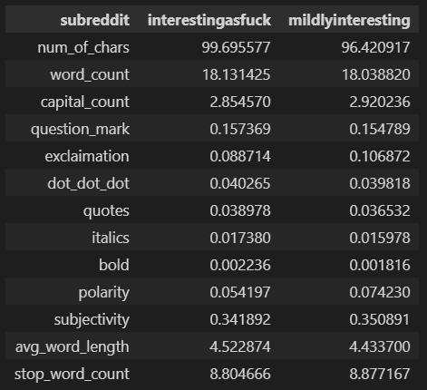
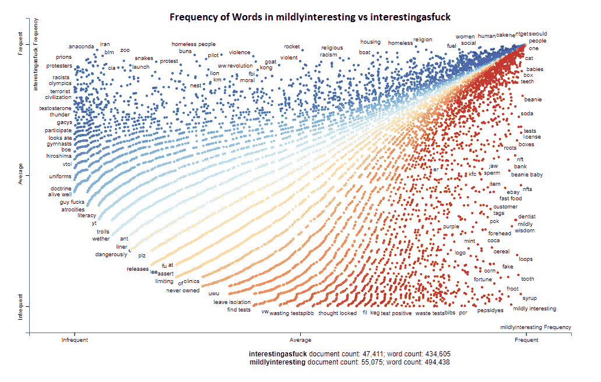
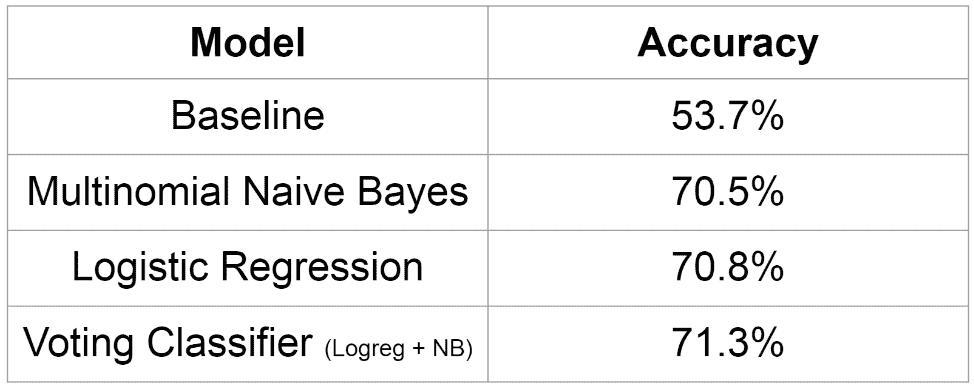
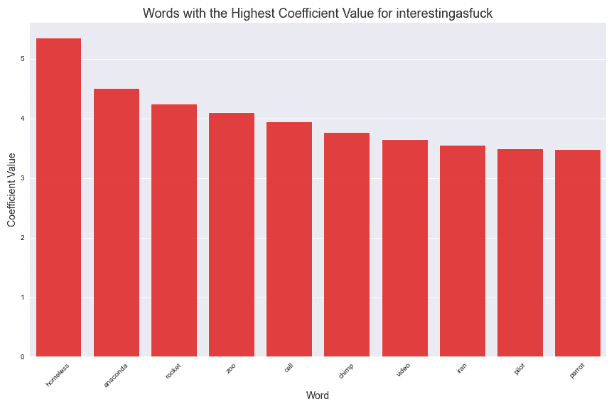
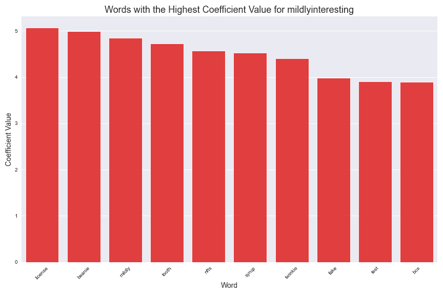

# 你能预测一个评论来自哪个子编辑吗？

> 原文：<https://medium.com/mlearning-ai/can-you-predict-what-subreddit-a-comment-comes-from-97484acea41b?source=collection_archive---------4----------------------->

作为 General Assembly 的一名沉浸式数据科学学生，我已经能够从事各种项目。今天，我想带你们看一下我完成的第三个项目。这个项目的主要焦点是 web API 和自然语言处理(NLP)。

在这个项目中，我的目标是尝试并预测一个评论来自哪个子编辑。我首先使用 [Pushshift API](https://github.com/pushshift/api) 从两个相似的子编辑中收集评论。我必须彻底清理数据，使其可用于探索性数据分析和建模。我设计了 13 个可以在我创建的模型中使用的功能。我测试了六个不同的模型，选定了其中两个用于投票组合。在预测评论来自哪个子编辑时，我的最佳模型比基线高 17.6 个百分点。

我在这个项目中面临的第一个挑战是收集数据。使用 Pushshift Reddit API，您可以选择要收集哪个子编辑的数据以及需要什么样的信息。您可以更改的一个主要参数是，您是希望获得 subreddit 帖子上的数据还是帖子的评论。您也可以选择想要多少个条目。每个请求的最大金额是 100，这是不够的。所以，我必须提出多个请求。留给我许多问题。我应该收集多少数据？越多越好，但是如果我收集了一个小时的数据，遇到了错误，并且丢失了所有东西，那该怎么办呢？如果我清理了数据，不得不删除大部分条目，该怎么办？如果我在 EDA 或建模过程中发现我想要更多的数据怎么办？

为了解决这些可能的问题，我创建了一个函数来收集数据。我可以输入请求的周期数，并将每个周期保存到一个 csv 文件中。如果我稍后回来并想要更多，我的函数将能够识别我的数据中最后一篇文章的时间，并从它停止的地方继续。

首先，我必须设置 API 的 url，并选择我想要收集数据的子编辑。

```
# Pushshift Reddit API and the two subreddits to collect data forurl = 'https://api.pushshift.io/reddit/search/'subreddits = ['interestingasfuck', 'mildlyinteresting']
```

我在 stackoverflow.com 上发现了这个很棒的助手功能，可以给 csv 文件编写字典。这将有助于将每个帖子添加到 csv 中。

```
# https://stackoverflow.com/questions/41420742/python-repeatedly-writing-to-a-csv-file-from-a-dictionary-with-header-equal-to# This function appends a dictionary to a csv file. If there are no headers in the file, they are added. If not, just the rows (values of the keys) will be addeddef dict_to_csv(post_dict, file): with open(f'../data/{file}.csv', 'a', encoding='utf-8') as f: w = csv.DictWriter(f, post_dict.keys()) if f.tell() == 0: w.writeheader() w.writerow(post_dict) else: w.writerow(post_dict)
```

接下来，我构建的函数。它接受一个子编辑列表、要收集的数据类型(提交或评论)以及周期数。我能够不断地向 csv 文件中写入数据，因此万一出现问题，收集数据的进度不会丢失。我还在 csv 文件中加入了最后一篇文章的时间。如果我想收集更多的数据，这将允许我稍后返回并从我离开的地方继续。

接下来我要做的就是用我想要的参数调用这个函数。

```
pushshift_query(subreddits, 'comment', 100)
```

一旦我有了要处理的数据，下一个挑战就是清理它。因为我选择了评论，所以我有很多工作要做。互联网上的用户使用大量的俚语、短语、缩写词、多余的标点符号、符号、拼写错误的单词以及一大堆其他东西。

我还必须删除已删除的评论、机器人、URL、扩展缩写、去掉多余的空白和许多其他东西，以使文本为模型做好准备。

除了打扫卫生，我还做了一些特色工程。我记录了一些事情，比如:

*   字符数
*   字数
*   大写字母的数量
*   有问号吗？
*   有感叹号吗？
*   有拖尾句吗…
*   引号中有文字吗？
*   有斜体的文字吗？
*   是否有粗体文本？
*   评论的极性是什么
*   评论的主观性是什么？
*   平均单词长度
*   停用词的数量

因此，我在删除大量符号、大写字母变为小写字母以及其他操作之前，记录了所有这些内容，以便为模型准备好数据。

我做的最后一个清理步骤是使用正则表达式删除任何不是字母或空白字符的内容。第一行代码产生了一些额外的空白，所以我压缩了所有额外的空白，然后做了一个 final。剥()以清理末端。



在我的第一个模型和一些简单的 EDA 中，我很早就发现了一件事，那就是我的工程特性并不能帮助我的模型预测一个注释来自哪个子编辑。这是一个表格，列出了我试图比较的两个子条目的所有工程特征的平均值。



所以，我很不幸地放弃了我的工程特征。我现在的主要注意力在单词上。

这是我用散点图制作的一个很棒的图表。这显示了单词在两个子条目中的使用频率。在 X 轴上是在 mildlyinteresting 子编辑中单词的频率。Y 轴是有趣的子编辑中单词的频率。首先映入我眼帘的是右上角的集群。这表明有很多词频繁出现在两个子条目中。这看起来不适合做预测。如果在左上角或右下角有更多密集的簇，那将代表在一个子编辑中频繁使用的单词，而不是在另一个子编辑中。如果是这样的话，我相信这将有助于我的模型。



现在我的数据是干净的，并执行了一些 EDA，我准备创建一个模型来预测评论来自哪个子编辑。我最大的成功是仅仅使用评论的文本作为一个特征。

在这一点上，我的话已经被拟人化，停用词已经被删除。我使用 Tfidfvectorizer 将单词转化为可用的向量和投票集合，让我最好的两个模型对预测进行投票。我在投票集合中使用的两个模型是多项式朴素贝叶斯和逻辑回归。选择这两种型号是因为它们的速度和性能。我选择的模型评分标准是准确性。我觉得这个指标是合适的，因为我的数据集是平衡的，假阳性和假阴性对于这个分类问题来说无关紧要。



下面是两个子编辑中系数值最高的十个单词。这些词是这些子漩涡的最强预测者。有趣的是，它们几乎都是名词。这些信息可能有助于以后改进模型的性能。



那么，你能预测一个评论来自哪个子编辑吗？

我会说是的。我创建的预测模型比基线高 17.6 个百分点。

通过收集更多的数据，并释放名词的力量，我相信我可以在下一次迭代中进一步改进我的模型。

[](/mlearning-ai/mlearning-ai-submission-suggestions-b51e2b130bfb) [## Mlearning.ai 提交建议

### 如何成为 Mlearning.ai 上的作家

medium.com](/mlearning-ai/mlearning-ai-submission-suggestions-b51e2b130bfb)