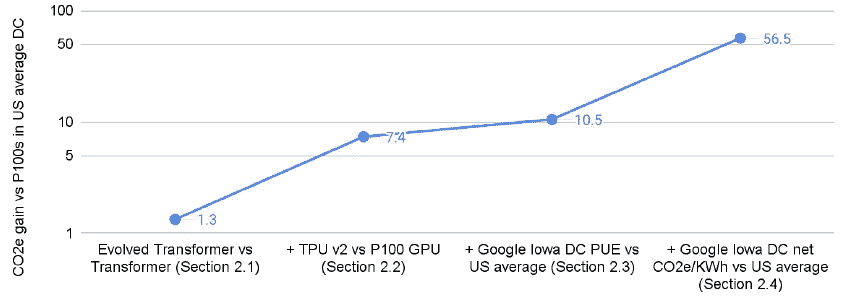

# “碳排放和大型神经网络培训”总结

> 原文：<https://medium.com/mlearning-ai/carbon-emissions-and-large-neural-networks-training-198b83d43c00?source=collection_archive---------3----------------------->

# 介绍

对更多计算的机器学习( **ML** )需求急剧增长。**更多的计算**意味着**更多的能源消耗**和**更多的排放到大气中的温室气体**。估计 ML 模型的能量消耗可以帮助测量它们的环境影响和尝试更绿色的策略。 **David Patterson** 等人在[ **1** ]中计算了最近几个大型自然语言处理模型( **NLP** )的能源使用量和碳足迹，并改进了早期发表的对发现进化变压器的神经架构搜索的估计。根据他们在实验中的发现，他们强调了三个机会(使用**稀疏激活深度神经网络**、**地理位置感知计算**，以及使用**专用处理器(加速器)**)来提高能源效率和二氧化碳当量(二氧化碳和所有其他温室气体，如甲烷、一氧化二氮等)排放。这些机会将碳足迹减少了**~ 100-1000 倍**。此外，他们同意一些以前发表的论文关于发表 ML 论文的一些规范，你可以在这个总结的最后一节找到。

**注**:本文的重点是**培训**。

# 提高能源效率和减少温室气体排放的机会

下面列出了[ **1** ]所强调的提高 ML 计算效率的机会。

## 算法/程序改进

一个更好的算法可以节省大量时间，更少的时间意味着更少的能源使用，从而减少温室气体的排放。此外，实现算法的程序是算法执行速度的一个重要因素。与 Transformer (Big)相比，Evolved Transformer (Medium)型号使用的触发器数量减少了**1.6 倍**，时间减少了**1.1-1.3 倍**，但精度略高。

## 处理器改进

谷歌的张量处理单元( **TPU** 版本 2 ( **v2** )处理器运行 Transformer(大)/Evolved Transformer**4.3X/5.2X**比英伟达的 **P100 GPU** 快。TPU v2 用电量少:变压器少**1.3 倍**，进化变压器少**1.2 倍**。性能/功率的净**增益分别为**5.6 倍**和**6.2 倍**。**

## 数据中心改进

数据中心效率的一个有用的量化指标是数据中心内*计算设备*的能源开销。例如，如果一个数据中心的开销是 50%，电源使用效率(**)是 1.5。由于数据中心利用率等其他因素，云数据中心的能效大约是典型企业数据中心的 2 倍。Masanet 等人在[ **3** 中发现，与 2010 年相比，全球数据中心的能耗仅增长了 6%，尽管计算能力在同一时期增长了 550%[**4**]。因此，云计算是一个更好的选择，因为在这个领域有更好的管理。**

*****PUE =(总设施功率)/ (IT 设备功率)*****

## ****能源组合改进或地理感知计算****

**与通过光纤以光子的形式发送信息相比，远距离传输电力成本更高，效率更低。云计算使得像谷歌这样的公司拥有一个全球性的数据中心组合，其中许多都放置在电网更清洁的地方，如芬兰(占基础设施能耗大约 70%的冷却可以通过利用环境以更有效的方式完成)，或者公司可以直接购买清洁能源的地方，如爱荷华州(T21)。2021 年，谷歌宣布了其能源战略的新目标:到 2030 年，它的目标是让所有数据中心和办公室全天候使用无碳能源。**

**下图[ **1** ]展示了 David Patterson 等人强调的机会。**

****

**Improvement in CO2 over Transformer (Big) on P100 GPU in an average US datacenter vs Evolved Transformer (Medium) on TPU v2s in the Google Iowa datacenter**

# **认可之前对新 ML 发布规范的呼吁**

**下面的清单列出了 ML 出版中遵循的规范，可能有助于 ML 社区理解培训的真正温室效应以及如何减少它。**

**鼓励更多的研究人员测量能源使用量和二氧化碳当量排放量(或使用 ML 排放计算器[ **2** ]等工具获得近似估计值)并公布数据。这是因为现在很难精确评估二氧化碳当量排放量，因为所有需要的信息很少报告或公开提供(例如，数据中心、硬件、能源组合)。作者认为 power 将包含在即将到来的 [MLPerf 基准](https://mlcommons.org/en/)中，这是朝着正确方向迈出的重要一步。**

****2**—**效率**应伴随**准确性**和**其他措施**用于发布计算密集型模型的 ML 研究。**

****3** -更多的研究人员应该公布加速器的数量及其训练计算密集型模型的时间，以激励在降低训练成本方面取得进展。这是因为减少培训时间很重要，既因为“**时间就是金钱**”也因为**更便宜的培训让更多的人参与进来**。**

# ****结论****

**全球气候变化是对经济、人类健康和环境的威胁，ML 社区需要尽自己的一份力量来限制其碳排放，因为 ML 正在变得无处不在，并且越来越需要计算和能源。为此，应该采取新的出版规范，并考虑更好的软件(算法/程序)、更好的硬件(神经网络的 TPUs 等加速器)、更好的数据中心管理(云计算)和地理感知计算(清洁生产能源的爱荷华州)等机会。**

# **参考**

**【**1**】Patterson，David 等.**碳排放与大型神经网络训练。***arXiv 预印本 arXiv:2104.10350*(**2021**)。**

**【**2**】Lacoste，Alexandre 等.**量化机器学习的碳排放。***arXiv 预印本 arXiv:1910.09700*(**2019**)。**

****3** 马萨内特，埃里克&谢哈比，阿尔曼&雷，努阿&史密斯，莎拉&库米，乔纳森。"**重新校准全球数据中心能源使用估算。**“科学。367.984–986.10.1126/science . ABA 3758(**2020**)。**

**[ **4** ] Masanet E .，**2021 年 3 月 24 日**，“ [**数据中心能源分析:过去、现在和未来**](https://www.youtube.com/watch?v=-o8j5zIM0iA) ”，加州大学圣巴巴拉分校讲座( **UCSB** )**

**【 **5** 】阿姆布鲁斯特、迈克尔等人】**云计算的一种看法。Commun。**“ACM。53.50–58.10.1145/1721654.1721672(**2010**)。**