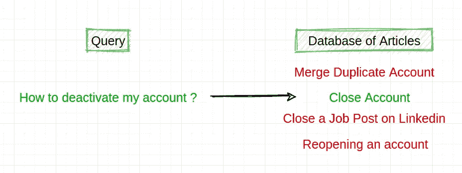
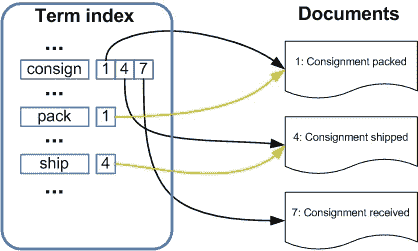
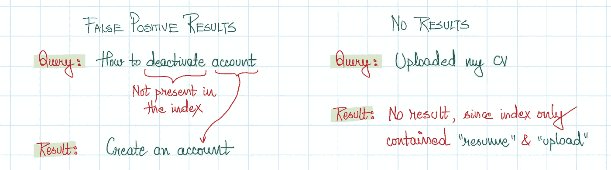
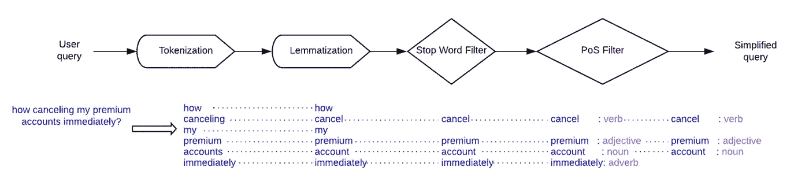
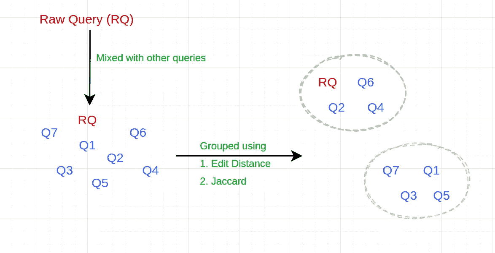
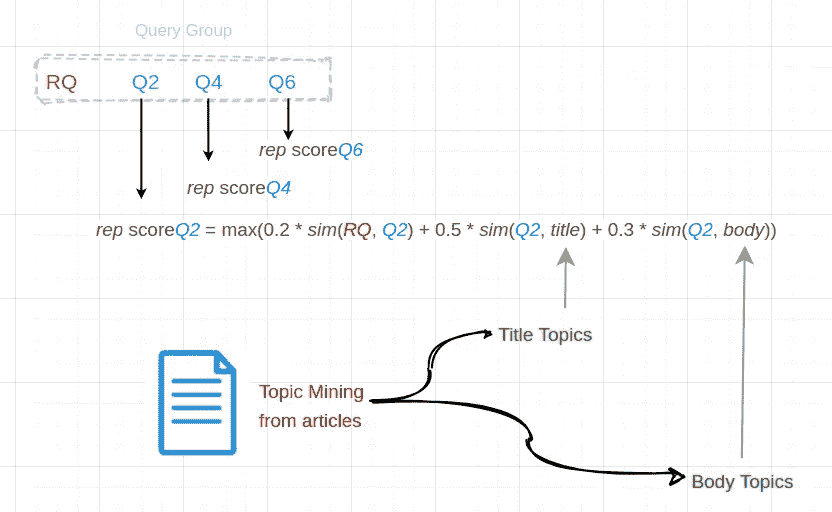
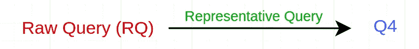
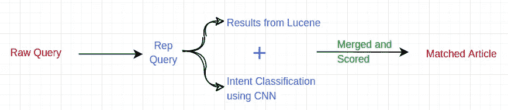

# 案例研究 LinkedIn 如何使用 NLP 设计帮助搜索系统

> 原文：<https://medium.com/mlearning-ai/case-study-how-linkedin-used-nlp-to-design-help-search-system-a2e5e02c0fff?source=collection_archive---------3----------------------->

这是 LinkedIn 关于如何使用 NLP(截至 **2019** )设计其帮助搜索系统的[原始帖子](https://engineering.linkedin.com/blog/2019/04/how-natural-language-processing-help-support)的摘要和关键要点。

# 问题陈述:

给定用户的查询，从数据库中获取最相关的帮助文章。

(Image by Author) Problem Statement

# 迭代 1:初始解决方案

1.  使用 [Lucene Index](https://www.google.com/url?sa=i&url=https%3A%2F%2Fdzone.com%2Farticles%2Fusing-lucene-grails&psig=AOvVaw2x138CW_f6YEA2FaeHUVpH&ust=1621175326902000&source=images&cd=vfe&ved=0CAIQjRxqFwoTCLj72vXyy_ACFQAAAAAdAAAAABAE) 索引数据库中的所有帮助文章(文档)。简而言之，它生成一个反向字典，将术语映射到它出现的所有文档。

[Source](https://engineering.linkedin.com/blog/2019/04/how-natural-language-processing-help-support)

2.给定的查询用于使用 Lucene 索引获取所有相关的文档(点击)。

3.使用 [BM25F](https://www.programmersought.com/article/53174626597/) 算法对每个命中进行评分，该算法考虑了 ***文档结构*** ，对**标题**中的命中给予最高权重，然后对**关键字**和**正文**中的命中给予最高权重，并返回加权分数。

4.返回得分最高的文章。

## 失败的原因

由于文档检索系统是基于**术语(** *句法***)**而没有考虑*语义*的，下面是两个失败的例子:

(Image by Author) Examples of use cases that failed

# 迭代 2:最终解决方案

## 步骤 1:文本规范化

*如何立即取消我的保费账户*归一化为*取消保费账户*

[Source](https://engineering.linkedin.com/blog/2019/04/how-natural-language-processing-help-support)

## 步骤 2:查询映射

规范化的查询可能与文章中的单词没有任何共同之处。因此，每个查询都被映射到一个更具代表性的查询，以填补用户术语和文章术语之间的空白。

分以下两步完成:

1.  **查询分组:**基于相似性度量将查询分组在一起

(Image by Author) Illustration of Query grouping

**2。主题挖掘和重复评分:**对于查询组中的每个查询，计算一个*重复评分*，并选择前 K 个查询作为重复查询

(Image by Author ) Illustration of Topic Mining and Rep scoring

sim(RQ，Q2)是原始查询和组中另一个查询之间的相似性

sim(Q2，标题)是 Q2 和其中一个题目最大的相似度，从题目来看(正文也是如此)

## 步骤 3:意图分类

长尾查询可能没有 Rep 查询，在这种情况下, **CNN** 用于对查询的**意图**进行分类。

例如:“取消您的 premium 订阅”和“取消或更新在您的 Apple 设备上购买的 Premium 订阅”被视为具有相同的“取消 Premium”意图

# 总流量

(Image by Author) Overall Flow

 [## Mlearning.ai 提交建议

### 如何成为 Mlearning.ai 上的作家

medium.com](/mlearning-ai/mlearning-ai-submission-suggestions-b51e2b130bfb)