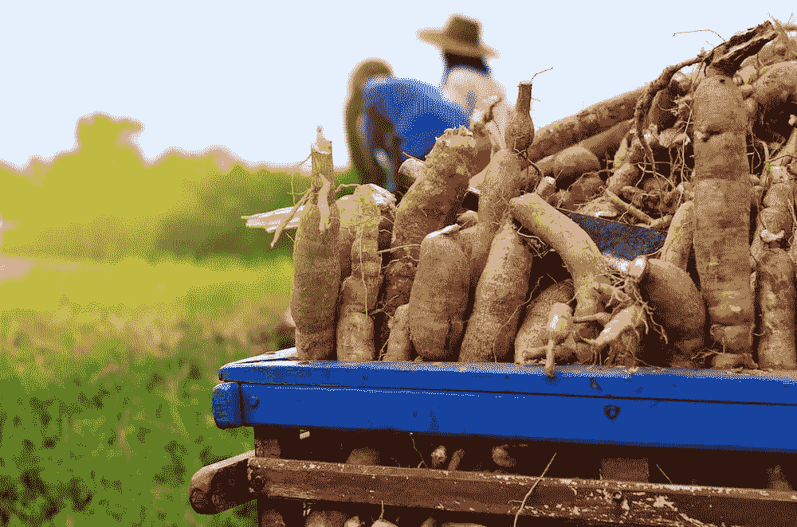
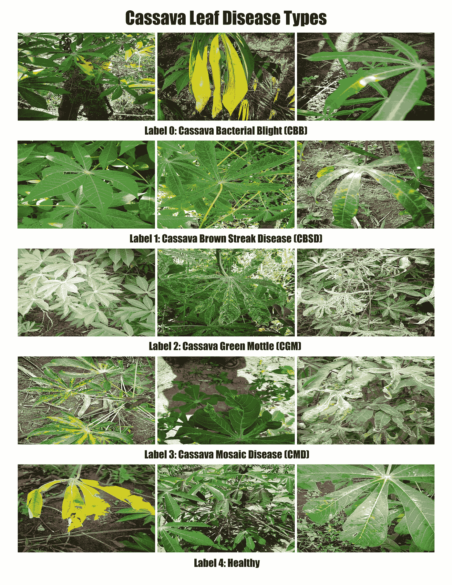
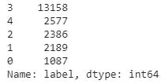

# 基于卷积神经网络的木薯叶病害分类

> 原文：<https://medium.com/mlearning-ai/cassava-leaf-disease-classification-using-convolutional-neural-networks-48fdc32cec1d?source=collection_archive---------2----------------------->

疾病导致木薯作物产量低的解决方案可能植根于新的深度学习技术。

Cassava Crop Harvest [1]

# 背景和动机

作为非洲最重要的主要作物之一，淀粉木薯是整个非洲大陆第二大碳水化合物生产商，尽管这种植物以其健壮的天性和抵御恶劣环境条件的能力而闻名，但猖獗的疾病爆发经常威胁作物产量，并对种植这些作物的自给农民构成严重威胁。虽然撒哈拉以南非洲 80%以上的小型家庭农场都种植这种根茎，但很少有人有能力检测和减轻疾病爆发的破坏性影响，这些疾病经常困扰着他们。[2]目前，为了评估一个人的植物是否受到疾病的侵袭，农民必须与当地政府官员合作，派遣农业专家亲自检查植物。不幸的是，这一过程劳动强度大、速度慢、效率低，如果农民真的要处理植物中的疾病爆发，他们会面临更大的损失。为了帮助加快这一过程，并为农民提供拯救他们作物的最佳机会，我们的目标是帮助开发一种卷积神经网络，它将能够通过简单地向模型提供植物叶片的图像，快速准确地分类给定植物是否患有疾病。鉴于当地农民可以使用的许多相机质量可能很低，我们将使用有代表性的照片来训练我们的模型，并尝试创建一个有效的解决方案，能够为所有迫切需要它的人提供服务。

我们用来创建和优化我们的网络的数据集包含 21，397 个木薯叶图像及其相应疾病分类的观察结果。叶子图像所属的五个类别是木薯细菌性枯萎病(CBB)、木薯褐条病(CBSD)、木薯绿斑驳病(CGM)、木薯花叶病(CMD)和健康。下面显示了一些示例图像。

Figure 1\. Cassava Leaf Images for Different Disease Classes in our Dataset

从上面的图像中可以看出，虽然对于受过训练的眼睛来说，这些疾病可能有一些明显的特征，但指示疾病的特征是微妙的，区分这些不同症状表现并准确诊断植物的能力需要一定水平的专业知识和技能，而许多人并不具备这种能力。令人欣慰的是，正是这些相对不显眼的特征可能会被外行的观察者掩盖，卷积神经网络非常擅长分析和计算将它们与相关类相关联的关系。这些深度学习工具如此强大的原因之一是，无论使用该模型的人的背景如何，一个好的神经网络都可以超越人类所需的任何正式训练，以便识别这些特征作为特定类别的指示，并发展简单地基于其先前对一组训练数据的经验来描绘抽象类别的边界的能力。

# 探索性数据分析

当我们开始创建一个允许准确和稳健分类的模型时，我们必须首先熟悉我们所掌握的数据，因为数据是一个好模型的基础。一旦我们将数据上传到 Google Colab(这是一项独立的事业)，我们就能够开始了解我们将用来训练和建立模型的数据的性质。我们的训练集由 21，397 对木薯叶图像及其相应的疾病分类组成。

如前所述，这些图像的质量变化很大，这可以从上面输出的示例中看出。然而，所有图像的一个一致的特征是它们的尺寸都是 800x600(宽乘高),这使得以保持比例的方式调整它们的尺寸更加方便，而不用担心扭曲或变形图像中形状和颜色之间的任何关系。为了节省 RAM 并减少模型输入维度的大小，我们决定将高度和宽度减少到原始大小的四分之一(200x150)，从而允许我们将相应数组表示中的条目减少十六分之一。在这一点上，我们有一组训练图像，可以输入到我们的模型中。

然而，对我们的基线模型更重要的是我们对标签数据的粗略分析。在对我们的类标签数据框运行 value_counts 函数时，我们得到了如下所示的输出。

Figure 2\. List of Disease Prevalence (0 corresponds to CBB, 1 to CBSD, 2 to CGM, 3 to CMD, and 4 to Healthy)

虽然这不是一个特别深入的分析，但它确实为我们提供了一些有价值的见解，有助于我们建立下面的多数分类器。我们可以看到，虽然大多数类(如 CBSD、CGM 和 Healthy)每个类都有 2100 到 2600 张图像，但仍有超过 13000 张 CMD 受灾木薯植物的图像，占我们整个训练数据集的近 61.5%。虽然这可能是创建训练集的一些不完美采样的结果，但有理由假设更可能的情况是 CMD 是迄今为止最常见的情况，并且应该允许我们创建一个非常简单的基线模型，该模型简单地将所有图像分类为受其困扰。这种方法不是最具信息性的，但它确实提供了一个基本水平的准确性，我们知道，如果我们希望对努力寻找这些非常现实和重要的农业问题的解决方案的人们有所帮助，我们就必须提高这一水平。

# 多数分类器基线模型

在使用 value_counts 函数分析我们的数据后，很明显木薯花叶病(CMD)正在影响图像中描绘的绝大多数植物，因此，为了获得我们模型的基线得分，我们决定简单地将我们预测函数的整个概率质量放在该疾病分类上，与提供给它的图像无关。虽然这种方法在数据分析方面没有特别的意义，甚至没有利用神经网络的能力，但它确实提供了一个基线得分，如果我们想证明我们的模型确实能够根据图像中的视觉表现区分不同的疾病，就有必要对其进行改进。尽管我们的基线模型使用了简单地将每个图像分配到 CMD 类的简单方法，但它确实实现了超过 60%的准确性，因为事实上训练集和测试集中的植物都主要遭受这种情况。

Figure 3\. Majority Classifier Results

展望未来，随着我们实际上开始为木薯叶疾病分类开发更深入和复杂的模型，我们计划将调整大小和预处理的图像输入一系列卷积层，然后是几个密集的完全连接的层。出于说明的目的，下面提供了一个大概的示意图，但是，在这一点上，我们还没有确定我们的层的最佳设计，以及哪些特性和功能会使模型产生最佳结果。

Figure 4\. General CNN Schematic [3]

# 后续步骤

在未来的几天和几周内，我们希望为我们的模型开发一个更复杂的架构，使农民能够简单地上传他们作物的图像，并迅速收到准确的评估，以确定他们是否必须迅速采取行动根除患病的植物，以挽救他们剩余的收成，或者他们的植物是否看起来处于健康状态。随着我们开始创建一个更复杂的模型，该模型实际上采用了我们在课堂上接触到的以及在以前的作业中使用过的深度学习技术，我们将继续通过另外两篇系列博客帖子来更新我们的进展，此外还有一个摘要截屏，解释我们对整个项目的方法，特别强调我们最终模型的配置和性能。我们计划在下周解决的一些具体主题包括进一步预处理我们的图像将对训练过程产生什么影响，如何修改某些超参数(如正则化符、初始化符、退出率和批量大小)以优化我们的模型的准确性，以及从先前训练的模型中进行迁移学习是否能够为增强我们的网络奠定坚实的基础。我们期待在未来分享更多我们的工作，并希望您继续关注！

这个项目的代码可以在我们的 [GitHub 库](https://github.com/ethan21814/Tensorflow-Bros/blob/main/baseline_model.ipynb)中找到。

关于作者:Ethan Huang 和我(Griffin McCauley)都是布朗大学应用数学专业的大三学生。此外，我是男子大学越野队和田径队的成员，也是经济系的助教，伊森是 NFL 平台 Starting Eleven 的主席和学术导师。

鸣谢:该项目基于木薯叶疾病分类 Kaggle 竞赛([https://www . ka ggle . com/c/Cassava-Leaf-Disease-class ification](https://www.kaggle.com/c/cassava-leaf-disease-classification))，是数据科学倡议硕士项目中布朗大学数据 2040 课程(深度学习和数据科学中的特殊主题)的一部分。

参考资料:

1.  [https://www . demandafrica . com/food/cassava-africas-most-versatile-staple/](https://www.demandafrica.com/food/cassava-africas-most-versatile-staple/)
2.  [https://www . ka ggle . com/c/cassava-leaf-disease-class ification](https://www.kaggle.com/c/cassava-leaf-disease-classification)
3.  [https://www . researchgate . net/figure/Schematic-diagram-of-a-basic-convolutionary-neural-network-CNN-architecture-26 _ fig 1 _ 336805909](https://www.researchgate.net/figure/Schematic-diagram-of-a-basic-convolutional-neural-network-CNN-architecture-26_fig1_336805909)