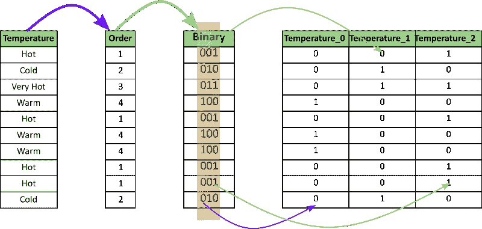
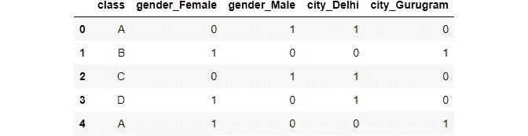
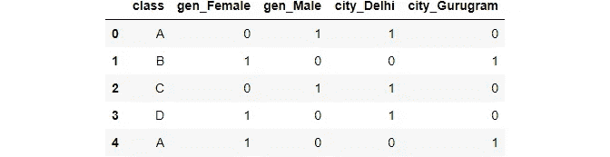
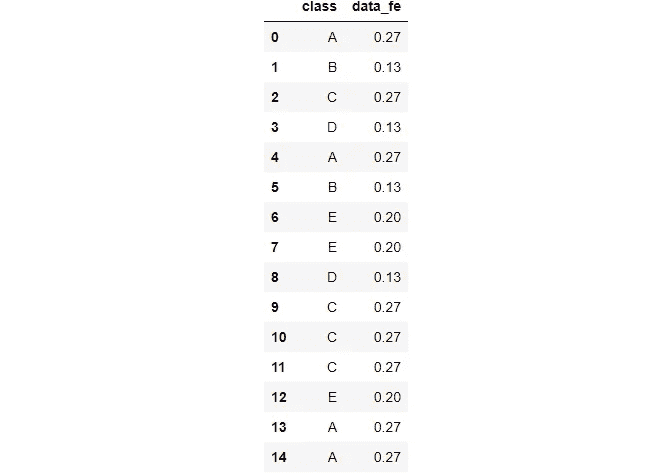
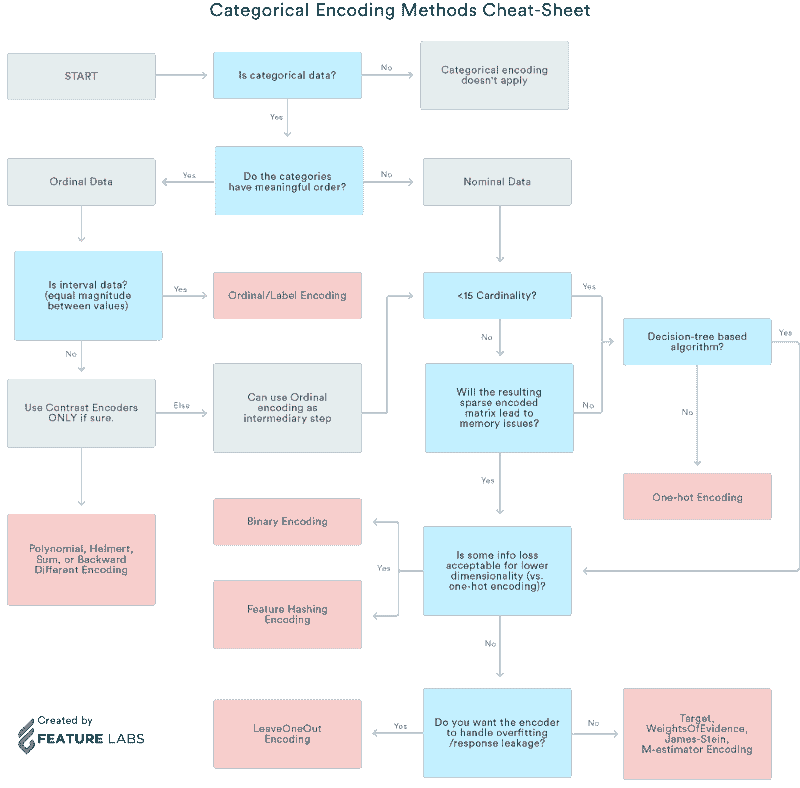

# 如何对分类数据进行编码

> 原文：<https://medium.com/mlearning-ai/category-encoders-c2a9bb192f0a?source=collection_archive---------0----------------------->

## 任务:试验和实现不同类型的编码来处理分类数据


Image Ref: [Unsplash](https://unsplash.com/photos/F79gXCckUUY)

## 在这篇博客中，我们将探索和实现:

一个热编码使用:

*   Python 的类别编码库
*   Sklearn 预处理
*   Python 的 get_dummies

二进制编码

频率编码

标签编码

顺序编码

## 什么是分类数据

分类数据是一种用于对具有相似特征的信息进行分组的数据，而数值数据是一种以数字形式表达信息的数据。

例如:性别

## 为什么我们需要编码？

*   大多数机器学习算法不能处理分类变量，除非我们将它们转换成数值。
*   许多算法的性能甚至因分类变量的编码方式而异。

## 分类变量可以分为两类:

*   标称值(无特定顺序)
*   序数(有些是有序的)

我们还将参考一个备忘单，显示何时使用哪种类型的编码。

## 方法:1 使用 Python 的类别编码器库

category_encoders 是一个了不起的 python 库，它提供了 15 种不同的编码方案。

## 以下是 15 种编码类型的列表:

*   一个热编码
*   标签编码
*   顺序编码
*   赫尔默特编码
*   二进制编码
*   频率编码
*   平均编码
*   证据权重编码
*   概率比编码
*   哈希编码
*   后向差分编码
*   省略一个编码
*   詹姆斯-斯坦编码
*   m 估计编码
*   温度计编码器

## 导入库

```
import pandas as pd 
import sklearn
```

pip 安装类别 _ 编码器

```
import category_encoders as ce
```

## 创建数据框架

```
data = pd.DataFrame({ 'gender' : ['Male', 'Female', 'Male', 'Female', 'Female'],
                      'class' : ['A','B','C','D','A'],
                      'city' : ['Delhi','Gurugram','Delhi','Delhi','Gurugram'] })data.head()
```


## 通过 category_encoder 实现一键编码

在该方法中，每个类别被映射到一个向量，该向量包含 1 和 0，表示该特征的存在或不存在。向量的数量取决于特征类别的数量。

创建一个 Hot 编码器的对象

```
ce_OHE = ce.OneHotEncoder(cols=['gender','city']) 

ce_OHEOneHotEncoder(cols=['gender', 'city'])data1 = ce_OHE.fit_transform(data)
data1.head()
```


## 二进制编码

二进制编码将类别转换为二进制数字。每个二进制数字创建一个特征列。



[Image Ref](https://towardsdatascience.com/all-about-categorical-variable-encoding-305f3361fd02)

```
ce_be = ce.BinaryEncoder(cols=['class']);

# transform the data 
data_binary = ce_be.fit_transform(data["class"]);
```

打印数据

```
print(data["class"])
data_binary0    A
1    B
2    C
3    D
4    A
Name: class, dtype: object
```


类似地，该库还提供了其他 14 种编码类型。

## 方法 2:使用 PYTHON 的获取虚拟对象

```
pd.get_dummies(data,columns=["gender","city"])
```



如果我们想的话，可以指定前缀。尽管它也采用默认前缀！

```
pd.get_dummies(data,prefix=["gen","city"],columns=["gender","city"])
```



## 方法 3:使用 SKLEARN

sklearn 还有 15 种不同类型的内置编码器，可以从 sklearn.preprocessing 访问。

## SKLEARN ONE 热编码

## 让我们首先从数据中获得一个分类变量列表

```
s = (data.dtypes == 'object')
cols = list(s[s].index)
```

导入:

```
from sklearn.preprocessing import OneHotEncoder

ohe = OneHotEncoder(handle_unknown='ignore',sparse=False)
```

## 申请性别专栏

```
data_gender = pd.DataFrame(ohe.fit_transform(data[["gender"]]))

data_gender
```


## 应用于城市专栏

```
data_city = pd.DataFrame(ohe.fit_transform(data[["city"]]))

data_city
```


## 应用于类列

```
data_class = pd.DataFrame(ohe.fit_transform(data[["class"]]))

data_class
```


这是因为 class 列有 4 个唯一的值

## 应用于分类变量列表:

```
data_cols = pd.DataFrame(ohe.fit_transform(data[cols]))

data_cols
```


这里的前 2 列代表性别，接下来的 4 列代表阶级，剩下的 2 列代表城市。

## SKLEARN 标签编码

在标注编码中，为每个类别指定一个从 1 到 N 的值，其中 N 是要素的类别数。这些作业之间没有关系或顺序。

```
from sklearn.preprocessing import LabelEncoder

le = LabelEncoder()
```

标签编码器不带参数

```
le_class = le.fit_transform(data[["class"]]);le_classarray([0, 1, 2, 3, 0])
```

## 与独热编码相比

```
data_class
```


## 顺序编码

序数编码的编码变量保留了变量的序数(有序)性质。它看起来几乎类似于标签编码。唯一的区别是标签编码不考虑变量是否是有序的，它会指定一个整数序列

## 示例:序数编码将赋值为非常好(1)

First, we need to assign the original order of the variable through a dictionary.

```
temp = {'temperature' :['very cold', 'cold', 'warm', 'hot', 'very hot']}

df=pd.DataFrame(temp,columns=["temperature"])

temp_dict = {
    'very cold': 1,
    'cold': 2,
    'warm': 3,
    'hot': 4,
    "very hot": 5
}temp_dict{'very cold': 1, 'cold': 2, 'warm': 3, 'hot': 4, 'very hot': 5}temp{'temperature': ['very cold', 'cold', 'warm', 'hot', 'very hot']}df
```


Then we can map each row for the variable as per the dictionary.

```
df["temp_ordinal"] = df.temperature.map(temp_dict)df
```


## Frequency Encoding

The category is assigned as per the frequency of value in its total lot

```
data_freq = pd.DataFrame({'class' : ['A','B','C','D','A',"B","E","E","D","C","C","C","E","A","A"]})
```

Grouping by class column

```
fe = data_freq.groupby("class").size()
feclass
A    4
B    2
C    4
D    2
E    3
dtype: int64
```

Dividing by length

```
len(data_freq)15fe_ = fe/len(data_freq)
```

Mapping and Rounding off

```
data_freq["data_fe"] = data_freq["class"].map(fe_).round(2)data_freq
```



We saw 5 types of encoding schemes. Similarly, there are 10 other types of encoding :

*   Helmert Encoding
*   Mean Encoding
*   Weight of Evidence Encoding
*   Probability Ratio Encoding
*   Hashing Encoding
*   Backward Difference Encoding
*   Leave One Out Encoding
*   James-Stein Encoding
*   M-estimator Encoding
*   Thermometer Encoder

## Which One is Best then?

There is no single method that works best for every problem or dataset. I personally think that the get_dummies method has an advantage in its ability to implement very easily.

## Read about all the 15 types of encoding in detail here:

If you want to read about all the 15 types of encoding here is a very good article to refer to: [https://towardsdatascience . com/all-about-categorial-variable-encoding-305 f 3361 FD 02](https://towardsdatascience.com/all-about-categorical-variable-encoding-305f3361fd02)

我还附上一个什么时候使用什么类型的编码备忘单。



[Image Ref](https://towardsdatascience.com/all-about-categorical-variable-encoding-305f3361fd02)

*…………。如果你喜欢这个博客，别忘了留下几个由衷的掌声:)*

## [在 LinkedIn 上帮我联系](https://www.linkedin.com/in/shelvi-garg-3a7421108/)

参考资料:

1.  [https://towards data science . com/all-about-category-variable-encoding-305 f 3361 FD 02](https://towardsdatascience.com/all-about-categorical-variable-encoding-305f3361fd02)
2.  [https://pypi.org/project/category-encoders/](https://pypi.org/project/category-encoders/)
3.  [https://pandas . pydata . org/docs/reference/API/pandas . get _ dummies . html](https://pandas.pydata.org/docs/reference/api/pandas.get_dummies.html)