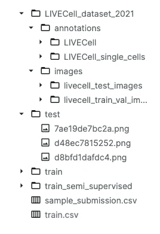
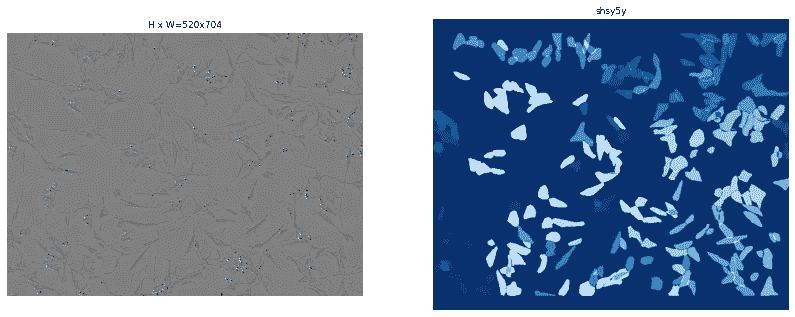
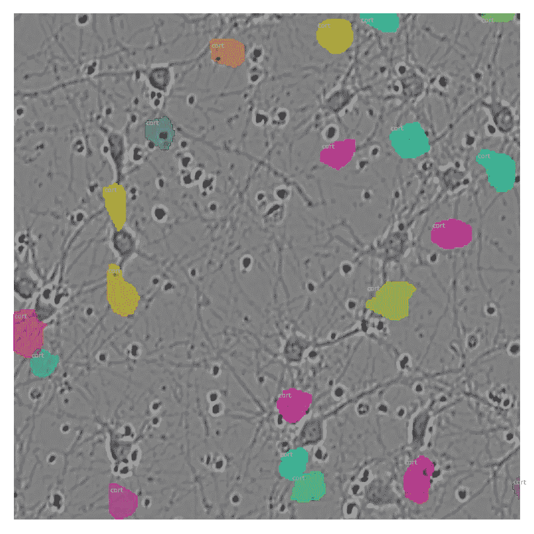
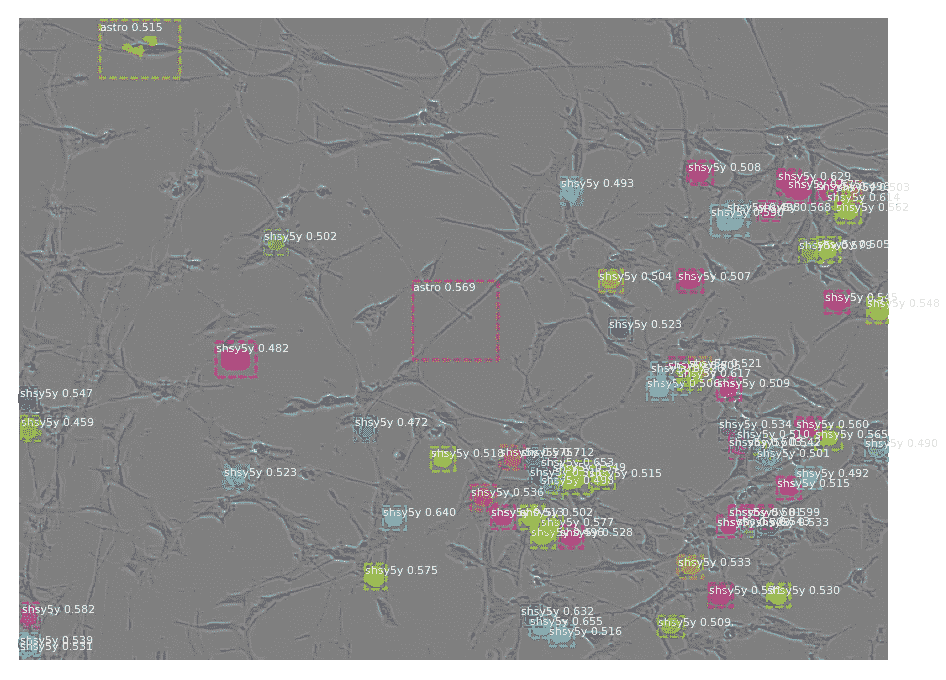
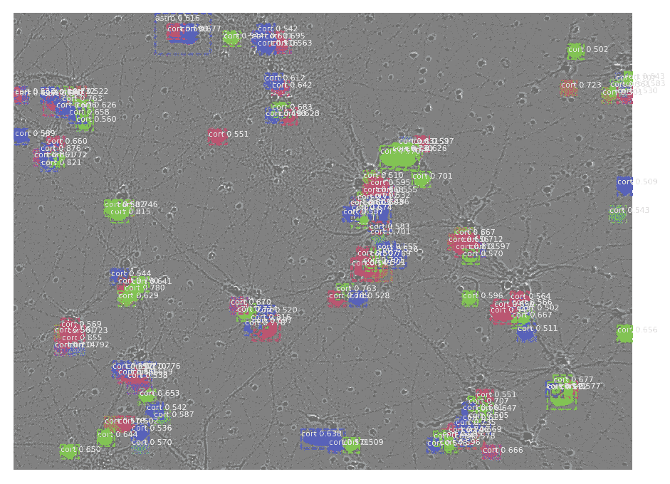

# 使用掩模 R-CNN 的细胞实例分割

> 原文：<https://medium.com/mlearning-ai/cell-instance-segmentation-using-mask-r-cnn-c7a3810192ff?source=collection_archive---------2----------------------->

通过构建细胞实例解释分割训练和推理

下面是我们*[***Colab 笔记本***](https://colab.research.google.com/drive/1zvcp88bTlly_XMkK6G6HXZvA_vk5MP7i?usp=sharing) 的链接*

## *1.简介:*

*[细胞实例分割](https://www.kaggle.com/c/sartorius-cell-instance-segmentation/overview):是由生命科学研究和生物制药行业的合作伙伴 Sartorius 主办的 Kaggle 竞赛。在这场比赛中，我们的任务是在描述神经疾病研究中常用的神经元细胞类型的生物图像中检测和描绘不同的感兴趣对象。这项任务具有挑战性，因为它需要正确检测图像中的所有对象，同时还需要精确分割每个实例。*

*[Mask R-CNN:](https://engineering.matterport.com/splash-of-color-instance-segmentation-with-mask-r-cnn-and-tensorflow-7c761e238b46) (区域卷积神经网络)在图像分割和实例分割方面是最先进的。Mask R-CNN 建立在更快的 R-CNN 之上，这是一个流行的对象检测框架。在这个框架中有两个阶段:*

*   *第一阶段称为**区域提议网络** (RPN)，提议候选对象边界框。*
*   *第二阶段从每个候选框中提取特征，并执行分类、边界框回归和**二元掩码**。*

## *2.数据集:*

****数据描述:****

*训练注释以游程编码(RLE)掩码的形式提供，图像是 PNG 格式的。*

****文件:****

***train.csv** :所有训练对象的 id 和掩码*

***sample_submission.csv:** 格式正确的样本提交文件*

***列车**:PNG 格式的列车图像*

***测试**:测试 PNG 格式的图像。*

***训练 _ 半监督**:无标签图像*

***live cell _ dataset _ 2021**:live cell 数据集数据的镜像*

**

*Data Explorer*

> ***注:**我们仅使用 **train.csv** 、 **train** 和 **test** 进行训练和推理。*

****游程编码(RLE):*** 是数据压缩的一种形式。图像可以存储在位图和压缩使用 RLE 算法。由于掩码是 RL 编码的，我们需要提供一个 RLE 解码器来读取这些掩码。*

## *3.配置:*

*我们用 [**Google Colab**](https://colab.research.google.com/drive/1zvcp88bTlly_XMkK6G6HXZvA_vk5MP7i?usp=sharing) 来演示这一点。*

***首先**，我们需要安装一些要求，让 Mask R-CNN 运行:*

```
*!pip3 uninstall -y keras-nightly!pip3 uninstall -y tensorflow!pip3 install keras==2.1.6!pip3 install tensorflow==1.15.0!pip install 'h5py<3.0.0'!pip install imgaug # for augmentation*
```

***第二个**，我们克隆了[**matter port Mask R-CNN**](https://github.com/nghi-huynh/Mask_RCNN.git)**资源库:***

```
***!git clone https://github.com/nghi-huynh/Mask_RCNN.git!mv -f Mask_RCNN/mrcnn/ .!mv Mask_RCNN/samples/cell/cell.py .!rm -rf Mask_RCNN/!rm -rf sample_data/***
```

*****第三个**，我们导入所需的库:***

***Importing required libraries***

*****第四个**，我们通过复制 [*nucleus.py*](https://github.com/nghi-huynh/Mask_RCNN/blob/master/samples/nucleus/nucleus.py) 创建[***cell . py***](https://github.com/nghi-huynh/Mask_RCNN/blob/master/samples/cell/cell.py)文件，并根据我们的需要进行修改。在这个文件中，我们从基本掩码 R-CNN `Config`和`Dataset`类继承了两个类，并覆盖了一些值。***

*   ***`CellConfig`类看起来是这样的:***

***Customize CellConfig class***

> *****代码提示:**基础配置类在 [config.py](https://github.com/nghi-huynh/Mask_RCNN/blob/master/mrcnn/config.py) 中。并且 NucleusConfig 在 [nucleus.py](https://github.com/nghi-huynh/Mask_RCNN/blob/master/samples/nucleus/nucleus.py) 中***

*   ***`CellDataset`类看起来像这样:***

***Customize CellDataset class***

> *****代码提示**:您可以跟随[示例](https://github.com/nghi-huynh/Mask_RCNN/tree/master/samples)并注意每个示例如何使用自己的数据集类，然后编写自己的数据集类来加载数据集的任何格式。***

## ***4.数据探索:***

***一旦我们定制了数据集，我们就通过加载数据集并显示一些随机样本来验证我们的代码。***

***Data visualization***

***这是我们可视化的一个例子:***

******

***Sample of our visualization: on the left is the original image, on the right is its corresponding masks***

***然后，我们通过加载特定图像的源 ID，将原始图像和蒙版叠加在一起。***

***Overlaying the original image and mask together***

***这是我们叠加图像的一个例子:***

******

***Overlay original image and its masks***

## ***5.型号:***

***现在，我们使用`CellDataset`加载训练和验证数据集。然后，我们下载并初始化 coco 为我们的模型训练的权重。最后，我们使用我们创建的`CellConfig`实例初始化用于训练的 Mask R-CNN 模型。***

***Initialize our Mask R-CNN model***

> *****注意:**我们从 ResNet50 的训练中排除了最后几层***

## ***6.数据扩充:***

***然后，我们添加我们的增强管道，以增加我们的训练和验证数据集的多样性。我们的管道包括一些随机翻转，仿射和高斯模糊。***

***Augmentation pipeline***

## ***7.培训:***

***我们分两个阶段训练我们的模型:***

*   *****第一阶段**:我们只训练头部。这里，我们冻结了所有的主干层，只训练 COCO 女士随机初始化的预训练权重。为了只训练头部层，我们将`layers='heads'`传递给`train()`函数。***

***Head training with higher learning rate***

> *****代码提示:**训练学习率较高的头部，加快学习进程。***

*   ***第二阶段:我们微调所有图层。为了训练所有层，我们将`layers='all'`传递给`train()`函数。***

***All layers training with lower learning rate***

> *****注意 *:*** 每次历元后，我们所有训练过的重量都会自动保存在我们的`MODEL_DIR`中。但是，我们也可以通过以下代码手动保存它:***

***Save our trained weights manually***

## ***8.推论:***

***现在，我们要显示由训练好的模型生成的结果。首先，我们在推理模式下创建模型。然后，我们加载之前从训练模型中保存的权重。然后，我们加载一些我们想要检测包围盒、类别和置信度百分比的图像。最后，我们可视化我们的火车预测。***

******

***shsy5y***

******

***cort***

## *****9。结论:*****

***我们注意到信心百分比相当低。因此，我们列出了一些可能改进我们模型的因素:***

*   ***增加历元的数量***
*   ***修改学习率***
*   ***使用另一个主干，如 EfficientNetV2，而不是 ResNet50***

***[](/mlearning-ai/mlearning-ai-submission-suggestions-b51e2b130bfb) [## Mlearning.ai 提交建议

### 如何成为 Mlearning.ai 上的作家

medium.com](/mlearning-ai/mlearning-ai-submission-suggestions-b51e2b130bfb)***