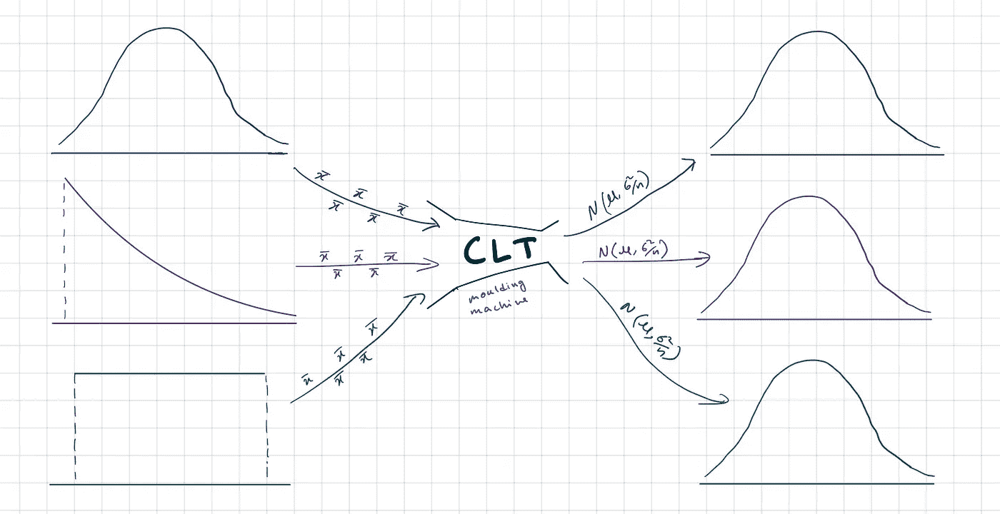

# 中心极限定理又名 CLT

> 原文：<https://medium.com/mlearning-ai/central-limit-theorem-aka-clt-d76cda6deb78?source=collection_archive---------5----------------------->

中心极限定理也称为 CLT，是一个非常流行和强大的定理。在这个博客中，你会彻底了解它，并能够欣赏它的美丽。

> CLT 声明，如果您有一个具有均值 **μ** 和方差 **σ** 、**t5】的分布，并且取 **m** 个大小为 **n** 的随机样本进行替换，那么**样本均值** x̅的抽样分布将遵循一个具有均值 **μ** 和方差 **σ /n** 的**正态分布**。******

这里μ 是均值，σ是总体或原始分布的方差。x̅代表每个样本的平均值，这意味着它是样本平均值。另外，请注意标准偏差是方差的平方根。所以σ将是原始分布的标准偏差， **σ/√n** 将是结果正态分布的**标准偏差**。

好吧，乍一看可能会让人困惑甚至望而生畏。因为这是一个更正式的定义。我保证在这篇博客结束时会变得更清楚。让我们把形式定义分成几部分，以便更清楚地理解它。

## 什么是 S **充分均值的抽样分布？**

假设我们取多个样本，并计算每个样本的平均值。这些样本均值的分布称为样本均值的抽样分布。这是 CLT 的主要部分。在上面的定义中，我们说过样本的数量是 n，每个样本的大小是 m。在 CLT，我们对每个样本进行替换，这意味着一旦我们采样，我们就替换它的值。

简单地说，CLT 说，样本均值的抽样分布将是正态分布，不管原始分布是什么。这是 CLT 定义的第一个最重要的部分。该定义的第二个最重要部分是，均值相同，方差除以 n，因此，如果我们知道一个分布，就可以计算另一个分布的均值和方差。

中心极限定理适用于任何分布，我们可以从高斯或对数正态或均匀分布中抽取样本，也可以从指数或帕累托分布等极端分布中抽取样本。对于所有情况，CLT 都可以正常工作。

当你检查 z 检验和 t 检验的公式时，你会发现它们是基于 CLT 定理的。CLT 还有很多应用。

## n 和 m 应该是什么？

n 代表每个样本中的点数。m 的经验法则是 30，但是当分布不极端时，使用较小的值也可以。但是对于一些极端分布，我们可能需要每个样本中有 30 个以上的点才能使它成为一个恰当的正态分布。

n 调节样本均值的抽样分布的范围。从公式中可以看出，合成正态分布的方差也是σ /n，因此，随着 n 的增加，正态分布的分布范围将减小，并向均值收敛。

m 代表我们采集的样本数量。本质上，它意味着平均数的总数，或者你可以把它看作样本平均数的抽样分布中的数据点的数量。对于一个分布，一般来说，100 个数据点被认为是足够数量的数据点。但是我们也可以使用更少的数据点。

# 例子

理论够了，来看几个例子吧！！

我们将从一个简单的例子开始。在下面的例子中，原始分布是高斯分布。请注意两种分布的平均值、方差和标准差，以及理论值和实际值的接近程度。

让我们看另一个例子，在下面的例子中原始分布或人口分布是指数分布。请注意样本均值的采样分布是正态/高斯分布。

另一个例子只是为了让你相信它的美丽。

现在我们已经看了一些例子。让我们重温一下定义。

> CLT 声明，如果您有一个具有均值 **μ** 和方差 **σ** 、**t5】的分布，并且取 **m** 个大小为 **n** 的随机样本进行替换，那么**样本均值** x̅的抽样分布将遵循一个具有均值 **μ** 和方差 **σ /n** 的**正态分布**。******

现在，它看起来不应该像以前那样令人生畏。

感谢阅读博客。👏如果你喜欢的话。建议总是受欢迎的。