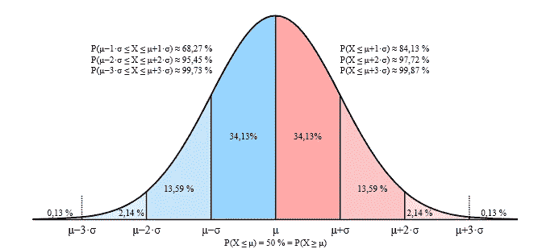
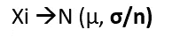
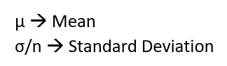
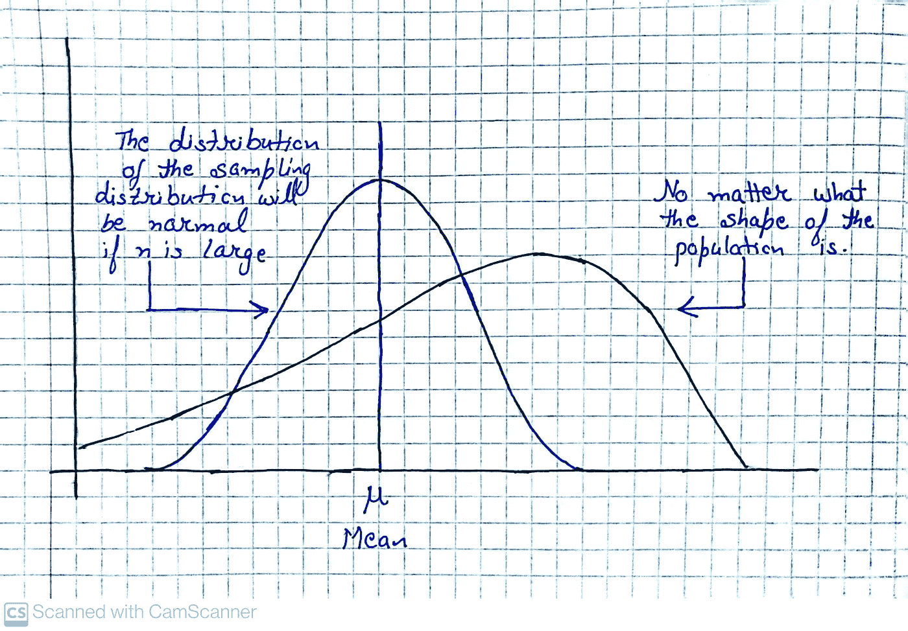

# 中心极限定理(CLT)

> 原文：<https://medium.com/mlearning-ai/central-limit-theorem-clt-57bead4d5de7?source=collection_archive---------1----------------------->

在学习中心极限定理之前，我想谈谈总体和样本，因为这将有助于理解 CLT。

## 总体(N)与样本(N)

总体和样本的主要区别在于如何将观察值分配给数据集。

1:一个**群体**包括一组数据中的所有元素。
例如指一所学校的学生人数。

2:一个**样本**由从总体中抽取的一个或多个观察值组成。
例如特定班级的学生人数。

## **中心极限定理(CLT)**

中心极限定理或 CLT 是统计学中的一个基本概念，它表明随着样本规模变大，样本均值的采样分布接近正态分布-无论总体分布的形状如何。

简而言之，CLT 指出，随着我们采集更多样本，尤其是更大的样本，我们的样本均值图将看起来像一个正态分布图。

Source:- [https://commons.wikimedia.org/wiki/File:Normal_Distribution_Sigma.svg](https://commons.wikimedia.org/wiki/File:Normal_Distribution_Sigma.svg)

CLT 基于大数定律，即随着样本中观察次数的增加，样本的均值将趋于接近总体均值。

## 数学表达式

假设我们有几个尺寸为 m 的样本，那么,
S1、S2、S3…………Sm 是尺寸为 m 的样本
和 X1、X2、X3………..Xm 分别是它们的样本均值。
抽样均值的抽样分布(Xi) =分布后跟 X 个 pts。

根据 CLT 的说法，

CLT

Central Limit Theorem

Illustration of CLT

## 为什么 CLT 很重要？

中心极限定理或 CLT 允许我们计算在一定范围内获得样本均值的概率，即使总体分布不是正态的。这意味着，在不知道总体分布的确切形状的情况下，可以从正态分布中确定某个范围内样本均值的概率。

*感谢您阅读本文！如果你有任何问题，请在下面留言。*

 [## Mlearning.ai 提交建议

### 如何成为 Mlearning.ai 上的作家

medium.com](/mlearning-ai/mlearning-ai-submission-suggestions-b51e2b130bfb)