# 中心极限定理:让我们通过一个使用 Python 的例子来学习

> 原文：<https://medium.com/mlearning-ai/central-limit-theorem-lets-learn-with-an-example-using-python-4801b8d1c6b5?source=collection_archive---------1----------------------->

概率理论

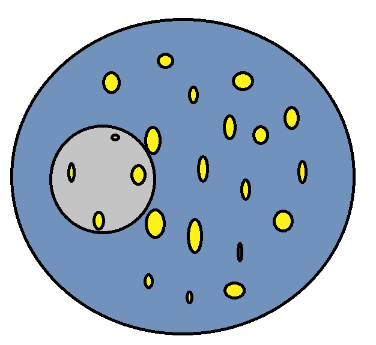

A small piece of information can tell the whole story

**中心极限定理(CLT)** 指出，如果我们有一个大的 ***人口*** ，它可能或可能不遵循高斯(正态)分布；当我们从中抽取 ***个随机样本*** 时， ***个样本意味着*** 将始终遵循高斯(正态)分布。我们将借助一个例子来理解这种说法。

在此之前，让我们先回答以下 3 个问题。

1.  ***什么是高斯/正态分布？***

它是从数据集形成的 ***对称钟形*** 曲线，其中数据点出现的概率是 ***靠近平均值*** (以灰色突出显示)较频繁，远离平均值 【以蓝色突出显示】较不频繁。

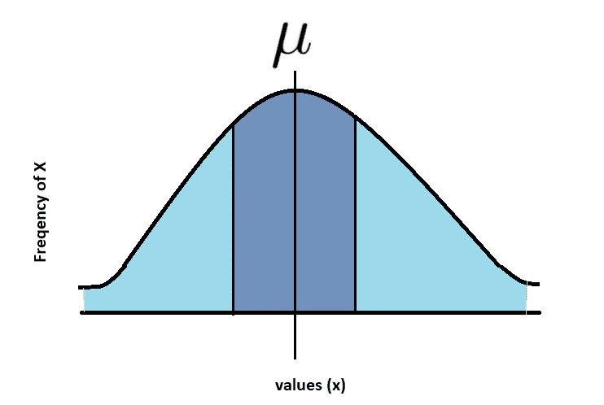

Gaussian/Normal Distribution

***2。人口和人口是什么意思？***

“**群体**”是基于可用于统计目的的共同特征收集的整个数据集。

例如，海洋中所有鱼的重量的数据集。

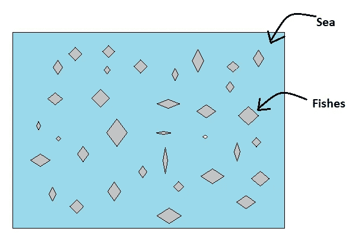

Population Depiction

***人口平均值*** 是对整个人口计算的平均值。

例如，种群中所有鱼的平均重量。

***3。样本和样本是什么意思？***

***样本*** 是数据点较少的总体的子集，即从总体中随机选取的数据。

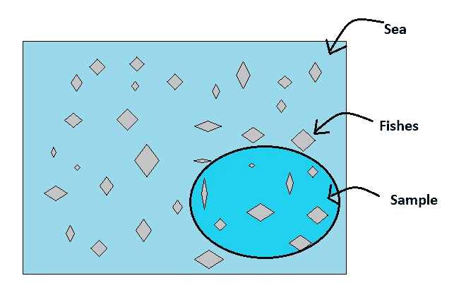

Sample Depiction

***样本平均值*** 是对样本数据集计算的平均值。

例如，样本中所有鱼的平均重量。

我们现在知道，什么是**总体**、**样本、**和**高斯分布**；让我们借助一个例题数据集来理解**中心极限定理**。

本例中使用的这个[数据集](https://data.world/montgomery-county-of-maryland/da04581d-180f-4008-bb0d-70d830f9e673)由 2019 年的员工工资组成。该数据集中的基本工资数据将是我们的总体，我们将从该总体中选择随机样本来计算样本均值。

我们将使用 python 中的 *pandas、matplotlib 和 sns* 模块来加载和分析数据。

使用 pandas 导入库模块并加载数据集

```
import pandas as pd
import matplotlib.pyplot as plt
import seaborn as sns
%matplotlib inline
import warnings
warnings.filterwarnings("ignore")
population= pd.read_csv('employee_salary.csv')
population
```

下面是数据集的快照，它有 10105 行和 8 列。

为了理解 CLT，我们只关注“基本工资”一栏，称之为全体人口的工资。

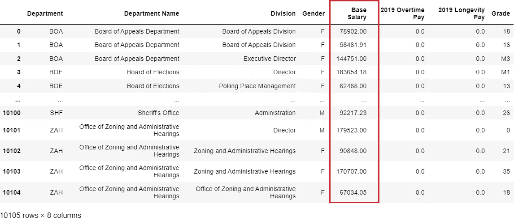

```
population_base_salary = population['Base Salary']
```

让我们计算基本工资的总体平均值，并绘制直方图来检查分布情况

```
print("Population Mean")
print("---------------")
print(population_base_salary.mean())
sns.distplot(population_base_salary, color='grey')
plt.xlabel('Population Base Salary')
plt.ylabel('Probability Density')
```

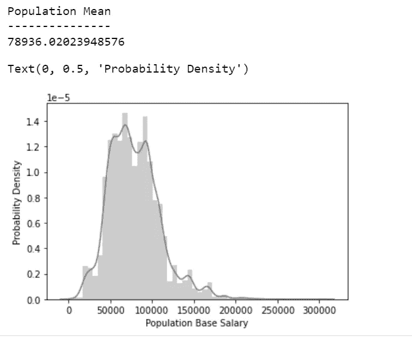

Population Distribution of Base Salary

***上图显示分布略有不对称，即不完全符合高斯分布。***

现在，我们将随机选择具有恒定数量样本的样本数据集，并计算平均值。我们重复这个过程 500 次，以获得 500 个样本平均值，然后绘制分布图。

为了更简单，我们可以使用下面的函数 **calc_sample_mean** ，它将输入作为“样本大小”和“样本均值数量”，即要计算的“样本均值”的数量。这个函数在每次随机选择样本时计算样本的平均值，并以数组的形式返回。

如果我们传递 *sample_size =2* 和 *no_of_sample_means=500* ，该函数将从数据集中随机选取 2 个“Base_Salary”样本，计算样本平均值并将其存储到一个数组中。它将重复这个过程来存储 500 个这样的样本平均值，并返回 500 个存储的样本平均值数组。

```
mean = []
def calc_sample_mean(sample_size, no_of_sample_means):
    for i in range(no_of_sample_means):        
        sample_base_salary = population_base_salary.sample(n=sample_size)
        sample_mean=sample_base_salary.mean()
        mean.append(sample_mean)
    return mean
```

让我们使用该函数计算平均值，并绘制出 **sample_size=2** 的分布

```
mean_2=calc_sample_mean(sample_size=2, no_of_sample_means=500)
sns.distplot(mean_2, color='b')
plt.xlabel('Sample Base Salary (Sample size =2)')
plt.ylabel('Probability Density')
```

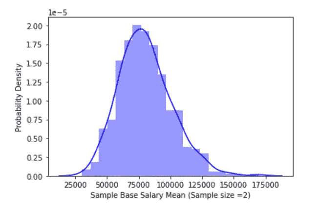

Distribution Curve from Sample Mean with Sample Size 2

在那里！！

***我们得到了一个高斯/正态分布曲线，有轻微的偏斜。***

这证明了一个定理——如果我们有一个大的*群体，它可能遵循也可能不遵循高斯(正态)分布，当我们从中抽取*随机样本时， ***样本意味着*** 将总是遵循高斯(正态)分布。**

**让我们按照相同的过程进行检查，但要增加 sample_size。**

****sample_size=3****

```
**mean_3=calc_sample_mean(sample_size=3, no_of_sample_means=500)
sns.distplot(mean_3, color='r')
plt.xlabel('Sample Base Salary Mean(Sample size =3)')
plt.ylabel('Probability Density')**
```

****

**Distribution Curve from Sample Mean with Sample Size 3**

****sample_size=10****

```
**mean_10=calc_sample_mean(sample_size=10, no_of_sample_means=500)
sns.distplot(mean_10, color='y')
plt.xlabel('Sample Base Salary Mean(Sample size =10)')
plt.ylabel('Probability Density')**
```

**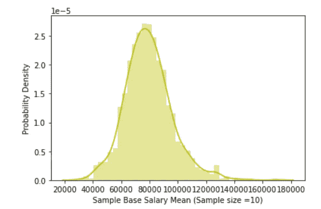**

**Distribution Curve from Sample Mean with Sample Size 10**

****sample_size=20****

```
**mean_20=calc_sample_mean(sample_size=20, no_of_sample_means=500)
sns.distplot(mean_20, color='g')
plt.xlabel('Sample Base Salary Mean(Sample size =20)')
plt.ylabel('Probability Density')**
```

**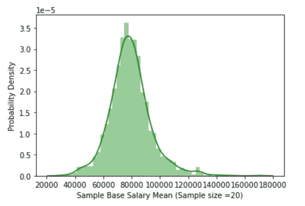**

**Distribution Curve from Sample Mean with Sample Size 20**

****sample_size=30****

```
**mean_30=calc_sample_mean(sample_size=30, no_of_sample_means=500)
sns.distplot(mean_30, color='maroon')
plt.xlabel('Sample Base Salary Mean(Sample size =30)')
plt.ylabel('Probability Density')**
```

**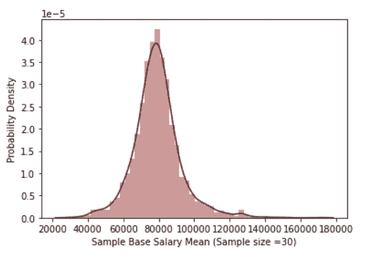**

**Distribution Curve from Sample Mean with Sample Size 30**

****样本 _ 大小> 30****

**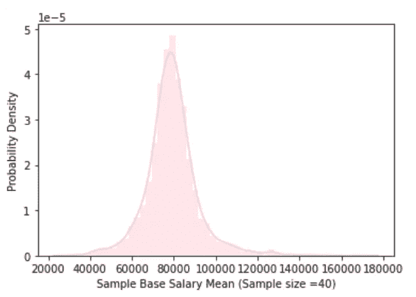**

**Distribution Curve from Sample Mean with Sample Size 40**

**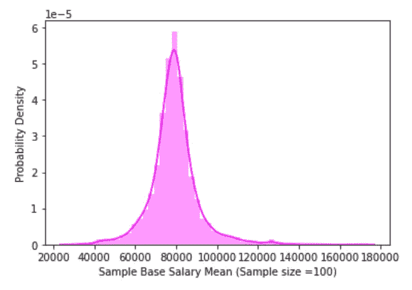**

**Distribution Curve from Sample Mean with Sample Size 100**

**随着样本量的增加，偏斜度降低，曲线变得更加尖锐。查看 [GitHub](https://github.com/gayathrig21/Medium_Examples/tree/main/Central_Limit_Theorem) 中的代码。**

**这说明无论我们的*人口分布曲线是什么，其 ***样本均值都将始终遵循高斯(正态)分布。******

**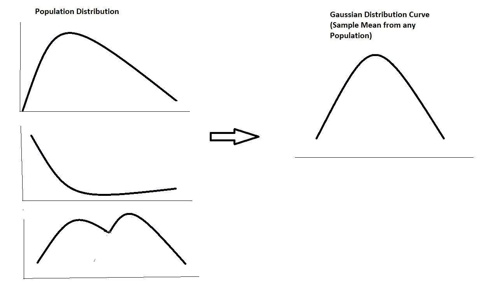**

> **等于或大于 30 的样本量**被认为足以使定理成立，但这并不总是必要的。在我们的例子中，我们可以观察到，我们得到一个样本大小为 10 或 20 的高斯分布。****

**所以有人会问，中心极限定理的实际含义是什么？**

**在几乎所有情况下，收集和统计分析整个人口的数据几乎是不可能的。任何群体的样本数据都可以用于使用 CTL 得出关于总体的结论，因为我们知道样本均值总是正态分布的！！！！**

**快乐学习！！！！**

**[](/mlearning-ai/mlearning-ai-submission-suggestions-b51e2b130bfb) [## Mlearning.ai 提交建议

### 如何成为 Mlearning.ai 上的作家

medium.com](/mlearning-ai/mlearning-ai-submission-suggestions-b51e2b130bfb)**