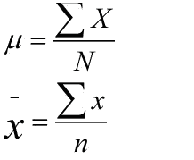
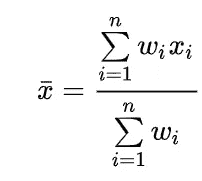
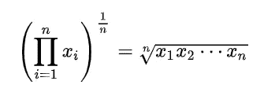
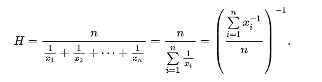

# 使用 Python 的集中趋势

> 原文：<https://medium.com/mlearning-ai/central-tendency-using-python-addf1baa23a8?source=collection_archive---------7----------------------->

## 随机变量的算术平均值、调和平均值、几何平均值、中值、众数和期望值

C 中心趋势是代表数据分布中心的单个值，它非常重要，是许多统计模型和理论的基石，如假设检验、置信区间、k 均值聚类算法、正态和其他数据分布等。最常见的集中趋势度量是算术平均值、中位数和众数。在本文中，我们将学习并实现 python 编程语言中的以下主要趋势

*   等差中项
*   加权平均数
*   随机变量的期望值
*   几何平均值
*   调和平均值
*   中位数
*   方式

Photo by [Stanley Emrys](https://unsplash.com/es/@monophonic1985?utm_source=medium&utm_medium=referral) on [Unsplash](https://unsplash.com?utm_source=medium&utm_medium=referral)

# 等差中项

算术平均值也称为平均值，其计算方法是将观察值的总和除以观察值的总数。μ用于总体平均值，x̄用于样本平均值。

# 加权平均数

通过将数据向量和权重向量的点积除以权重向量的总和来计算加权平均值，公式如下

# 随机变量的期望值

*   使用`np.unique(data, return_counts = True)`从数据向量创建值和频率向量
*   通过将数据和频率向量的点积除以频率向量来计算平均值
*   我们也可以通过从频率向量`f`计算概率向量作为`p = f/sum(f)`来计算期望值
*   现在将概率向量乘以数据向量来计算平均值

## 使用 Numpy

## 使用熊猫

# 几何平均值

几何平均定义为`n`数乘积的`nth`根，即对于一组数`x1, x2, …, xn`，几何平均定义为

# 调和平均值

调和平均值可以表示为给定的一组观察值的倒数的算术平均值的倒数。

# 中位数

median 是中间值，通过以下步骤计算得出

*   按升序或降序对数据向量进行排序
*   如果数据项是奇数，则中值在索引处`**(n+1)/2**`
*   否则，取中间两个值的平均值

# 方式

Mode 是最常见的值，通过计算数据值的出现次数来计算。

# 结论

在本文中，我们学习了算术和随机变量期望值的加权平均。我们还介绍了几何平均、调和平均、众数和中位数，并在 python 编程语言中实现了它们。

 [## Mlearning.ai 提交建议

### 如何成为 Mlearning.ai 上的作家

medium.com](/mlearning-ai/mlearning-ai-submission-suggestions-b51e2b130bfb)