# 第六章。优化数据以实现灵活的图像识别

> 原文：<https://medium.com/mlearning-ai/ch-6-optimizing-data-for-flexible-and-robust-image-recognition-23f4dcce3af7?source=collection_archive---------1----------------------->

## 我们如何调整输入数据和标签，以鼓励神经网络像人类一样灵活地“感知”图像？

# **人类感知的灵活性👼**

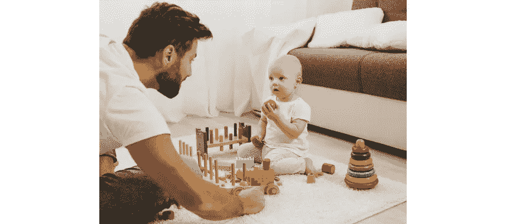

**Visual Inputs:** toy blocks, (moving) person, (my) hands, (my) arms, floor, wall

从我们很小的时候起，我们就通过我们的五种感官观察不同的刺激并与之互动来了解这个世界。人类的感知包括在参考“我所知道的”数据库的同时，对环境中的事物进行连续的命名、表征和记忆。如果我在我的数据库中看到接近某个特定类别的东西，我*会认出*它。如果它和我数据库中的任何东西都不一样，我就把它作为新数据添加进去。多年这种持续的自下而上的学习自然赋予了我们 ***在*感知**方面的灵活性，比如:

*   识别环境中不存在物体
*   同时识别多个物体
*   跨不同媒介识别物体的形状(例如，真实生活与草图)

这些也使我们变得强壮，能够根据视觉刺激的环境采取不同的视角。

# 神经网络的不灵活性🤖

为视觉训练的神经网络怎么样？如今，很容易下载一个预先训练好的 CNN 网络 ImageNet，并对其进行微调，以对不同类别的图像进行分类。但是它有上面列出的感知灵活性吗？我们能指望它自然地推断出给定数据之外的东西吗？给定*格式*以外的数据呢？答案是否定的。他们的“感知”能力被严格限制在以下范围内:

*   给定输入图像(x)
*   目标标签的给定格式(y)
*   给定任务(损失函数，类别数)

让我重复一下[我的帖子中讨论数据在机器学习中的核心作用的主要观点](/codex/data-data-data-32376be378b0)。当我训练一个机器学习模型的时候，模型只对把我给的数据(x)映射到一个特定形式的标签(y)感兴趣，这个标签也是我给的。作为一名机器学习工程师，我负责为模型设置环境和道具。计算机只是计算硬件。那么我该怎么做才能让模特更灵活地感知图像呢？我可以优化我提供的数据。

# CNN 的灵活性训练—数据优化

在这篇文章中，我将讨论这样的界限如何在视觉感知中限制 CNN，这对人类来说可能是微不足道的，这可能导致模型的不灵活和通常不直观的行为。我还将通过用不同的方式注释或优化数据来呈现我发现的对每个不灵活性的补救措施。下面是我将要讨论的三个不灵活性:

1.  无法识别物体的缺失→ **包括“无中生有”类**
2.  无法同时识别多个对象→ **为每张图像使用多个标签**
3.  无法在不同的图像纹理中识别相同的对象形状→ **使用风格化的 ImageNet 鼓励形状偏好而不是纹理偏好**

我还将分享我在多伦多大学硕士研究的自动威胁检测项目的每种数据优化方法的动机和应用。我将继续提到的图像识别模型是**，仅用普通相机(网络)图像进行训练，然后用 x 射线图像进行测试**(由于只有少量的 x 射线图像可用)。详细背景请见本[项目介绍帖](/@lucrece.shin/ml-masters-research-project-beginnings-43894d13b3cb)和我的项目帖列表[。](/@lucrece.shin/list/machine-learning-research-portfolio-0437a30c89fa)

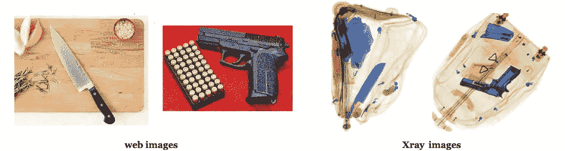

My model is trained only with normal camera (web) images then tested with Xray images, due to only a small amount of Xray images available.

# 不灵活#1:不能识别对象的缺失

## (1.1)你为什么把篮球归类为刀？

我有一个 ResNet50 型号:

*   接受过**枪对刀二元分类**的培训
*   仅使用枪(0 类)和刀(1 类)的图像进行训练
*   显示枪和刀的测试图像有 99%的准确性

看看以下同型号的预测:

A gun vs. knife binary classification model confidently classifies most images containing neither classes as knife.

我在[我的关于 ResNet50](/@lucrece.shin/chapter-3-2-transfer-learning-with-resnet50-from-performance-analysis-to-unexpected-riddle-abe2da3b4e8f) 迁移学习的帖子中提到过这个问题，其中模型**自信地将大多数既不包含枪也不包含刀的图像归类为刀**。与我的预期相反，该模型在对完全不相关的图像进行分类时，会对枪和刀类输出接近 50/50(非决定性)的概率。为什么？

## (1.2)黑白决策边界

正如在[我的关于 t-SNE 图的帖子](/@lucrece.shin/chapter-4-using-t-sne-plots-as-human-ai-translator-c5ef9c2f2fa4)中所讨论的，我有一种直觉，二元分类模型学习“黑白”决策边界。它**仅检查测试图像位于边界**的左侧还是右侧。因此，它只能给我们左(0 类)或右(1 类)选项，无法识别任一对象的**不存在**，即使任一对象形状在图像中不存在。例如，当看到一个篮球的图像时，模特完全不能思考:

“哦，这看起来不像我以前见过的任何东西，所以我不能把它归为这两类中的一类。让我将最后一个完全连接的图层的输出要素数量从 2 调整为 3。这样我就可以把它归为第三个‘非枪非刀’类了”。

## (1.3)看问题的背景

如果我们计划在输入图像严格属于两个类别之一的情况下使用该模型，这不会是太大的问题。但是，如果模型可以接收任何类型的图像，并且预计该图像不包含任何类，那该怎么办呢？

## (1.4)x 光扫描仪，可将每件行李归类为有害物品

一般来说，在机场安检处扫描的大多数行李都不包含枪或刀。当我用 300 个良性(不包含枪或刀)x 射线扫描图像测试相同的枪与刀二元分类模型时；然而，93.7%被归类为具有高置信度的刀，如下所示。

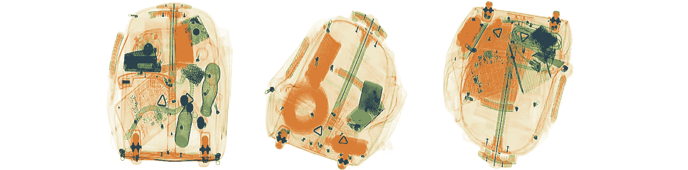

Examples of benign Xray images

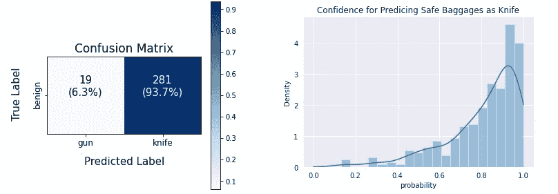

Confusion matrix (left) “knife” class prediction confidence (right) for benign Xray images

在几乎每个包中都有刀的情况下，如此高的误报率是不现实的，也是非常低效的。

# 补救措施#1:引入“无上述”类

为了解决这种不灵活性，我引入了第三个“良性的”(既非枪也非刀)类**，表示世界上所有非枪或刀的对象**。为了收集这堂课的训练图像，虽然除了枪和刀之外还有无限的东西，但我还是尝试使用可能在机场行李中找到的物体。我从谷歌上抓取图片使用的最终搜索关键词包括:*书、汽车、电线、水瓶、胶带、纱线、音箱、盒子、*和*太阳镜*。

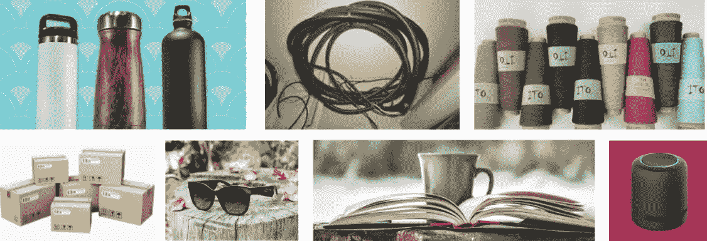

Examples of collected images for benign class

## (1.5)x 射线图像的性能:高失误率

下面是引入良性类前后 x 射线图像上模型性能的比较。回想一下，模型在训练期间不使用 x 光图像([细节](/mlearning-ai/chapter-2-source-domain-data-collection-d00cb426d559))。

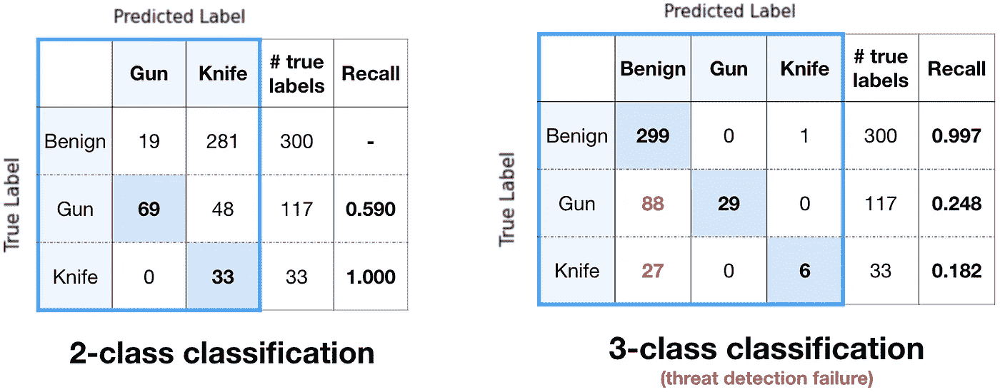

Confusion matrices for 2-class and 3-class classification for Xray images

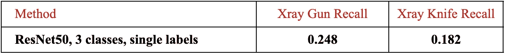

Gun/Knife Recall Table for Xray images (V1)

结果与仅检测到 25%和 18%的枪支和刀具相差甚远，从高虚警(2 级)转向高漏检(3 级)。在威胁检测中，错过是非常不受欢迎的，因为我们不想错过包里带着枪或刀的人！

## (1.6)回望巴塔

试图找到高小姐的原因，我看着输入的图像:

Xray images and web images containing knife and gun

如上所示，除了枪或刀之外，大多数行李的 x 射线扫描图像包含许多其他物体，而大多数网页图像显示的是一个明显的、孤立的物体。因此，当模型将 x 射线图像分类为良性时，它可能正在查看其他对象，而不是枪或刀。无法考虑图像中存在一个以上类别的可能性，例如良性物体*和*枪。这成为图像识别模型的另一个致命的不灵活性。

# 不灵活#2:不能同时识别多个对象

## (2.1)你没看见刀吗？

这种不灵活性适用于网页图像以及 x 光图像。下面展示了同一个模型是如何在一个明显包含枪和刀的图像中识别枪的。

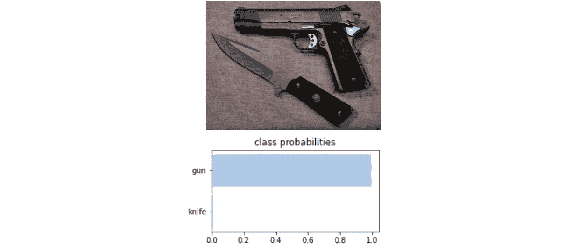

Gun vs. Knife binary classification model not recognizing knife in the image

该模型还不如被训练成*枪对非枪*二元分类，而不是*枪对刀*。它对刀的不敏感也是相当惊人的。

一般来说，用于训练图像识别模型的最被接受的数据注释是为每个图像分配一个从 0 到 N-1 的**单一数字目标标签**，其中 N 是类别的数量。然而，这限制了模型将图像分类为仅一个可用类别。我们如何以不同的方式标注数据，以便模型可以判断图像中是否存在多类对象？

# 补救措施#2:用多个类别标签注释每个图像

我想到的解决方案是:不是让模型将图像分类为 N 个类别(单标签)中的一个，而是让它预测包含 N 个类别(多标签)中的每一个的图像的**N**概率。此表总结了使用单目标标签和多目标标签标注图像的差异:

Using single labels vs. multi labels for data annotation

## **目标标签的数量**

使用单标签时，图像的目标标签是一个数字(0、1、2 等)。)，代表 N 个类中的一个。对于多标签，目标标签是 N 个二进制数(0 和 1)的列表，其中 1 表示该类存在于图像中，0 表示它不存在。

## **软标签**

对于我的威胁检测问题，我发现对良性类别使用*软标签*是有益的，因为与枪和刀类别相比，该模型倾向于将图像分类为良性，具有更高的可信度。由于检测良性物体没有检测枪或刀重要，我将良性信号变弱，用 0.5 替换良性类别标签，同时保持其他为 1。

## **损失函数**

使用单标签，该模型将输入图像分类到单个目标类别中。因此，我们对来自最后一个全连接层的逻辑进行 softmax 激活，这在训练期间被用于计算交叉熵损失。使用多标签，该模型预测图像包含每个类对象的概率。因此，softmax 激活被替换为 sigmoid，为每个目标类输出 0 到 1 之间的概率。对于多维目标，交叉熵损失转化为二值交叉熵损失。由于我对良性类使用了 0.5 的软标签，所以我使用了 MSE 损失而不是 BCE 损失。

## (2.2)所有输入图像的重新标记

Three different types of images and respective target labels

我重新注释了所有输入图像的目标标签，以便区分包含单个孤立对象的图像和包含背景中其他良性对象的图像。例如，上面的图像(a)被赋予了一个标签 **[0，0，1]** ，它代表 **[P(良性)，P(枪)，P(刀)]** ，只有 P(刀)=1，因为该图像只包含一把刀，没有任何其他对象。图像(b)带有刀和其他良性物体，如蘑菇🍄和肉🥩被赋予**【0.5，0，1】**的标签，P(良性)为 0.5 作为软标签，P(刀)为 1。同样的事情也适用于图像(c)的枪和刀类。

## (2.3)改进了 x 射线图像中枪和刀的召回

下面是用单标签和多标签数据训练的模型在 x 射线图像上的性能比较。你可以看到这两个级别的召回增加了近两倍。

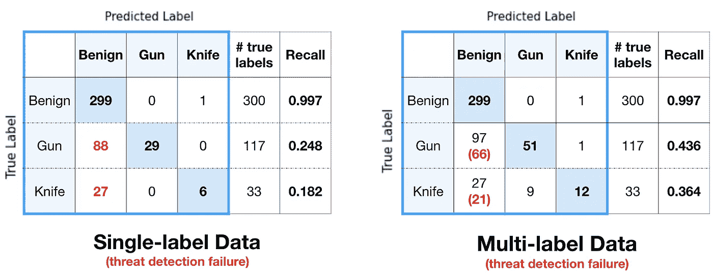

Confusion matrices for Xray images for models trained with single-label and multi-label data

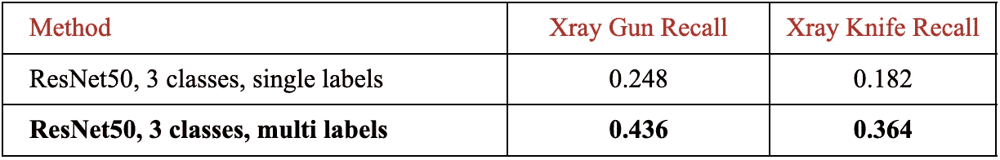

Gun/Knife Recall Table for Xray images **(V2)**

对于用多标签数据训练的模型，我使用 0.3 的预测阈值，这意味着如果某个类的预测 logit 大于 0.3，我就认为该图像属于该类。这样，如果一个以上的类的 logits 超过 0.3，我也可以预测测试图像的多个标签。

右侧混淆矩阵显示，用多标签数据训练的模型将大多数枪和刀图像分类为良性，这是好的，因为在大多数 x 射线图像中确实存在许多其他良性对象。

# 不灵活#3:不能跨不同的图像纹理识别相同的对象形状

## (3.1)纹理偏移

**Texture shift** from web images to Xray images

由于从 web 图像到 x 射线图像存在明显的纹理偏移，所以最好确保模型**正确地学习每个威胁对象**的*形状*，使得**纹理偏移不会影响其性能**。

## (3.2)纹理假设/纹理偏差

请看下图，该图显示了 4 种不同的 CNN 架构和人类将前四幅图像分类为“猫”而将最后一幅图像分类为“大象”的准确度:

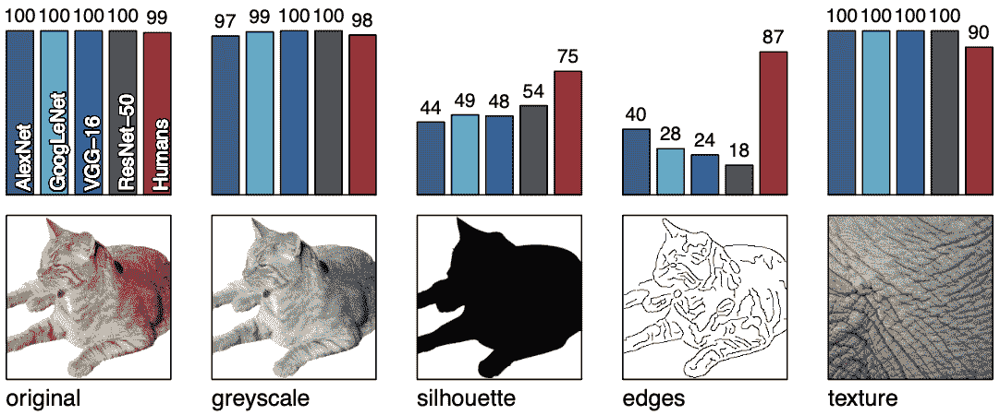

Accuracies of CNN architectures and humans for classifying the first four images as “cat” and the last image as “elephant” (Source: [https://arxiv.org/abs/1811.12231](https://arxiv.org/abs/1811.12231))

这个结果发表在一篇名为 [*的论文中，ImageNet 训练的 CNN 偏向于纹理；增加形状偏差提高准确性和鲁棒性*](https://arxiv.org/abs/1811.12231) 由 Geirhos 等人于 2019 年发表。尽管风格/纹理发生了变化，但大多数人可以很容易地将前四幅图像识别为一只猫。相比之下，当纹理更改为轮廓和边缘时，AlexNet、LeNet、VGG16 和 ResNet50 的精度会急剧下降。这说明了 ***纹理假说*** :(引自同一篇论文)

> 对于 CNN 目标识别，目标纹理比全局目标形状更重要。 ***纹理等局部信息实际上可能足以“解决”ImageNet 对象识别。***

这个想法反映在所有 4 个 CNN 架构将最后一个象皮图像分类为大象的 100%准确度中。如果是的话，**如何让模型对物体的*形状*而不是纹理更敏感？**

# 补救措施#3:使用**风格化的 ImageNet 数据集**增加模型中的形状偏差

作为对纹理偏差的补救，该论文建议用来自 ImageNet 数据集的 ***风格化的*** 图像来训练模型。对图像进行“风格化”意味着:

*   保持图像中的内容/形状
*   使用 [AdaIN 风格转移](https://arxiv.org/abs/1703.06868)用数字数据集(包含 79434 幅画)替换从 [Painter 中随机选择的画的图像中的风格/纹理](https://www.kaggle.com/c/painter-by-numbers)

这是一个用十种不同的绘画风格化的狐猴图像的例子。

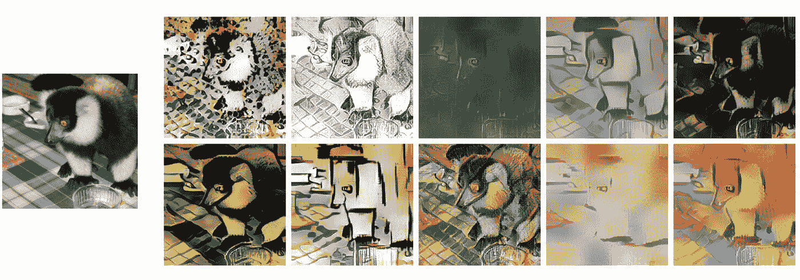

**10 Stylized samples of an image of class “*ring-tailed lemur”*.** The samples have content/shape of the original image on the left and style/texture from different paintings (Source: [https://arxiv.org/abs/1811.12231](https://arxiv.org/abs/1811.12231))

风格化的图像保留了狐猴的外形轮廓，同时具有多样化的纹理。这使得*局部*纹理线索不再高度预测目标类，迫使模型更加关注对象的全局形状。在中，将风格化数据集命名为**风格化 ImageNet (SIN)** ，将原始 ImageNet 图像命名为**。用 SIN 和 IN 中的一种或两种进行训练的实验结果如下表所示:**

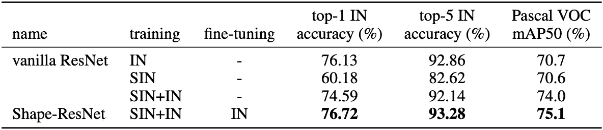

Accuracy comparison on the ImageNet (IN) validation dataset & object detection performance (mAP50) on PASCAL VOC 2007\. All models have an identical ResNet-50 architecture.

对于我的威胁检测问题，我使用了在 SIN 和 IN 上预先训练的性能最好的模型(最后一行),然后在 IN 上进行微调。论文作者的 [github 资源库](https://github.com/rgeirhos/texture-vs-shape)中提供了下载模型检查点的代码说明。我再次使用多标签对良性、枪和刀类的网络图像的模型进行了微调。我也尝试将我自己的枪和刀的图像风格化；然而，验证结果不如使用原始图像好。

## (3.3)改进了 x 射线图像的模型性能

以下是使用原始和风格化 ImageNet 训练的模型在 x 射线图像上的性能比较。您可以看到，这两种产品的召回率都增加到了 71%和 73%。

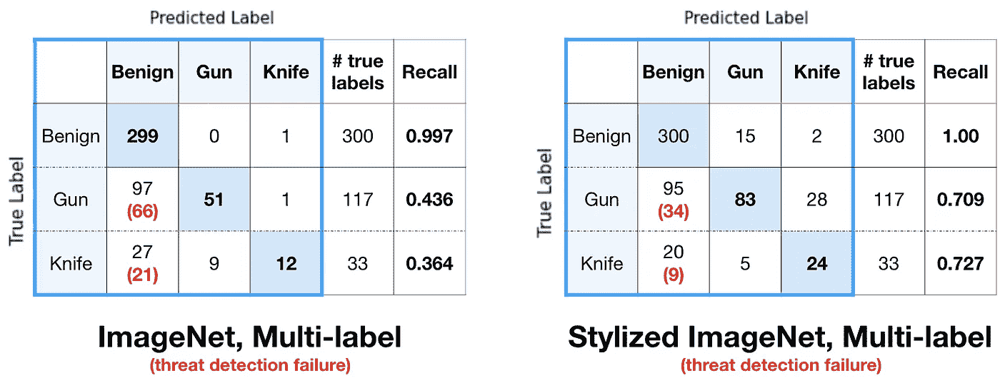

Confusion matrices for Xray images for models trained using original ImageNet (left) and Stylized ImageNet (right)

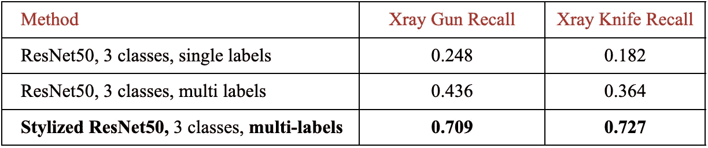

Gun/Knife Recall Table for Xray images **(V3)**

虽然召回一直持续到 70 年代，但这对于威胁检测系统来说是不可靠的。我将在以后的文章中讨论我是如何使用领域适配来提高门槛的。

# 关闭

我们研究了三种数据优化方法，这些方法鼓励基于 CNN 的图像识别模型做出更灵活的决定，以适应给定问题的背景。一些读者可能想知道**为什么不使用一个可以执行更复杂任务的对象识别或语义分割模型。**可以，但它们需要更大、更复杂的模型架构和昂贵的数据注释(考虑语义分割的像素级标记)。

优化数据就像通过**试验不同的光线和角度来学习如何拍摄有创意的照片，而不是购买更昂贵的相机。**我*可以*用昂贵的相机为我设置/优化每一个设置来拍出好照片，但我永远不会掌握切换不同变量来在照片中创造我想要的感觉的技能。

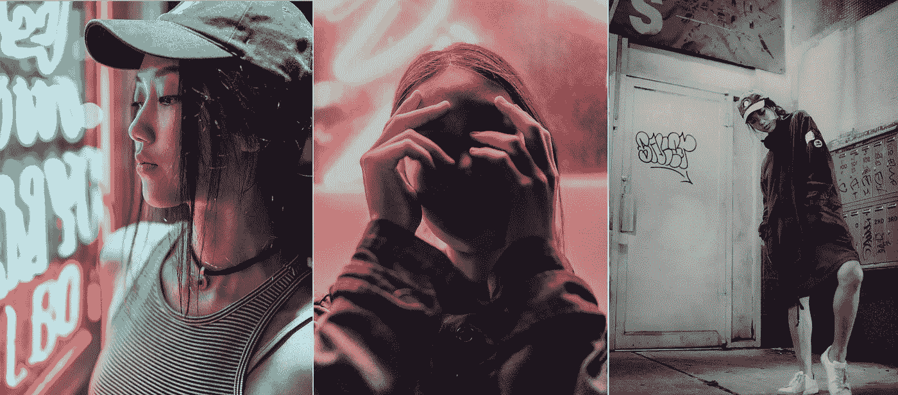

Me captured by the light magician [Andre](https://www.instagram.com/andrecwidjaja/) 🌙

您可以[联系我](mailto:lucrece.shin@mail.utoronto.ca)了解任何关于我的方法的问题或反馈。我很想知道其他 ML 研究人员的想法。感谢阅读！🌸

-☾₊˚.