# 第八章。对抗性区分域适应(ADDA):语义对齐的探索

> 原文：<https://medium.com/mlearning-ai/ch-8-adversarial-discriminative-domain-adaptation-adda-quest-for-semantic-alignment-1fc7e4ba6a86?source=collection_archive---------0----------------------->

## 通过切换数据注释、训练框架和预训练数据集来优化领域适应性

在这篇文章中，我将介绍机器学习中的领域适应的概念，并讨论优化敌对歧视领域适应(ADDA)框架的过程。以下是目录:

1.  领域适应的动机——领域转换
2.  领域适应的目标——语义对齐
3.  web→x 射线域自适应
4.  ADDA —算法
5.  快速查看多标签
6.  实验#1:仅用 web(源)域微调预先在 ImageNet 上训练的 ResNet50
7.  实验#2:在 ImageNet 上预训练编码器的 ADDA
8.  break time:Web→Xray 域转移的根源是什么？
9.  实验#3:在风格化+原始 ImageNet 上预训练编码器的 ADDA
10.  领域适应:前景

# 1.领域适应的动机——领域转换

看看这个有趣的观察:

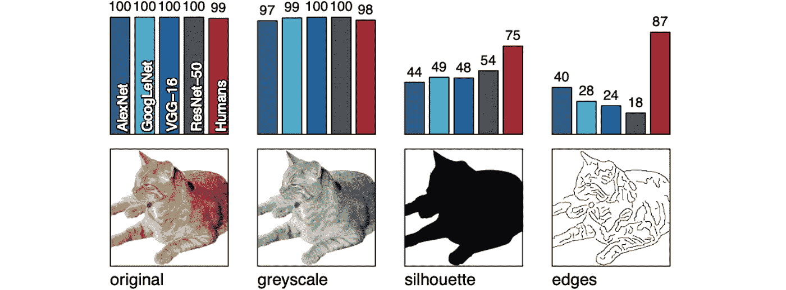

Classification accuracies of 4 CNN architectures and humans for classifying the images as “cat” 🐱 (Source: [https://arxiv.org/abs/1811.12231](https://arxiv.org/abs/1811.12231))

这个结果呈现在 [*ImageNet 训练的 CNN 偏向于纹理；增加形状偏差提高了准确性和鲁棒性*](https://arxiv.org/abs/1811.12231) (2019)显示，虽然大多数人类可以很容易地将所有四个图像识别为一只猫🐱尽管风格发生了转变，但所有四个基于 CNN 的图像分类模型 AlexNet、LeNet、VGG16 和 ResNet50 的性能对于《剪影和边缘》风格中描绘的猫来说都急剧下降。

在研究中，不同的风格/纹理被称为图像*的不同 ***【域】*** 。*由于神经网络对输入数据的分布高度敏感，仅在图像的单个域(称为 ***【源域】*** )上训练的图像分类模型将**学习编码图像，仅考虑该特定域的** **区别属性**。因此，如上图所示，当在另一个图像域(称为 ***【目标域】*** )上测试时，同一模型可能表现不佳。这个问题被称为 ***域转移*** 。

# 2.领域适应的目标——语义对齐

## 2.1 输入空间和特征空间

我们如何最小化域转移并使模型适应新目标域上的良好概括？这个任务，非常直观地称为 ***域适应*** ，可以通过查看深度学习模型内的两个地方来实现:

1.  **输入空间** —我们可以在目标领域收集或合成足够数量的输入数据，用于训练/微调模型。
2.  **特征空间** —我们可以鼓励模型将来自不同领域但同一类别的输入数据在特征空间中紧密地映射在一起(任务称为 ***语义对齐*** )。

## 2.2 语义(特征)对齐

如果目标领域是小众的或在研究中未被探索，由于数据的缺乏，收集足够的数据可能是不可能的或昂贵的。出于这个原因，在特征空间中进行了许多领域适应的研究，旨在实现*语义对齐，如下所示:*

*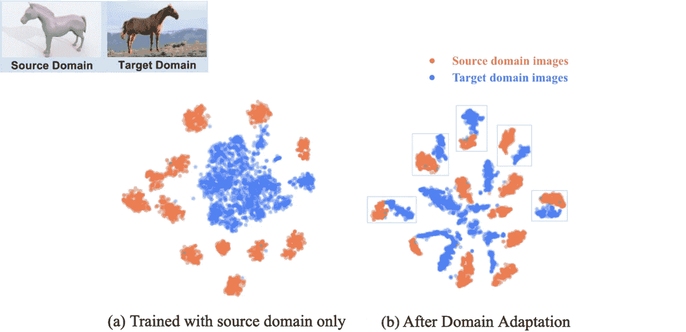*

*t-SNE visualization of [VisDA-2017 dataset](http://ai.bu.edu/visda-2017/) using ResNet101 before and after domain adaptation with [Drop to Adapt](https://arxiv.org/abs/1910.05562) framework; t-SNE hyperparameters are consistent in both visualizations. (Source: Drop to Adapt [Paper](https://arxiv.org/abs/1910.05562))*

*在[*Drop to Adapt:Learning discriminant Features for Unsupervised Domain Adaptation*](https://arxiv.org/abs/1910.05562)(2019)中呈现，这两个图显示了 [VisDA-2017 数据集](http://ai.bu.edu/visda-2017/)(以合成 3D 模型图像作为源域，以真实摄影图像作为目标域的 12 类图像分类)在域适应之前和之后的特征表示。在域适应之前(左)，源域特征(红色)显示为 12 个独立的聚类，而目标域特征(蓝色)显示为一个大斑点。域适应后(右)，目标域特征显示出更好的分离。此外，尽管在图中没有标记不同的类，但是一些红色和蓝色聚类对出现在彼此附近(由青色矩形指示)，这可能代表**相同类**的聚类，说明语义对齐。*

*现在，我将给出一个在普通相机域和 x 射线相机域之间的真实世界域适应的例子。让我简单介绍一下这个项目以及为什么我决定使用领域适应方法。*

# *3.web→x 射线域自适应*

*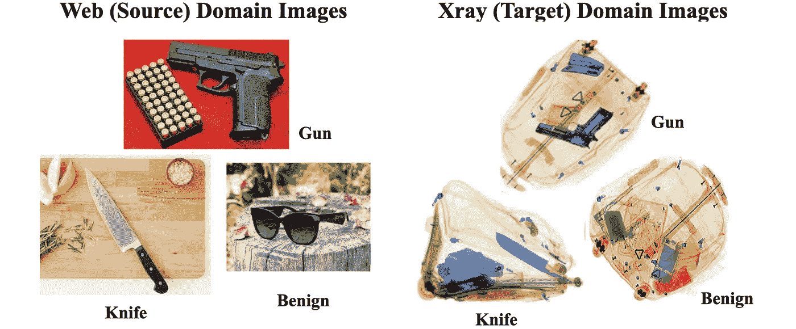*

*Samples of the three classes from web (source) and Xray (target) domains*

## *3.1 给定任务*

*对于我在多伦多大学的硕士研究项目，我被要求为机场 x 光行李扫描仪执行**自动威胁检测**，即给定一个看起来像上面的 x 光扫描图像，检测任何枪或刀(如果存在)。*

## *3.2 给定数据集*

*一个国际机场向我提供了 450 个 x 光行李扫描图像，分为 3 类:枪(117 个图像)、刀(33 个图像)和良性/无害(300 个图像)。但问题是给定图像的数量**不足以在不过度拟合**的情况下训练一个神经网络。*

## *3.3 建议的研究路径*

*考虑到卷积神经网络在计算机视觉方面的突破性表现，我的研究主管建议我开发一个**深度学习**模型。特别是，他建议我使用**图像分类**目标(将整个图像分类为一类)，而不是对象检测(预测对象周围的边界框)或对象分割(将每个像素分类为属于或不属于一类)，以保持模型复杂性适中。他还希望我采取**域适应**的方法，考虑到没有足够的 x 光图像来训练一个神经网络而不过度拟合。这种方法首先从网络上收集大量非 x 射线的、类似股票照片的相同对象类的图像，使用它们来训练模型，并使模型适应 x 射线图像。最后，我的研究小组的博士生建议从**对抗性区分域适应(ADDA)** 框架开始，因为它的算法相对简单，但功能强大。*

*更详细的项目背景，请参考本[项目介绍帖](/@lucrece.shin/ml-masters-research-project-beginnings-43894d13b3cb)和我的项目帖列表[。](/@lucrece.shin/list/machine-learning-research-portfolio-0437a30c89fa)*

# *4.ADDA —算法*

*[**对抗性判别域自适应(ADDA)**](https://arxiv.org/abs/1702.05464) 框架(2017)引入了一个有效的无监督(意味着目标域数据是无标签的)域自适应框架***减少源和目标域分布之间的差异，从而提高泛化性能*** 。*

## *4.1 GAN 与 ADDA 的关系*

*ADDA 的名字中带有“对抗性”和“歧视性”的术语，你可能会想起[生成性对抗网络(GAN)](https://arxiv.org/abs/1406.2661) (2014)。让我们比较一下这两者:*

## *GAN —图像生成*

*   ***输入，输出—** 潜在向量 z，由 G 生成的伪图像*
*   ***生成器 G** (反卷积层)——将 1D 潜向量 z 映射成 3D 假图像*
*   ***鉴别器 D** (卷积层+全连接层)——将 3D 图像映射为真实或虚假的二进制标签(即 0 代表虚假，1 代表真实)*
*   ***D 的目标** — 将输入 x 分类为真，将 G 的输出分类为假*
*   ***G 的目标** — **迷惑 D** 将 G 的输出归为真实*

## *ADDA —图像分类*

*   ***输入，输出** —图像 x，类别标签 c*
*   ***编码器** **E** (卷积层数；通常是强骨干，例如 ResNet50)，将 3D 图像映射到 1D 特征向量*
*   ***分类器 C** (全连接层)——将 E 的 1D 特征向量输出映射到**类标签** c 中*
*   ***鉴别器 D** (全连接层)—将 E 的 1D 特征向量输出映射到**二进制域标签** d (1 表示源域，0 表示目标域)*
*   ***D 的目标** —将源域和目标域特征分类为它们的**真实域标签** (1 为源域，0 为目标域)*
*   ***E 的目的**——(1)以类别区分的方式对输入图像进行编码以及(2) **混淆 D** 以将源和目标域特征分类为它们的**伪域标签** (0 表示源域，1 表示目标域)，以便产生在特征空间中不可区分的源和目标域特征*
*   ***C 的目标** —区分不同类别(例如交叉熵损失)*

## *4.2 ADDA —不对称映射*

*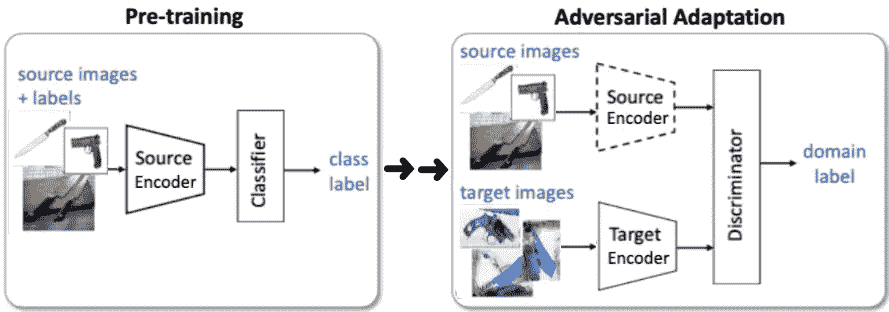*

*Sequential training with asymmetric mapping (original ADDA)*

*ADDA 论文提出使用两个独立的编码器来映射源和目标域图像。如上图所示，**分类和域适配任务依次执行，一个接一个**。首先，在标记的源图像的*类标签*上预先训练源编码器。接下来，用源编码器的预训练权重初始化与源编码器具有相同架构的目标编码器，然后在源编码器权重被冻结时，使用二进制(源对目标)*域标签*来训练目标编码器。由于 ADDA 执行 ***无监督*域自适应**，它假设目标域数据是未标记的，并且不针对目标域上的类别分类进行优化。*

*该论文提出，源编码器和目标编码器之间的这种不对称映射更加灵活，因为它允许学习更多特定于领域的特征提取。*

## *4.3 修改的 ADDA 对称映射*

*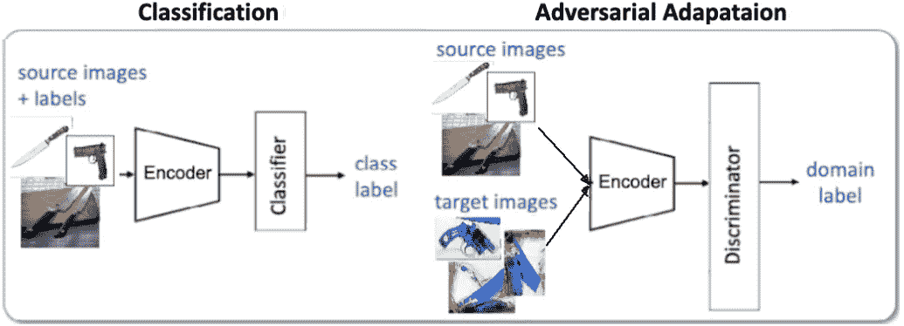*

*Parallel training with symmetric mapping (modified ADDA)*

*我稍微修改了 ADDA，增加了一个*编码器来映射来自源域和目标域的图像。这消除了源编码器的预训练阶段。如上图所示，**单个编码器在单个时期内同时*被训练用于分类***(仅使用源域图像和类标签)、**和域适应**(使用源和目标域图像+二进制域标签)。**

*我如何想到这种修改的是，一篇关于深度学习在 x 射线安全成像中的应用的[调查论文](https://arxiv.org/abs/2001.01293) (2021)报告说，大多数公认的用于域适应的对抗鉴别模型都使用对称映射。*

*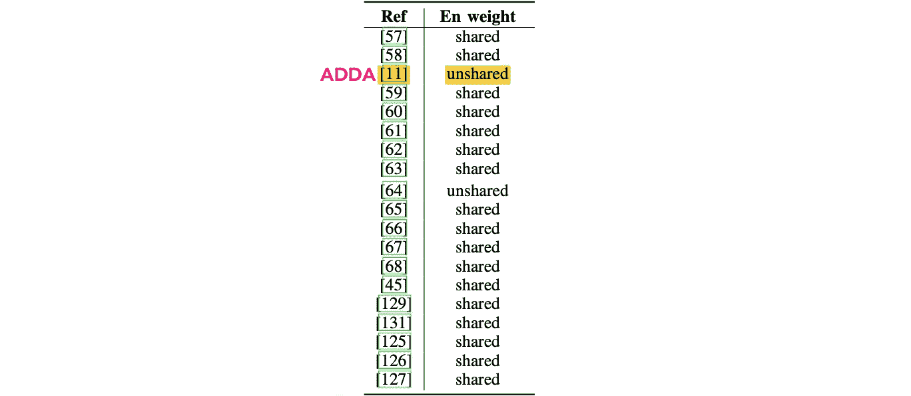*

*Comparison of different adversarial discriminative models, where ‘En’ is short for Encoder. ‘shared’ means symmetric mapping with a single encoder sharing weights for both source and target domain, while ‘unshared’ means asymmetric mapping with two separate encoders. Highlighted in yellow is the ADDA paper. (Source: [Survey paper](https://arxiv.org/abs/2009.00155) on unsupervised domain adaptation, 2021)*

*当使用对称映射时，我还观察到了更好的性能。这可能是因为对于非对称映射，源编码器的预训练权重可能已经**太偏向于根据它们的类别标签映射源域图像**，作为目标编码器的次优起点。因为对称映射允许在一个训练时期中同时优化分类和域适应，所以编码器可以考虑这两个任务来调整权重。*

## *4.4 ADDA —报告的性能*

*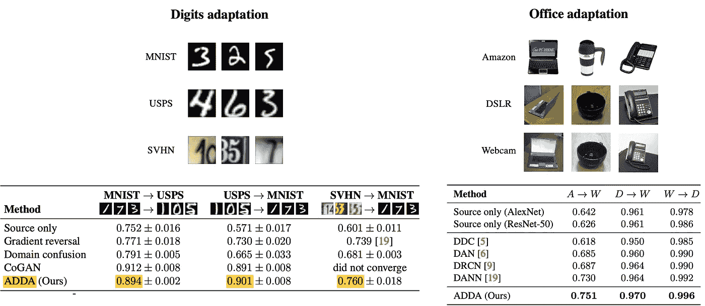*

*(Left) MNIST, USPS, and SVHN samples and ADDA experimental results (Right) Office dataset samples and ADDA experimental results (Source: ADDA [paper](https://arxiv.org/abs/1702.05464))*

*上表显示了 ADDA 对于数字识别和办公对象识别任务的性能，其远优于仅使用源域数据训练的“仅源”模型，并且比之前的域适应框架相当好。这篇论文没有提到语义对齐；不过，我稍后会针对我自己的问题展示 ADDA 是如何实现的。*

*我的 [Colab 笔记本](https://github.com/lukysummer/Adversarial-Discriminative-Domain-Adaptation-with-multi-label-data/blob/main/ADDA_multi_label.ipynb)中包含了 ADDA training 的一步一步 PyTorch 实现(以及 t-SNE 绘图和定义多标签数据集的功能)。接下来，我将按时间顺序讨论我的领域适应实验。在每一步，我将呈现源和目标域特征的 t-SNE 图，以检查语义对齐。*

# *5.快速查看多标签*

*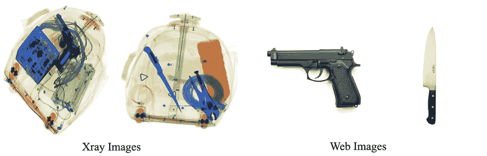*

*Xray images and web images containing knife and gun*

*如上所示，大多数 x 射线扫描图像包含**其他良性(即无害)物体，其中混杂着枪支或刀具**，而大多数网络图像显示的是孤立的物体。因此该模型可以很容易地注意到 x 射线图像中除枪或刀之外的其他物体。考虑到这一点，用标准的*单个*标签(类别 0、1 或 2)注释每个图像不允许模型预测图像中存在一个以上的类别，例如枪*和*其他良性物体。为了解决这个问题，我为每个图像分配了一个**多标签**:*

*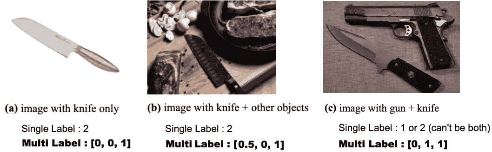*

*Three different types of images and respective target labels*

*值得注意的是，我发现该模型倾向于将图像分类为良性类别，与枪和刀类别相比具有更高的可信度(非常直观地，因为良性类别代表除了枪和刀之外的宇宙🤨).因为检测良性物体没有检测枪或刀重要，所以我通过给良性类一个 0.5 的“软”标签来减弱良性信号，同时保持其他类为 1。*关于多标签的更多细节在我的* [*上一篇关于数据优化的*](/mlearning-ai/ch-6-optimizing-data-for-flexible-and-robust-image-recognition-23f4dcce3af7#ec5e) *中讨论。**

# *6.实验#1:仅用 web(源)域微调预先在 ImageNet 上训练的 ResNet50*

*对于我的初始实验，我下载了 ResNet50，其权重在 [ImageNet](https://image-net.org/) 数据集上进行了预训练，并针对单标签和多标签情况在 web(源)域图像上对其进行了微调。**该过程中未使用 x 射线(目标)域图像。**对于这两种情况，源域图像的模型召回在不到 10 个训练时期内达到 0.99+。相比之下，由于结构域转移，x 射线(靶)结构域召回率很低:*

*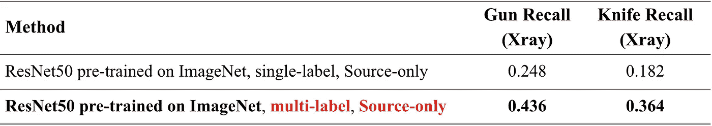*

*Recall table for Xray images (v1)*

*多标签案例的召回率虽然是单标签案例的两倍，但仍远低于预期的 100%。下面是经过微调的 ResNet50 使用多标签数据编码的源和目标域特征的 t-SNE 图，带有按域(左)和域+类(右)的颜色标签。*

*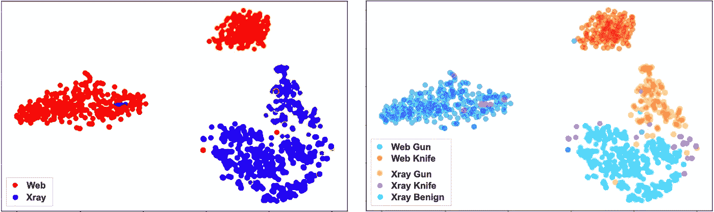*

*t-SNE plot of source-only, multi-label model features, distinguished by domain (left) and by domain+class (right)*

*左图显示了与第 2.2 节左图相似的模式，其中红色的 web(源)域特征按类(枪和刀)紧密聚集，而蓝色的 x 射线(目标)域特征显示为一个斑点。右图显示，该模型远未实现语义对齐。我们确实看到 x 射线枪功能(黄色)倾向于 web gun 功能(红色)，但它们仍然更接近 x 射线刀和 x 射线良性功能。x 射线刀特征(粉红色)随机分散，没有接近网状刀簇(钴蓝色)的迹象。这意味着**模型不能完全通过 x 射线纹理**来检测它被训练在 x 射线图像中检测的物体。*

# *7.实验#2:在 ImageNet 上预训练编码器的 ADDA*

*接下来，我用 ADDA 框架进行了训练。我首先指定编码器具有与 ResNet50 相同的架构，并使用在 [ImageNet](https://image-net.org/) 数据集上预先训练的权重对其进行初始化。然后，我使用(1)用于分类的网页图像及其类别标签和(2)网页和 x 光图像以及用于域适应的 0 对 1 域标签来训练编码器。由于 ADDA 执行无监督域自适应，x 射线图像的**标签从未使用过**。下面是在几个中间训练时期:(时期 1，5，10，15，21)编码器特性的 t-SNE 图*

*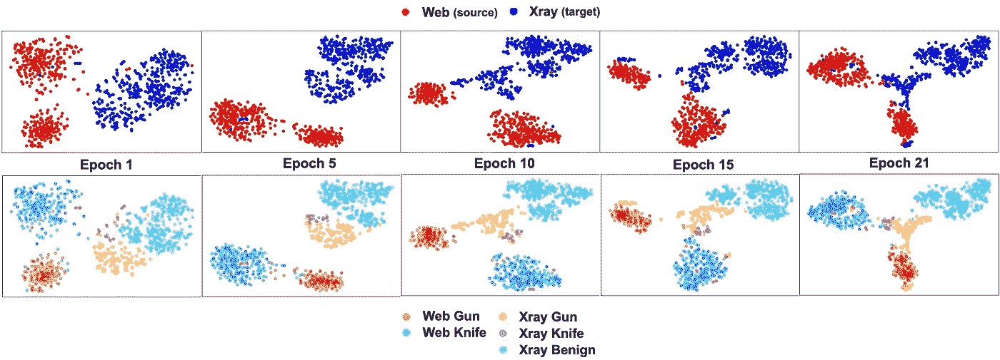*

*t-SNE plots of ADDA encoder (pre-trained on ImageNet) features, distinguished by domain (top) and by domain+class (bottom) at training epochs 1, 5, 10, 15, 21*

*在时段 1，我们看到一个蓝色的 x 射线特征的单个斑点，所有三个类别聚集在一起。随着 ADDA 培训的进展；然而，单个斑点开始分裂。x 射线刀特征(粉色)开始向网状刀特征(钴蓝色)迁移，而 x 射线枪特征(黄色)开始向网状枪特征(钴蓝色)迁移。在 epoch 21，x 射线枪和 x 射线刀特征与 x 射线良性特征相距很小，这是实现语义对齐的巨大进步！这种质的提高也反映在枪支和刀具召回的增加上:*

*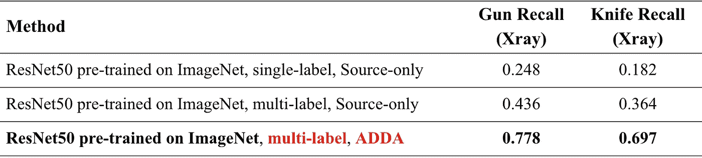*

*Updated recall table for Xray images (v2)*

# *8.break time:Web→Xray 域转移的根源是什么？*

*尽管有这样的改善，78%和 70%的枪支和刀具召回仍然远远不能确保飞行安全。我们已经试过 ADDA 了，下一步我们能做什么？🤔我尝试用我的数据集训练最近引入的其他几个领域适应框架(如 [Drop to Adapt](https://arxiv.org/abs/1910.05562) 、[Domain mix](https://arxiv.org/abs/1912.01805)、 [DADA](https://arxiv.org/abs/1904.01886) )，但无法获得任何更好的结果。所以我反而更多的想到了 web 的 ***根***→Xray 域移位问题。*

*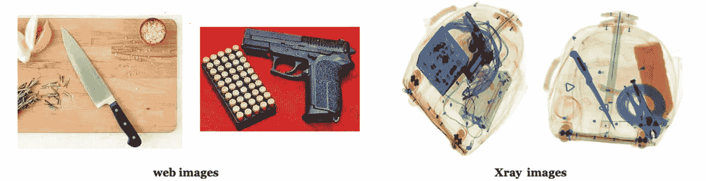*

*Samples of Web images and Xray images containing gun and knife*

*查看 web 和 x 射线图像，我可以指出两个主要区别:*

1.  ***纹理偏移**—与网络图像相比，x 射线图像的颜色有限，透明度增加，且略微模糊*
2.  ***对象混乱程度** —与明显存在主要对象的网络图像相比，x 射线图像包含杂乱的不同对象*

*但是，尽管如此困难，我们人类怎么能在 x 光图像中发现枪或刀呢？也许我们清楚地记得枪和刀的**形状**并试图在 x 光图像中定位它。想到这里，我想到了本文开头介绍的那篇论文: [*ImageNet 训练的 CNN 偏向于纹理；增加形状偏差提高精确度和鲁棒性*](https://arxiv.org/abs/1811.12231) (2019)。*

*本文提出了 ***纹理假说*** ，该假说认为*“对于 CNN 目标识别，目标纹理比目标整体形状更重要。诸如纹理的局部信息实际上可能足以‘解决’ImageNet 对象识别”。*这是 CNN 模型的一个致命缺陷，尤其与我的问题有关，从网络图像到 x 光图像发生了巨大的纹理变化。所以为了使模型对物体的 ***形状*** 而不是纹理更加敏感，建议用**风格化图像**对模型进行预训练。“风格化”图像意味着保留图像中的内容/形状，而**使用 [AdaIN 风格转移](https://arxiv.org/abs/1703.06868)用数字数据集(包含 79434 幅画)从[画师的](https://www.kaggle.com/c/painter-by-numbers)**中随机选择一幅画来替换图像的风格/纹理。这是一个用十种不同绘画风格化的图像示例:*

*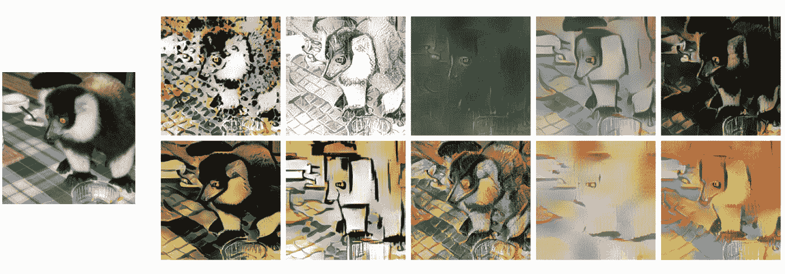*

*10 stylized samples of an image of a ring-tailed lemur. The samples have content/shapes of the original image on the left and style/texture from 10 different paintings (Source: [https://arxiv.org/abs/1811.12231](https://arxiv.org/abs/1811.12231))*

*该论文报告称，模型**在风格化的和原始的 ImageNet 数据集上进行预训练，然后在原始的**上进行微调，表现最佳。论文作者的 [Github 资源库](https://github.com/rgeirhos/texture-vs-shape)中提供了模型检查点和下载说明。*

# *9.实验#3:在风格化+原始 ImageNet 上预训练编码器的 ADDA*

*因此，我再次使用 ADDA 进行训练，将编码器架构设置为与 ResNet50 相同，并使用上面提到的性能最好的模型的权重进行初始化。以下是最终得到的 t-SNE 图:*

*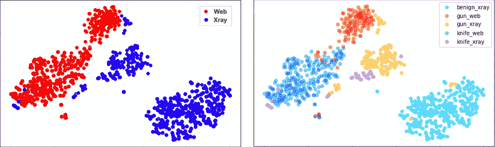*

*t-SNE plot of ADDA encoder (pre-trained on Stylized+Original ImageNet) features by domain (left) and by domain+class (right)*

*你发现以前实验的改进了吗？为了更好地理解，下面是三个实验的图表:*

*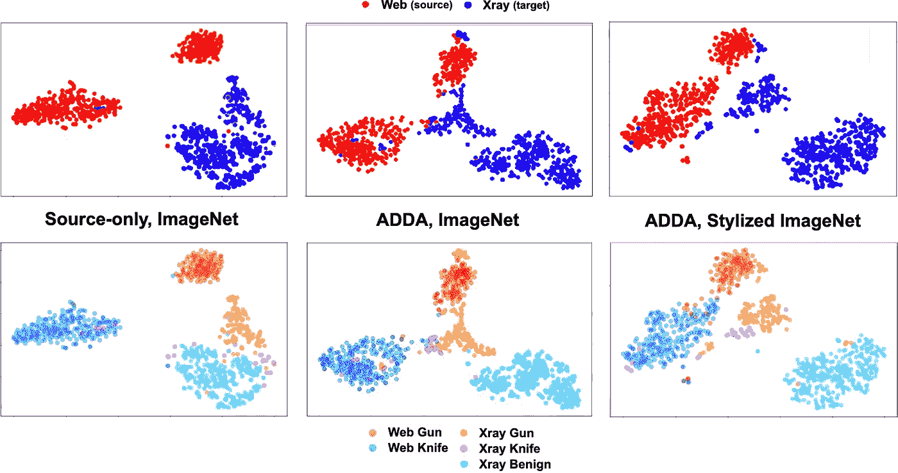*

*t-SNE plots of encoded features by domain (top) / by domain+class (bottom) for three different experiments*

*从左到右看下面三个图，我们看到以下几个方面的进展:*

*   *从 x 射线良性特征(青色)中分离出 x 射线枪和 x 射线刀特征(黄色和粉红色)*
*   *x 射线枪特征(黄色)向网状枪特征(红色)的迁移*
*   *x 射线刀特征(粉色)向网状刀特征(蓝色)的迁移*

*这样的进展说明这个模型已经**实现了语义对齐**。该模型现在能够通过 x 射线纹理进行观察，并检测枪和刀，尽管纹理从普通相机转移到 x 射线。下表显示了最终型号增加的枪支和刀具召回:*

*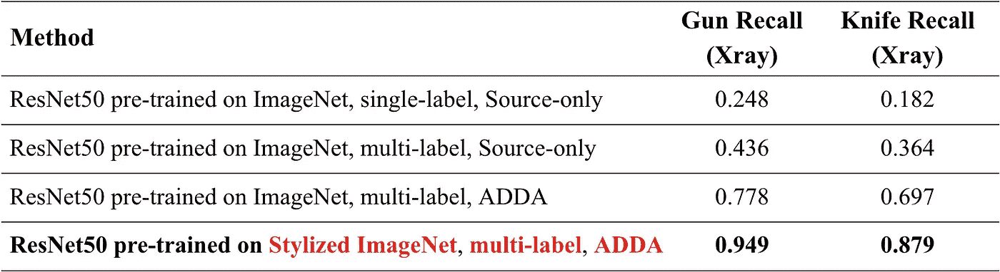*

*Updated recall table for Xray images (v3)*

# *10.领域适应:前景*

*总之，我考虑了领域适应的各种观点，包括模型训练框架、预训练数据、定性度量(语义对齐)和定量度量(回忆)。在这篇文章中，我方便地将我的研究过程分为三个不同的实验，但事实上，在这之间进行了数百个实验(加上淋浴时的数千个思维实验)来测试，仅举几个例子，多标签的[有效性](/mlearning-ai/ch-6-optimizing-data-for-flexible-and-robust-image-recognition-23f4dcce3af7#ec5e)，学习对象形状的[重要性](/codex/ch-7-decoding-black-box-of-cnns-using-feature-map-visualizations-45d38d4db1b0)，以及 t-SNE 图在检查语义对齐中的[有效性(每个都在我的其他链接文章中详细阐述)。还要注意 ADDA 论文从未提到语义对齐，但是在挖掘了许多其他关于领域适应的研究论文后，我认识到它是领域适应的主要目标。](/@lucrece.shin/chapter-4-using-t-sne-plots-as-human-ai-translator-c5ef9c2f2fa4#6d8a)*

*作为机器学习实践者，我们经常旨在找到一篇解决我们自己的类似问题的研究论文，用我们的数据实现并运行算法，然后嘣！精确度达到很高，问题得到解决。但是如果结果不够好，我们必须努力寻找不同的视角来看待问题。我认为我的数据可能与 ADDA 论文中使用的数据集具有非常不同的特征，并寻找适应这种差异的方法。*

*同样，我的 [**Colab 笔记本**](https://github.com/lukysummer/Adversarial-Discriminative-Domain-Adaptation-with-multi-label-data/blob/main/ADDA_multi_label.ipynb) 中包含了 ADDA training 的一步一步 PyTorch 实现(以及用于 t-SNE 绘图和定义多标签数据集的函数)。如有任何问题或反馈，您可以[联系我](mailto:lucrece.shin@mail.utoronto.ca)😊。感谢阅读，机器学习快乐！🦋🦋*

* [## Mlearning.ai 提交建议

### 如何成为 Mlearning.ai 上的作家

medium.com](/mlearning-ai/mlearning-ai-submission-suggestions-b51e2b130bfb)*