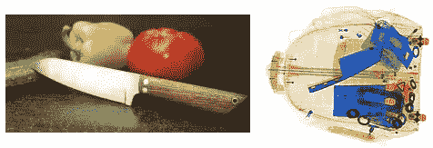
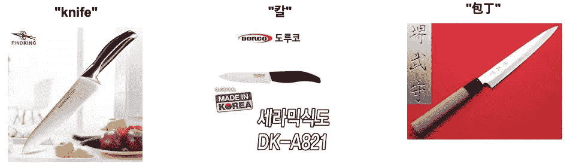
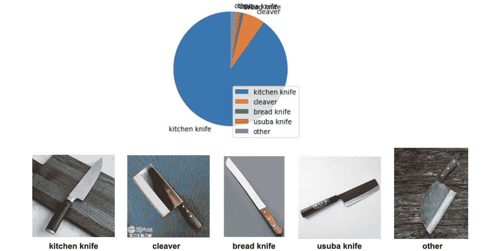
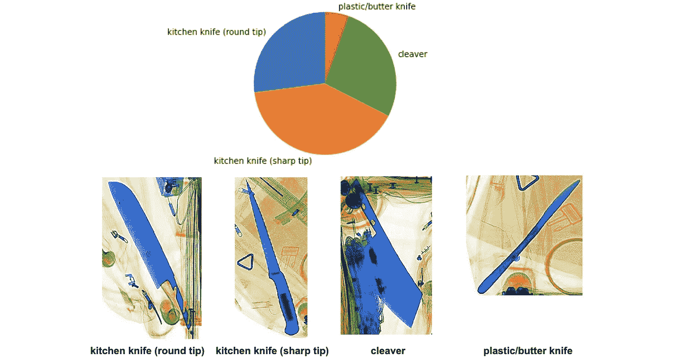
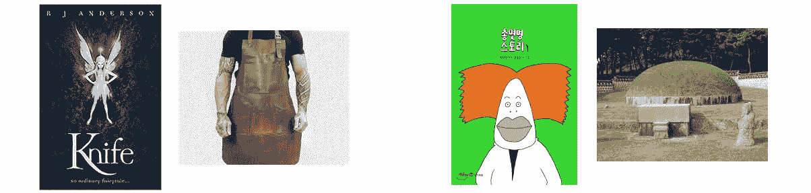
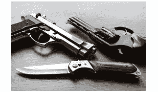
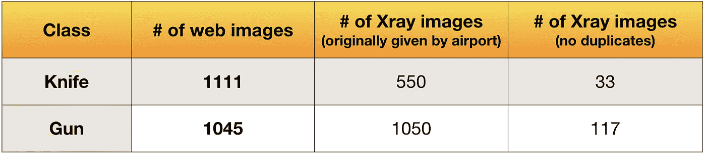

# 甲烷。源域的迭代数据收集

> 原文：<https://medium.com/mlearning-ai/chapter-2-source-domain-data-collection-d00cb426d559?source=collection_archive---------3----------------------->

## 如何创造性地为你的 ML 问题设计数据

***背景:*** *我正在分享我在多伦多大学攻读机器学习硕士学位的计算机视觉研究项目经历。一家机场给了我 x 光行李扫描图像，让我开发一个自动检测危险物品的模型。给定少量的 x 射线图像，我使用域自适应，首先从互联网上收集大量危险物体的正常(非 x 射线)图像，仅使用这些正常图像训练模型，然后调整模型以在 x 射线图像上表现良好。*

在我之前的[帖子](/@lucrece.shin/chapter-1-data-inspection-and-pre-processing-for-xray-images-d95f717684b7)中，我分享了我对给定 x 射线图像的初始数据检查和预处理步骤。我已经把要探测的危险物体的种类缩小到**枪和**刀。在这篇文章中，我将分享用于领域适应的普通相机图像的数据收集过程。以下是我将讨论的主题列表:

1.  **动机**
2.  **源域和目标域**
3.  **数据收集—基本框架**
4.  **数据设计—迭代思维**
5.  **网络图像的数量与 x 光图像的数量**

# 动机

为了给这个步骤提供一个动机，让我解释一下关于**领域适配**的一些事情。[维基百科](https://en.wikipedia.org/wiki/Domain_adaptation)将其定义为能够:

> **将使用[源域]训练的算法应用到不同的[目标域]**

那么为什么不先用目标域来训练算法呢？可能有多种原因，如数据不足(如我们的情况)或标记目标域数据的高成本。正如我在[上一篇](/@lucrece.shin/chapter-1-data-inspection-and-pre-processing-for-xray-images-d95f717684b7)中提到的，我们只有 **117 张包含枪的 x 光图像和**31 张包含刀的 x 光图像。如此小的数量将使神经网络过拟合，该神经网络仅在用大量图像训练时表现良好。因此，我们可以转向互联网来收集大量库存照片般的枪和刀的相机图像，并使用它们来训练模型。然后，我们可以使模型适应 x 射线图像来很好地执行相同的工作。

# 源域和目标域

参考维基百科对域适配的定义，本项目中的*源域*将指危险物体的正常相机图像，*目标域*指包含相同物体的 x 光行李扫描图像。因此，本项目上下文中的术语**“域”**对应于图像的**风格和纹理**。借用维基百科的话，我希望:

> 应用用[s**stock-photo style images]**到**[x 射线行李扫描图像]训练的自动威胁检测算法。**



Normal camera image (source domain) of knife vs. Xray baggage scan image (target domain) of knife.

我该怎么做？我首先需要源域和目标域的适当图像数据。对于目标领域，我已经有机场提供的 x 光行李扫描图像。对于源域，我必须从网上搜集公开可用的图片。对于抓取任务，有一个方便的 [fast.ai](https://docs.fast.ai/) 库，可以让我们轻松地从谷歌图片搜索中下载图片。让我们开始吧。

# 数据收集——基本框架

1.  进入[谷歌图片搜索主页](https://www.google.com/imghp?hl=en)，输入合适的搜索关键词(我用的是谷歌 Chrome 浏览器)。
2.  要获得最大数量的图像，请滚动到底部，单击*显示更多结果*按钮，并滚动到最底部，显示*看起来您已经到达最后*。
3.  对于 Mac 键入`command + opt + j`或对于 Windows 键入`ctrl + shift + j`来打开 Chrome 的控制台。
4.  您可能需要禁用任何广告拦截器扩展。
5.  将下面几行复制粘贴到控制台，然后按`enter`。我对 javascript 了解不多所以无法解释这些代码，抱歉！

```
urls = Array.from(document.querySelectorAll(‘.rg_di .rg_meta’)).map(el=>JSON.parse(el.textContent).ou);
window.open(‘data:text/csv;charset=utf-8,’ + escape(urls.join(‘\n’)));
```

这将自动从搜索中下载一个包含低分辨率图像 URL 的`download.csv`文件。如果以上行不通，请尝试:

```
var urls=Array.from(document.querySelectorAll(‘.rg_i’)).map(el=> el.hasAttribute(‘data-src’)?el.getAttribute(‘data-src’):el.getAttribute(‘data-iurl’)); var hiddenElement = document.createElement(‘a’); hiddenElement.href = ‘data:text/csv;charset=utf-8,’ + encodeURI(urls.join(‘\n’)); hiddenElement.target = ‘_blank’; hiddenElement.download = ‘myFile.csv’; hiddenElement.click();
```

6.更改 csv 文件的名称以匹配搜索关键字。例如，如果您搜索“菜刀”，请将文件重命名为`kitchen_knife.csv`。

7.使用此功能创建一个文件夹，使用 csv 文件将图像下载到其中，压缩文件夹，最后下载 zip 文件。这里我们使用的是`fastai.vision`库。

从现在开始，我将把刮下来的图片称为“网络图片”。请记住:

*   来源域名:**网页图片**
*   目标域:**x 射线图像**

# 数据设计——迭代思维

到目前为止，该程序是数据收集的“基本框架”。你可以找到许多其他文章解释同样的事情。程序中没有包括的是如何*有效地*收集图像数据，以便建立一个更健壮的机器学习算法。以下是我为了更有效而做的事情:

## I .使用不同的搜索关键词(迭代过程)

当我有枪和刀两个类的时候，很自然的只用关键词“枪”和“刀”来搜索相关图片。人类语言有时会简化事物，因为我们能够通过使用集体术语来相互理解(例如，单词“tree”可以指任何颜色、形状或大小的树)。但是为了展示一个婴儿机器学习模型👶对于代表单个对象的更多样的图像，重要的是要有丰富的搜索关键词池。

## 1)不同语言的对象名称

This is quite useful since searching an object in different languages give images from different countries’ product websites. In addition to increasing the number of images, it gives a variety of types and shapes of the object that each country offers. I used the word “knife” and “gun” in English, Korean (칼 and 총) and Japanese (包丁 and 銃). It was interesting to see that using the Japanese keyword for knife resulted in a large amount of images of a skinny, long knife with wooden handle as shown in the rightmost image below.



Sample knife image with English, Korean, and Japanese search keywords.

## 2)不同类型的对象

起初，我只使用了搜索关键字“刀”在 3 种不同的语言，如上所述。但是当我用 web 刀图像训练一个模型时(记住，为了适应领域，我们只使用 web 图像来训练模型，x 射线图像只用于测试模型。我会在下一篇文章中详细解释训练过程。)，我看到对 x 光刀图像的召回率相对较低。我后来发现**90%以上的网刀图片都有菜刀造型**，如下图饼状图所示。这种形状确实是最普遍的、被广泛接受的“刀形”。



Shape distribution of scraped images of knife.

当我看着包含刀的 x 光图像时；然而，我看到不同刀形的分布更加均匀:



Shape distribution of Xray images containing knife.

这个分析让我意识到，收集各种类型的刀可能有助于模型检测不同形状的刀。于是我用以下搜索关键词刮出了更多图片:*切肉刀、黄油刀、塑料刀、切肉刀、*和*银刀*。使用额外的图像进行训练确实使模型更加健壮，提高了对 x 光刀图像的回忆。

## 3)适合您自己问题的特殊搜索关键字

这一步需要更多的思考，因为它特别适用于你自己的问题。就我而言，我注意到大多数网上的刀的图片在刀刃和刀柄之间有明显的区别，用不同的颜色和深度来标记。但是如果你看看上面 x 光照片中的刀，它们中的许多都是单一色调的蓝色，刀身和刀柄之间没有明显的区别。所以我假设源域(web)图像和目标域(x 射线)图像之间的差异可能会导致模型混淆。

所以想了一会儿之后🤔什么样的网络图像有助于解决这个问题，我尝试使用搜索关键字*黑刀*，它给我这样的图像:


Examples of images from search keyword “black knife”.

您可以看到，与 x 射线图像中的刀相似，整把刀都是单一色调。此外，由于普通刀片很少是黑色的，从头到脚都是黑色的刀片可以让模特将焦点转移到刀的形状上，而不是刀的颜色或纹理上。这在手头的领域适应任务中非常重要，因为我们试图让模型在不同纹理的图像中检测相同的对象(web vs. Xray)。因此，黑刀图像成为构建健壮模型时对网络图像的有用补充。

回想起来，这个产生不同搜索关键词的过程教会了我**数据收集是一个*迭代*过程**。我甚至称之为**创造性** **数据设计过程**，在其中我不断地填补漏洞，以解决之前迭代的不足。我经常花一些时间离开电脑，独自思考如何创造性地解决问题，这让我学到了机器学习教科书甚至研究论文都没有告诉我的东西。这是一次真实世界研发的体验。

## 二。移除不具代表性的图像

在为每个类下载了一堆图像后，我浏览了这些图像，删除了任何不代表类“对象”的图像。以下是我为刀枪类移除的一些图片:



Examples of images I removed for knife class (first 2) and gun class (last 2).

## 三。删除或裁剪包含多个类对象的图像



Example of an image containing both gun and knife.

最后，我删除了包含多个类对象的图像。如果可能的话，我把这些图片裁剪成只包含一个类对象。这对于不混淆具有用于分类的 softmax 图层的模型非常重要，因为该模型被训练为将每个输入图像仅分类到其中一个类别中。这确实看起来相当不灵活，后来我想出了一种方法，在处理多对象图像时使模型更加灵活，我将在我未来的一篇帖子中谈到这一点。

# 网络图像数量与 x 射线图像数量

下表总结了网络图像和 x 光图像的数量:



您可以看到，与 x 射线图像相比，每个类都有大量独特的 web 图像。

我的项目的*初始*网络图像数据收集到此结束。请记住，这可能(或者肯定不会)是最后一次收集数据，因为*设计*数据是一个迭代过程。在下一篇文章中，我将讨论 ResNet50 架构下使用抓取的 web 图像进行迁移学习。寻找更多的乐趣和批判性思维！

如有任何问题/意见/反馈，请随时给我发信息或电子邮件至 lucrece.shin@mail.utoronto.ca。感谢你阅读🥰

-☾₊˚.