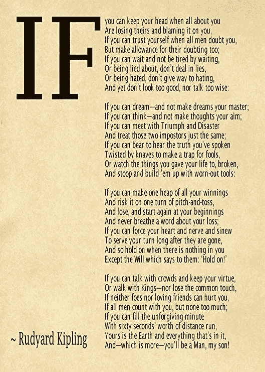
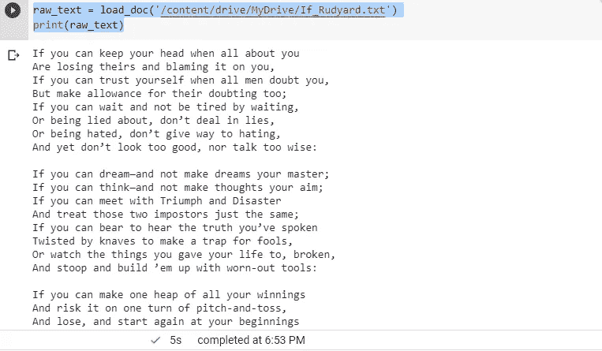
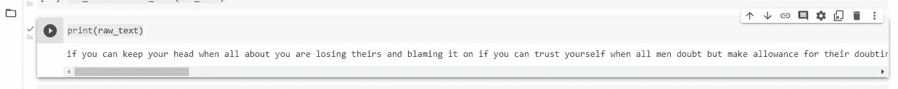
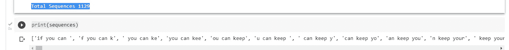
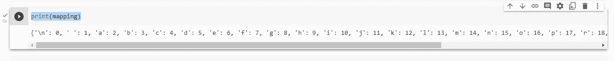
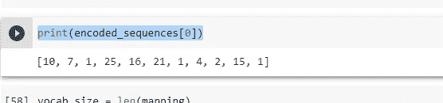
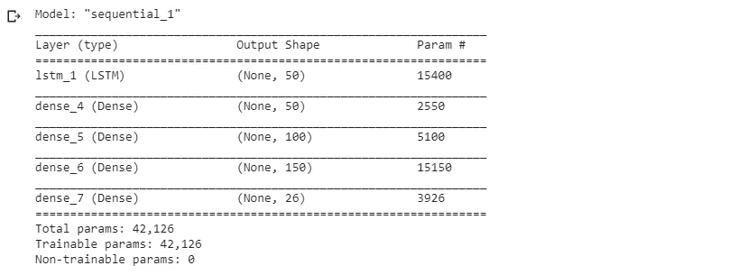
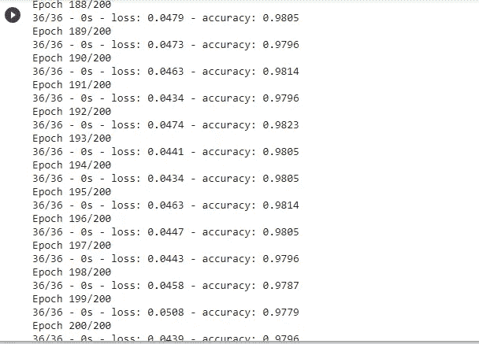
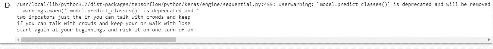

# 使用 LSTM 的基于字符的神经语言建模

> 原文：<https://medium.com/mlearning-ai/character-based-neural-language-modelling-using-lstm-bfb136bebb3b?source=collection_archive---------0----------------------->


Photo by [Visor.ai](https://www.visor.ai/nlp-chatbots/)

神经语言建模是神经网络在语言建模中的应用。最初，使用前馈神经网络，但是长短期记忆网络或 LSTM 已经变得流行，因为它允许模型在比简单的神经网络长得多的输入序列上学习相关上下文。

基于字符的语言模型根据序列中出现在它之前的特定字符来预测序列中的下一个字符。基于字符的语言模型有许多好处，因为它能够处理任何单词、标点符号和其他结构。然而，有时训练会比较慢，尤其是较大的模型。我们可以用拉迪亚德·吉卜林的《如果》这首诗来发展我们基于角色的语言模型。

**IF —拉迪亚德·吉卜林**



Photo by [AmazonPosters](https://www.amazon.com/Print-Rudyard-Kipling-Poster-Ivory/dp/B07Q3ZD7Z8)

**数据准备**

使用 load_doc()函数将文本加载到内存中。

```
def load_doc(filename):
  file = open(filename,'r')
  text = file.read() 
  file.close()
  return text
```

我们加载包含这首诗的歌词的 If_Rudyard_Kipling.txt 文件并打印它。

```
raw_text = load_doc('/content/drive/MyDrive/If_Rudyard_Kipling.txt')
print(raw_text)
```



IF by Rudyard Kipling

**干净的文字**

使用以下方式清理文本数据

1.  在空白上分割标记。
2.  去掉单词中的所有标点符号。
3.  删除所有不完全由字母字符组成的单词。
4.  把所有的单词都变成小写。

```
import stringdef clean_data(text):
  tokens = text.split()
  tokens = [t for t in tokens if t not in string.punctuation]
  tokens = [t for t in tokens if t.isalpha()]
  tokens = [t.lower() for t in tokens]
  tokens = ' '.join(tokens)
  return tokens
```

清理数据并打印出来。

```
raw_text = clean_data(raw_text)print(raw_text)
```



Cleaned Text

**创建序列**

为了训练模型，我们创建输入-输出序列，其中每个输入序列的长度为 10 个字符，一个输出字符使每个序列的长度为 11 个字符。在预测了第一个字符(第 11 个字符)之后，我们将它添加到输入序列中，模型使用该输入来预测下一个字符。我们为模型使用 10 个字符的任意长度。

```
# Each input sequence will be 10 characters long with one output character, making each seq 11 characters longlength = 10
sequences = list()def create_seq(raw_text):
   for i in range(length,len(raw_text)):
     sequences.append(raw_text[i-length:i+1])
   print('Total Sequences',len(sequences))create_seq(raw_text) # Total Sequences 1129print(sequences)
```



Sequences

**保存序列**

可以保存处理过的数据，以便在以后的阶段使用它来开发我们的模型。

```
def save_doc(lines,filename):
   text = '\n'.join(lines)
   file = open(filename,'w')
   file.write(text)
   file.close()output_file = 'char_seq.txt'
save_doc(sequences,output_file)
```

**编码序列**

每个独特的字符将被赋予一个整数值，因此每个字符序列将被编码为一个整数序列。我们可以创建一个映射，作为从字符值到整数值字典。

```
chars = sorted(list(set(raw_text)))
mapping = dict((c,i) for i,c in enumerate(chars))print(mapping)
```



Mapping

接下来，我们处理每个字符序列，并使用字典映射查找每个字符的整数值。

```
# Encoding each character according to our above mapping
encoded_sequences = list()for line in lines:
   encode_seq = [mapping[char] for char in line]
   encoded_sequences.append(encode_seq)print(encoded_sequences[0])
```



First encoded sequence

词汇的大小被用作我们模型的输入。我们可以用 len 函数来计算。

```
vocab_size = len(mapping)
print(vocab_size) # 26
```

**分离输入和输出**

由于现在序列是整数编码的，我们可以使用数组切片将它们分成输入和输出(10 个字符作为输入，第 11 个字符作为输出)。

```
# Splitting into inputs and outputsimport numpy as npencoded_sequences = np.array(encoded_sequences)
X,y = encoded_sequences[:,:-1], encoded_sequences[:,-1]print(X[0]) #[10  7  1 25 16 21  1  4  2 15]
print(y[0]) # 1
print(X[1]) #[ 7  1 25 16 21  1  4  2 15  1]print(X.shape) #(1129, 10)
print(y.shape) #(1129,)
```

为了给网络提供更精确的输入表示，我们需要对每个字符进行一次热编码，其中每个字符都变成一个向量，只要词汇表(在我们的例子中是 26 个元素)为特定字符标有 1。字符上的概率分布可以由模型输出，并与实际的下一个字符的全 0 值和 1 值的情况进行比较。Keras to _ categorical()函数用于对输入和输出序列进行一次性编码。

```
from tensorflow.keras.utils import to_categoricalonehot_encoded_seq = [to_categorical(x,num_classes=vocab_size) for x in X]X = np.array(onehot_encoded_seq)
y = to_categorical(y,num_classes=vocab_size)print(X.shape) # (1129, 10, 26)
print(y.shape) # (1129, 26)
```

**训练模型**

该模型具有一个输入层，该输入层采用 10 个时间步长和 26 个特征的序列作为一个热编码输入表示。它有一个 LSTM 隐藏层，有 50 个存储单元，以及 3 个完全连接的输出层，每个输出层有 50、100 和 150 个神经元。输出层使用 softmax 激活函数，并输出词汇表中所有字符的概率分布的 1 个向量。由于这是一个多类分类问题，我们使用分类对数损失和 Adam 优化器来编译模型。

```
def define_model(X):
  model = Sequential()
  model.add(LSTM(50,input_shape=(X.shape[1],X.shape[2])))
  model.add(Dense(50,activation='relu'))
  model.add(Dense(100,activation='relu'))
  model.add(Dense(150,activation='relu'))
  model.add(Dense(vocab_size,activation='softmax'))
  model.compile(loss='categorical_crossentropy',
optimizer='adam',metrics=['accuracy'])
  model.summary()
  return model
```

训练我们的模型 200 个纪元。

```
model = define_model(X)model.fit(X,y,epochs=200,verbose=2)
```



Model Summary



Training the model

**生成文本**

我们将使用我们的模型来生成具有相同统计属性的新文本。

我们的模型期望 10 个字符作为用于训练模型的经过处理的格式的输入。因此，我们执行上述所有步骤，将我们的训练文本转换为经过处理的文本。

1.  使用映射对序列进行整数编码。
2.  使用 Keras to _ categorical()函数对整数进行热编码。
3.  由于我们只有一个序列，它需要被重新整形为三维形状，因为 LSTM 期望所有输入都是三维的(样本(1)、时间步长(10)、特征(26))
4.  接下来，我们使用 predict_classes 方法预测下一个字符，该方法将直接为概率最高的字符选择整数。
5.  使用我们的映射来解码预测的整数，以查看字符。
6.  预测的字符然后被附加到我们的输入序列。
7.  由于输入序列现在有 11 个字符长，我们需要通过删除第一个字符来截断它。

函数 generate_seq 执行上述所有步骤。

```
# generate a sequence of characters with a language modeldef generate_seq(model,mapping, seq_length, seed_text, n_chars):
  in_txt = clean_data(seed_text)
  #genarating n number of chars
  for _ in range(n_chars):
    #encode the text as integers
    encoded_seq = [mapping[char] for char in in_txt] #truncate sequences to a fixed legth
  encoded_seq =  pad_sequences([encoded_seq],maxlen=seq_length,truncating='pre') #one hot encoding
  encoded_seq = to_categorical(encoded_seq,num_classes=len(mapping)) #reshaping
  encoded_seq =  encoded_seq.reshape(1,encoded_seq.shape[0],encoded_seq.shape[1]) yhat = model.predict_classes(encoded_seq) #Integer to character out_char = ''
  for char,i in mapping.items():
    if i == yhat:
      out_char = char
      break in_txt += out_charreturn in_txt
```

我们可以使用我们的模型生成一些文本序列

```
print(generate_seq(model, mapping, 10, 'two impost', 50))print(generate_seq(model, mapping, 10, 'If you can', 50))print(generate_seq(model, mapping, 10, 'start agai', 50))
```



模型输出有意义的单词，但是句子的整体上下文可能没有意义。可以使用更长的输入字符长度、单词嵌入或更深的网络来改进该模型。

**资源**

[机器学习掌握度](https://machinelearningmastery.com/time-series-forecasting/)

[用 Python 进行深度学习](http://faculty.neu.edu.cn/yury/AAI/Textbook/Deep%20Learning%20with%20Python.pdf)

[Keras 文档](https://keras.io/)