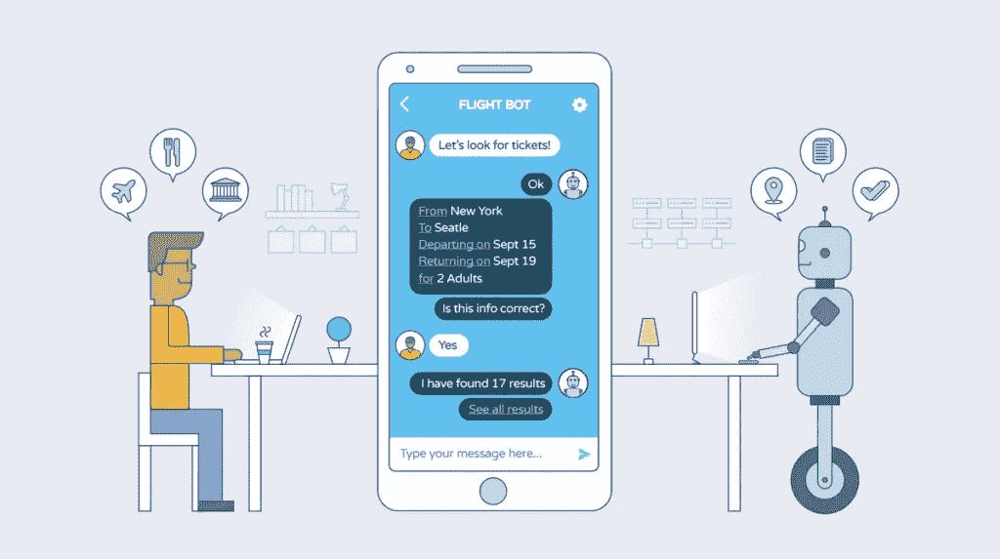
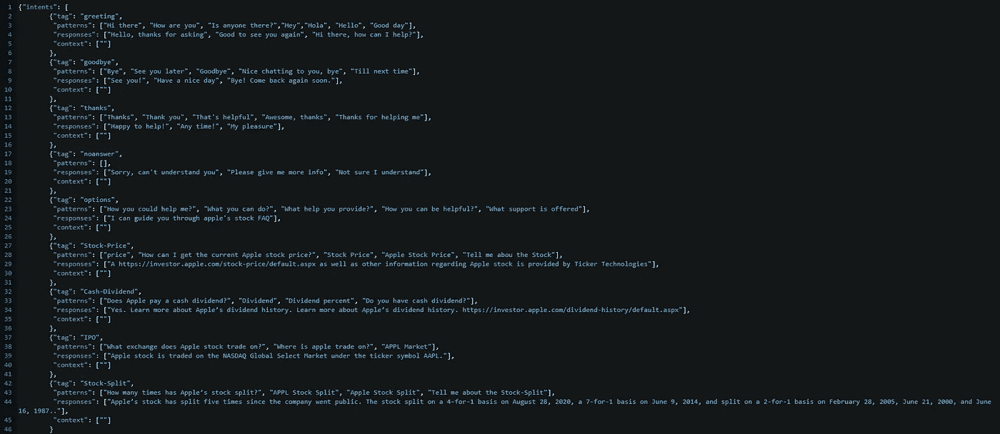

# 使用深度学习的聊天机器人

> 原文：<https://medium.com/mlearning-ai/chatbot-using-deep-learning-2c648a733c6d?source=collection_archive---------4----------------------->



什么是聊天机器人？

聊天机器人是一个使用自然语言与用户交互的对话代理。它也经常被描述为人类和机器之间互动的一种表达。在后端，它识别用户的请求并返回响应。

**背景**

第一个聊天机器人是 1966 年在麻省理工学院开发的，名为 ELIZA。伊莱扎是一个简单的决策树问题，它回答了几个问题。现在，它已经发展到日常生活中，包括 messenger 应用程序、语音助手等等。聊天机器人正在迅速取代人类提供技术支持和客户服务。

**好处**

每个企业的网站或应用程序都需要一个聊天机器人。甚至私营部门和其他公司也需要聊天机器人来为他们的客户服务。聊天机器人可以用 24 小时服务取代客户服务代理，并帮助企业节省资金。

如果你想查看我对这个项目的介绍，这里有[链接](https://www.youtube.com/watch?v=cg_5bDdfCSw&ab_channel=tenzinwangdu)。

# **创建聊天机器人的不同方法**

*   创建一定数量的模式和响应
*   使用 RASA 框架
*   创建自己的框架

## **创建您自己的数据/意图**

我的笔记本第一种方法是[这里](https://github.com/tw1270/Chatbot/blob/master/Different%20types%20of%20Chatbot/twitter_chatbot/Apple%20Chatbot.ipynb)。

意图是用户输入的文本的类别。例如，“嗨”是一种问候，“你能为我做些什么？”会有所帮助。您可以为不同的目的创建不同的意图。这是一个很好的常见问题解答，并且很容易创建，你可以创建不同的回答。这是

# **第一步:根据您想要的 FAQ 类型创建意图**

下面是我创建的一个简短的苹果股价常见问题。



**标签**:用户提问意图的可能类别

**模式**:用户通常询问特定标签相关问题的方式越多越好

**响应**:数据集中每个标签的预定义响应，模型可以从中选择对特定问题的响应

**上下文**:与标签相关的上下文单词，便于更好地对用户的请求进行分类

# **下一步**:载入文件，然后对数据进行预处理

```
## Loading the file
with open(“intents.json”) as file:
 data = json.load(file)
```

对于预处理，您需要为建模部件更改数字数组中的模式。下面是对数据模式的预处理部分:

**标记化**:把单词分成一个列表

**斯特梅尔**:把类似程序、程序、程序这样的单词制作成它的基本单词程序

**删除所有特殊字符**:我用归一化的方法删除所有的 ASCII 和 UTF8 单词

```
for word in new_words:
    word = unicodedata.normalize('NFKD', word).encode('ascii', 'ignore').decode('utf-8', 'ignore')
    words.append(word)
```

**标签:**我们需要一个标签，通过使用我们上面创建的意图文件的标签来为单词列表标注。

# **创建一个二进制单词包来训练模型**

因此，对于我们使用预处理创建的单词列表，我们需要将其转换为一个数字数组。

```
for x, doc in enumerate(docs_x):
    bag = []
    wrds = [stemmer.stem(w) for w in doc]for w in words: 
        if w in wrds:
            bag.append(1)
        else:
            bag.append(0)
    output_row = out_empty[:]
    output_row[labels.index(docs_y[x])] = 1
    training.append(bag)
    output.append(output_row)
## switching the list into an array for input into a model
training = np.array(training)
output = np.array(output)
```

# 建模:深层神经网络

对于这个模型，我使用了一个 tflearn 模块来使用神经网络模型来训练模型。由于数据非常少，我使用了 1000 个纪元，因为它可以非常快地处理 1000 个纪元。

```
## defines the input shape for the model
net = tflearn.input_data(shape = [None, len(training[0])])
## adding to the neural network to 2 hidden layers 
## more hidden layers for more complex problem
net = tflearn.fully_connected(net, 8)
net = tflearn.fully_connected(net, 8)
## output layers activation will allow us to get probablity for each neuron.
net = tflearn.fully_connected(net, len(output[0]), activation = 'softmax')
net = tflearn.regression(net)
## Deep Neural Networl model
model = tflearn.DNN(net)
model.fit(training, output, n_epoch = 1000, batch_size = 8, show_metric = True)
```

# **建造机器人**

现在，我们需要改变机器理解的输入。因此，我们需要一个从用户输入创建数组的函数。

```
def bag_of_words(s, words):
    bag = [0 for _ in range(len(words))]

    s_words = nltk.word_tokenize(s)
    s_words = [stemmer.stem(word.lower()) for word in s_words]

    for se in s_words:
        for i, w in enumerate(words):
            if w == se:
                bag[i] = 1
    return np.array(bag)
```

这个函数接受输入“s”和你在上面预处理的单词列表。然后，它对您的输入进行标记和词干分析，然后将其转换为二进制数组，以便机器理解。如果您输入的单词在列表中，它将被转换为 1 和 0:如果不在列表中。

现在，您可以创建一个可以与您交互的聊天机器人功能。

```
def chat():
    print('Hello, I am an Apple Stock FAQ Bot!! How may I help you? (type q to stop) !')
    while True:
        inp = input('You: ')
        if inp.lower() == 'q':
            break
        ## it will giveout a probablity
        results = model.predict([bag_of_words(inp,words)])## gives an index of the largest probablity, so you can display the best answer
        results_index = np.argmax(results)
        tag = labels[results_index]
        if results[results_index] > 0.7:
#             print(results)for tg in data['intents']:
                if tg['tag'] == tag:
                    responses = tg['responses']print('Chatbot: ' + random.choice(responses))
        else:
            print("Chatbot: Sorry, Here is Customer Service number Phone: 877-360-5390 (U.S. toll-free) for better help!")
```

在这个函数中，该函数的作用是运行单词包函数，将您的输入转换为二进制数组，然后使用该模型进行预测。它将列出意图相似的概率。然后它得到最大的结果意图，如果它大于 70%，它给出响应。

# RASA 框架

Rasa 是一个开发人工智能驱动的工业级聊天机器人的框架。它非常强大，被世界各地的开发者用来创建聊天机器人和上下文助手。Rasa 有很多依赖问题，所以我建议你要么创建一个新的虚拟环境，要么使用 google colab。这是在您的[计算机](https://rasa.com/docs/rasa/installation)上安装 rasa 的指南的链接。

Rasa 允许我们设计故事，这样你就可以继续和机器人交流。所以它会记住前面的商店答案。所以聊天机器人可以控制对话的流程。因此，这对酒店和航空公司等企业很有用。因此，客户可以预订房间或航班。

当您创建 rasa 项目时，它会附带一些您需要编辑的文件，以便自定义您的喜好。

# **RASA 文件**

**Config.yml:** 所有机器学习设置
**Domain.yml** :意图+响应自定义动作概述
**Stories.md** :意图/动作序列示例
**Nlu.md** :意图/实体示例

# RASA 管道

*   空白标记器(使用空白作为分隔符)
*   计数向量特性(创建用户消息、意图和响应的单词包表示)
*   从 1 到 4 的 n 元语法
*   NLU 模型(自然语言理解)

您可以在 config.yml 文件中编辑为您的 chatbot 优化的管道。这是为 it 部门准备的笔记本。

如果你想看看这个项目，下面是 Github 的链接。

https://github.com/tw1270/Chatbot

【https://www.linkedin.com/in/tenzin-wangdu/ 