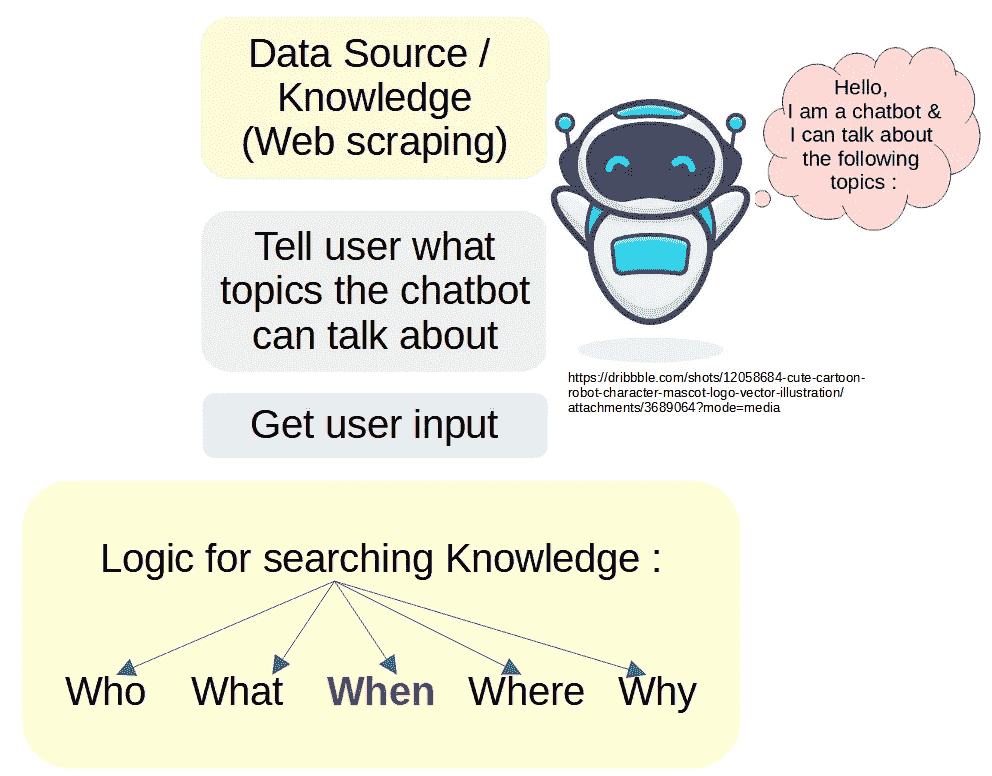
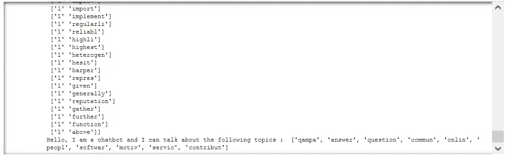
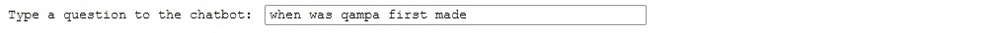
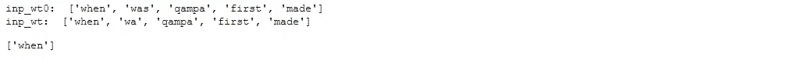
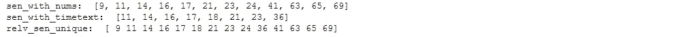
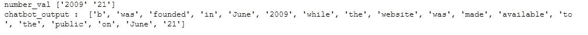
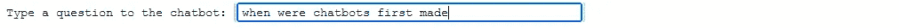
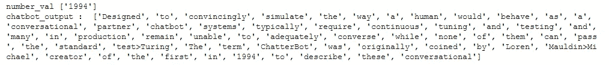

# 聊天机器人:网络抓取和人类互动

> 原文：<https://medium.com/mlearning-ai/chatbot-web-scraping-human-interaction-d2059c021238?source=collection_archive---------0----------------------->

作为一个在数据科学领域拥有人在回路和实时人类测量经验的人，设计和编程一个人机交互聊天机器人听起来很有趣。没有遵循已知的聊天机器人结构，我试图发挥创造力，提出自己的逻辑结构。

我看了几个中型博客，我试图首先制作一个“基于自学检索的聊天机器人”，而不是基于规则的聊天机器人或自学生成聊天机器人。

如图所示，我想到了使用类似于问答深度学习转换器中用于“搜索知识逻辑”的 query (q)、key (k)、value (v)的架构。在这个实践环节中，我只做了“当”架构；我寻找与包含“何时”信息的信息相关的句子，如数字、日期、月份和时间。我认为这种简单的架构可以非常好地工作，用问答转换器架构来分析找到的句子，而不是余弦相似度。

查看 github 中支持 python 的子功能:[https://github.com/j622amilah/Chatbot](https://github.com/j622amilah/Chatbot)！

# 通过网络抓取获取聊天机器人知识库

我们使用 Beautiful Soup 和 Request 进行网络抓取，查看 github 上的函数 text_url_2_senANDwordtokens，了解如何做到这一点。

# 基于检索的聊天机器人:逻辑和解析规则

## 聊天机器人告诉我们它所知道的:

## 让我们问聊天机器人一个关于它知道的话题的问题:

请记住，我们只能问一个“何时”的问题，因为这是我们今天练习的架构结构。

聊天机器人检测到我们问了一个“什么时候”的问题，所以它将搜索可能包含回答“什么时候”类型问题的信息的句子。

聊天机器人从废弃的维基百科问答页面中识别出 14 个包含“When”类型信息的句子。

## 计算所提问题中的单词和每个相关找到的句子之间的相似性度量

我计算了相似单词的简单百分比和流行的余弦相似度；他们给出了相同的答案，但度量标准不同。

所以相似度最高的最长句子看起来是最佳反应！！

## 让我们来看看信息最丰富的句子，它可能包含我们问题的答案

聊天机器人告诉我们，2009 年 6 月 21 日是一个重要的日子！！它找到了 Quora 的创建日期，这是不正确的。但是，这是一个好的开始。让我们试试另一个维基百科页面。

## 聊天机器人废弃维基百科页面结果:

当在维基百科聊天机器人页面上尝试时，它竟然找到了正确答案！

# 摘要

我问了几个简单的问题，就成功了！但它可以更精确。

但是，我认为它可以通过“相关句子”的问答转换步骤来改进，以真正隔离所提问题的答案。

此外，如果在网页抓取单词后，句子被完美地分开，结果会更准确。我有点不愿意把句子分开，因为我没有把句子和超链接放在一起；有些情况下，两个句子通过超链接连接在一起。

享受并快乐练习！

 [## Mlearning.ai 提交建议

### 如何成为 Mlearning.ai 上的作家

medium.com](/mlearning-ai/mlearning-ai-submission-suggestions-b51e2b130bfb) 

🔵 [**成为作家**](/mlearning-ai/mlearning-ai-submission-suggestions-b51e2b130bfb)