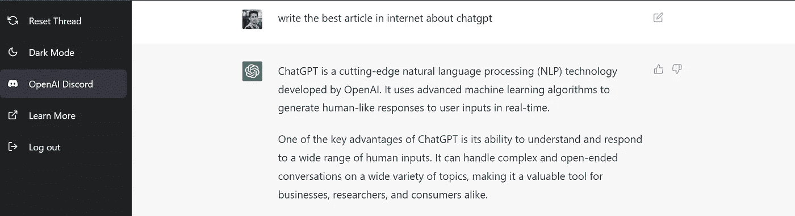

# ChatGPT:对话式人工智能的下一个层次

> 原文：<https://medium.com/mlearning-ai/chatgpt-the-next-level-in-conversational-ai-7e4a38dc968a?source=collection_archive---------2----------------------->

## 使用 ChatGPT 可以做的很酷的事情

ChatGPT interactive interface

ChatGPT 在几天前推出，已经有超过 100 万用户🤯。ChatGPT 是 OpenAI 开发的前沿自然语言处理(NLP)技术。它使用先进的机器学习算法来实时生成对用户输入的类似人类的响应。