# 胸部 x 光图像分类

> 原文：<https://medium.com/mlearning-ai/chest-x-ray-image-classification-a555c6d242c?source=collection_archive---------8----------------------->

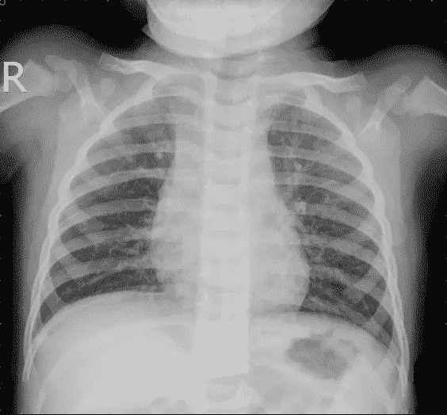

Source Mendeley Data

他的文章详细介绍了一种图像分类器，将胸部 x 光图像分为肺炎和正常。为此，在 Kaggle 中找到了一个数据集，使用此处的链接。代码可以在[我的 GitHub](https://github.com/thiagolimaop/chest-x-ray-classifier) 上找到。

肺炎*胸部 x 光片*显示一个或两个肺部异常浑浊，正常胸部 x 光片显示肺部清晰，图像中没有任何异常浑浊区域。正如 [Kaggle](https://www.kaggle.com/datasets/paultimothymooney/chest-xray-pneumonia) 中所解释的，数据集中的每幅图像都由两位专家医师进行分级。

用于处理该数据集(1GB)的策略是将其放入 Google Drive，并使用 Google Collab 和 TensorFlow 和 Keras。

# 数据理解

将从数据集存储库下载的压缩文件插入 Google Drive 文件夹后，下面的步骤是解压缩文件图像，如下所示:

Unzipping the image files

看一下目录，没有找到验证目录，这对于帮助我们理解学习曲线和获得一些见解是必不可少的。

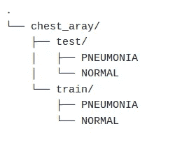

Directory tree of the unzipped files

数据的分布描述如下:

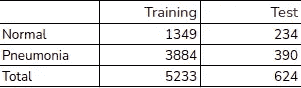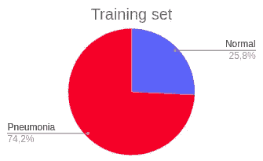

Distribution of the data

考虑到吴恩达教授(斯坦福)提出的引入交叉验证的比例(60%的数据用于训练，20%用于验证，20%用于测试)，让我们产生数据集的一些统计数据，以在 ower 数据集上实现这些比例:

*   胸部 x 光照片总数(训练集+测试集):5，857
*   胸部 x 光照片总数的 20 %: 1171 张
*   **肺炎**验证**所需胸片总数**套:869 张
*   **验证**组需要的**正常**胸部 x 光片总数:302 张
*   总计**肺炎**胸部 x 光片**测试**需要:479
*   **测试**组需要的**正常**胸部 x 光片总数:68 张

由于测试集有 624 幅图像，我们从训练集中得到一个精简的图像集，以获得正确的比例。为了实现这些比例，我们创建了一个函数，从一个文件夹中获取随机图像，并将它们移动到另一个文件夹中。

Code to transfer a set of random images from a source to a destiny

# 数据准备

本质上，这一步包括从磁盘中读取数据，并在数据上设置所需的准备来训练它们。我们需要知道的第一件事是，神经元网络需要一个固定大小的输入。由于我们的图像没有模式宽度和高度，我们需要将所有图像调整到相同的大小。选择的尺寸是 150×150 像素。我们还将像素值归一化到从 0 到 1 的范围内。

这一步可能是任何项目中的游戏规则改变者，因为在这里我们实现了一些增强来防止过度拟合。但是不是任何增强在任何数据集中都能很好地工作。增强需要对数据集有意义，以产生与数据集中已经存在的图像相似的图像。

下面我们可以看到数据集中一些“远离平均值”的图像示例。

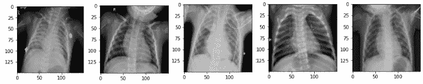

Rotate images

上图中，我们可以看到前四幅图像显示了 15°到 20°之间的胸部旋转。

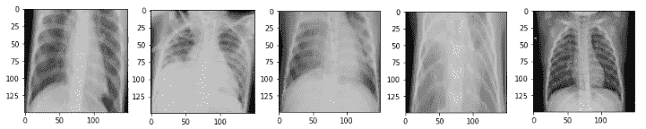

Zoom images

上面可以看到更接近视图的图像(前四幅图像),就好像这些图像被放大了一样。

最后使用的增强是旋转 20 度和缩放 30 度。这些增强可以帮助我们防止过度拟合。

Appling zoom and rotation augmentations

# 模型架构

该项目将使用 CNN(卷积神经网络)架构来创建模型。该模型由四个卷积块组成，每个卷积块中有一个最大池层。我们还使用了漏失层，这是另一种帮助我们防止过度拟合的技术。这项技术包括在数据经过这些时期时随机关闭一些神经元，迫使其他神经元完成所有工作。该模型将在最后一个图层中使用 softmax 输出两个类别(正常或肺炎)的类别概率。模型训练也使用 Adam 的优化器。

# 训练实验和结果

使用相同的模型架构进行了五个训练实验。

## 实验一

在第一个实验中，使用了没有增强的训练集。了解初始精度和学习曲线。

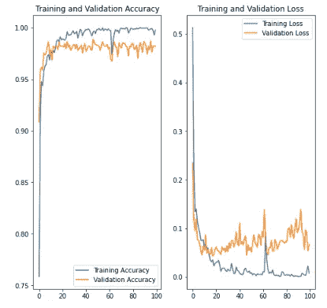

Learning curve — Experiment I

正如我们从图中看到的，验证损失随着时间的推移而增加，这表明过度拟合。本实验的测试准确率为 87.11%。

## 实验二

第二个实验是验证在训练数据集上应用 20 的旋转增量的想法，并看看这一步是否有助于我们防止过拟合并提高准确性。

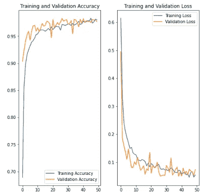

Learning curve — Experiment II

这个实验的测试准确率为 90%(比第一个实验高出近 3%)。

## 实验三

第三个实验是验证在训练数据集上应用 30%的缩放增强的想法，并看看这一步是否有助于我们防止过度拟合并提高准确性。

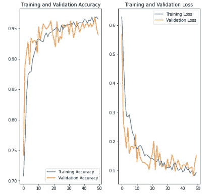

Learning curve — Experiment III

这个实验的测试精度是 93.94%(比第一个实验高 7%)。

## 实验四

在这个实验中，为了增加精确度，探索了亮度增强。这一线索是在名为《公共科学图书馆·综合》(Plos One)(专门从事科学和医学)的期刊上的一篇[文章](https://journals.plos.org/plosone/article?id=10.1371/journal.pone.0265949)中发现的。该文章展示了降低/增加亮度的良好效果。该实验尝试在 70%到 130%的范围内调节亮度。

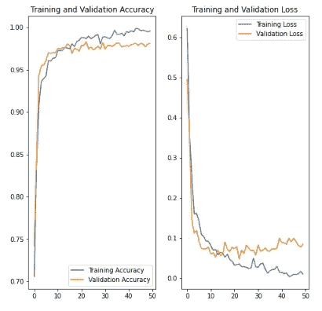

Learning curve — Experiment IV

学习曲线是过度拟合的明显标志。本实验的测试准确率为 87.79%。与第一次实验相比，精确度的提高非常小。

## 实验五

实验 II 和 III 因其准确性而脱颖而出，帮助我们防止过度拟合。在两个实验中使用了 50 个时期，这被证明是不够的。因此，在这个实验中，我们使用与之前相同的配置，使用缩放和旋转增强来尝试 80 个历元。

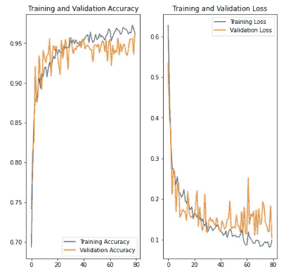

Learning curve — Experiment V

这个实验的测试精度是 95%(与第一个实验相比，几乎高了 8%)。

# 讨论

最后一个实验展示了更好的结果。但是加入上一个亮度增强的实验是个好主意。即使实验四没有展示出很好的结果，它的学习曲线的可变性更小，我们在准确性上也略有提高。也可以探索其他的增强。

如果你发现这篇文章中有任何不一致的地方，请随时通过这里或我的 [LinkedIn](https://www.linkedin.com/in/thiago-lima-3b0370111/) 联系我。如果您没有发现任何不一致之处，只是想谈谈数据科学，也可以随时联系我。感谢您读到这里！

 [## Mlearning.ai 提交建议

### 如何成为 Mlearning.ai 上的作家

medium.com](/mlearning-ai/mlearning-ai-submission-suggestions-b51e2b130bfb)